[[reports]]
== Reporting

[[reports-printing]]
=== Using reports

onCourse comes prepackaged with a large range of reports. You can use them as is, or copy and modify any of them to suit your needs. Advanced users can also create brand new reports from scratch.

==== Printing Reports in onCourse

The first thing to be aware of when attempting to print a report is that you must be in the right onCourse list view to print the expected report. For example, Class roll is a report available from the class list. You cannot print this report from inside the class record, only the class list view.

From each list window, click on the Share icon, the select 'PDF' to see the list of available reports,

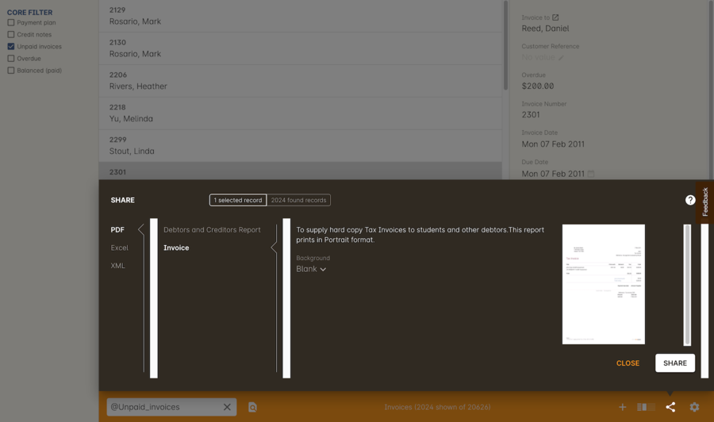

All reports are printed to a PDF file which you can save to your computer, email, or print to a printer on your network. Your computer will need to have a PDF reader installed to create and view the report.

For exports to excel, XML or other formats, look at <<importExport, our exports chapter>>.

Before you print a report, you will usually need to collate your data by running a query on it first.
For example, if you wish to print the class rolls for all the classes starting this week, you will need to do an advanced query for classes starting from today, to the last day of the week. For more information on search queries, check our <<search, search chapter>>.

The share window provides an alphabetized list of all reports available via the given window. Select the relevant report and a summary description and print preview (if it has been printed before) is provided of the highlighted report. This description will also clarify whether the report prints in Portrait or Landscape format.

In the print dialogue, you will be asked if you want to print selected or all records. A record count will be given for each option. Choosing 'selected' will print the results you have highlighted manually, while choosing 'all' will print the report for the one or more records you have selected in the list.

[[reports-background]]
=== Print Backgrounds

onCourse printed reports can be set up with a defined background. These backgrounds must be created as a PDF document that is then imported into onCourse via the PDF Backgrounds section of the `Automation` window.

Generally, you will have a standard 'letterhead' style background, available in both portrait and landscape modes that can be used as the print background to common reports like invoices, enrolment confirmations and class rolls. You might also have some special backgrounds for certificates and other formal documents. Put all your graphic elements on these backgrounds such as signatures, logos, compliance icons and watermarks. It is easier to add these elements to the background than to the report itself.

[[reports-createBackground]]
==== Creating a backgrounds

Use your favourite page layout tool. Indesign, Quark, Word, Pages or any other tool which can create high quality PDF output will do fine. Make sure you set up the page size and orientation to match your report.

If you create a single page PDF, that background will be used for all the pages of your report. If you create a two page PDF, the first page of the PDF will be used as the background for the first page of the report and the second page of the PDF will be used for all subsequent pages. It is common to create a two page PDF with letterhead on the first page and a blank page for the follow-on.

[TIP]
====
Many of the built-in reports have 30mm header space. If you can keep your header within that area, you'll not have to adjust the standard reports to fit.
====

[[reports-addNewBackground]]
==== Adding a background to onCourse

Once you have created the print backgrounds for your reports, you can now import those PDF backgrounds into onCourse and attach them to their relevant reports. You only need to import each report background once.

Report Backgrounds are managed within the Automation window, under PDF Backgrounds:

. In onCourse, from the Dashboard, search for 'Automation' then click it open the window.
. Scroll the left-hand column until you see 'PDF Backgrounds'.
. Click the + button next to the header, this will create a new background record that you can upload your background PDF to.
. Name your new background, then click the 'Upload New Version' button.
. Find where you saved your PDF file, click to highlight it, then click Open.
. You will now see the filename appear just below the button. Click Save.
+
image::images/background_new.png[title='A newly uploaded PDF background showing its preview view']

If you click back into your record, you will now see that it shows a preview of the background PDF (as shown above).

[TIP]
====
When printing, the report will default to the last background you used for that report.
====

[[reports-choosingBackground]]
==== Choosing a Print Background

You can choose a print background in one of two places:

. You can set it globally as a default background within a PDF report record itself, or
. You can set it at the time you print a report from within onCourse. This is simple as setting the background on the print view screen from the PDF Background drop down box.

To set a global default background for a report:

. Go to the Automation window and scroll the left-hand column until you see PDF Reports
. Click into the PDF report you wish to set a background for
. In the record that opens, make a selection from the PDF Background drop down box, then click Save

[[reports-preview]]
==== Background Previews

You may notice the Preview sections within the PDF Reports and PDF Backgrounds records. The preview window shows you a preview of how the current PDF Report will come out with the background that's currently selected.

IMPORTANT: Previews will only generate after a report has been printed at least once, and the 'create preview' tickbox was checked.

To ensure you create a preview:

. When preparing to print any report, ensure the correct background is selected
. Ensure the 'Create Preview' tick box is ticked.
. Check this the next time you print by making sure the preview box has an image in it.

image::images/pdf_preview.png[title='Preview in the PDF Report view']

[[reports-existing]]
=== Built-in reports

onCourse includes a range of printed reports as part of the standard software. These examples list the reports available and their purpose. Additional reports can be quoted and built on request if you do not have the in-house IT skills to build or modify your own reports.

==== Classes
From the Class list, select Share, then PDF and choose one of the following reports. You can print all available records, listed records (based on a query you have run) or the highlighted records. Some of these reports are also available in other parts of the application as well.

Academic Transcript:: To provide students with the information retained in onCourse regarding each of their enrolments and current status of their outcomes. This is also available within the Enrolments window.

All Class Details:: Detailed report of all information for a given class, including delivery mode, minimum and maximum places, enrolment numbers, fees and discounts, session details, course description, tutor information and directions for getting to the campus.

Assessment Outcome Report:: For use by the College Tutor to mark the assessment outcomes for each student studying a VET class. As well as enabling the Tutor to sign and date the entries prior to sending back to College Administrators for entering onto onCourse.

Assessment Outcomes Per Student:: For use by the College Tutor to mark the assessment outcomes for a student studying a VET class, as well as enabling the Tutor to sign and date the entries prior to sending back to College Administrators for entering onto onCourse. This is also available within the Enrolments window.

Budget Details by Subject:: In the example below, the classes are listed with the actual figures displayed. As detail has not been entered for the budget fields, the budget amounts are all listed as $0.

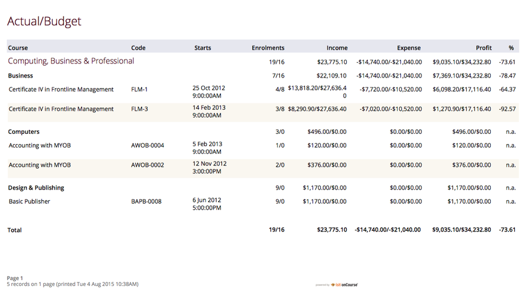

Budget Details by Class:: To obtain a detailed print out of the budgeted and actual income and expense lines, one page per class.

image::images/reports/BudgetDetailsByClass.png[title='Budget Details']

Budget Summary by Subject:: Enables Colleges to monitor budget against actuals at the summary level, includes details by subject on the number of enrolments, income generated, expenses and the resulting variances.

Budget Summary by Class:: Enables Colleges to monitor budget against actuals at the summary level, includes details by Class on the number of enrolments, income generated, expenses and the resulting variances.

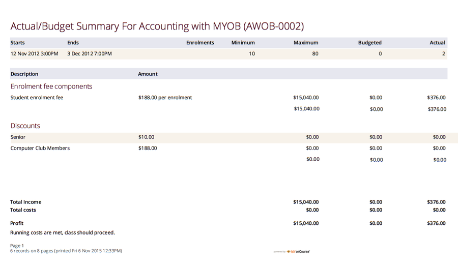

Cancelled Classes Count:: Provides a summary list of the number of enrolments and monetary value of those enrolments for classes which have been cancelled and the students transferred, refunded or credited. This report can be useful for deciding if that type of class should be offered in the future, based on it's level of previous student enrolment.

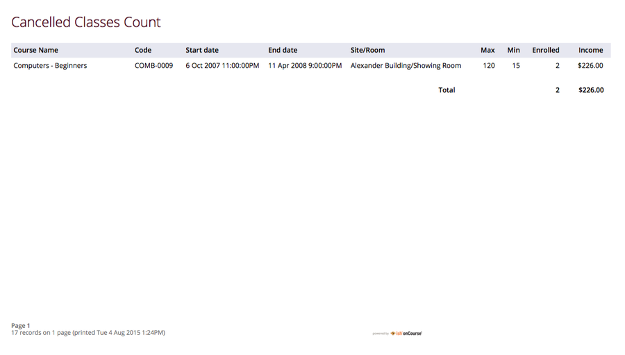

Class by Subject Report:: To obtain an overview of all classes status within a given time period, such as a term. Classes are grouped by their Category/Sub Category tag. Useful for holistic planning processes and work flow activities such as confirming course go ahead or managing cancellations.

[NOTE]
====
M/F column: If a student's gender is not set within their details, they will not counted for either M or F; thus M + F does not necessarily equal to the total number of enrolments. Target column: This is the number of enrolments to reach the target for this class, i.e.: -3 means 3 more enrolments are required to meet the target, 3 would means that there are 3 enrolments more than the target.
====

Class Contact Sheet:: To create a list of students enrolled and the phone numbers and email addresses for those students. Hard copy lists can be distributed to tutors before classes commence if you wish them to have this information. Tutors can also access this information via their web portal if you organisation has enabled it.

[NOTE]
====
Given that tutors may pass rolls around the room for students to initial their attendance, to comply with privacy legislation, there are no student contact details on the class roll. If the tutor requires the student's contact details, a student contact list can be printed.
====

Class Details Report:: To obtain full list of one or more classes scheduled sessions. This is a list view of the timetabled sessions. Useful information to provide to venue coordinators, tutors and students.

Class Hours::

A summary of the classroom, nominal and reportable hours for each class, for use in the administration of VET / AVETMISS courses.

Class Information::

Class information that can be provided for the enrolling student including course details, information about the Tutor, directions on where to go and the individual session details.

Class Invoice Record::

Invaluable as a method of cross-referencing incoming payments for a given Class. the report lists the names of all enrolling students, Invoice No, fee charged, fee paid and any outstanding balances. As well as the name and contact number of the payee

image::images/reports/ClassInvoiceRecord.png[title='Class Invoice Record']

Class Prepaid Fees Liability::

This Report identifies how much of the invoice value is currently held in the Pre Paid Fees Liability Account and is yet to be transferred to the defined Income Account. This report is grouped by Class and sorted by Date.

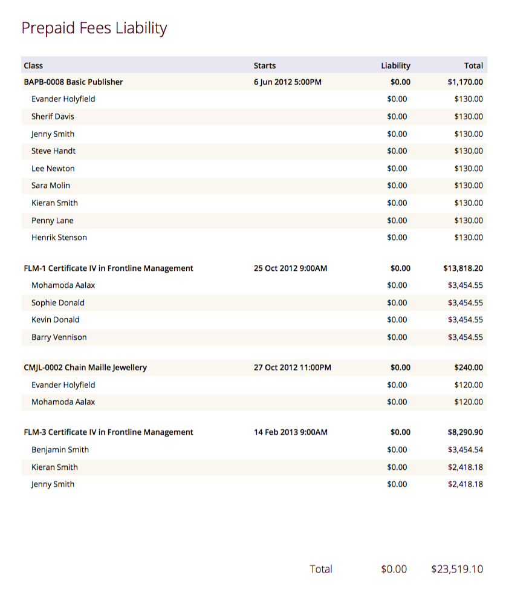

Class Roll::

To create a list of students enrolled and columns for each of the scheduled sessions, used to mark attendance. The report will automatically re-size to fit the number of students and session conditions. Hard copy rolls are often distributed to tutors before classes commence, or PDF copies emailed to tutors or coordinators.

[NOTE]
====
Given that tutors may pass rolls around the room for students to initial their attendance, to comply with privacy legislation, there are no student contact details on the class roll. If the tutor requires the student's contact details, a student contact list can be printed. The roll is marked by session and will show "Y" if attended; partial attendance, "N" for absent; absent without reason and no value for unmarked attendance.
====

Class Roll - Age:: A class roll with the students ages.

Class Roll - Contact No (Number):: Report that provides a list of all students, their contact phone number, can be printed out and used for a roll call. Can also be used to contact students who are not in attendance at their enrolled session or class.

Class Roll - Single Sessions:: To be used for classes where the tutors need to return a student-signed copy of the class roll back to the college administration office after each week or session. Users need to print multiple copies of this roll if they require one for each session of a class.

Class Roll - USI:: A class roll with the students USI status and the course qualification and unit of competency information

Class Tutor List:: To obtain an overview of classes scheduled for each tutor. This report also provides the total hours the tutor is scheduled to teach for each class, which can be used for payroll purposes.

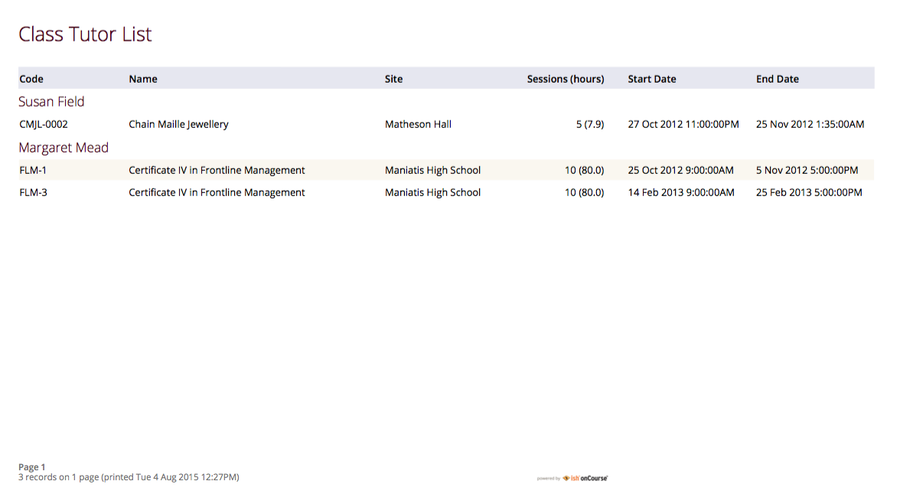

Class Sign for Door:: Report that can be printed off and used as a sign or label on door of Training Room

Class Timetable Report:: The purpose of this report is to allow the user to select multiple classes (which may contain the same students e.g. those doing a Diploma may undertake 4 classes simultaneously) and print a date-range specified timetable of sessions to show the students when and where to turn up to class. Useful for both students attending classes or could also be printed for all classes for a tutor who teaches multiple classes.

This report is also available in the Courses, Sites & Rooms windows.

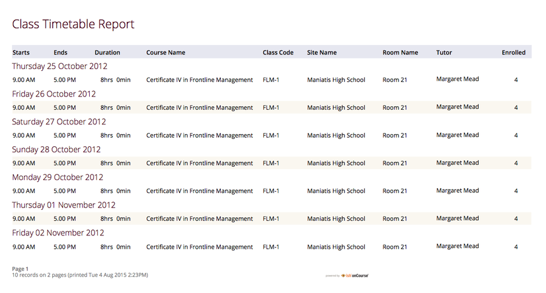

Class Timetable - Planning:: This is an alternate version of the class timetable report which includes the session private notes field in the last column.

This report is also available in the Courses, Sites & Rooms windows.

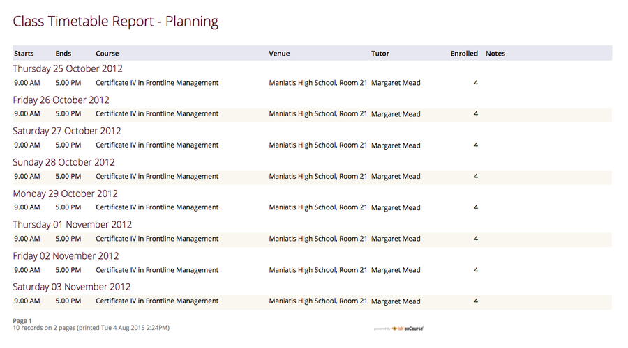

Class Tutor Pay Schedule Report:: This report provides the detail of the expected payslip lines that will be generated for all tutors attached to a class with wages in the budget, allowing you to confirm that the correct details have been entered at the class level prior to generating the tutor pay.

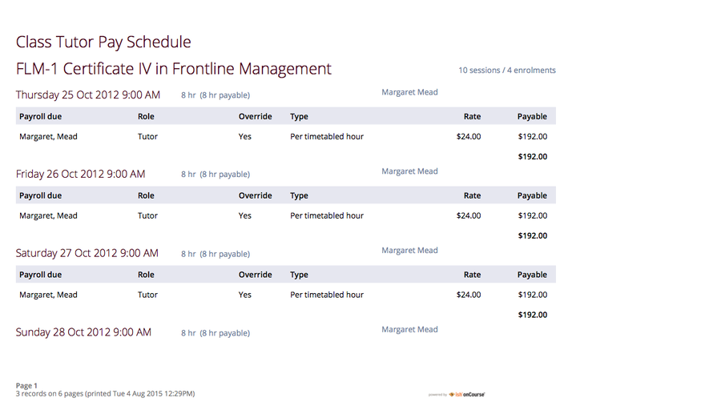

Classes:: To obtain an overview of all classes status within a given time period, such as a term. Useful for holistic planning processes and work flow activities such as confirming course go ahead or managing cancellations. Classes are reported in the list order you have sorted the window data e.g. class name alphabetical order, start date order or code order.

[NOTE]
====
The information available in this report is also available grouped by subjects in the Classes by Subject Report.
====

Commonwealth Assistance Notice:: This reports provides information to the student on their enrolment, any HELP debt and student contribution paid, and any loan fee they may have incurred. If the student has a VET Student Help loan, you are required to provide a Commonwealth Assistance Notice to the student. This report will not print for enrolments in classes that do not have the option ticked 'This is a VET Student Loan eligible class.'

[NOTE]
====
This report is accessible from both the Classes and Enrolments windows
====

Course Completion Survey:: This report shows you a detailed summary of student survey results including a list of all students in a class that completed survey on the student portal, the scores from each student and their comments (if any). The report also shows the average results per class, and the average of all results is displayed at the bottom of the report.

[NOTE]
====
Please note that the Course Completion Survey Tutor report should be used instead if the data will be used outside the office.
====

Course Completion Survey Summary:: This report shows you a summary of all survey results including the average results for the class. The average of all survey results is displayed at the bottom of the report. Individual student scores or comments are not included.

Course Completion Survey Tutor:: This report shows you a detailed summary of student survey results including a list of all the scores from each student and their comments (if any). The report also shows the average results per class, and the average of all results is displayed at the bottom of the report. This report does not show the name of the students.

[NOTE]
====
Please note that due to privacy considerations, this report should be used if the data will be used outside the office.
====

Demographic Data Report:: This report shows the aggregate the responses to the standard student demographic questions such as age, gender, residential suburb, country of birth and language spoken for a selection of classes or enrolments.

[NOTE]
====
This report is also available in the Enrolments window.
====

Discounts by Class:: Report generates a list of all discounts that apply to a given Class. As well as a summary of the number of enrolments and the discounts taken up.

image::images/reports/DiscountsByClass.png[title='Discounts by Class Report']

Enrolment Confirmation:: To provide students with details of their class once they have enrolled. During the enrolment process, if the student provides an email address, an email confirmation of enrolment can be selected. It is not necessary to provide hard copy enrolment confirmations for these students.

[NOTE]
====
This report is also available from the Enrolments window.
====

Enrolment Summary by Account:: This report shows you the number of enrolments and Income made per account code.

Enrolments and Income by Account:: This report shows the income and number of enrolments every account has taken per class.

Class Funding:: To keep track of delivery of funded program Student Contact Hours over a particular time period. This report shows a summary of each qualification and the hours delivered against each of the national funding types.

[NOTE]
====
This report may be of particular interest to colleges who deliver programs with a range of funding sources and who are required to report the delivery of these hours. By regularly running this report, the year to date delivery can be checked and be used to assist with program planning.
====

Income Journal Projection:: To show the projected pre-paid fee liability to income journals for each of the next 7 months from the date the report is run, for each class.

Income Summary Projection:: This report allows you to see a summary of the projected income for the selected class.

Individual Training & Assessment Plan:: ASQA compliant, multiple page report that provides a detailed outline of the units of competency for the given Course/Class, as well as the start and end date for each unit. The report also includes a Delivery Plan which outlines as to when each Unit of Competency are taught within the overall Class schedule

[NOTE]
====
This report is also available from the Enrolments window
====

Sales by Course Location:: Provides a summary list of the number of enrolments and monetary value of sales for each site, with further detail regarding number of enrolments and monetary value listed by Course. This report is also available within the Enrolments window.

image::images/reports/SalesByCourseLocation.png[title='Sales by Course Location Report']

Sales Report:: This report provides a comparative analysis of sales figures (shown as number of enrolments and monetary value) from one College site to the next.

NOTE: This report is also available within the Enrolments window.

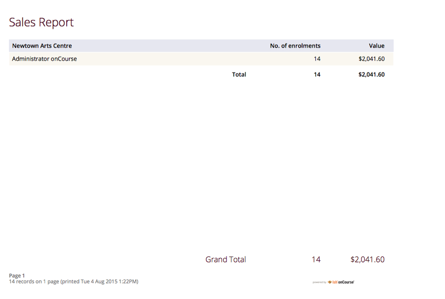

Simple Class Roll:: Session by session grid for marking student attendance

Student Contact List:: To export the contact details provided for students enrolled in a class. This report is also available in the Enrolments window.

[NOTE]
====
This report may be used to accompany the Class Roll
====

Student Special Needs:: Used as a reference for any special needs such as wheelchair access, dietary requirements and provides an indicator as to whether the student and or tutor has been contacted to confirm or follow up this information.

NOTE: This report is also available in the Enrolments window

Total Discounts:: To confirm uptake and cost of discounts across a selection of classes. This report is also available in the Enrolments window

Contacts:: From the Contacts list, select Share, then PDF and choose one of the following reports. You can print all available records, listed records (based on a query you have run) or the highlighted records. Some of these reports are also available in other parts of the application as well.

Statement Report:: To print a list of all transactions (both debits and credits) for a particular contact for all time, showing their opening and closing balances.

Student Attendance Averages:: This reports allows you to calculate monthly student attendance averages, of particular use to CRICOS providers.

Student Details:: A useful educational report showing an overview of all units a student has undertaken at the training organisation and their outcomes.

Transaction Detail:: Generally this report is printed for one selected record at a time, but can be printed for all record as needed. Select the appropriate background for this report then run the report. This report is available on financial windows also.

image::images/reports/TransactionDetail.png[title='A Transaction Detail Report']

Transaction Summary:: To provide a more general overview of transactions made over a specified period of time. This report is commonly printed each month and used to prepare a journal for import into the primary accounting system. This report is available on financial windows also.

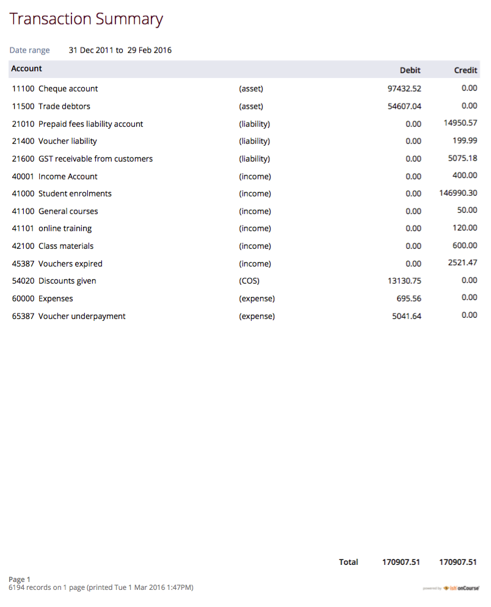

Tutor Details:: The contact details and scheduled sessions for a Tutor

Tutors List:: A list of tutor names and addresses

Courses:: From the Courses list, select Share, then PDF and choose one of the following reports. You can print all available records, listed records (based on a query you have run) or the highlighted records. Some of these reports are also available in other parts of the application as well.

Course Details:: To create a print out of the full course information including scheduled classes. Can be used to create print copies of all the web information to mail to students without web access.

Courses Report:: To create a print out of the list of courses

Enrolments:: The following reports are available predominantly from the Enrolments window, although they may be accessible elsewhere also.

Academic Transcript:: onCourse includes AQF recommended templates for full Qualification Certificates, Statements of Attainment and transcripts.
Certificates can only be generated from units that are recorded as part of onCourse enrolments. If you wish to include Credit Transfer units, you will need to add these outcomes to the students record before you create the certificate. The Transcript report can be printed as required from the Certificate window for all types of certificate records.

Certificate Attendance:: Report is generated at the conclusion of any non VET short courses to verify that the student attended all of the required number of classes.

Enrolment Summary by State:: A list of contact enrolments by state.

Traineeship Training Plan:: This report provides summary information on the required units of competency that need to be completed for a given student. As well as provision of signatures and sign off on the Training Plan by the student's employer, the trainee themselves and the Registered Training Provider (RTO)

Financial:: The following reports are the main reports that can be found in their respective Financial windows, like invoices, transactions, payments in,payments out, discounts etc.

Aged Debtors and Creditors Report:: To obtain an aged debtors and creditors report for all unbalanced invoices. This report can be run against invoices and/or credit notes.

Banking Report:: The report can also be re-printed for only payments in or payments out from either of those respective windows, for each record you highlight prior to clicking the Export button. Remember to select the appropriate background for this report then run the report.

Cash Movements Detail Report:: This report can be used to reconcile payments in and out with banking deposits.

Cash Movements Summary Report:: This report can be used to help reconcile payments in and out with banking deposits.

Corporate Pass List Report:: List of all current CorporatePass records. This report prints in Portrait format.

Corporate Pass Detailed Report:: Provides detailed breakdown of usage of Corporate Pass records, including invoices generated against each Corporate Pass. From the Corporate Pass window, find the Corporate Pass records you wish to include in the report and highlight them. Then click the Share icon, then PDF and choose report Corporate Passfrom the list of available reports.
Remember to select the appropriate background for this report then run the report.

Discount Take Up Report:: This report shows during the date range specified, and for each discount chosen, the detail of the enrolments which have taken up a discount offer.

Discount Take Up Summary:: This report shows during the date range specified, and for each discount chosen, how many enrolments for each class have used that particular discount.

Invoice:: To supply hard copy Tax Invoices to students and other debtors. Other invoices, not relating to enrolments, can be manually created and printed via the invoices window.

As seen below if you have enrolled into a class using a payment plan the Tax invoice will show you the next payment due dates and the amounts payable.

[NOTE]
====
When a student is enrolled, and provides an email address, a tax invoice will be emailed to the payer, and an enrolment confirmation email will be sent to the student enrolled.
Often this will be the same person.
====

Payments In Report:: To obtain an overview of payments processed, declined or rejected, processed through either your office or over the website.

[NOTE]
====
All payments made, or attempted, as part of the enrolment process will created a Payment In record.
You can also manually create payments in from this window, against any outstanding invoice.
====

Payments Out Report:: To obtain an overview of payments out processed.

Payslip Report:: This allows you to print the payslips for error checking prior to exporting them to your payroll system

Training:: The following reports are available from their respective training windows, like sites, rooms & qualifications.

Qualifications Report:: A list of the all the data downloaded from NTIS which you can use to start building courses.

Room Timetable:: The purpose of the report is to allow users to print the details of all sessions that are scheduled for a particular room, for a particular date range.

Rooms List:: List of all rooms and their related sites and seating capacity.

Site Details:: Detail of all each site, venue information, rooms and each room capacity for the site

Site List:: List of all sites and their addresses

Certificate - Statement of Attainment:: onCourse includes AQF recommended templates for full Qualification Certificates, Statements of Attainment and transcripts. Certificates can only be generated from units that are recorded as part of onCourse enrolments. If you wish to include Credit Transfer units, you will need to add these outcomes to the students record before you create the certificate. For detailed information regarding VET Certificates, refer to the RTO Guide Chapter of the User Manual.

From the Certificate window, select the student(s) you wish to print certificates for. Select Share, then PDF and choose the Certificate from the drop down menu of reports. Remember to select the appropriate background for this report then run the report.

The resulting report (Statement of Attainment or Qualification) is dependent on how you have set up the Certificate record. If you have more units in the Statement than will fit on a single page, the report will automatically break into two pages.

Certificate - Qualification:: onCourse includes AQF recommended templates for full Qualification Certificates, Statements of Attainment and transcripts. Certificates can only be generated from units that are recorded as part of onCourse enrolments. If you wish to include Credit Transfer units, you will need to add these outcomes to the students record before you create the certificate. For detailed information regarding VET Certificates, refer to the RTO Guide Chapter of the User Manual.

From the Certificate window, select the student(s) you wish to run certificates for. Select Share, then PDF and choose the Certificate from the drop down menu of reports. Remember to select the appropriate background for this report then run the report.

The resulting report (Statement of Attainment or Qualification) is dependent on how you have set up the Certificate record.

Student Feedback:: This report shows a list of the feedback left by students. Data included in the report can be either the highlighted records, or the entire list of feedback.

Waiting List:: List of all current wait list entries, including name of course, name of student, client, and site where course is held.
