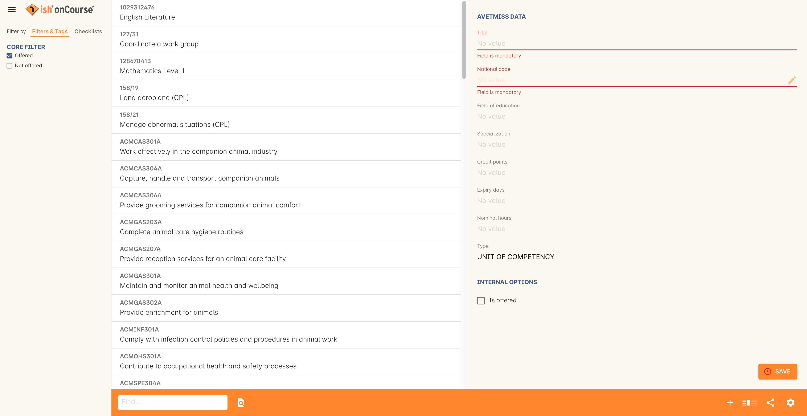
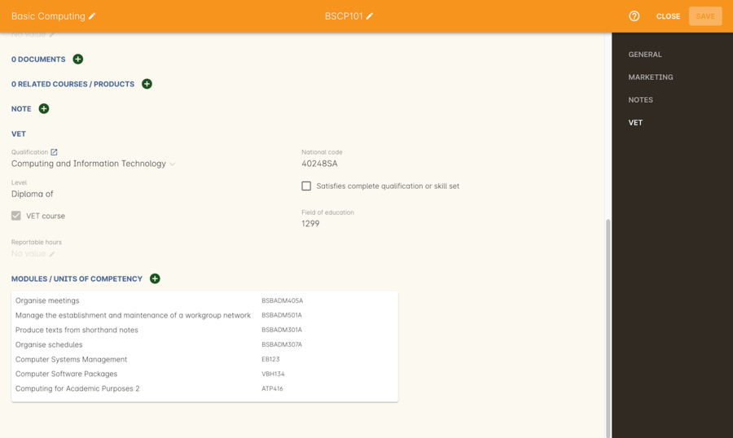
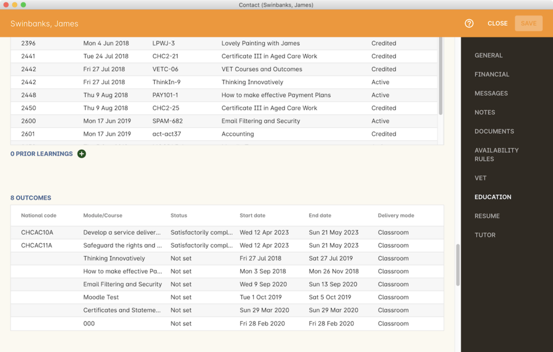
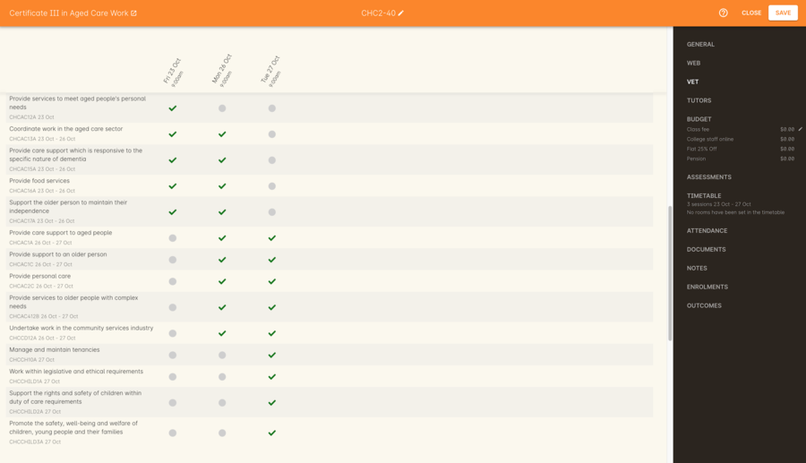
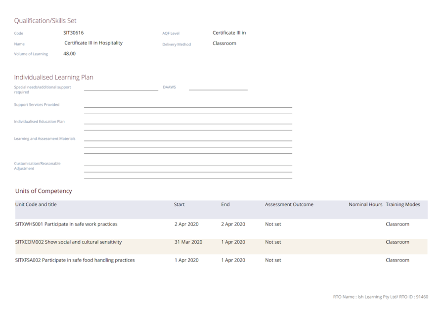

[[rto]]
== RTO Setup

=== Chapter Overview

This chapter looks at how an RTO can prepare their courses and classes in onCourse to ensure they're set up properly and can correctly report their data for funding. Included in this chapter is what to do before taking enrolments, how to set up funding sources/contracts, and how to set up sites, courses and classes.

[[rto-enrolments]]
=== Before Taking Enrolments

If you're required to report AVETMISS or funded training there are a few steps you'll need to take to ensure that reporting time goes as smoothly as possible. Do these things before you accept your first enrolment into any VET classes.

[[rto-enrolments-general]]
==== Set up General Preferences

Set up your AVETMISS details within the https://demo.cloud.oncourse.cc/preferences/avetmiss[Preferences] window.

Make sure that the 'Show RTO related screens and menus' checkbox is enabled, then fill out the rest of the page and be especially certain both your Training organisation name and RTO Identifier field match the details recorded on training.gov.au.

When you've finished, hit the 'Save' button.

[[rto-enrolments-competency]]
==== Competency components

onCourse imports information from training.gov.au such as Qualifications, Accredited Courses, Skill groups/sets, Units of Competency, and Modules. It also tracks higher education Courses and Units of Study.

onCourse automatically imports all this data regularly. You can view Units of Competency or Qualifications form the nav menu by clicking Training > Units of Competency or Training > Qualifications.

You can also create your own competencies for skills groups, modules and higher education which aren't imported automatically from training.gov.au. You can learn how to create your own Modules, Units of Competency and Qualifications in the paragraphs directly below.

[[rto-createModules]]
==== How to create your own Modules and Units of Competency

You can add your own modules and units of competency to the onCourse system from within the https://demo.cloud.oncourse.cc/module[Units of Competency] window.

It will open a new column in the window where you must enter a title, the national code, the field of education code, a credit points value, and an expiry days value. You cannot save the record without these fields being filled. After filling these fields, the save icon will become enabled. Click the icon to save the record.

There is an additional field for specialization, however this is not mandatory in order to save the record.

Type is a drop-down box where you can select whether the record is for a unit of competency, a unit of study, a module, or other. There's also an 'Is Offered' check box that, when ticked, flags that UoC as being offered by your college.

You can delete a custom record by highlighting it and clicking the cogwheel icon, then clicking delete record. You can only delete custom records.

[[rto-createQual]]
==== How to create your own Qualifications

From within the Qualifications window you can create your own Qualifications and Skill Sets. There are four mandatory fields that must be filled out before the record can be created: Type, Level, Title and National Code.

The Type field is a drop-down box that will allow you to specify the type of record; a qualification, an accredited course, a skill set, a local skill set, or higher education.
Level, title and national code are all free-text fields.

NOTE: For AVETMISS purposes, the presence of a Local Skill Set during the reporting period will create a NAT00030A file in your AVETMISS 8 export.

Additional fields include the ANZSCO number, field of education code, specialization code, and the number of nominal hours. There's also an 'Is Offered' check box that, when ticked, flags that qualification as being offered by your college.

You can delete a custom record by highlighting it and clicking the cogwheel icon, then clicking Delete Record. You can only delete custom records.

==== Site setup

Before creating courses or classes, you should ensure that all the sites you've set up have the correct address, suburb, postcode and timezone set. Any sites that are used for VET classes will have most of these details included in reporting, so ensuring accuracy in this data is important.

You can learn more details about <<sitesRooms>>.

[[rto-enrolments-courses]]
==== Course setup

[TIP]
====
In this section when we talk about Qualifications we really mean "Qualifications, Accredited Courses or Skillsets". When we say "Unit of Competency" we also include "Modules". Although the words are different between state and commonwealth accreditation regimes, the processes in onCourse are exactly the same.
====

Before going any further, you should read <<courses>> to understand the basics of what a course is in onCourse, and how to go about creating one.

Once you have a course created, in the VET tab of the new course record you can select the Qualification, and the Units from the built in NTIS data for your chosen course. If your course is VET, but not from a training package or accredited course, you can also flag it VET here and allocate its Field of Education ID. This is something you may need to do as part of your government funding requirements for non accredited courses.

[TIP]
====
Do you deliver state accredited courses? You will find the course listed in onCourse but not the modules that make up the course. This is because they are not publicly available on training.gov.au.
You can add your own by hitting the + button on either the Qualifications or Units of Competency windows.
====

onCourse does not contain the qualification packaging rules, so it is up to you as the RTO to ensure that you are compliant with your own scope of registration, and the requirements of the training packages you are authorised to deliver. You should refer to these requirements when creating your courses and only select those units which are allowed to contribute towards that particular qualification.

. A full Qualification where you know all the units the students will complete in advance i.e. all students will complete the same core and elective units. Students will graduate with a complete Qualification.
. A full Qualification where all students will undertake the core units, but may all select different elective units. Students will graduate with a complete Qualification.
. A short course which has one or more units of competency embedded within it. The units may or may not all contribute to the same Qualification. Students will graduate with a Statement of Attainment.
. A short course where you know which qualification a student will be working towards in advance, but the students in the class will complete a variable number and selection of units. Some may achieve a Statement of Attainment, some may be working towards a full Qualification, and some may simply receive a non-vet Statement of Attendance.
. A course which is not linked to any national or state accredited training packages or accredited courses, but has a vocational learning outcome. Depending on your reporting requirements, these courses may also contribute towards your annual VET delivery.

In onCourse, outcomes (records of undertaking and achieving a unit of competency) flow down from the course to the student via an enrolment in a class. If a course has 15 units attached to it, the students enrolled in that class will have 15 outcomes created for them - one for each unit. You can always modify the units for the student in their own enrolment, for example if they change to a different elective.

[[rto-createVETCourse]]
==== Creating a VET Course

. Go to Courses and hit the + button to create a new course record. For a detailed view on how to create a new course in onCourse, read <<courses>>.
. When you're done with the initial course setup, open the VET tab.
. Enter the National Code. The fields are clairvoyant, so as you type in them, onCourse will search for and list the qualifications in the built in training.gov.au database. Select the qualification by clicking on it. You can also search for qualification by name in Qualification. Omit the words Certificate in or Diploma of in your search. For example, search for the Certificate IV in Aged Care by typing 'Aged Care'.
. The qualification information is broken into different fields, so the Certificate IV Training and Assessment would read National code - TAA40104 Qualification - Training and Assessment Level - Certificate IV
. You can then add modules, and the units by clicking the +icon on the right-hand side of the screen.
This will open a drop down screen.
. Enter the National Code or Title These fields are also clairvoyant so make your selection and press ok. You will then be returned to the course screen where you will see the modules and units listed. To add more units simply click on the +sign and repeat the process. To delete any units, click the - sign. When you are done, click save. You can also set the nominal hours for the units as you attach them to the course.

[[rto-addModules]]
==== How to "add" a unit of competency to a course

You cannot actually add a Unit of competency to a course if it already has enrolments (see the caution above), you can only cancel the old course and then create a new course with the additional unit of competency you want included. This is because changing the units of competency changes the very nature of the course, but the history of the old course and its previous students need to be retained.

If needed, you can also add units directly to student enrolments. This will not change the course units for new students enrolling, but can be used to correct or update the records of existing students.

If the unit change is substantial, you may want to consider creating a new class against the new course, and transferring all the students from the class linked to the old course to the class linked to the new course. This will remove all the old units from their record (provided outcomes have not yet been set), and with their new enrolment, add all the new units to their record.

[CAUTION]
.Changing units in a course
====
Once a course has a class with an enrolment in it you CANNOT change the units of competency assigned to the course. This is because onCourse has created an immutable relationship with this data - if you changed it at the course level, every student ever enrolled in a class for this course would have their outcomes changed.

However - you can always retire the old course and create a new course to use for future enrolment using the 'duplicate course' option in the list view cogwheel. The new course can have the same name but will have to have a different course code. You may choose to change the code of the old course instead, so the new course can use the existing code, which is advantageous for your SEO. Make sure to set the status of the old course to 'course disabled' and when you are ready, the status of the new course to 'enabled and visible online'.

You may also want to duplicate one of the classes from the old course and assign it to the new course to use the same timetables and teaching schedules.
====

[[rto-duplicateCourse]]
==== How to duplicate a course:

. First go to "Course" list view and single click to select the old version of the course
. From the cogwheel, select the option 'duplicate course'. This will make another course with the same name and all the same content, with a course code with a 1 on the end.
. Courses can have the same name, but every course has to have a unique code. Because the course code is what forms your URL on the website, it is better for SEO purposes to change the code of the old course to something different before you disable it e.g. BCDCERTV could become oldBCDCERTV. Then you can change the code of the new version of the course from BCDCERTV1 back to BCDCERTV.
. Open the old version of the course and set the status to 'course disabled'.
. Open the new version of the course and make the required changes to the listed units of competency by adding or deleting from the current list on the VET tab. Note you will need to delete all the non-required units, save the record, and then reopen it to add new units.
. When you are ready to save and close the new course, set the course status to 'enabled and visible online'
. Open the class list view and locate a recent class from the old course. Following from the example before, this might be class oldBCDCERTV-90.
. Using the class cog wheel option, duplicate this class, making any changes to the dates as appropriate. This new class will have the code oldBCDCERTV-91 and be linked to the old course.
. Double click on the new class to open it. In the course code field in the top right-hand corner, change the code from the old course to the new course e.g. BCDCERTV. This has now linked the class to the new course. Save and close.
+
NOTE: You can only change the course a class is linked to before any enrolments are processed into the class. If a class has enrolments, even if those enrolments are cancelled, you can not change the course code it is linked to.

[[rto-qualsAndSkillsets]]
==== Courses which are complete qualifications or skill sets

When a course has the flag 'Satisfies complete qualification or skill set' checked on the VET tab, this means that if the student successfully completes all the attached units, they will be eligible for a Qualification or Skill Set Statement of Attainment.

Using the automatic 'create Certificates' options from the class or enrolment cogwheels will look at the value of this flag and determine what type of certification to create.

This flag, for AVETMISS purposes, also signifies the student's intent to complete a qualification.
Outcomes linked to a class with this flag checked will be reported linked to the parent qualification, where courses where this isn't selected will be reported as module only enrolments.

This value of this checkbox can be changed as needed after the course has been created, and even after students have enrolled.

[[rto-partialQualification]]
==== Partial qualifications

Remember that in onCourse a course is about the product you are selling to your students. Sometimes you may break a program of study e.g. full qualification into lots of short courses for students to buy, complete and over time, to work towards the final outcome of a qualification.

In onCourse, courses don't have to be linked to a qualification or a unit of competency. They can just be a non-accredited course.

If students are working towards a unit of competency that they will complete in another course, you may like to indicate this in the program description that you use for marketing purposes. If the student only completes this course, they will only be eligible for a non-accredited Certificate of Attendance, not a Statement of Attainment.

You can set up this type of program in onCourse by attaching the Qualification that the student will be working towards in the VET tab of the course, but not adding any Units of Competency to the course. You do not have to add the Qualification at all - this is optional, and would not be appropriate if the program of study never led to any formal Qualification outcome.

When students enrol in this course, they will get a dummy outcome (used for reporting purposes in some states) with the name of the course. You can set this dummy outcome to pass (81) or fail (82).
Using this outcome, you will then know when the student enrols in the next course (where the units have been attached) that they have successfully completed the part one component.

When you set up the second part of the course, you will add the qualification and the units to the VET tab, so when the student enrols they will get the appropriate units of competency added to their record. Then you are able to record their final outcome result as per the standard list of VET options.

In the example below, a student is working towards a cluster of units from the Certificate I in IT. Only when they have completed the second course, Understanding Computer Basics, are they eligible to be assessed against the unit outcomes. The first course, Computing Basics, has no units attached, and the second course has three units attached.

image::images/computing_basics.png[title='1st course: The Qualification is attached to the course,but the student has not completed any units of competency by completing this course']

image::images/understanding_computer_basics.png[title='2nd course: The Qualification and Units are attached to this course. After completing part 1 and 2 the student can now be assessed.']

[[rto-enrolments-classes]]
=== Class setup

First, you should be familiar with creating a <<classes>> in onCourse.

Where a class has multiple units of competency assigned to it, you should create a training plan to define at which points during the class delivery each unit begins and ends. Also ensure you add any <<assesment-trainingPlan, assessment tasks>> to the class so that these can be set in the training plan also.

For some government funding training, is it important to show in the AVETMISS reporting the sequence of the delivery of units by having varied start and end dates. Training plans allow you to achieve this.

[[rto_training_plans]]
=== Training Plans

Training plans are linked to sessions and can be found in the VET section of the class record.

By default, all units of competency are assigned to all sessions unless you choose to change this in the training plan. Units can't be assigned to no sessions as they would then have no start or end date, creating errors in AVETMISS reporting.

Assessment tasks assigned to the class also appear in the training plan and can be attached to outcomes they relate to. This will move any start/end outcome dates if the due date of the assesment extends beyond the set session delivery dates.

The Training Plan report allows you to provide hard copy evidence of the outcomes delivered in each session of the class, and the tutors you have assigned to deliver them. This report may be useful to provide to government funding bodies or ASQA auditors, as well as being used for internal planning and resource management.

[NOTE]
====
The outcomes/modules must have been set at the Course level first or else you won't be able to build a training plan.
====

To create a training plan:

. For any VET class, open the class record and go to the VET section.
. In VET, there's a sub-heading called 'Training Plan' which lists out the outcomes defined in the Course record, as well as each session date listed in the class's Timetable.
+

. New classes appear with every box checked. To quickly uncheck them, hover your mouse over the dates at the top and click the chevron that appears, then select 'Not Assigned'. this wil unassign each outcome for that date, and you can now set them as you wish.
. Just like when marking student attendance, click any circle to add a check mark, click again to remove it. This will mark that outcome as being taught in that session, and will adjust that outcomes start and end dates within the class training plan accordingly. You can see these dates below each outcome heading as you add check marks. Every outcome should have at least one check mark next to it. A combination of these dates, the tutors for each session and other class details form the training plan.
. Once the class record has been saved, the start and end dates are now set for each unit and can be reviewed by clicking the 'Show All Outcomes' button at the bottom of the Class edit view.
. The start dates and end dates defined by each unit must fall within the sessions of the class. You cannot manually set a date in a training plan outside the class boundaries, but you can do this on an outcome by outcome basis if required. To edit outcome dates individually, click 'Show All Outcomes' at the bottom of the class view, then in the window that opens, double-click the student/outcome you wish to edit the dates for. Outcome dates may have a padlock next to them, you can click this to unlock it and edit the field.
. If a student's outcome has been modified manually e.g. the end date has been extended beyond the duration of the class, the Training Plan settings will not modify the manual overrides you have created.
. To print the training plan report for all class enrolments, save and close the record and ensure the class is selected in the class list view. Click the Share icon > PDF > *Individual Training and Assessment Plan*. You can also print training plans for individuals from the Enrolments window.
Go to Enrolments, highlight the enrolment you wish to create the Training Plan for then select the Share icon > PDF > Individual Training and Assessment Plan.

[[rto_funding-contract]]
=== Funding source/contract

Once you've created the class, add the correct funding contract at the Class level via the VET tab, and then make any required changes for individual students at the Enrolment level. You can go here to learn more about <<fundingContract, Funding Contracts>>.

When you make any changes to funding source fields in the VET tab after you've already created the class, if there are already enrolments and outcomes associated with the fields you've just edited, you'll be prompted via pop-up whether you want to copy that change to all associated enrolment and outcome records. You can push the changes to enrolment records only, outcome records only, or both types.

[[rto_funding-invoices]]
=== Funding invoices

You can create funding-specific invoices in onCourse for any funded VET class. There is a very specific process to creating this special invoices, which can be used to track payments from any funding body for any funded enrolment.

Funding Invoices appear as an extra step within the Checkout process, after the Summary. They will only appear for single new enrolments if the class being enrolled in to has a 'default funding contract' that _isn't_ 'fee for service (non-funded)'.

If you don't require a funding invoice, or don't wish to use one, you can simply disable the tracking switch and move on to Payments.

image::images/reports/funding_invoice.png[title='Funding invoice in the Checkout']

The Summary is the invoice going to the student, whereas the Funding Invoice isn't sent to anyone, but used to track the funded payments internally for each enrolment. To correctly set up a funding invoice you must:

. Ensure the 'Track the amount owing' switch is turned on - you can change the funding contract this is recorded against here as well by selecting a new option from the drop down box.
. Set the Funding Provider contact record - generally this would be the Department of Education or another similar contact you keep in your system. If you don't have one, create one.
. Set the purchasing contract ID (NSW Commitment ID) - this will appear as the customer reference in the invoice record.
. Set the Price - this is the full amount of money you're expecting to be paid in funding, NOT from the student. Student invoices are all controlled via the summary in Checkout.
. Set the Payment Plan estimates - The payment plan will show a date entry for each day a session is held in this class. You will also see a breakdown of the class training plan, which will show you the number of units commenced by that date, and the number of units completed by that date. These are intended as a guide to help you work out your payment estimates and are taken directly from the settings in the class training plan.
+
Just like in other <<batchpayments>>, you can click a payment plan entry (not the first entry), and set an amount. As with other payment plans, the total amount put into the payment plans must equal the amount you entered into the Price field above.

These invoices are all traceable within onCourse, just like a normal invoice, from the invoices window.

The invoice will display with unique invoice lines noting that funding is being provided, the name of the student and the class enrolled in.

[IMPORTANT]
====
Single student enrolments into a class that has the same default funding contract set will all be grouped into the one funding invoice. This is to make it easier in cases where each individual outcome is separated out into separate classes.
====

