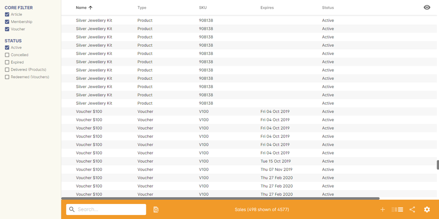
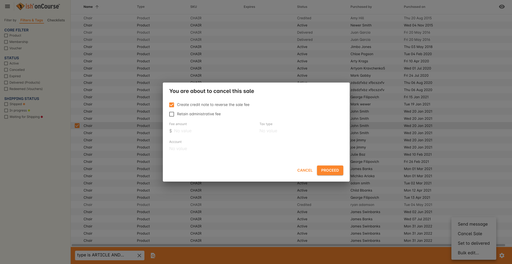
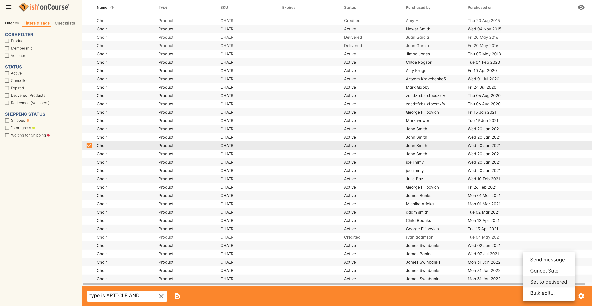
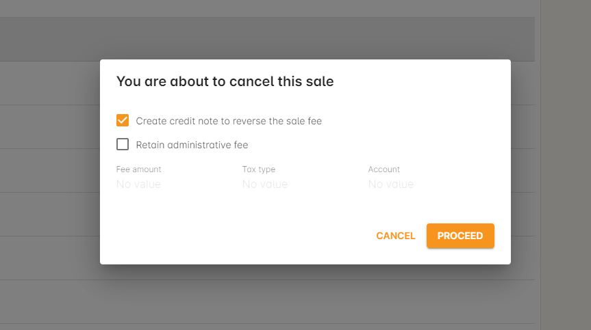
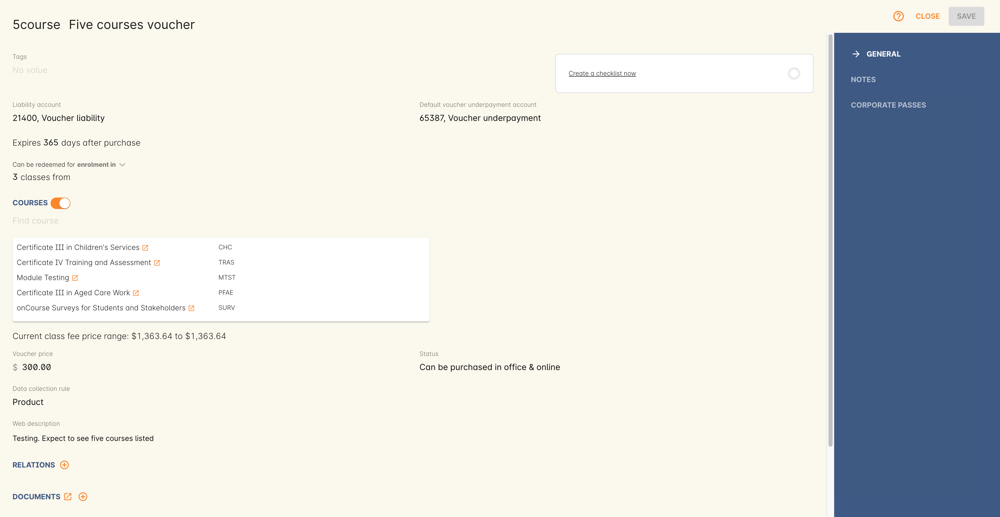

[[sales]]
== Sales

[[sales-navigating]]
=== Navigating the Sales list window

The https://demo.cloud.oncourse.cc/sale[Sales] window displays all the products, vouchers and memberships that have been sold.

Double-click on a record in the list to open it.

[[sales-Products]]
=== Products

A product sale record shows the product name, name of the buyer, the date it was purchased on, and the purchase price. There is also a Status field which shows as 'active' initially, but can be changed to 'delivered' if you require so.

[[sales-cancelProducts]]
==== Cancelling Products

To cancel a purchased product sale simply highlight the product you want to cancel, then click on the cogwheel and choose the option 'Cancel sale'. Once you have done that a sheet will pop down with the following options:

* Create a credit note to reverse the sale fee (this is checked by default).
* Retain an admin fee and apply it against a certain account.

[[products-delivered]]
==== Setting delivered status

You can set the status of a product to delivered from the sales list view. This can be done by:

. Highlighting the product
. Clicking on the cogwheel
. Selecting the option 'Set to delivered'.

[[sales-Memberships]]
=== Memberships

Memberships are products that can entitle a student to discounts, and possibly also provide that discount to their related contacts. You can learn more about them in our <<concessions-whatIsAMembership, Memberships and Concessions chapter>>.

Membership sales records will show the name of the membership product purchased, the name of the buyer (also the person who has the membership), the date of purchase, the 'valid from' date, the expiry date, the pruchase price and the status of the membership. It will also show any associated payment records.

image::images/Purchased_memberships_edit_view.png[title='Edit view of a purchased membership']

[[sales-cancelMemberships]]
==== Cancelling Memberships

To cancel a purchased membership highlight the membership you want to cancel, then click on the cogwheel and choose the option 'Cancel sale'. Once you have done that a sheet will pop down with the option to:

* Create a credit note to reverse the sale fee (this is checked by default).
* Retain an admin fee and apply it against a certain account.

[[sales-Vouchers]]
=== Vouchers

To open a voucher record double-click on a record in the list with the Type 'Voucher'.

Voucher records show the name of voucher product purchased, the name of the purchaser, the purchased on date, the expiry date, the purchase price, the status (active, expired, cancelled, redeemed), the remaining value and the voucher code.

There is also a 'Send invoice on redemption' field, which also acts like a 'can be used by' field. If a voucher has a contact in this field, then it can only be used by that contact.

[[sales-cancelVoucher]]
==== Cancelling Vouchers

To cancel a purchased voucher simply highlight the voucher you want to cancel, then click on the cogwheel and choose the option 'Cancel sale'. Once you have done that a sheet will pop down with the option to create a credit note to reverse the sales fee.

image::images/cancelling_voucher_sale.png[title='How to cancel a purchased Voucher']

[NOTE]
====
If the voucher has been partially redeemed you will see a record under the 'Payment Record' heading within the sale record.
====

