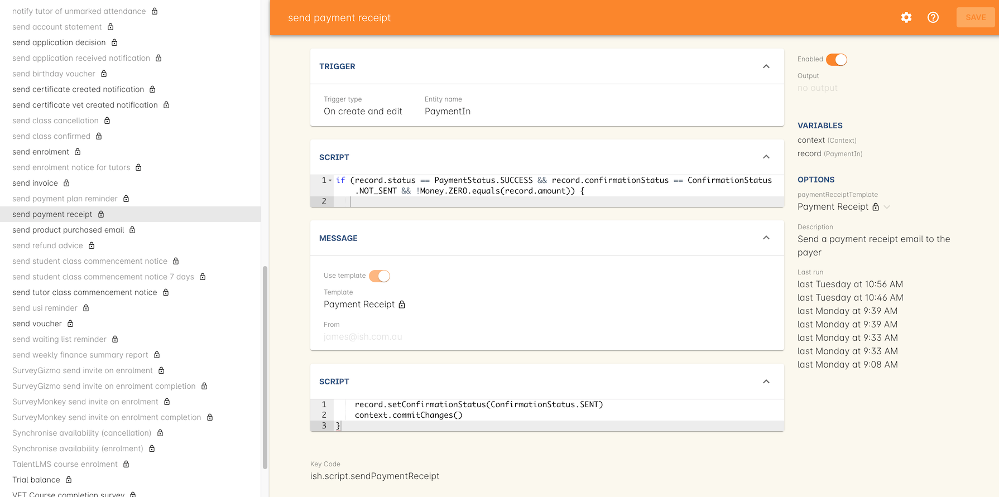
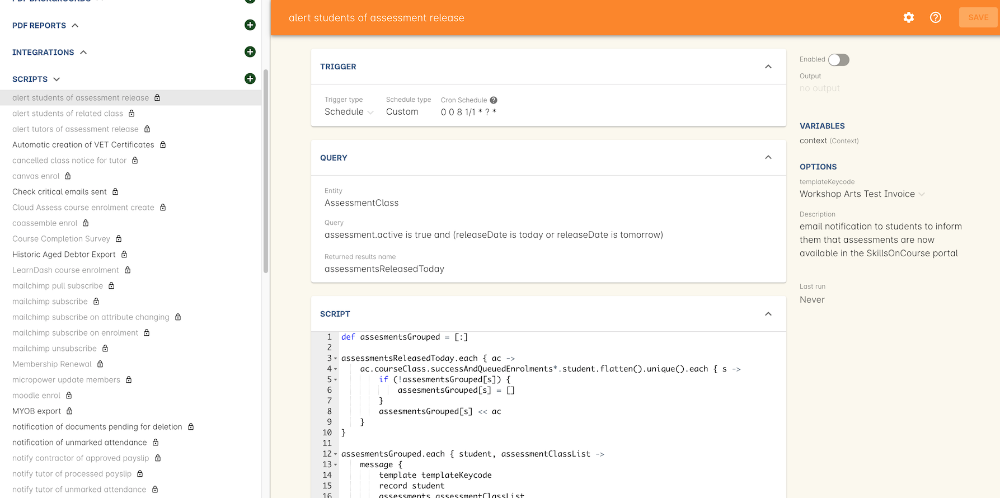

[[scripts]]
== onCourse scripts and custom workflow

onCourse has a powerful scripting engine which can be used to implement your own specific workflow rules into onCourse which is accessed via the Automation window, either by typing Automation into the Find Anything dashboard search.

You can use script to send automated emails or SMS, change records inside the system, integrate with third party tools such as analytics or mailing lists, export data to finance systems or your LMS. And much much more.
Scripts allow your student management system to become a completely customisable tool with your business workflow engine built right into onCourse.
You can create and update onCourse records on an event, send messages to key contacts when a record is created or changed, or automating the publishing, exporting or printing of data how and when you require it.
Every script has a description field to help explain the purpose of it.

Scripting allows you to write directly to the database, calling your own program code that can automate almost any business practice you can imagine.
Any database changes they attempt are subject to similar validation as data input manually.

Scripts often work hand in hand with <<emailTemplates>>, sending automated messages to various onCourse contacts.

=== Navigating the Scripts view

Click the 'Scripts' heading in the Automation window to expand the section.
Then click the script you want to view in detail and it will open in the section on the right.

[[scripts-whatYouCanDo]]
=== What can you do with scripts?

Some simple ideas that could be implemented with a custom onCourse script:

* Run a daily transaction export at 2am for the prior 24 hours and email it to your Accounts Manager
* Automatically send an email to a student on their birthday containing a $10 gift voucher
* Notify tutors their class is confirmed running when the class minimum enrolment number has been reached
* Notify coordinators one week before a class is due to commence if the class is under the minimum
* Automatically notify all students on a course waiting list when you publish a new instance of class to the web
* Send a monthly notification to debtors or creditors of their onCourse balance outstanding
* Send your Enrolment Manager a daily email of students who failed to complete the online enrolment process so they can manually follow them up
* Send the CEO weekly summary of enrolments, income and trending programs
* Schedule a series of daily reports to print rooms labels, class rolls and sign in sheets every business day morning, and for all weekend classes on a Friday morning
* Print and send reports to site coordinators for all sessions running at their venue the following week
* Email students at the conclusion of their course suggesting other courses they might be interested in, with a time limited discount offer
* Email VET students' employers three months after the conclusion of their course requesting they complete the Employer Satisfaction Survey
* Integrate with an LMS such as Moodle or Canvas where you push student enrolments in real time as enrolments are created.
You can use onCourse tags to control which courses are handled in this manner.
* Integrate with MailChimp or other mailing list manager to synchronise mailing list contacts in both directions
* Verify that course administrators are writing at least 100 words of course description before putting the course onto your website
* Send an email to your administrator if a course administrator schedules a course for a public holiday
* Automate integration with your accounting system
* Email students the day before their class starts
* SMS to tutors one hour before the should be teaching
* Automate compliance exports such as VET FEE HELP or AVETMISS
* Update course content on your website with data from some other source
* Automate of creating Facebook or Twitter comments from "what's hot today" or new courses being published
* Push course enrolment events to Google analytics so that you can see office enrolments alongside web enrolments in your statistical reports

[[scripts-Permissions]]
=== Script permissions

All onCourse license options can choose to enable or disable scripts provided by ish, and alter the options within them to suit their own needs.
Some paid license plans can commission changes to existing scripts or request new custom scripts from ish.
Customers with Enterprise level licensing can modify and add to their own scripts to onCourse themselves.

You can enable and disabled a script by double-clicking one from the script list view, which you can access from the Security window under User Roles, and then ensuring the access for scripts is set correctly.

Scripts which are enabled display the information about when they will next run in the record.
Disabled scripts appear greyed out.

If you have the appropriate license for modifying scripts, you can control which users are able to edit them in the user roles.
We recommend you only give this permission to users with technical skills to properly make changes to the scripts since a bad script can have far ranging implications for your system.

[[scripts-onCourseDefaultScripts]]
=== onCourse default scripts

All the default scripts come with a new installation of onCourse.

[NOTE]
====
IMPORTANT: Before you enable or adjust any new script, you should open the script and click the button in the bottom right hand corner "Update to the latest version".
This will ensure the script is set to use the latest code version from Git Hub.
====

==== Auto enabled default scripts

These scripts are enabled by default in all onCourse databases.
Please contact us before you disable them as they have implications for the enrolment and sales processes:

. *Send enrolment* - send the email (template - Enrolment Confirmation) to the enrolling student on successful creation of an enrolment, through the office or the website.
. *Send invoice* - send the email (template - Tax Invoice) to the payer of the enrolment where the invoice balance is not zero.
. *Send payment receipt*- send the email (template - Payment Receipt) to the payer when a payment in is processed outside of the enrolment process
. *Send voucher* - send the email (template - Voucher Email) containing the voucher redemption code and details to the purchaser of a voucher

==== Disabled default scripts

These scripts have been added for all users of onCourse, but are switched off by default.
Before enabling these scripts you should check the wording of the default email templates they call, and adjust them as necessary.

Prior to enabling a script, you should open the script and click on the button 'update to latest version'.
This will make sure any improvements to the original script are downloaded.

You can enable or disable these scripts in your database at any time, and make modifications as desired if your licence level allows.

===== Student notifications

. *Send student class commencement notice* - automatically send a reminder email (template - Student notice of class commencement) to active enrolled students one day before their class commences
. *send student class commencement notice 7 days* - automatically send a reminder email (template - Student notice of class commencement) to active enrolled students seven days before their class commences.
+
NOTE: Depending on your business processes, you may wish to enable only one of the reminder scripts (1 day before or 7 days before), or both.
By default, these scripts use the same email template.
. *Send class cancellation* - Send an email (template - Class Cancellation) to the students who were enrolled with information about class cancellation options, when a class is cancelled
. *Send application received notification* - When an application has been created via the web or in the office, send the student an email (template - Enrolment application received) to notify them, and send an email to the default admin email address to schedule the follow up process.
. *Send application decision* - When an application status is set to offered, send an email (template - Enrolment application accepted) to a student to notify them their application has been accepted, what their custom enrolment fee is and how they can enrol.
When an application is set to rejected, send an email (template Enrolment application rejected) to the student to notify them.
. *Send certificate created notification* - Create a certificate of attendance for non-VET training with your custom certificate_attendance_backgound.pdf, upload the certificate to the portal and send an email (template - Certificate available) to the student containing the link.
There are options in the script to check attendance requirements before creating certificates, which are commented out by default.
. *Send class completion survey* - The day after a class is completed send an email (template - Course completion survey) to all classes that are not tagged with "no survey" requesting students complete the skillsOnCourse portal survey process.
. *Alert student of assessment release* - This script runs daily at 8am and checks if any assessments have a release date in the system set as today, and then sends students an email detailing each assessment released.

===== Tutor notifications

. *Send tutor class commencement notice* - automatically send a reminder email (template - Tutor notice of class commencement) to all class tutors two days before their class commences
. *Cancelled class notice for tutor* - automatically sends a cancellation email (template - Tutor notice of class cancellation) to the tutor/s if a class they are teaching gets cancelled
. *Send enrolment notice for tutors* - For classes tagged with 'Notify manager', send an email (template - Enrolment notification) to the tutor attached with the role 'course manager' to advise them that a student has enrolled in the class.
. *Notify tutor of unmarked attendance* - This script runs daily and checks every session run on the previous 7 days.
If any student attendance is unmarked, the script sends to the tutors an email notification (template - Tutor notice of unmarked attendance) to mark their class roll.
One email is sent for each class with unmarked sessions.
Tutors may receive the same email for 7 consecutive days if they do not follow the instructions and mark their attendance.
After 7 days from the session date, no further reminder will be sent.
. *Alert tutor of assessment release* - This script runs daily at 8am and checks if any assessments have a release date in the system set as today, and then sends an email to the tutor for each assessment released.

===== VET specific scripts

. *Send USI reminder* - automatically send a reminder email (template - USI reminder email) to VET students every 7 days for the next month if they haven't supplied their USI on or shortly after enrolment
. *Automatic creation of VET Certificates* - For each enrolment, at 4am every day check for outcomes which have been modified in the previous 24 hrs.
If any outcomes attached to the enrolment are not yet marked, skip this enrolment.
For students with at least one successful outcome, create the certificate record (Statement of Attainment or Qualification, based on the isFullQual flag at the course level).
If the outcome is already joined to a certificate, do not create a new certificate containing that outcome
. *Send certificate VET created notification* - At 5am each day, print to PDF and upload to the portal all unprinted VET certificates, where the student meets the requirements for certification, including having supplied their USI. Send an email (template - Certificate available) to notify the student that their certificate is available in the portal.
You must ensure you have created and uploaded into onCourse backgrounds named vet_soa_background.pdf, vet_qualification_background.pdf and vet_skillset_background.pdf before enabling this script.
. *VET course completion Survey* - This script will send an email (template - VET course completion Survey) to each student two weeks after to the completion of the course.

===== Financial scripts

. *Send refund advice* - When a successful payment out is created e.g. credit card refund, send an email (template - Refund advice) to the payee
. *Send weekly finance summary report* - Send the Trial Balance report for the previous 7 days each Monday morning to the default system administrator email address.
There is an option in this script to change the reporting period from weekly to monthly if that is your reporting period preference.
. *Send payment plan reminder* - This script will send an email (template - payment reminder) to each debtor with an overdue invoice, or an invoice which has a payment due within the next 7 days.
Included in the email is a link where the debtor can click to make a credit card payment via the onCourse portal.
. *Membership notification renewal*- This script will send an email (template - Membership Notification Renewal) to each contact with an active membership 7 days prior to its expiry to remind them to purchase a renewal.
. *Send account statement*- This script will send an email with a PDF attachment of the printed Statement Report for each contact with an outstanding balance, and by default is scheduled to run on the first of the month.
The email that is sent to the contact is plain text, embedded within the script.
There is no separate email template to edit and no HTML version available.
The email includes the total balance outstanding and a 30 day no login required link to the skillsOnCourse portal where the invoices can be viewed and payments made.
There is no copy of this message stored in onCourse against the contact record.

===== Marketing and sales scripts

. *Synchronise availability (enrolment)* - This script finds all single session classes taught by the same tutor in the same room with overlapping times and keeps the places available in sync.
For each enrolment in Class A, the maximum available places in Class B is reduced by one.
This is useful if one class is a subset of another (e.g.. a refresher First Aid class where students need only come to the second half of the regular First Aid class).
If you enable this script, you'll also want to enable 'Synchronise availability (cancellation)'
. *Synchronise availability (cancellation)* - This script finds all single session classes taught by the same tutor in the same room with overlapping times and keeps the places available in sync.
For each enrolment in Class A, the maximum available places in Class B is reduced by one.
This is useful if one class is a subset of another (e.g.. a refresher First Aid class where students need only come to the second half of the regular First Aid class).
If you enable this script, you'll also want to enable 'Synchronise availability (enrolment)'
. *Send waiting list reminder* - for students who have been added to a waiting list, send them an email (template - Waiting List reminder) every 7 days of the classes currently available for the courses they are on wait lists for.
+
NOTE: There is also a manual email template 'Waiting list notification' that is designed to be sent manually when a class has limited vacancies available, to students on the wait list for the course.
. *Alert students of related class* - DO NOT ENABLE THIS SCRIPT!
It is designed to be manually triggered as needed on a class by class basis.
Access the script from the class cogwheel, by single clicking on the class you want to promote to past students of the same class tutor, and choosing 'Execute script for 1 record' > alert students of related class.
+
This script finds all students who have enrolled in a class in the last 18 months with the tutor(s) assigned to the first class session, who aren't currently enrolled in this class, and sends them an email (template - alert students of related class) to encourage them to enrol in this class.

===== Administrative scripts

. *Send product purchased email* - Each time a product is purchased on the website, and email is sent to the admin email address to notify them of the purchase, using the same admin email as the 'From' address.
Rather than using an email template, the email layout is a simple plain text email inside the script itself.
To change the text, you need to edit the script directly.
This script is disabled by default.
. *Notification of unmarked attendance* - This management script is set to run daily and check for sessions run the previous day where at least one of the enrolled students has an unmarked attendance record.
If an unmarked record is found, an email is sent to the admin contact so they can initiate a follow up process with the tutor.
Optionally, only courses tagged with 'checkAttendance' will be checked, so if attendance marking is important for some programs, like VET, you can ignore unmarked attendance for your leisure courses.

===== Integration scripts

A number of 3rd party integrations are included with onCourse and as standard, and each integration includes integration scripts to enable you to fine tune how the integration works.
For more information about 3rd party application integrations refer to <<externalintegrations>>

. *CloudAssess course enrolment create* Creates an enrolment in cloud assess where the onCourse course code and cloudAssess course code are the same
. *Moodle enrol* Create an enrolment in moodle where the course has the tag defined in the moodle integration
. *Coassemble enrol* Create an enrolment in Coassemble LMS.
. *Mailchimp subscribe* Subscribe contacts to mailchimp mailing lists using the onCourse mailing list feature.
NB The name of the integration must match the name of the mailing list exactly for this script to work.
You can set up multiple integrations, one for each mailing list.
You only need to enable this one script to run them all.
. *Mailchimp subscribe on enrolment* Subscribe all enrolling students to a mailchimp mailing list, where the integration name is 'Enrolment'.
NB you must set up the integration before enabling this script.
. *Mailchimp unsubscribe* Unsubscribe contacts from mailchimp mailing lists using the onCourse mailing list unsubscribe feature
. *SurveyGizmo send invite on enrolment* Send a survey invite (template
- survey invite) on enrolment in a course tagged with the tag defined in the SurveyGizmo integration
. *SurveyGizmo send invite on completion* Send a survey invite (template
- survey invite) on class completion in a course tagged with the tag defined in the SurveyGizmo integration
. *SurveyMonkey send invite on enrolment* Send a survey invite (template
- survey invite) on enrolment in a course tagged with the tag defined in the SurveyMonkey integration
. *SurveyMonkey send invite on enrolment completion* Send a survey invite (template - survey invite) on class completion in a course tagged with the tag defined in the SurveyMonkey integration
. *Xero manual journal* Create a Xero set of journals for the total transactions for each account created on the previous day
. *MYOB manual journal* Create a MYOB set of journals for the total transactions for each account created on the previous day

[[scripts-scriptTriggers]]
=== Script triggers

Each script is triggered by an event.
An event can be time based (cron) or linked to a record change.

==== Time based events

onCourse scripts can be triggered by a cron expression for firing at a repeating interval. cron is a Unix tool that has existed since the 1970s and is extremely powerful and flexible.

Some pre-defined cron expressions are available to select from the drop down list in the script (daily, weekly or hourly), or you can create your own custom cron using this simple tool http://www.cronmaker.com/?0

You need only write six fields separated by spaces to describe the recurring timing.
For example, you can specify "every Monday at 9am" or "1am on the first Sunday of every month".

Seconds::
Allowed values: 0-59
Minutes::
Allowed values: 0-59
Hours::
Allowed values: 0-23
Day of month::
Allowed values: 1-31
 +
Special characters: ?
L W
Month::
Allowed values: 1-12 or JAN-DEC
Day of week::
Allowed values: 1-7 or MON-SUN
 +
Special characters: ?
L #

Every field allows the special option '*' which means all values.
For example, '*' in the minute field means every minute.
In each field you can also use ranges.
For example '13-15' in the hour field means 1pm, 2pm and 3pm.
And ',' can be used for multiple values such as 'mon,wed,fri' in the day of week field.
You can specify a repeating increment in a field with a '/'.
For instance "0/15" in the hour field means every 15 minutes starting at the hour.
Or "2/3" in the day of month field means every three days starting on the second day of the month.

? ("no value")::
Because day-of-month and day-of-week overlap in meaning, one of those two fields should always be '?'.
L ("last")::
has different meaning in each of the two fields in which it is allowed.
For example, the value "L" in the day-of-month field means "the last day of the month" - day 31 for January, day 28 for February on non-leap years.
If used in the day-of-week field by itself, it simply means "7" or "SAT".
But if used in the day-of-week field after another value, it means "the last xxx day of the month" - for example "6L" means "the last Friday of the month".
When using the 'L' option, it is important not to specify lists, or ranges of values, as you'll get confusing results.
W ("weekday")::
used to specify the weekday (Monday-Friday) nearest the given day.
As an example, if you were to specify "15W" as the value for the day-of-month field, the meaning is: "the nearest weekday to the 15th of the month".
So if the 15th is a Saturday, the trigger will fire on Friday the 14th.
If the 15th is a Sunday, the trigger will fire on Monday the 16th.
If the 15th is a Tuesday, then it will fire on Tuesday the 15th.
However if you specify "1W" as the value for day-of-month, and the 1st is a Saturday, the trigger will fire on Monday the 3rd, as it will not 'jump' over the boundary of a month's days.
The 'W' character can only be specified when the day-of-month is a single day, not a range or list of days.
 +
The 'L' and 'W' characters can also be combined in the day-of-month field to yield 'LW', which translates to "last weekday of the month".
#::
used to specify "the nth" XXX day of the month.
For example, the value of "6#3" in the day-of-week field means "the third Friday of the month" (day 6 = Friday and "#3" = the 3rd one in the month).
Other examples: "2#1" = the first Monday of the month and "4#5" = the fifth Wednesday of the month.
Note that if you specify "#5" and there is not 5 of the given day-of-week in the month, then no firing will occur that month.

The legal characters and the names of months and days of the week are not case sensitive.
MON is the same as mon.

.Examples
[cols=",",]
|===
|0 0 12 * * ? |Fire at 12pm (noon) every day

|0 15 10 ? * * |Fire at 10:15am every day

|0 15 10 * * ? |Fire at 10:15am every day

|0 15 10 * * ? * |Fire at 10:15am every day

|0 15 10 * * ? 2005 |Fire at 10:15am every day during the year 2005

|0 * 14 * * ? |Fire every minute starting at 2pm and ending at 2:59pm,
every day

|0 0/5 14 * * ? |Fire every 5 minutes starting at 2pm and ending at
2:55pm, every day

|0 0/5 14,18 * * ? |Fire every 5 minutes starting at 2pm and ending at
2:55pm, AND fire every 5 minutes starting at 6pm and ending at 6:55pm,
every day

|0 0-5 14 * * ? |Fire every minute starting at 2pm and ending at 2:05pm,
every day

|0 10,44 14 ? 3 WED |Fire at 2:10pm and at 2:44pm every Wednesday in the
month of March.

|0 15 10 ? * MON-FRI |Fire at 10:15am every Monday, Tuesday, Wednesday,
Thursday and Friday

|0 15 10 15 * ? |Fire at 10:15am on the 15th day of every month

|0 15 10 L * ? |Fire at 10:15am on the last day of every month

|0 15 10 ? * 6L |Fire at 10:15am on the last Friday of every month

|0 15 10 ? * 6L |Fire at 10:15am on the last Friday of every month

|0 15 10 ? * 6L 2002-2005 |Fire at 10:15am on every last Friday of every
month during the years 2002, 2003, 2004 and 2005

|0 15 10 ? * 6#3 |Fire at 10:15am on the third Friday of every month

|0 0 12 1/5 * ? |Fire at 12pm (noon) every 5 days every month, starting
on the first day of the month.

|0 11 11 11 11 ? |Fire every November 11th at 11:11am.
|===

==== Entity events

Rather than a specific time, the trigger for a script can instead be a record change, otherwise known as an entity event.
You are able to specify the entity name and the type of change to trigger the script:
create, update, create or update, or remove.
Note that entity names are mostly the same as database table names, but there is a difference.
Some entities don't map directly to the database.

For more details of what entities are available, please consult our detailed API documentation.

==== onCourse events

There are also specific events in onCourse that can be used to trigger scripts, called onCourse events.
These events relate entirely to cancellation and/or creation of enrolments as well as the publishing and/or cancelling of classes.
The events types are specified as:
enrolment successful, enrolment cancelled, class published and class cancelled.

==== On Demand scripts

When a script is set as On Demand it means the script can only be triggered manually by the user via the cogwheel menu in onCourse.
The entity class defines from which screen in onCourse the script can be triggered.
If an entity is not defined, then the script can only be run from the main navigation menu under 'Favourites'.
This latter function only appears for users with admin priveliges.
You can also add the script to your Favourites by clicking the heart icon that appears when you hover your mouse over it.

Click the script icon in the list to open a new dialog box.
For some script, this will shows some questions to be answered, depending on the script definitions.
Click Run Now to run it.
The run history is shown as a series of ticks and crosses representing each time the script has run either successfully or failed.
Hovering your mouse over the icon will show you the corresponding date and time it was run.

[[basic-Scripts]]
=== Creating Scripts

Scripts can be constructed by via blocks that represent certain behaviours and actions in onCourse.
Each block has a specific function.
Scripts executes the function of each block starting from the 'top' block.

To add a block, click the Floating Action Button (FAB).
This will give you a drop-down of the blocks available to add to your script.
Click and drag to reposition a block.
You can change the order of blocks within your script by clicking and dragging the reposition icon.
Click and drag to reposition a block.

[[basic-Scripts-Blocks]]
==== Script blocks

There are a number of different blocks that can be used to construct a script.

SCHEDULE::
Each script must start with a schedule block.
This tells the script how/how frequently it is run.
The Schedule block outlines the triggers for a given script.
Schedule block triggered by a CRON.
IMPORT::
The Import block allows you to import external Java and Groovy libraries to be used in your script.
These libraries can give you access to certain methods or classes to be used in an Advanced script block.
Import block importing the Apache Common StringUtils library
QUERY::
The Query block allows you to retrieve records from your database.
You must specify what entity type is to be returned from you query, as well as provide a name to reference the returned objects.
Additionally, an AQL query can be provided to further filter down the returned objects.
Querying a database to return all classes that are not cancelled and finish on the day of script execution.

[[scripts-Content]]
=== Writing advanced scripts with Groovy

Advanced scripts give you power to implement almost any workflow using the onCourse Domain Scripting Language (DSL).
The onCourse DSL provides an interface you can use to interact and edit with your onCourse data.
You can interact with the onCourse DSL using the Apache Groovy scripting language.

To create an Advanced script block, select 'Script' from the FAB drop down.
An Advanced script block that will take in a list of classes, and send an email to each enrolment in each class.

Let's pull apart a sample script.
This one sends an email when an invoice is created.

[source,groovy]
----
def i = args.entity

if (i.confirmationStatus == ConfirmationStatus.NOT_SENT) {
    def m = Email.create("Tax Invoice")
    m.bind(invoice: i)
    m.to(i.contact)

    m.send()

    i.setConfirmationStatus(ConfirmationStatus.SENT)
    args.context.commitChanges()
}

----

In that variable "args" you will get access to important objects to help you write your script.
The most important two are:

args.entity::
This is the object which caused the script to run.
It is null if this script was triggered by a cron event.
args.context::
This is the Cayenne context within which the script runs.
You'll use this to perform searches for other records or to commit changes back to the database.

[source,groovy]
----
def i = args.entity
----

For convenience we've assigned this object to a variable with a nicer name.
This just makes the rest of our script easier to read.

[source,groovy]
----
if (i.confirmationStatus == ConfirmationStatus.NOT_SENT) {
----

So our invoice has an attribute confirmationStatus.
We can find these attributes documented in the onCourse javadocs.
In this case we just want to check to see that we still need to send this email.
We don't want to send it if the invoice was part of a failed payment and reversal, or if the user already received it.

[source,groovy]
----
def m = Email.create("Tax Invoice")
----

So let's make a new email and call it "m".

[source,groovy]
----
m.bind(invoice: i)
----

That email template has a property called "invoice" and we'll bind our invoice object to that property.

[source,groovy]
----
m.to(i.contact)
----

The invoice has a property called 'contact' and we'll make sure the message will be sent to that person.

[source,groovy]
----
m.send()
----

And we are done.
This will finish all the work of creating the message.

[source,groovy]
----
i.setConfirmationStatus(ConfirmationStatus.SENT)
----

We better now set the invoice to sent so that we don't send this email again.
For example, this script might be triggered because we edit the invoice to change the due date.
In that case, the script will be triggered.

[source,groovy]
----
args.context.commitChanges()
----

This last step is very important.
All the changes we made (including the email we created) exist only in memory and not saved to the database until this step.
Unless we save it, no email will go out and no other user will see our changes.
When we commit, all the validation will run.
For example, onCourse will prevent you from sending an email which has no 'to' contact and so the commit will fail. onCourse will also synchronise any objects with your onCourse website.
This allows you to programmatically modify website content directly from these scripts.

For full details of the groovy language consult the official documentation here http://groovy.codehaus.org/ Groovy has very nice support for iterating through collections (such as a big list of database objects), regular expression matching and much more.
Plus you get to use all the Java libraries already included inside of onCourseServer plus the full Java JRE.
