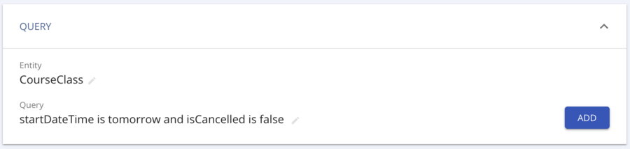

== Search

[[search-introduction]]
=== Introduction

onCourse has powerful tools for searching across every piece of data you
have collected. You can search in lists, perform basic and advanced
searches on any attribute of the data and use these searches to write
scripts and reports. In this chapter we'll start from the simplest tools
and then show you more advanced possibilities.

[[search_findAnything]]
=== Find Anything

The main Dashboard has a search bar called Find Anything, where you can
type in almost any type of data from a record, including a name, course
code, class code, even an invoice number, and it will be shown in the
search results.

image:images/find_anything.png[Find Anything will help you find almost
anything within onCourse quickly,scaledwidth=100.0%]

[NOTE]
====
IMPORTANT: This is not the same as the Search function in list views.
====

[[search-listView]]
=== List Views

Every list view has a search panel across the bottom.

Typing into the Search bar will retrieve all records that match your
input across certain fields. For example, in the Contact list, the text
you enter will be found in first name, last name and email address
fields. Simple search terms will automatically wrap in quotes. You can
also type more complex queries into this field using the Advanced Query
Language, link:search.html#search-advanced[covered here].Searching
Classes for any using 'Certificate III' in the course name

[[search-findRelated]]
=== Find related records

Find related records is one of the most powerful tools inside onCourse,
let you quickly jump from window to window, finding records related to
groups of other records. This function is located next to the advanced
search in each list view in onCourse.

For example, to locate all the employers of all the students aged 18 to
25 in the last three months of VET programs to send the Employer
Satisfaction Survey to you can start by searching for all classes with a
particular tag or use the advanced search on VET course flag. Once you
have those classes, you can highlight those delivered in the last three
months, and select from the find related icon 'Enrolled students'.

image:images/search/find_related_records.png[ Finding the related Course
record for the highlighted Class ,scaledwidth=100.0%]

Once the student list has opened, you can search that list of results
for students aged 18 to 25. The list view that has opened is in a
special mode called 'custom selection' which you can see in the window
header bar. This means other searches or filters you run on this window
are only inside the special set of results you have created as a list.

With the reduced list of students, you can use the find related icon to
select contacts related as Employer. From this new window, you can use
the cog wheel to send a message to the student's employers.

[NOTE]
====
Find related can only be run on a max of 1000 records at any one time
====

[[search-advanced]]
=== Advanced Query Language

You can construct more powerful search queries using the onCourse query
language. When clicked on, you'll notice the search bar expands and
shows numerous options for you to select from a drop down box. These
selections are used to construct queries, which can be used to find
either simple or complex sets of data. It might seem intimidating at
first, but understanding the logic of this feature will help hone in on
finding exactly the right data you need, and using the drop down boxes
takes a lot of the guesswork out of this.

The advanced search query bar

The small bookmark icon shows you whether or not your search query is
valid. When the search is empty it appears grey, when you're using an
accepted query it'll display in green, and when using an invalid query
it'll display in red. When the query is good and the bookmark is green,
you can click the bookmark to save your search so it appears in the
left-hand column. Just choose if you want it visible for only you or
everyone who uses your system, give it a name then hit the save icon
that appears next to it.

You can also use AQL in sub-lists, like when adding a set of classes to
discounts, or when adding a Corporate Pass to a voucher type.

A simple query consists of a field, followed by an operator, followed by
a value:

....
 
                title starts with "Apply"             
            
....

In the above example, the field is 'title', the operator is 'starts
with', and the value is 'Apply'. Searches are context sensitive to the
screen you are viewing e.g. in the Unit of Competency list, this query
will show you records beginning with 'Apply'.

Two or more queries can be linked together with conditional operators.

....
 
                title starts with 'Apply' and nationalCode starts with "B"                  
            
....

In this example, 'and' is the conditional operator that combines the two
separate queries. In this case, using 'and' means only records that
satisfy both queries are returned.

image:images/search/searchOperator.png[ An example of a simple query
using the onCourse query language ,scaledwidth=100.0%]

[[search-advanced-fields]]
==== Fields

When you click into the search box, a drop-down list of available
_fields_ will appear. The fields that are available to use in queries
will change depending on which record type you are searching on. You can
also search for custom fields by typing the custom field key associated
with the custom field you want to call.

image:images/search/advanced_query_fields.png[ Query parameters are
listed in a simple, context-sensitive drop-down box for you to choose
from ,scaledwidth=100.0%]

[[search-advanced-operators]]
==== Operators

In your query, you will want to compare the field with some value. The
type of comparison is defined with an _operator_. Each operator can be
written as a word in full or as the short symbol.

EQUALS or =::
  Finds records where the field matches the value exactly. This operator
  is not case sensitive.
  +
....
createdOn = today
....
  +
....
nationalCode EQUALS "ABC"         
....
NOT EQUAL or !=::
  NOT EQUAL finds records that do not match the input value.
  +
....
deliveryMode != ONLINE                                    
....
LESS THAN or <::
  LESS THAN returns records where the value is less than the input
  value.
  +
  LESS THAN can also be used with EQUALS to return records where the
  value is less than or equal to the input value.
  +
....
enrolmentCount < 10                                   
....
  +
....
enrolmentCount <= 9
....
GREATER THAN or >::
  GREATER THAN returns records where the value is greater than the input
  value.
  +
  GREATER THAN can be used with EQUALS to return records where the value
  is greater than or equal to the input value.
  +
....
age > 17
....
  +
....
age >= 18
....
BETWEEN or ..::
  BETWEEN ( .. ) is used to specify a date range. BETWEEN ( .. ) will
  return records where the specified attribute occurred or was created
  between the set dates.
  +
....
createdOn in 01/01/2018 .. 01/02/2018
....
  +
  BETWEEN can be used with a star closure ( * ), placed either directly
  before or after the date. See below for the correct syntax; placing
  the star and BETWEEN before the date will find all relevant data from
  before that date, while placing them after will find all relevant data
  after that date.
  +
....
createdOn not * .. 01/01/2018
....
  +
  Both the above and below queries will show you the same data, all
  records created before 01/01/2018. The top query asks all records
  created before this date to be excluded thanks to the 'Not' operator,
  while the bottom query asks for all records created after this date to
  be shown thanks to the 'In' operator.
  +
....
createdOn in 01/01/2018 .. *
....
IN::
  IN will display any data that fits into the input data set.
  +
  A set is denoted as a list of items, where each element of the set is
  separated by a comma. In the below example, this query will return and
  display any data that has a confirmationStatus as either _NOT_SENT_ or
  _DO_NOT_SEND_.
  +
....
confirmationStatus in (NOT_SENT, DO_NOT_SEND)

enrolment.student.id in (10,11,12)
....
[ ]::
  Square brackets are a shorthand to search for the record id (the
  primary key in the database) in a list, denoted by [ ].
  +
....
enrolment.student[10,11,12]
....
  +
  This query is equivalent to:
  +
....
enrolment.student.id in (10,11,12)
....
\{ }::
  Curly brackets allow you to reference a record attribute multiple
  times without needing to retype the full path to that attribute.
  +
  The following query can be simplified using curly brackets:
  +
....
outcome.enrolment.status == REFUNDED and outcome.enrolment.student.contact.lastName == 'Smith'
....
  +
  Here's the simplified version:
  +
....
outcome.enrolment{status == REFUNDED and student.contact.lastName == 'Smith'}
....
  +
  Notice how the path from 'outcome' to the 'enrolment' attribute is
  only typed out once. The query inside the curly braces is in the scope
  of the 'enrolment' attribute.
BEFORE::
  BEFORE can be used in conjunction with dates (or date-specific
  keywords, like 'today' or 'tomorrow') to return any requested data
  created or set before the input date.
  +
....
createdOn before today
....
AFTER: after::
  AFTER can be used in conjunction with dates (or date-specific
  keywords, like 'today' or 'tomorrow') to return any requested data
  created or set after the input date.
  +
....
createdOn after today
....

CONTAINS::
  CONTAINS returns any data where the specified field contains/matches
  the input.
  +
....
name contains "Gardening"
....
STARTS WITH:::
  STARTS WITH returns any data where the specified field contains data
  that starts with the input.
  +
....
name starts with "Cooking"
....
ENDS WITH: ends with::
  ENDS WITH returns any data where the specified field contains data
  that ends with the input.
  +
....
name ends with "Expert"
....
NOT::
  NOT reverses the returned value of all of the previous operators.
  +
  For example, 'code not contains "Gardening"' with return all courses
  that have a code that does not contain the term 'Gardening'
  +
....
name not like John
....
  +
....
name not contains "Gardening"
....
  +
....
name not starts with "Cooking"
....
  +
....
name not ends with "Beginners"
....
HASHTAG or #::
  The HASHTAG ( # ) operator will return records that are tagged with
  the specified tag in onCourse E.G. if you have a tag named Health and
  Care, and another named Training, and you wanted to find records that
  use either tag, you'd use:
  +
....
#Health_and_Care or #Training
....
FILTER TAG or @::
  The FILTER TAG ( @ ) operator is used to as shorthand to call a custom
  query or other filter that has been saved.
  +
  For example, imagine the following query is saved with the name
  _kids_:
  +
....
Age <= 12
....
  +
  _@kids_ can then be called in the construction of other queries
  +
....
@kids and isMale is true
....
  +
  is equivalent to Age <= 12 and isMale is true
LIKE or ~::
  The LIKE (~) operator is used to search a field for a specific
  pattern.
  +
  There are two special wild card characters used with the LIKE
  operator:
  +
  [arabic]
  . _%_: the percent sign is used to represent any amount of characters
  (including zero)
  . ___: the underscore is used to represent exactly one character
  +
  Examples of the LIKE operator with wild card characters:
  +
....
name ~ "a%"
name like "a%"
....
  +
  finds any record that has a name starting with "a"
  +
....
name ~ "%a"
....
  +
  finds any record that has a name ending with "a"
  +
....
name ~ "%ab%"
....
  +
  finds any record that has a name containing "ab"
  +
....
name ~ "_a%"
....
  +
  finds any record that has a name with "a" as the second letter
  +
....
name ~ "_%_%_%"
....
  +
  finds any record that has a name with at least a length of 3
  characters
  +
....
name ~ "a%b"
....
  +
  finds any record that has a name starting with "a" and ending with
  "b".

[[search-advanced-conditions]]
==== Combining queries

OR::
....
name contains "Gardening" or code starts with "GAR"
....
AND::
....
startDateTime = tomorrow and successAndQueuedEnrolments >= minimumPlaces
....
( )::
  Use brackets to specify the order in which query fragments are
  executed.
  +
....
name contains "Gardening" or (code starts with "GAR" and startDateTime = tomorrow)
....

[[search-advanced-keywords]]
==== Keywords

In onCourse, a keyword is a reserved word that has a predefined meaning.

DATES::
  today;;
    the current day from 00:00 to 23:59
  yesterday;;
    yesterday from 00:00 to 23:59
  tomorrow;;
    tomorrow from 00:00 to 23:59
  last year;;
    from January 1 00:00 to December 31 23:59 of the previous year
  last month;;
    from the 1st of the previous month 00:00, to the last day of the
    previous month 23:59
  last week;;
    from Monday 00:00 to Sunday 23:59 of the previous week.
    +
    If 'today' is Thursday 13 September 2018, then 'last week' will be
    from Monday 3 September 2018 to 9 September 2018.
  next year;;
    from January 1 00:00 to December 31 23:59 of the next year
  next month;;
    from the 1st of the next month 00:00 , to the last day of the next
    month 23:59
  next week;;
    from Monday 00:00 to Sunday 23:59 of the next week.
    +
    If 'today' is Thursday 13 September 2018, then 'next week' will be
    from Monday 17 September 2018 to 24 September 2018.
  +
....
createdOn today
createdOn yesterday .. tomorrow
startDateTime last week
endDateTime next year
....
  +
  Dates can be combined with basic arithmetic and a specified time unit
  to query over a period of time.
  +
....
createdOn today + 1 day
createdOn yesterday..tomorrow + 2 week
createdOn * .. today + 6 month
createdOn 9:00 .. 19:00 today - 1 year
....
ME::
  ME allows for search to be constructed using the currently logged in
  user as a query value.
  +
....
Invoice.createdByUser = me
....

[[search-advanced-arithmetic]]
==== Arithmetic

Basic arithmetic can be performed directly within the query language.
Addition, subtraction, division, multiplication and modulus operations
are all supported.

....
feeHelpAmount is 100 + 50
feeHelpAmount is 100 - 50
feeHelpAmount is 100 / 2
feeHelpAmount is 100 * 5
feeHelpAmount is 100 % 3
....

==== Special attributes

Some record types have special attributes which aren't stored in the
database, but calculated on the fly. Some examples are:

enrolmentCount::
  Search Class records on the current count of active enrolments.
  +
....
enrolmentCount = 3
....
isMinEnrolments::
  Search Class records to find those that have reached their minimum or
  above.
  +
....
isMinEnrolments = true
....
isMaxEnrolments::
  Search Class records to find those that have reached their maximum
  capacity.
  +
....
isMaxEnrolments = false
....

[[search-save]]
==== Saving custom searches

Any search query that you create in the advanced search bar can be saved
for just yourself to use, or for everyone who uses your onCourse system.

The small bookmark icon shows you whether or not your search query is
valid. When the search is empty it appears grey, when you're using an
accepted query it'll display in green, and when using an invalid query
it'll display in red. When the query is good and the bookmark is green,
you can click the bookmark to save your search so it appears in the
left-hand column. Just choose if you want it visible for only you or
everyone who uses your system, give it a name then hit the save icon
that appears next to it.

image:images/search/savesearch.png[ These save options appear when you
click the green bookmark icon that displays next to a valid query
,scaledwidth=100.0%]

[[search-script]]
=== Searching in custom scripts

Scripts often need retrieve records from your database to perform some
function. For example, if you wanted to contact all students who are
enrolled in a class starting tomorrow, you would need to retrieve all
classes that start tomorrow from the database.

Add a query panel to your script like this.

The results of this query are then available to you in your script in
the variable 'records'. You can use this to perform additional actions
in the script.

For more information on custom scripts, please visit our
link:scripts.html[Scripting chapter]
