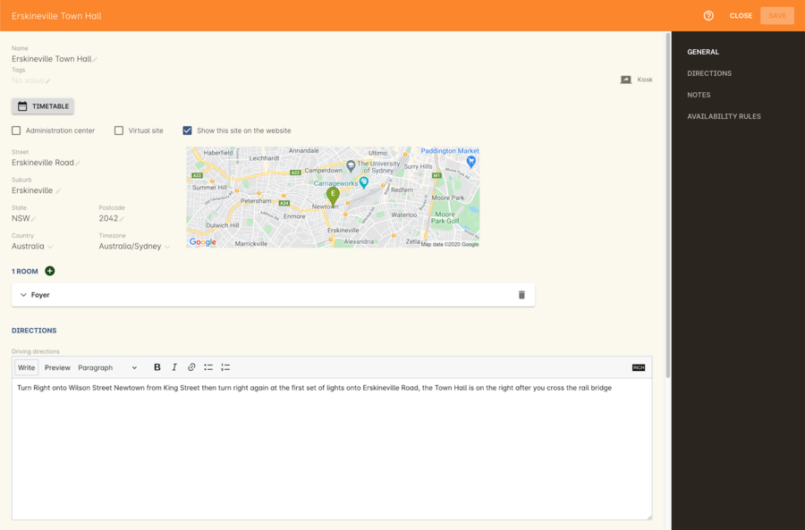
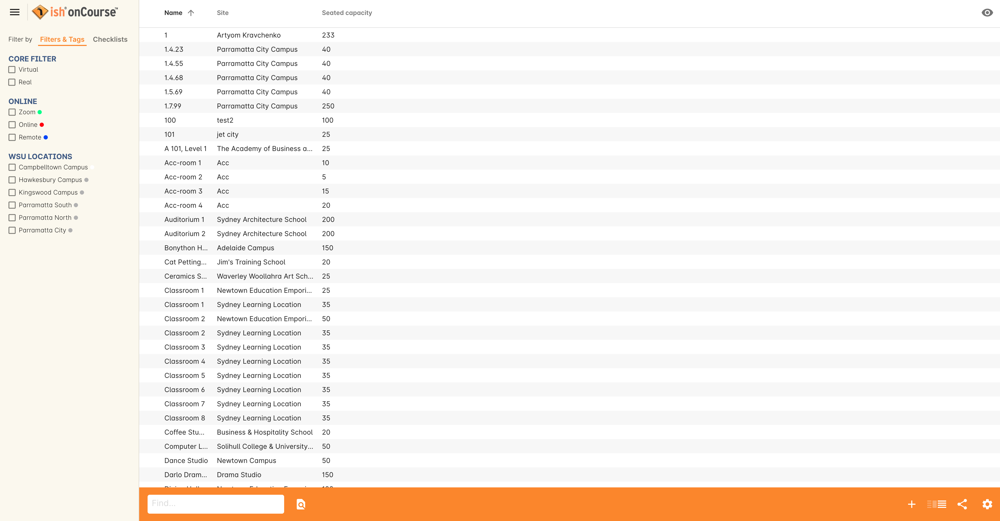
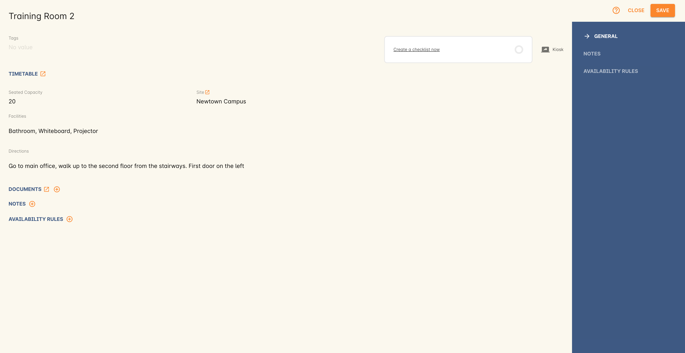

[[sitesRooms]]
== Sites and Rooms

[[sitesRooms-definitions]]
=== onCourse Terms and Definitions

Sites::
Sites are the physical venues where you offer classes at places like Newtown Arts Club, or Parramatta High School. A site will have one or more rooms. Sites can also be Administration centres where you take enrolments and payments.
Rooms::
Rooms are where the classes will be held, a class may be held in one room all year, or may change. Rooms will have names like room 14, studio 6, the library. Rooms can have a seated capacity.

[[sitesRooms-workingWith]]
=== Working with Sites and Rooms

You can access both the https://demo.cloud.oncourse.cc/site[Sites] and the https://demo.cloud.oncourse.cc/room[Rooms] via the Dashboard.

[[sites]]
==== Site Record Details

Double-click a record to open the Site details section.

[[sites-General]]
===== General

Here you can set the site name and address details. You can access this site's <<kiosk, Kiosk view>> by clicking the Kiosk button in the top right of the record. You can also access the site's Timetable view by clicking the Timetable button.
Learn more about <<timetable>>.

* Administration centre - allows you to set that site as an administration centre, a physical site where your staff work. Administration centres are the only sites that can have money banked against them. Sites flagged as an administration centre can be selected as a site to bank cash/cheques in <<users-settings>> and  <<accounting-Deposit>>.
* Show this site on the website - allows you to show the site, and anything related to it on the website.
* Virtual Site - refer to related section on <<sites-virtual>>.

The following additional features can be managed via the General tab of the Site record:

* By adding the street address, suburb, state and postcode, this information will automatically populate through to your onCourse website
* You can set the relevant time zone for this particular Site by selecting the relevant option from the drop down menu on the General tab

[NOTE]
====
If you are running an integrated onCourse website, you will have access to full location searches and directions via Google maps. Just make sure you set the address details fully then the map will automatically generate.
====

[[sitesRooms-rooms]]
===== Rooms

This small section within Sites is a quick view of the rooms detailed for this site. You can add new rooms here by clicking the + button, then adding a room name and the seating capacity. Clicking the More Options button will take you directly to the Room details window. See the <<rooms>> section for more details.

[[sites-Directions]]
===== Directions

This section allows you to display different types of directions for your students, if you input into any of the three text fields, it would be displayed on your website. The three types of text fields in the Directions tab are:

* Driving directions
* Public transport directions
* Special instructions - like where the room or cafeteria is

There is also an attachment window beneath, this will allow you to add attachments that relate to the Direction tab. To add an attachment you must click on the + sign on the top right-hand side, to remove an attachment you will click on the - sign. There are three fields in the attachment window:

* Name - the file name of the attachment
* Web Visible - when checked, the attachment will be visible on your site
* Size - the size of the attachment

[[sites-Notes]]
===== Notes

This section is for internal notes about the site. It is not published on the site.

You can add a new note in the 'New note' field at the top of the tab. Below this will show you a list of previous notes created, these fields are not editable. Each of these entries has the date and time it was created, along with which user created it.

[[sites-Timetable]]
===== Availability Rules

Availability Rules will allow you to set when the site is not available. By clicking on the + sign, you can set when the busy period starts and ends as well as the option to select "all day", this is good for something like construction. You can also add a description for the unavailability e.g; "construction on this site on 2/2/11".

[[sites-virtual]]
===== Virtual Sites

onCourse allows a College to flag a given Site as a Virtual Site. These sites can be used in either of the following scenarios:

* Classes that are delivered Online
* Self paced learning where there is no set timetable

When you create a new Site within onCourse and flag it as a Virtual Site, onCourse will automatically assign a Virtual Room to that site.
The reason for this is that Class enrolments must be assigned to a Room, they cannot be assigned to just a Site. Whilst this virtual room record is hidden within the user interface, it has been created automatically when the Site is flagged as being a Virtual Site.

You can also convert an existing Site to a Virtual Site by ticking this box within the General tab of the Site Record. Please note that if the existing Site which you wish to convert to a Virtual Site has more than 1 Room allocated against it, it cannot be converted to a Virtual Site.

[[rooms]]
==== Room Record Details

Double-click a record to open its details window.

[[rooms-General]]
===== General

Here you can set the Room name, the site to which the room is related , room capacity, room specific directions for once the student is at the site and add details about the facilities available in that room. There is also an attachment window available for things like images (see above for more on the attachment window).

You can view a Room's Timetable view by clicking on the Timetable button. Learn more about <<timetable, Timetable's here>>.

[NOTE]
====
You will note that the Facilities and Directions fields within the Room record is part of the dynamic course content which is automatically published to your onCourse website.
====

[[rooms-Notes]]
===== Notes

This tab is for internal notes about the room. It is not published on the website.

You can add a new note in the 'New note' field at the top of the tab. Below this will show you a list of previous notes created, these fields are not editable. Each of these entries has the date and time it was created, along with which user created it.

[[rooms-Timetable]]
===== Availability Rules

Here you can set room availabilities (see above for more on the availability rules).

[[sitesRooms-Creating]]
=== Creating Sites and Rooms

The next step in setting up your onCourse program is entering sites and rooms. You can give each room a name, specific directions on how to get there, and describe the facilities that are available. It also allows you to make it possible for students to view detailed maps and instructions from your website about where their class will be held, saving your staff time with phone calls giving directions and saving students frustration when they can't accurately locate the venue.

Creating sites and rooms is a valuable part of your training resource management. Every time you book a session in a room, the Classes timetable is updated and the room becomes scheduled. This means that if you try to book another session in this room at the same time, you will be notified that it is already booked within the Class > Timetable tab. It's important to note that onCourse will not prevent you from double booking a room.

If you have a room or site that you hire on a casual basis you can also set the availability for it. For example, you may hire a public hall on Wednesday evenings. When you set up this room, you can specify it is only available for you to book between 5pm and 9pm. Course coordinators scheduling classes will an error message if they try to book a class in this room on another night, or to start before 5pm.

[TIP]
====
It is a good idea to enter the sites and rooms first so later when you add the courses you can easily assign them to a location.
====

==== How to set up a new site

. From the Sites list view, click on the + button. A new site screen will open on the details window in the general section.
. In the Name field enter the name of the site e.g. Waverley Campus. Remember the site is where the rooms are located and is not the rooms themselves, that comes later.
. Enter the street address of the site. If you report AVETMISS your sites must have accurate address suburbs and postcodes.
. Once you've entered the complete address, a Google Maps image denoting your sites location will appear.
. Move to the Directions section.
If you have specific driving directions, public transport directions or special instructions like parking, you can add them here. This information is published to your ish website. Because these description fields are Rich Text enabled (the blue A indicates this) you can add hyperlinks to local bus timetables or other useful pages for your students, like transport infoline or your local equivalent.
. If you have any internal notes about the site, you can add them on the notes tab. These are not published to your ish website.
. To set an unavailability for the site, go to the Availability Rules section and click on the + button.
. Create a new availability rule by clicking the +and define the Start and End date and time. You can also select 'all day' instead of selecting a time period.
. Choose if you wish to repeat the unavailability and the end date of the repeats. You also need to add a description of why the resource is unavailable.
. Click save. Once you have saved your site, click Close to be returned to the list view.

==== How to set up a new Room

. From the site list, double-click on the site you want to add rooms to. Alternatively, you can open the Rooms list from the splash screen and click on the + button.
. Enter the name of the room e.g. Studio 1. If your venue only has one room, such as a community hall, you still need to create at least one room so you can link a class to it.
. Enter the seated capacity. This is how many people the room can hold. If you try to book a class into this room that has a maximum student number greater than the seated capacity, you will get a warning.
. On the Direction tab you can enter the directions to the room e.g. ground floor, level 3 and the room facilities e.g. tables and chairs, screen projector.
. If you have any internal notes about the room, you can add them on the notes tab. These are not published to your ish website.
. To set room availability, go to the Availability Rule section and click the + button.
. Create a new availability rule by clicking the +and define the Start and End date and time. You can also select 'all day' instead of selecting a time period.
. Choose if you wish to repeat the unavailability and the end date of the repeats. You also need to add a description of why the resource is unavailable.
. Click save to save the record, then click close to return to the list view.
. To edit any of the information you have entered simply click on the room or site that you wish to update. This will bring up the edit screen for that record. Make your changes and click save.

