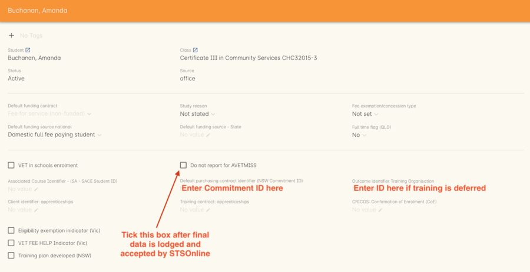

[[skillsfirstVIC]]
== Skills First Funding (Victoria)

[[intro_skillsfirstVIC]]
=== What is Skills First?

Skills First is a state based funding program provided by the Victorian State government and administered by Skills Victoria.
Details of the program are available on the Smart and Skilled Website
https://www.education.vic.gov.au/skillsfirst/Pages/default.aspx

Reporting for Skills First training activity uses a state based variation of the AVETMISS standard to reconcile data for payment to training providers.
It is important to ensure you set up your onCourse records correctly to export your data in the correct format so you receive prompt payment for your training delivery.

The Skills first contracts require you to lodge your compliant training files (NAT Files) once every calendar month of the year.
You will need to lodge all data (Funded and Fee for Service) in the batch.
Each batch must include all training activity up ot the end of the reporting month e.g. January onwards.

State Training Services will pay a percentage of the total contract amount at key points in the reporting, such as

. Commencement - the enrolment is reported with a commitment ID and at least one outcome reported as 70 - Continuing Enrolment.
. Progression - one or more claims paid when the enrolment is reported with required milestones (i.e. started and completed outcomes).
Please refer to Smart & Skilled Operating Guidelines for details, different qualifications have different progression milestone and payment amounts.
NOTE: The milestones include those who withdrew after they started their training, and you may be able to claim progression payments when the student withdraws.
. Completion - the enrolment reported with a final status for all outcomes and a complete record in the NAT00130 file.
Completion payments are only paid if the student has been issued with the qualification, and not if the student is withdrawn.

Key differences when using progressive reporting are

. You are expected to report all the outcomes in the qualification with each batch of NAT Files, including outcomes that are not yet started or did not start. e.g. for a Diploma of Business with eight units of competency, initial lodgement of data will have one outcome as 70 - Continuing Enrolment, and seven outcomes as 85 - Not Yet Started.
. As the student progresses through the training, their outcomes statuses are updated.
Claims will be paid based on their level of progression. e.g. for a Diploma of Business with eight units of competency,the progression claim is paid after move the 4 outcomes are reported as 70 - Continuing Enrolment and at least one outcome is reported as 20 - Competent.
. Smart & Skilled reporting does not rely on calendar year.
If you don't report completion or withdrawal data, the student will remain active.

The National AVETMISS reporting specification was originally designed to report training completion after the fact i.e. at the end of the calender year, and shoehorning this standard into a continual reporting framework takes continual effort on the part of STS and software vendors like ish to find new and creative ways to report your data in a way that requires the least amount of effort on your part.

onCourse contains a number of features and functions to smooth your reporting journey.
Many can be set up to help you manage the often complex requirements for Smart & Skilled reporting.

Ideally, you will create courses for Smart and Skilled enrolments that contain all the outcomes for the qualification or skill set in the course level.
This will then mean you have only one enrolment to report for each student, and that single enrolment will contain all the outcomes for the student's funded course.

Some providers will choose to make multiple courses for reporting their Smart and Skilled students for operational reasons.
In those instances, the Commitment ID and Funding Source will need to be added to every enrolment that contains outcomes for the student.
These enrolments may represent clusters of outcomes, or single outcomes.

The instructions given in this documentation assume that one enrolment per student is the norm, but you can adapt these instructions as needed to your environment.

==== Setting up Reporting for Skills Groups

Skills Group are special 'made up' Skill Sets or mini qualifications that have been invented by STS to allow funding for clusters of units under the Smart and Skilled funding program.

onCourse includes by default all official training package and accredited course qualifications from Training.gov.au, but not the Skills Groups.
The Skills Groups codes are created by STSOnline on an ad hoc basis, they need to be manually entered in the onCourse qualification database as you receive the funding contact and before you try to report the student.

*It is important you do this as early as possible in the process as so not to hold up your reporting.*

. When you receive a Skills Group contract, it will include a code like SG00001234
. Go to the onCourse Support portal and log a new task requesting the addition of the code
. ish support staff will schedule the addition of the code which may take around 48 hours to propagate to your onCourse database.
An email will be sent to notify you of the addition
. Once the code has been added, it will be available for you to add to your course on the VET tab national code field
. Make sure you tick the option 'Satisfies complete qualification of skill set' to ensure the data is correctly reported for these students as an enrolment in a mini qual, rather than a standalone set of units.
. Add the units the Skills Group funding covers to the course and save the course
. IMPORTANT: If you don't have the Skills Group added to onCourse when you set up the course, you can still set up the course and enrol the student.
The Skills Group code and tick box can be added later, after enrolment if needed.
All this information affects is AVETMISS reporting and Certification defaults.

==== Data Collection Set Up

Data collection rules and forms allow you to define what information is collected during the online enrolment, application and waiting list process.

Before you set up your Skills First courses, you may want to consider if there is a need to create a set of forms and rules for the program.

You can create custom fields and forms for using the Data Collection feature, and assigned them to particular courses, which can assist with the individual requirements of your contact.
Please read more in
link:#dataCollection[???] This is particularly useful when creating an electronic Evidence of Eligibility and Student Declaration.

==== Funding Contact Set Up

To streamline the reporting process, ensure you have enabled the Skills First funding contract.

Skills First is a default funding contact in onCourse.
Instructions on activating the default contacts are in
link:#fundingContracts-enable[???].
You can also add additional funding contracts if you want to split your Smart and Skilled reporting into smaller subgroups, managed by different parts of the business.

==== Course and Class Set Up

There are a few setting you will need to use if you want to take advantage of the full range of Skills First features in onCourse.
These features will assist you in collecting the data and reporting it in a timely manner.
It is expected that you are already familiar with the standard course and class set up process before you read this documentation about the specific Skills First set up requirements.

===== Course General Tab

If you intend to collect the 'Evidence of Eligibility and Student Declaration' electoninically, you will need to set your Skills First courses to 'Enrolment by Application', and attached the Data Collection Rule you have set up for Skills First.
In onCouse, a course that is Enrolment by Application allows for a second level of checks, for example, to check a student meets the funding requirements, prior to proceeding to enrolment.

======

If you have Fee for Service and Skills First enrolments in the same class, you may decide to complete the eligibility check for each applicant.
This means you will set up the same course for the qualification or skills set, and have all prospective students apply for a to see if they are Eligible for Skills First Funding.
If your classes are primarily Skills First enrolments this is the best option.

Some providers will have a range of Fee for Service and Skills First enrolment in the class.
If you are providing both you may decide to have two courses set up, one for Skills First that is by application, and one for your Fee for Service class that is 'open enrolment'.
If you do have two courses, you will need to consider your strategy with classes, and whether you will have lots of classes available.
This is generally more complex than taking all students by application and providing them with a Quote, and we suggest you contact our support team to talk through the options before you proceed with this set up.

Most providers with Skills First funding for a qualification or skills set have the course set up by application to give the student the option to take up the Skills First funding if it's available to them.
This will allow students to make the decision to take up the Skills First funding after they have received they know if they are eligible or not.

If the student is does not wish to accept the Skills First funding, or is not eligible, and you can enrolment them as a Fee for Service using the same application process.

image:images/skillsfirstCourseSetUp.png[ Skills First Course General tab showing the course set to 'Enrolment by Application',scaledwidth=70.0%]

===== Class VET Tab

All Smart and Skilled courses need at least one class to enrol students into.

If you expect the majority of enrolments to be under Smart and Skilled Funding, you can make STSOnline (NSW) the default funding contact at the class.
All new enrolments in the class will adopt this default.

If you expect a fairly equal mix of fee for service students and Smart and Skilled funded students, you can make the funding contract 'Fee for service (non funded)' and set the funding source for the Smart and Skilled students at the enrolment level instead.

image:images/skillsfirstClassSetUp.png[ Skills First Class VET tab with the funding contract 'Skills Victoria' selected,scaledwidth=70.0%]

===== Enrolments

Pending review- need to see if there is a unique code for each student.

[[reporting_smartandSkilled]]
=== eReporting to Skills First

Skills First reporting differs from Total VET Activity Reporting in a number of ways;

* STSOnline requires you to successfully submit a Skills First lodgement calendar month of the year.
* All activity in the period (eg January - reporting month end) need to be submitted, including completed outcomes.
* Smart and Skilled claims are paid 6 weeks or 42 days of the successful lodgement of the data, so it's within your RTO's best interests to do smaller, more frequent lodgements than to wait for a once a month process.
Lodging every 14 days is ideal.

* At the point in time the Smart & Skilled export is run, any outcomes selected with a start date in the future will export '85 - Not Yet Started' as the outcome identifier - national, regardless of what has been set in the database or in the export runner preferences. i.e. you can choose the option 'export 70 - continuing enrolment for VET outcomes which are not set' and the override and apply the 85 code where appropriate.

For more information please refer to the "Training Data Collection" information page here
https://www.education.vic.gov.au/training/providers/rto/Pages/datacollection.aspx

[[reporting_smartandSkilledDeferrals]]
==== Deferrals

Need to determine if there can be deferrals

[[reporting_smartandSkilledCancellations]]
==== Cancellations

Need to investigate how cancellation are reported

=== Exporting Smart and Skilled AVETMISS data

How to export

How to check with AVS and override options

How to upload to SVTA https://www.education.vic.gov.au/svts/

=== Eligibility Checks and Provider Calculator

onCourse has developed processes that allow you to collect the student's information and lodge it with Skills Victoria Training Services (SVTS) using their provider portal.
You will need to ensure the following set up at the course level before you can proceed.

==== Update the Terms and Conditions Page on the Website

You will need to ensure you have collected express consent for the student's data to be used in the provider calculator.
To do this, you will need to update your terms and conditions page on the website to include the consent to use the data collected in application or enrolment to determine the student's eligibility where the application is for a Skills First program.

Details of the requirement for prospective students' consent are under VET Funding Contract page here
https://www.education.vic.gov.au/training/providers/rto/Pages/serviceagree.aspx

More information on how to edit your terms and conditions on your website is located in our link:#editorPages[???]

==== Creating the Bulk Upload Export

Need to see if there is a bulk upload for eligibility, will read doc and find out

. Go to top menu, select Activity and then select Applications.
This will open the application list view.
. From the Applications list view, sort and filter the list until you have the application you want in the batch.
+
image:images/openApplicationListview.png[image]
. Go to the Export icon on the top right hand of the list view and select the export file "Smart and Skilled Bulk Upload" and click export.
. Save the file to your computer.

image:images/smartandskilledBulkUpload.png[Smart and Skilled Bulk Upload Export]
