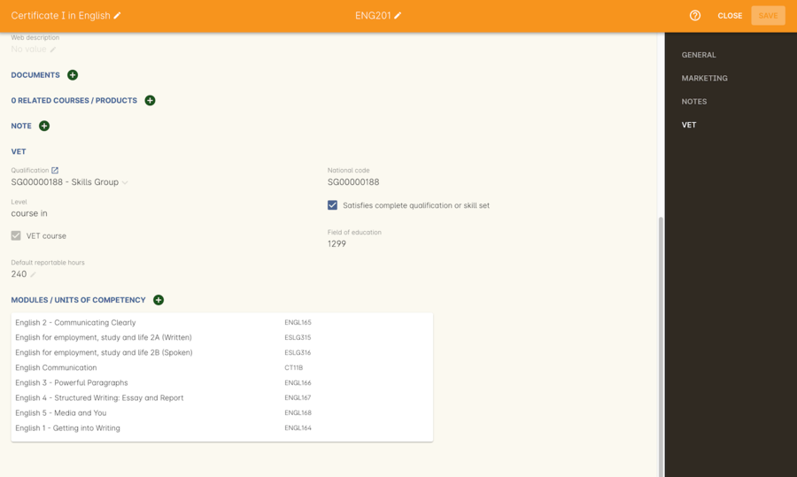
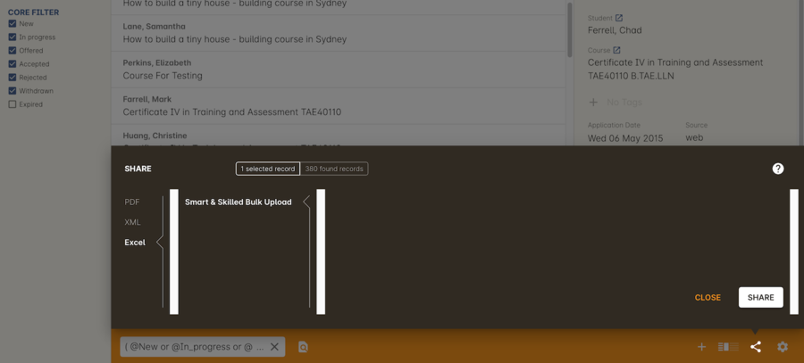

[[fundedTraining]]
== Funded Training

https://smartandskilled.nsw.gov.au/for-training-providers[Smart and Skilled] is the NSW funded training programme and https://www.education.vic.gov.au/skillsfirst/Pages/default.aspx[Skills First] is the Victorian State government programme administered by Skills Victoria. Other states also have funded training programmes which are also supported by onCourse.

These contracts require you to lodge your compliant training files (NAT Files) every few weeks. This is known as progressive or ongoing reporting. You may wish to report even more often in order to receive funding more quickly. Concepts which are common to these funding programmes are:

Commencement::
The enrolment is reported with a commitment ID and at least one outcome reported as `70 - Continuing Enrolment`. Because onCourse automatically reports 70 when the outcome commences you don't need to manually change the outcome status. Just ensure the student attendance is marked and onCourse will report the commencement.

Progression::
As outcomes are completed (or withdrawn) certain funding will be paid as per your contract. Just keep reporting AVETMISS exports to your funding body and onCourse will ensure the correct progressions of the students are reported.

Completion::
Finally, when you create a Certificate in onCourse and all the outcomes are finalised, you'll be able to receive your final payment.

[[fundedTraining-skillsGroups]]
=== Skills Groups

Skills Group are special 'made up' Skill Sets or mini qualifications that have been invented by funding bodies to allow funding for clusters of units.

onCourse includes by default all official training package and accredited course qualifications from Training.gov.au, but not the Skills Groups.

. When you receive a Skills Group contract, it will include a code like SG00001234
. In onCourse, go to the Qualifications screen and click the + button to create a new record
. The first drop down box is the Type field. Select 'Skill Set'.
. Fill out the remaining fields with relevant details; Level, Title & National Code are mandatory fields that must be filled out.
. Click Save.
. Once saved, it will be available for you to add to your course on the VET tab national code field
. Make sure you tick the option 'Satisfies complete qualification of skill set' to ensure the data is correctly reported for these students as an enrolment in a mini qual, rather than a standalone set of units.
. Add the units the Skills Group funding covers to the course and save the course

[[fundedTraining-generalConfig]]
=== General configuration

Data collection rules and forms allow you to define what information is collected during the online enrolment, application and waiting list process. You can create custom fields and forms for using the Data Collection feature, and assigned them to particular courses, which can assist with the individual requirements of your contact. You can read more about <<dataCollection>>.

You should set up a <<fundingContract>> or even create multiple contracts to report separately.

When you create courses for enrolling your funded students into, think about whether you want to allow students to enrol directly or have them `enrol by application`. The application process will give you more opportunity to review the enrolment eligibility and student fee component.

Finally, set up your classes and decide whether the enrolments in that class will be allocated a funding contract by default or are mostly fee for service students with no funding contract.

image::images/smartandskilledClassSetUp.png[title='Smart and Skilled Class VET tab with the funding contract 'STSOnline(NSW)' selected ']

[[fundedTraining-enrolments]]
=== Enrolments

After processing the student enrolment ensure you add the Commitment ID to the `Purchasing Contract Identifier` field. If the student has multiple enrolments under this funding committment ID (for example you may have split up the delivery into separate classes) make sure they all have exactly the same ID so onCourse can join them together in the AVETMISS export.

image::images/smart_and_skilled_fields.png[title='Red text showing where specific Smart and Skilled data is recorded']

[[fundedTraining-eligibilityChecks]]
=== Eligibility Checks and Provider Calculator

onCourse has developed processes that allow you to collect the student's information and lodge it with State Training Services using the STSOnline provider portal, using onCourse's Smart and Skilled Bulk Upload export. You will need to ensure everything is set up at the course level before you can proceed.

[[fundedTraining-bulkUploadExport]]
==== Creating the Bulk Upload Export

. From the Dashboard, open the Applications window.
. From the Applications list view, sort and filter the list until you have the applications you want in the batch. Ensure they are highlighted.
. Go to the Share icon on the bottom right hand of the list view, select Excel, and the export file "Smart and Skilled Bulk Upload" and click Share.
. Save the file to your computer.

===== Editing the Bulk Upload Template for Eligibility Checks

The bulk upload template will need to be edited before you can upload it via the STSOnline provider portal.

Certain fields are mandatory and must be completed for a successful upload. Some fields are conditional and only need to be completed if another field has a value. A few fields are optional and do not need to be completed for the eligibility checks.

Full details of the fields and their specifications are found in the "Smart and Skilled Provider Calculator Data Specifications and User Guide Multiple Student Process" available from the STSOnline provider portal.

onCourse has added values where applicable from the student, employer, course or class and included some default values for fields as details below, however, the provider will need to confirm that they are accurate and correct for each upload. All values in the export will need to be reviewed and verified by the operators to ensure it's compliant. You should consult the documentation on the STSOnline provider portal for specific information.

We recommend you download the "Smart and Skilled Provider Calculator Data Specifications and User Guide Multiple Student Process" Table 1 Bulk Upload file and confirm the values you will need to enter with your compliance team or management before you do your first upload.

Please make sure to check that the dates are formatted as DD/MM/YYYY for all date columns, some spreadsheet programs will change the date formats when the file is opened.

If you encounter issues with the upload failing or student not being accepted, you will need to contact Training Market for assistance:
https://www.training.nsw.gov.au/about_us/contacts.html

===== Export values for an Eligibility Checks

.Bulk Upload Export Template Fields for Eligibility Checks
[width="100%",cols="9%,15%,10%,50%,8%,8%",options="header",]
|===
|*Column* |*Column Name* |*Pre-filled by onCourse?* |*Where to locate
the information* |*Location in onCourse* |*Mandatory (M) / Conditional
(C) /Optional (O)*
|A |National_Provider_ID |Yes | |General Preferences |M

|B |Provider_Student_ID |Yes | |Student Contact |O

|C |Enquiry_Or_Notification |Yes | |Default |M

|D |Activity_Period_ID |Yes | |Default |M

|E |Region |No |Refer to STSOnline's
https://www.training.nsw.gov.au/forms_documents/smartandskilled/deliver_training/regions_postcodes.pdflist
|N/A |M

|F |Prog_Stream |No |Refer to Field 6 in the Table 1. Bulk Upload file
in the "Smart and Skilled Provider Calculator Data Specifications and
User Guide Multiple Student Process" |N/A |M

|G |Nat_Qual_Code |Yes | |Course |M

|H |First_Name |Yes | |Student Contact |M

|I |Surname |Yes | |Student Contact |M

|J |Other_Name |Yes | |Student Contact |O

|K |DOB |Yes | |Student Contact |M

|L |Gender |Yes | |Student Contact |M

|M |Lives_in_NSW |Yes | |Student Contact |M

|N |Residential_Postcode |Yes | |Student Contact |M

|O |Residential_Suburb |Yes | |Student Contact |M

|P |Still_At_School |Yes |Default value is No. Please refer to Refer to
Field 16 in the Table 1. Bulk Upload file in the "Smart and Skilled
Provider Calculator Data Specifications and User Guide Multiple Student
Process" if other value needed |N/A |M

|Q |Residency_Status |Yes | |Student Contact |M

|R |Qual_Since_2017 |Yes | |Student Contact |M

|S |Highest_Post_School_Qual |Yes | |Student Contact |C (See R)

|T |Apprentice_Trainee |Yes |Default value is No. Please refer to Field
20 in the Table 1. Bulk Upload file in the "Smart and Skilled Provider
Calculator Data Specifications and User Guide Multiple Student Process"
if other value needed |Default |M

|U |Apprentice_Trainee_Type |No |Please refer to Field 21 in the Table
1. Bulk Upload file in the "Smart and Skilled Provider Calculator Data
Specifications and User Guide Multiple Student Process". |N/A |C (See T)

|V |Work_in_NSW |Yes |If no employer listed, the default value No will
be used. |Employer Contact |C (See M)

|W |Employer_Org_Name |Yes |If no employer listed, field will be left
blank |Employer Contact |C (See V)

|X |Org_postcode |Yes |If no employer listed, field will be left blank
|Employer Contact |C (See V)

|Y |Org_subrub |Yes |If no employer listed, field will be left blank
|Employer Contact |C (See V)

|Z |ATSI |Yes | |Student Contact |M

|AA |Another_SS_Qual |Yes |Default value is No. Please refer to Field 27
in the Table 1. Bulk Upload file in the "Smart and Skilled Provider
Calculator Data Specifications and User Guide Multiple Student Process"
if other value needed |Default |M

|AB |Disability_Status |No |Please refer to Field 28 in the Table 1.
Bulk Upload file in the "Smart and Skilled Provider Calculator Data
Specifications and User Guide Multiple Student Process" if other value
needed |N/A |M

|AC |Disability_Assess_Type |No |Please refer to Field 29 in the Table
1. Bulk Upload file in the "Smart and Skilled Provider Calculator Data
Specifications and User Guide Multiple Student Process" if other value
needed |N/A |C (See AB)

|AD |Welfare_Status |No |Please refer to Field 30 in the Table 1. Bulk
Upload file in the "Smart and Skilled Provider Calculator Data
Specifications and User Guide Multiple Student Process" if other value
needed |N/A |C (See AB)

|AE |Welfare_Type |No |Please refer to Field 31 in the Table 1. Bulk
Upload file in the "Smart and Skilled Provider Calculator Data
Specifications and User Guide Multiple Student Process" if other value
needed |N/A |C (See AD)

|AF |Planned_Start_Date |Yes | |Class |M

|AG |Delivery_Mode |Yes | |Class |M

|AH |LTU_Evidence |Yes |Default value is No. Please refer to Field 34 in
the Table 1. Bulk Upload file in the "Smart and Skilled Provider
Calculator Data Specifications and User Guide Multiple Student Process"
if other value needed |Default |M

|AI |Planned_End_Date |Yes | |Class |O

|AJ |Unique_Student_ID |Yes | |Student Contact |O

|AK |ESP_Client |Yes |Default value is No. Please refer to Field 37 in
the Table 1. Bulk Upload file in the "Smart and Skilled Provider
Calculator Data Specifications and User Guide Multiple Student Process"
if other value needed |Default |O

|AL |ESP_Org_ID |No | |N/A |O

|AM |Client_ID |No | |N/A |O

|AN |Referred_by_ESP |No | |N/A |O

|AO |ESP_Referral_ID |No | |N/A |O

|AP |Confirmed |Yes |Default value is Yes. Cannot upload students if
they do not consent, no value will fail upload. |Default |M

|AQ |In_Social_Housing_Register_Or_Wait_List |No | |N/A |M

|AR |PAS_No. |No | |N/A |M

|AS |Waiver_Strategy |No | |N/A |M

|AT |Fee_Or_Waiver_Code |No | |N/A |C (See AS)

|AU |Training_Location_Postcode |Yes | |Site |C (See AG)

|AV |Training_Location_Suburb |Yes | |Site |C (See AG)

|AW |Training_Location_Region |No |Please refer to Field 49 description
in the Table 1. Bulk Upload file in the "Smart and Skilled Provider
Calculator Data Specifications and User Guide Multiple Student Process"
Use STSOnline's
https://www.training.nsw.gov.au/forms_documents/smartandskilled/deliver_training/regions_postcodes.pdflist
for the region code |N/A |C (see description)

|AX |Residential_Address |Yes | |Student Contact |M
|===

==== Export for an Application for Commitment IDs

You can use the same Bulk Upload template to upload your commitment IDs, however, some of the mandatory and compulsory fields will change.

Certain fields are mandatory and must be completed for a successful upload.
Some fields are conditional and only need to be completed is anther field has a certain value.
A few fields are optional and do not need to be completed for he Eligibility checks.

Full details of the fields and their specifications are found in the "Smart and Skilled Provider Calculator Data Specifications and User Guide Multiple Student Process" available from the STSOnline.

onCourse has provided the unique student values, course or class values and some defaults to the most commonly used values included, however, the college will need to confirm that they are accurate and correct for each upload.
We recommend you download the "Smart and Skilled Provider Calculator Data Specifications and User Guide Multiple Student Process" Table 1. Bulk Upload file and confirm the values you will need to enter with your compliance manager before you do your first upload.

.Smart and Skilled Bulk Upload Template for Commitment IDs
[width="100%",cols="9%,15%,10%,50%,8%,8%",options="header",]
|===
|*Column* |*Column Name* |*Pre-filled by onCourse?* |*Where to locate
the information* |*Location in onCourse* |*Mandatory (M) / Conditional
(C) /Optional (O)*
|A |National_Provider_ID |Yes | |General Preferences |M

|B |Provider_Student_ID |Yes | |Student Contact |O

|C |Enquiry_Or_Notification |Yes | |Default |M

|D |Activity_Period_ID |Yes | |Default |M

|E |Region |No |Refer to STSOnline's
https://www.training.nsw.gov.au/forms_documents/smartandskilled/deliver_training/regions_postcodes.pdflist
|N/A |M

|F |Prog_Stream |No |Refer to Field 6 in the Table 1. Bulk Upload file
in the "Smart and Skilled Provider Calculator Data Specifications and
User Guide Multiple Student Process" |N/A |M

|G |Nat_Qual_Code |Yes | |Course |M

|H |First_Name |Yes | |Student Contact |M

|I |Surname |Yes | |Student Contact |M

|J |Other_Name |Yes | |Student Contact |O

|K |DOB |Yes | |Student Contact |M

|L |Gender |Yes | |Student Contact |M

|M |Lives_in_NSW |Yes | |Student Contact |M

|N |Residential_Postcode |Yes | |Student Contact |M

|O |Residential_Suburb |Yes | |Student Contact |M

|P |Still_At_School |Yes |Default value is No. Please refer to Refer to
Field 16 in the Table 1. Bulk Upload file in the "Smart and Skilled
Provider Calculator Data Specifications and User Guide Multiple Student
Process" if other value needed |N/A |M

|Q |Residency_Status |Yes | |Student Contact |M

|R |Qual_Since_2017 |Yes | |Student Contact |M

|S |Highest_Post_School_Qual |Yes | |Student Contact |C (See R)

|T |Apprentice_Trainee |Yes |Default value is No. Please refer to Field
20 in the Table 1. Bulk Upload file in the "Smart and Skilled Provider
Calculator Data Specifications and User Guide Multiple Student Process"
if other value needed |Default |M

|U |Apprentice_Trainee_Type |No |Please refer to Field 21 in the Table
1. Bulk Upload file in the "Smart and Skilled Provider Calculator Data
Specifications and User Guide Multiple Student Process". |N/A |C (See T)

|V |Work_in_NSW |Yes |If no employer listed, the default value No will
be used. |Employer Contact |C (See M)

|W |Employer_Org_Name |Yes |If no employer listed, field will be left
blank |Employer Contact |C (See V)

|X |Org_postcode |Yes |If no employer listed, field will be left blank
|Employer Contact |C (See V)

|Y |Org_subrub |Yes |If no employer listed, field will be left blank
|Employer Contact |C (See V)

|Z |ATSI |Yes | |Student Contact |M

|AA |Another_SS_Qual |Yes |Default value is No. Please refer to Field 27
in the Table 1. Bulk Upload file in the "Smart and Skilled Provider
Calculator Data Specifications and User Guide Multiple Student Process"
if other value needed |Default |M

|AB |Disability_Status |No |Please refer to Field 28 in the Table 1.
Bulk Upload file in the "Smart and Skilled Provider Calculator Data
Specifications and User Guide Multiple Student Process" if other value
needed |N/A |M

|AC |Disability_Assess_Type |No |Please refer to Field 29 in the Table
1. Bulk Upload file in the "Smart and Skilled Provider Calculator Data
Specifications and User Guide Multiple Student Process" if other value
needed |N/A |C (See AB)

|AD |Welfare_Status |No |Please refer to Field 30 in the Table 1. Bulk
Upload file in the "Smart and Skilled Provider Calculator Data
Specifications and User Guide Multiple Student Process" if other value
needed |N/A |C (See AB)

|AE |Welfare_Type |No |Please refer to Field 31 in the Table 1. Bulk
Upload file in the "Smart and Skilled Provider Calculator Data
Specifications and User Guide Multiple Student Process" if other value
needed |N/A |C (See AD)

|AF |Planned_Start_Date |Yes | |Class |M

|AG |Delivery_Mode |Yes | |Class |M

|AH |LTU_Evidence |Yes |Default value is No. Please refer to Field 34 in
the Table 1. Bulk Upload file in the "Smart and Skilled Provider
Calculator Data Specifications and User Guide Multiple Student Process"
if other value needed |Default |M

|AI |Planned_End_Date |Yes | |Class |M

|AJ |Unique_Student_ID |Yes | |Student Contact |M

|AK |ESP_Client |Yes |Default value is No. Please refer to Field 37 in
the Table 1. Bulk Upload file in the "Smart and Skilled Provider
Calculator Data Specifications and User Guide Multiple Student Process"
if other value needed |Default |M

|AL |ESP_Org_ID |No | |N/A |C (See AK)

|AM |Client_ID |No | |N/A |C (See AK)

|AN |Referred_by_ESP |No | |N/A |C (See AK)

|AO |ESP_Referral_ID |No | |N/A |C (See AN)

|AP |Confirmed |Yes |Default value is Yes. Cannot upload students if
they do not consent, no value will fail upload. |Default |M

|AQ |In_Social_Housing_Register_Or_Wait_List |No | |N/A |M

|AR |PAS_No. |No | |N/A |M

|AS |Waiver_Strategy |No | |N/A |M

|AT |Fee_Or_Waiver_Code |No | |N/A |C (See AS)

|AU |Training_Location_Postcode |Yes | |Site |C (See AG)

|AV |Training_Location_Suburb |No | |Site |C (See AG)

|AW |Training_Location_Region |No |Please refer to Field 49 description
in the Table 1. Bulk Upload file in the "Smart and Skilled Provider
Calculator Data Specifications and User Guide Multiple Student Process"
Use STSOnline's
https://www.training.nsw.gov.au/forms_documents/smartandskilled/deliver_training/regions_postcodes.pdflist
for the region code |N/A |C (see description)

|AX |Residential_Address |Yes | |Student Contact |M
|===
