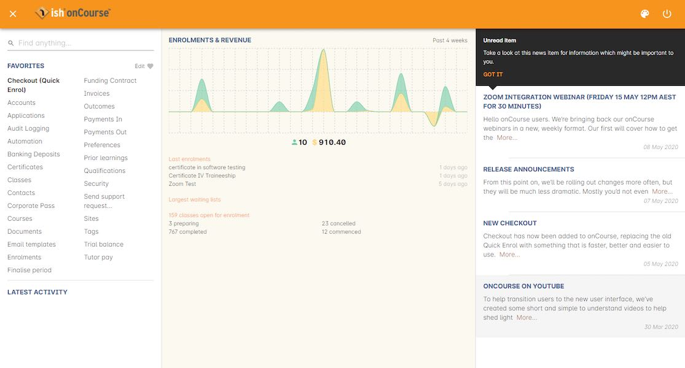

[[webstart]]
== onCourse Cloud

[[webstart-Cloud]]
=== What is onCourse cloud?

onCourse cloud is a hosted version of onCourse which ish manage and maintain on your behalf.

The benefits of a cloud hosted solution include:

* *Hosting of your onCourse server in a Tier 3 data centre located in Australia.* ish directly manages the hardware and software, with the data centre providing redundant links to the internet.
All networking equipment is fully redundant, and the database clustered across primary and slave machines.
If your primary office loses power or internet, remote access to your onCourse server is still available from other sites.
* *Management of your onCourse server*. ish supply and manage the physical infrastructure that hosts your server, provide offsite backups and manage the upgrade process for you when new versions are released.
You do not need to engage your IT support company for any onCourse related issues or assistance as you may with a locally managed version.
* *Web Browser interface offers simplified user access.* No software to install or maintain - you launch onCourse by going to a URL created just for you.
The software looks and behaves the same as the locally installed version; although you launch the application from inside a browser, you aren't restricted to the simplified user interface of a web application.
The full onCourse user experience is available complete with multiple windows, printing and more.
* **No need to update and install new client software when your server is upgraded.**New versions of the onCourse client software are applied automatically.
* *Staff access to onCourse from anywhere with internet access via the browser.* Home, remote training venues, other offices - there is no need for you to set up and manage VPNs or software installation on multiple machines.
Access is to onCourse is secure from any venue and encrypted with SSL at the same level of encryption as banking systems.
* *A unique database instance for your training organisation.* Every onCourse cloud customer has their own instance of the onCourse server application running.
This means we can upgrade your software when you are ready, and your data is not locked into our solution - your database can be handed over to you for self management at any time should you choose to leave the ish Cloud for a locally managed onCourse option, or if you just want to get at your database.

==== The onCourse Cloud Demo

If you would like to trial the onCourse cloud hosted application you can find it at https://demo.cloud.oncourse.cc/

This demo is designed for people who wish to explore the onCourse user interface and features and give onCourse a test run to see if it is the right solution for use in their training organisation.
Existing users who want to trial onCourse functions in a test database, provide training to new staff members provide or test the difference in performance between their locally hosted onCourse application, and a cloud hosted onCourse are also welcome to access the demo.

The demo contains sample data that is refreshed weekly, and which is shared between all current demo users.
This demo database is not designed for users to enter real classes, students or enrolments.

The username and password for the demo are:

* username - demo
* password - demo123

==== Accessing onCourse from your browser

. You'll be given the URL to access your college's instance of onCoruse on sign-up.
It'll look like https://yourcollege.cloud.oncourse.cc.
The 'yourcollege' part will be replaced by whatever code your college is given in our system, which we'll let you know about at the time.
. When you go to the URL you'll be greeted with the following login window.
Use your email address assigned to your user and your password to login.
If you are the first user of onCourse at your college, ish will make your login.
For every other user, they will be managed by the college's assigned admin users. ish cannot create or manage individual user accounts.
+

. After initial login you will also see a second splash page encouraging you to use <<users-TOTP, Two-Factor Authentication (2FA)>>, however it can also be skipped by clicking the 'Skip' button.
It will display each time you open onCourse until 2FA is enabled.
+
image::images/2fa_notification.png[title='This two-factor authentication page will appear every time you open onCourse until it has been enabled on the account accessing the system']
. After you successfully login, onCourse will load to the normal splash screen.
Proceed to use onCourse as normal, or if this is your first time in the software, explore the user and interface and press all the buttons to see what they do!
On many screens you will see a help icon in the bottom left-hand corner - this will take you directly to the part of the user documentation that relates to that part of the software.
+

== Installing the standalone version of onCourse

onCourse is also available as an installed, standalone application, rather than the cloud version hosted by the vendor.

In order to download and install the standalone application:

* Go to https://www.ish.com.au/download
* Download onCourse Server. There is one application bundle which will work on OSX, Windows, Linux and Unix platforms.
* Install and set up MariaDB 10.3 or higher on your system. Consult their docs to see how to do that. mySQL and postgresql should also work but we only test MariaDB for every release.
* Make sure you have Java 11 or newer installed. We typically use the AdoptOpenJDK distribution here, but any distribution should work OK.
* Edit onCourse.yml to suit your setup and database
* Run onCourse using either the `bin/server.bat` Windows script file or `bin/server` for all other platforms.

Once it is running, you should be able to connect with your browser and login with username "admin", password "admin".
