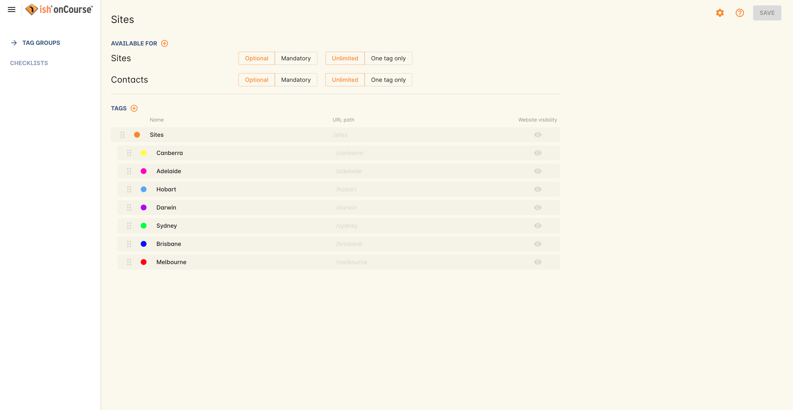
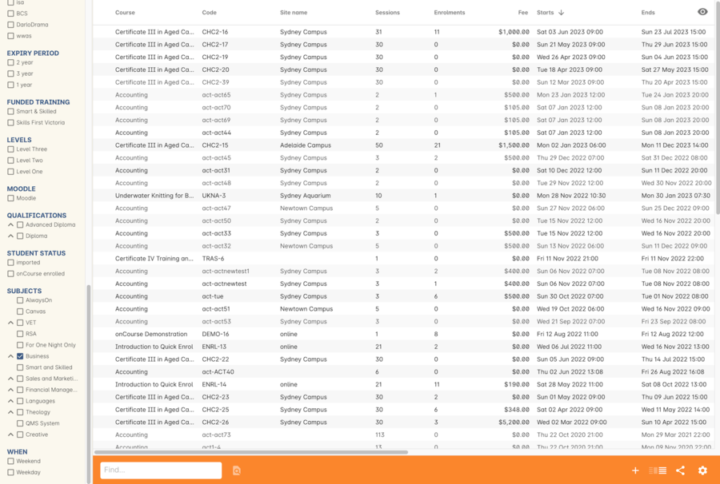
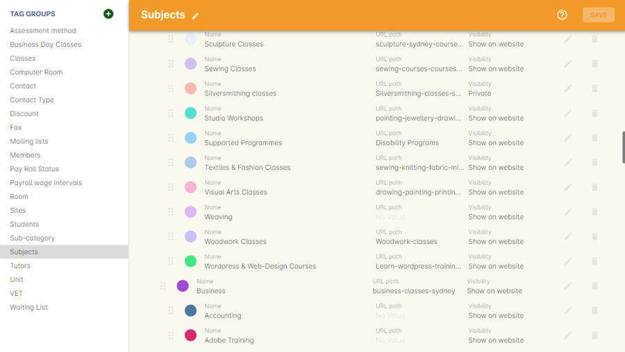
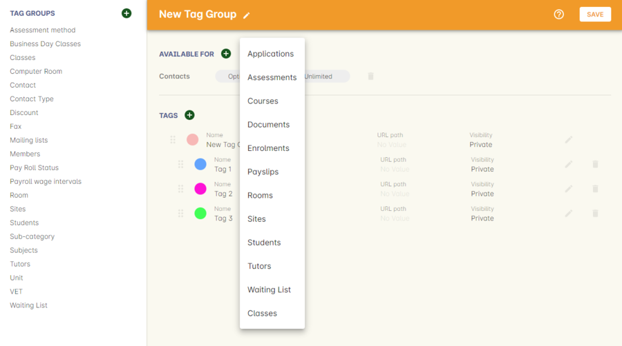
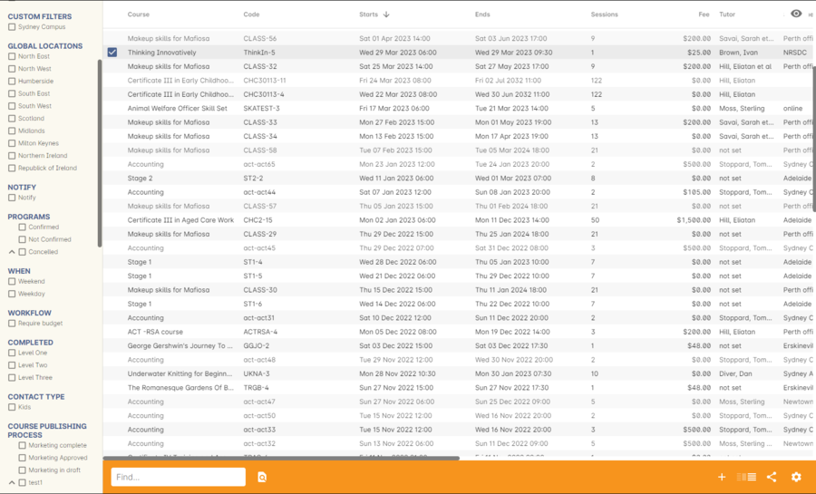
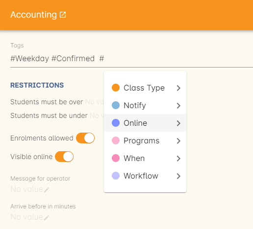
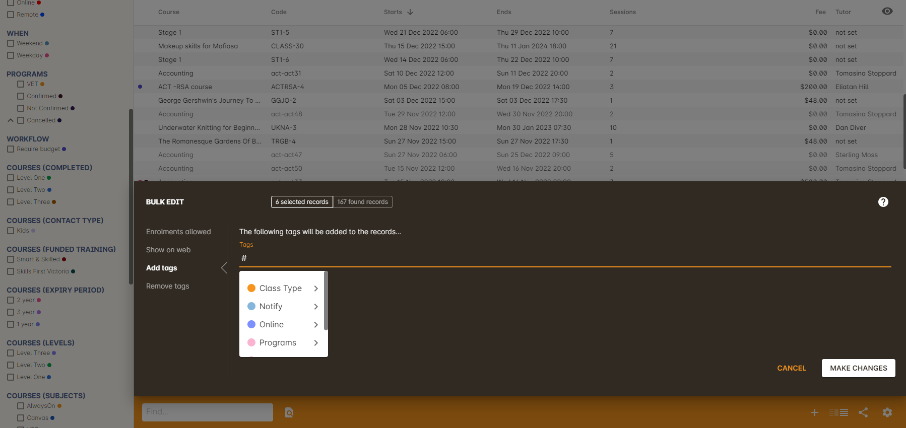

[[tagging]]
== Tags and Tag Groups

[[tagging-usingTags]]
=== Tags in onCourse

Tagging in onCourse is a powerful tool that allows you to add additional hierarchical information to records in a way that can be easily used for searching and grouping records. When specifically related to Course records, tags are flexible ways for you to categorise your data and organise the navigation of your website.

Tag groups applied to other record types can be used for internal navigation and grouping, but will not affect the website.

Tags can be created and edited by navigating to the Tags window. This will bring up a list of Tag groups. By default, onCourse will have a special tag group called Subjects that exists in your new database, whose name cannot be changed.

Tags names can use almost any characters except the following: @ # _ , or "

However you can use any of the following: ! % ( ) = & ^ + [ ] \{ } / . < > : or ;

[[tagging-subjectsTag]]
==== The Subjects tag group

The main tag group, used to drive your website and in the export of courses and classes for print production and many standard reports, is the "Subjects" tag group. You can create the categories that are appropriate for your organisation, and any sub categories that are needed.

You can search for individual tag groups or tags by typing their name in to the Filter items search at the top of the left-hand column.

Tag data is hierarchical so for example, under the category 'Computers' I might find tags with names like 'Microsoft Office', 'Adobe Creative Suite', 'Tablets & Smart phones'. There are no limit to the number of levels of hierarchy you can create, but from a user and navigational perspective, generally three levels are more than sufficient to represent the range of data you are tagging.

Any course tagged with a sub tag like 'Microsoft office' would also be visible if I clicked on the parent tag 'Computers'.

As a general rule of thumb, a website visible tag should apply to a minimum 3 to 5 course records, and a maximum of 10 to 15 to give the website visitor a useful and workable group of courses to browse.

For each tag group, you can decide if applying a tag from the group is mandatory or optional. A mandatory tag may make sense if you want to ensure your staff always tag every course in your database with a website navigation tag. You can also choose whether the tag can be applied an unlimited number of times, or only once. A pop up will display when changing any tag group between Mandatory or Limit to One, as each setting has implications on the records they're attached to.

You can also decide if records can have more than one tag from the tag group. Giving courses multiple subject tags mean they can be listed in multiple places on your website. For example, an MYOB course could be tagged with both 'Accounting' and 'Computers'.

You can add any number of tags by clicking on the + icon next to the `Tags` header. To add a subcategory tag, use the same + button to create the tag, then drag and drop it by clicking and holding on the six dots icon (the left side of the tag record) and then dragging it into the sub-category you want it placed in.

By default, tag groups will be sorted by alphabetical order, and tags in theorder that they are created. You can also apply your own sort order to the tags by dragging and dropping it on the window in the order you want it displayed.

This tag display order will also be mimicked on your onCourse website for tags under the "Subjects" tag group.

[[tagging-tagRelationships]]
===== Understanding tag hierarchies and relationships

When setting up your subject tags, it is advisable to only apply these subject tags to Courses and not to classes or other types of records. The reason for this relates back to the hierarchical nature of the database the information that is connected back to a course.

For example, a Course within the database will have classes, and within a class tutor(s) will be assigned, room(s) allocated and students enrolled. From a filtering perspective, by applying a subject tag to a Course, when you select the subject tag filter within any window, e.g. contact, the related information such as student enrolled in a class from a course with the tag, or tutor teaching a class from the course with the tag, will be displayed.

If you apply the tag directly to contact records as well as Courses, the meaning of the filter will change to also include the meaning above "AND show me all the contacts tagged with" which can lead to a returned results list that doesn't make much sense to the user.

In the following image you can see the class window where the information has been filtered by the "Business" subject tag.
Even though the classes listed are not tagged with the "Business" subject tag, but the classes all relate to a course that has the '"Business" subject tag, they will display automatically.

[[tagging-tagWebsite]]
=== Tags on your onCourse website

Course tags, beginning with the Subject tag group, define your website user navigation experience. Any new tags you create, or changes you make to any existing tags will update automatically on the website.

By default, all tags within a tag group are set as 'private' and are assigned a random colour. If you uncheck this option, the tag will show on the web, and will still be visible inside the onCourse application for your own internal filtering.

Making a tag private can be a better option than deleting a tag and all its relationships to historical records, if the tag is not currently in use for active courses.

If you have two onCourse websites for two arms of your business, each website may be driven by its own tag group. For example, a site for open enrolments might be driven by the subjects tag group, where the corporate site might be driven by a different tag group called 'corporate'. If this is the case, every course that you want to show on each website, must be tagged by a tag from the defined website tag group, even if that tag is not currently shown on the website. In this multi site situation, a course tagged with a non-visible tag will still be accessible via the course URL if you wish, while not being accessible via the navigation structure. Without a tag from the defined website group, the URL will return 404 not found.

[[tagging-tagWebsiteURL]]
==== Tagging and the website URL

The URL path for the subject tag group is /courses/subjects. This URL will contain any information that has been added in the 'Detail' field for the Subjects root tag.

If you set up a first level tag within the subjects tag group which is entitled "Arts", the URL for that tag on your website would display as /courses/arts.

You can also display second and third level tag hierarchy within the URL, here is an example of a second level tag entitled "Photography" under the Arts tag: courses/arts/photography.

Tags have an associated colour. You can edit these colours by clicking the pencil icon on the right side of the tag record and then clicking the colour. You can edit the colours on any tags.

Whilst the default tag structure for website URLs are set to recognise tags under the Subjects tag group, you can also show other tag groups for Courses on the web, as long as you define the tag group as being web visible by clicking the 'Optional/Show on website' button. An example of utilising a different tag group within a URL would be as follows: /courses/demographic/return-to-work for a tag group called 'Demographic'.

[NOTE]
====
Within the tag group edit view window, you can change the URL path of the tag name. To change the default URL path, simply click on the padlock next to the field URL path then edit what you want the URL path to be. The below example shows several customised URL's.
====

[[tagging-tagWebsiteDescription]]
==== Adding tag web descriptions

Tags can contain rich text descriptions, including images and video or other html content, which will display on your website at the top of the course list results for that tag.

In order to display the web description and any images you may attach, you need to do the following:

* Flag the tag as web visible within the tag set up.
* Enter the information, description of the tag into the detailfield for that tag. This appears under the Tag header, just click the edit button. This will also expand the detail window to display the full text in the field.
* You can also add images to the tag web description by uploading the image to onCourse via the Resources > Attachmentsmenu.
+
For more information about rich text and adding images, refer to the http://www.ish.com.au/s/onCourse/doc/web/richText.html[rich text]
chapter of the User Handbook.

[[tagging-facetedSearch]]
==== Using multiple tag groups for website navigation - faceted search

The special Subjects tag group is just the starting point for website navigation using tags, and can be thought as the equivalent of the dewy decimal system of course grouping. However, you may wish to build a website where there are multiple ways a potential student can browse through your course offerings if they don't know 'what' they want.

Some examples of other types of course tags in use by onCourse customers include 'who' (or demographic) type tags, 'where' (location, term/holiday program) or 'how' (delivery mode, duration or level).

It is important to consider at this point, before you decide to create multiple tags groups to record all this additional data, if the information you want to navigate by is a 'saved search', as in, onCourse already has this data stored in the class information, or a tag - new information about a course onCourse doesn't store anywhere else. The location of a class can be found via a saved search as the site address details are stored in the database already. The information about a course being a 'workshop', 'short course' or 'program of study' is a user defined definition that is best added to the course by a new tag group.

Both tags and saved searches can be used to navigate the website on their own, or in combination with other tags. This kind of navigation is called faceted search and needs to be carefully and considered and designed to meet your particular business needs before being implemented by the creation of and application of new tags to your onCourse data.

Faceted search allows users to see a pre-count of available class information as they refine their search options. In this example, a two tags called 'Who' and 'What' combine to form a faceted search across a large data set, to allow website visitors to drill down and find the course and class they are looking for as quickly as possible.

[[tagging-creatingTags]]
=== Creating a new tag group

To create a new tag group, begin by going to the Tags window (search for Tags in the dashboard search) and clicking the + button next to the 'Tag Groups' heading. Creating a new Tag Group will also create a header tag.

Begin by giving your tag group a name and deciding which part of the onCourse database you want this tag group to apply to using the + button next to 'Available For'.

A tag group can apply to multiple record types, but cannot be applied to record and a record sub set. For example, you cannot apply a tag to both 'contacts' and 'students' as students are a type of contact. For the same reasons, a tag cannot apply to both 'courses' and 'classes'.

Only tags which apply to 'Courses' will be available for display and navigation on your onCourse website. Tags which apply to other record types are for internal filtering only.

Begin building your tag structure by using the + button next to the 'Tags' header. The first time you click + in a new tag group, that will create the parent tag. Each subsequent click of the + button will add a child tag underneath the parent.

If you wish to adjust the tag structure, you can also drag and drop the ordering from the default alphabetical sort order.

You also have the ability to make changes to the root tag, however you won't be able to add a sibling or delete the root node.
In the case of the special Subjects tag, you can not change the root tag name.

==== Editing a tag colour in edit view

Tags also have a colour associated with them. You can edit the colour of a tag by clicking the pencil icon on the right side of the tag to open the edit view.

To edit the colour, click the coloured circle and two sliders will display. The top is hue, the bottom is saturation. Once you've amended it to the colour of your choosing, click the Save button.

[[tagging-filter_tool]]
=== Tags as a filtering tool within the onCourse application

All tags groups you create will be available as filters within the relevant onCourse list views. The tag groups shown are based on the record type the tag is related to, and then the records related to that record type.

For example, a tag group applied to Courses will also be available as a filter in the related windows of classes, contacts and enrolments.

In the course window, checking the filter means 'show me course records tagged with this tag'. In the class window, checking the same subject filter means 'show me the classes for the course tagged with this tag'. In the student window it displays as Subjects (enrolled), and means 'show me the students enrolled in classes linked to courses tagged with this tag'.

The tags that display within the left hand pane of a given window, provide you with a number of different options in terms of searching and sorting of information. Tag groups and components of tag groups can be expanded and collapsed to create your preferred window layout. You can utilise the tags within the a window in a number of ways:

* Expand and collapse a given tag group within the left hand pane by clicking on the name of the tag group (show / hide will display on hover)
* Expand and collapse tags within a tag group by clicking on the arrow that indicates a tag contains sub tags
* Use the tags to filter records within a given list view by checking the tick box next to the tag name. Ticking a tag that contains sub tags will select all the tags beneath it.
* Selecting multiple tag check boxes within the same tag group to create an OR search. e.g. selecting 'Business' and 'Writing' from the subjects tag at the same time will find results tagged with Business OR Writing.
* Use a tag filter in conjunction with a core filter or saved search.
This will create and AND search. E.g. current classes AND subject 'Writing'.
* Use the advanced search parameter of "tagged with" or "tagged with (including children)".
This means the search will include any records which have been tagged with second or third level tags within the hierarchy, also known as "children".
* Use a combination of advanced search, tag filter and core filters.
The advanced search will operate within the filtered set of results your checked options will limit the list of results to.

[[tagging-filter]]
=== Creating a custom filter instead of a tag

Sometimes, creating a tag group to add information to a record is not the best choice for your needs.
If the data already exists in the database, you could use a saved search to achieve the same result.

Learn more about saved searches in our <<search-advanced, Search chapter>>.

[[tagging-addremove]]
=== Adding and removing tags from records

After you have created your tag groups and their structures, you need to assign these tags to your records.

This process can be done record by record in the edit view, or in bulk from the list view.

To add a tag to a record, open the record and click the field up the top of the record, under where it says 'Tags'

You should always choose the tag furthest out in the tree - you don't need to add a tag from each level. In the example below, there are five groups, click the group then select the tags you wish to add. They will appear here.

You can remove a tag by simply highlighting it and deleting it, as you would text.

[[tagging-bulk]]
=== Adding and removing tags in bulk

You can add and remove tags in bulk from most list view windows e.g. Classes.

To add or remove tags in bulk from a selection of multiple records, first highlight each record you wish to edit by holding either CMD on Mac or CTRL on PC and clicking each record. Then one you have your selections highlight, click the cogwheel and select 'bulk edit'. From here you can choose to either 'Add Tags' or 'Remove Tags'.

When adding tags, click the field to see a drop down box of each of the tags available for the entity you're working on. Select as many tags as you like, then select 'Make Changes' to save.

When removing tags, select 'Remove Tags', click the field and select the tags you'd like to remove. The tags listed are all available tags, so not all records may be tagged with what is being displayed. You should ensure that you're selecting the correct records first before making any updates.

