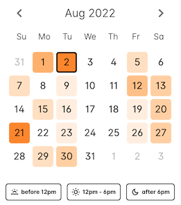
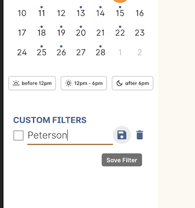

[[timetable]]
== Timetables

When scheduling classes, it can be helpful to know at a glance when a room or a site might have some availability free to book up, or is booked out solidly for the next four weeks. onCourse allows you to track scheduled class sessions across a variety of records using out detailed Timetable view.

[[timetable-access]]
=== Accessing Timetable View

The Timetable view can be accessed from the Dashboard in the Scheduling category, or from within either a site, room, tutor or student record.

* Search for timetable on the dashboard for a full timetable of all classes
* For student and tutor specific timetables, go to the student or tutor record and click the timetable link
* For specific sites or rooms, go to the site or room record and click the timetable link

image::images/sites_timetable_icon.png[title='The Sites window in three-column view with the timetable link in the right-hand column']

[[timetable-actions]]
=== Timetable Window

The Timetable window features a mini-calendar marking today's date, the date selected and any days with sessions booked.

The mini calendar also acts as a *heatmap*, giving you an at-a-glance idea of which days are relatively booked up versus which days have more space. The deeper the colour, the more relatively busy that day is compared to the others.

Additionally, there are three separate time of day filters; before 12pm, 12pm-6pm, and after 6pm. Selecting any combination of these filters will filter out results that appear outside these parameters.

image::images/timetable_standard_view.png[title='The default Timetable view']

You can also create custom filters using our Advanced Query Language, or AQL, a relatively simple but powerful way to search across numerous records in onCourse.

You will always see a list of current sessions booked, the date, session length, session times, site and room information, and the name of the sessions tutors, if they're set. You can also see any tags and associated tag colours for each class.

The class name can be clicked to open the applicable class record.

[[timetable-views]]
=== Timetable View Options

The timetable offers three different views that each display data in a different way: Compact, Gap (Days) and Gap (Hours), as well as options for setting how you view tags, and some other grouping options.

Each view will show the date, time and session length of a class, as well as the tutor, the room, and the site name. It can also show any associated tags and their tag colours. The view options available are:

* *Compact View* - Shows all booked sessions only. Does not show any available spaces or timetable gaps.
+
image::images/timetable_compact.png[title='The Timetable window in Compact view']

* *Gap (Days)* - Shows any days that are fully available (no bookings that day), as well as all currently booked sessions
+
image::images/timetable_gap_days.png[title='The Timetable in Gap (days) view mode']

* *Gap (Hours)* - Shows an hourly breakdown of each day from 9am to 6pm. For Sites, it will group each class by the hour. You can see a breakdown of each class within the hour by clicking the down chevron. For Rooms, it will display the name of the class for each hour it's booked. Any available times are marked 'available'.
+
image::images/timetable_gap_hours.png[title='Gap (hours) view mode shows classes grouped by hours of the day']

[[timetable-tagViews]]
=== Tags in Timetables

You can change how tags are viewed as part of the timetable using the tags option drop down

* *Tag names* - Displays the tag colour and tag name in full
* *Tag dots* - Displays the coloured tag dots only
* *Tag off* - Hides the tags from timetable view

[[timetable-grouping]]
=== Grouping options

There are three grouping options for you choose from for the timetable view. Each view still breaks down classes per day, but these options will allow you to break the options down even further, either by tutors or by rooms.

* *No grouping* - Works like per usual, classes are grouped by date only
* *Group by tutor* - Groups classes per date, per tutor
* *Group by room* - Groups classes per date, per room

[[timetable-customFilters]]
=== Creating Custom Timetable Filters

You can apply custom filters to the timetable utilising the onCourse advanced query language, which you can learn about in more detail in our <<search, search chapter>>.

image::images/timetable_filter_create.png[title='Creating a filter is easy thanks to the drop-down selections for each entity']

One example of a simple filter would be if you wanted to see when all your courses with Music in the name are on, you would select , then adding the following AQL code:

`courseClass.course.name contains "Music"`

AQL uses pre-selectable options to choose from, which makes creating filters like this, or even far more complex ones, very simple.

You can save any custom filter you create by clicking the sliders icon at the end of the search box. You can save it so it's visible for everyone, or just for you.

image::images/timetable_custom_filter_select.png[title='Choose whether to save a filter just for you, or for every user of your system']

When you choose that, the filter will appear in the panel on the left with a bank name field. Enter your name, then click the Save icon and the filter will be saved for you to recall at any time.

