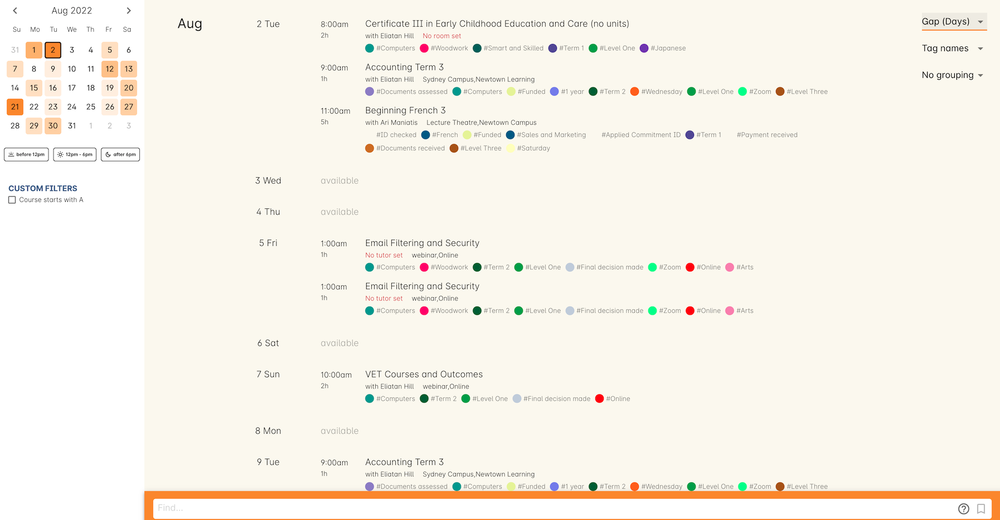
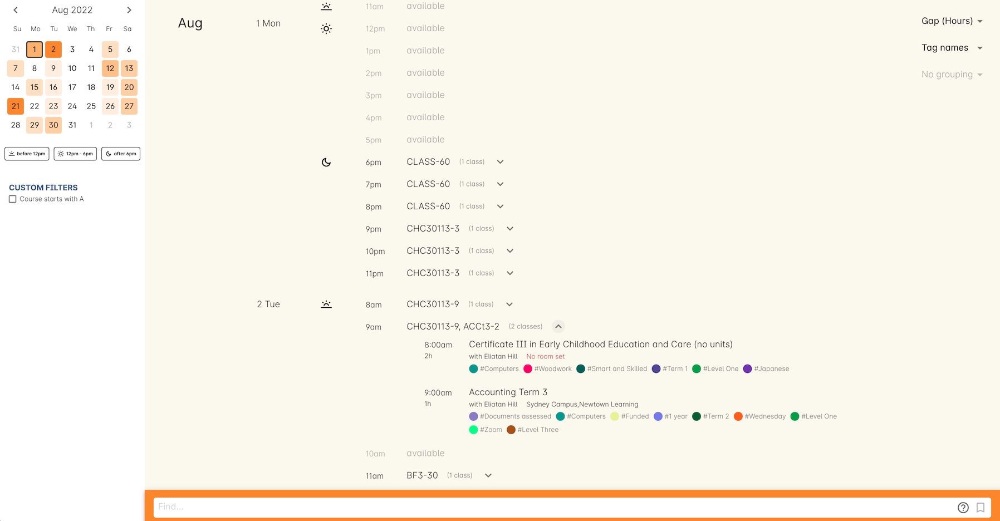
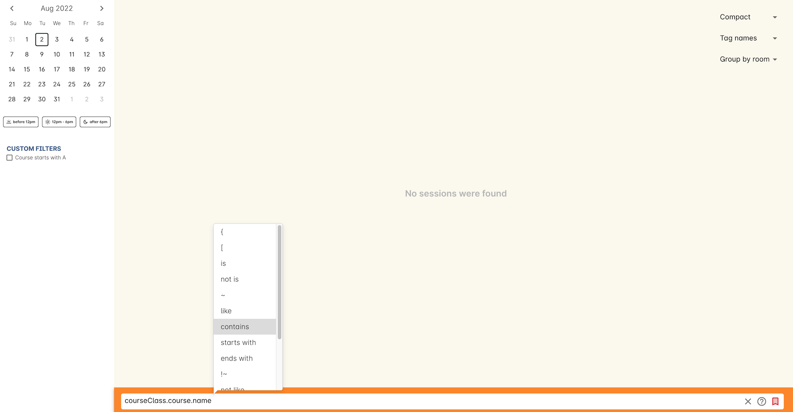

[[timetable]]
== Timetables

=== Chapter Overview

When scheduling classes, it can be helpful to know at a glance when a room or a site might have some availability free to book up, or is booked out solidly for the next four weeks. onCourse allows you to track class sessions scheduled at both the site level, and the room level, making it easier to spot holes in their availability quickly and easily.

[[timetable-access]]
=== Accessing Timetable View

The Timetable view can be accessed from the Dashboard by typing 'Timetable' into the Find Anything search bar, or from within either a Site or a Room record.
To find a timetable view for a specific site or room:

* Open the Sites or Rooms window, whichever is applicable
* If in three-column view, click the site or room you wish to view, then click the Timetable button in the right-hand column
* If in two-column view, double-click the site or room you wish to view, then click the Timetable button

=== Timetable Window

The Timetable window features a mini-calendar marking today's date, the date selected and any days with sessions booked, along with three separate time of day filters; before 12pm, 12pm-6pm, and after 6pm.
Selecting any combination of these filters will filter out results that appear outside these parameters.

image:images/timetable_standard_view.png[ The default Timetable view,scaledwidth=100.0%]

You can also create custom filters using our Advanced Query Language, or AQL, a relatively simple but powerful way to search across numerous records in onCourse.

You will always see a list of current sessions booked, the date, session length, session times, site and room information, and the name of the sessions tutors, if they're set.
You can also see any tags and associated tag colours for each class.
You can minimise the tags view to just the coloured dots by clicking any tag in the window.

Each class name can be clicked to open the applicable class record.

=== Timetable Views

The timetable offers three different views that each display data in a different way: Compact, Gap (Days) and Gap (Hours).
Each view will show the date, time and session length of a class, as well as the tutor, the room, and the site name.
It will also show any associated tags and their tag colours.

[[timetable-compact]]
==== Compact View

Shows all booked sessions only.
Does not show any available spaces or timetable gaps.

[[timetable-gap-days]]
==== Gap (Days)

Shows any days that are fully available (no bookings that day), as well as all currently booked sessions

[[timetable-gap-hours]]
==== Gap (Hours)

Shows an hourly breakdown of each day from 9am to 6pm.
For Sites, it will group each class by the hour.
You can see a breakdown of each class within the hour by clicking the down chevron.
For Rooms, it will display the name of the class for each hour it's booked.
Any available times are marked 'available'

=== Creating Custom Timetable Filters

You can apply custom filters to the timetable utilising the onCourse advanced query language, which you can learn about in more detail here,
link:search.html[in our search chapter].

To create a new search filter, make a selection from the drop down box in the search bar at the bottom of the window.
You can choose from the following entities:

* Sessions
* Tutors
* Contacts
* Classes
* Courses
* Student names
* Rooms
* Sites

Selections in the drop down box show you which entities the data is connected across within the onCourse database. E.G. the courses selection shows how the class session is connected to the class (called CourseClass in the database), which is connected to Course.
It appears like so:

`session.courseClass.course.`

One example of a simple filter would be if you wanted to see when all your courses with Music in the name are on, you would select , then adding the following AQL code:

`name contains "Music"`

AQL uses pre-selectable options to choose from, which makes creating filters like this, or even far more complex ones, very simple.

You can save any custom filter you create by clicking the sliders icon at the end of the search box.
You can save it so it's visible for everyone, or just for you.

image:images/timetable_custom_filter_select.png[Choose whether to save a filter just for you,or for every user of your system,scaledwidth=100.0%]

When you choose that, the filter will appear in the panel on the left with a bank name field.
Enter your name, then click the Save icon and the filter will be saved for you to recall at any time.

image:images/timetable_custom_filter_save.png[Give your filter a name,
then click the Save icon,scaledwidth=100.0%]
