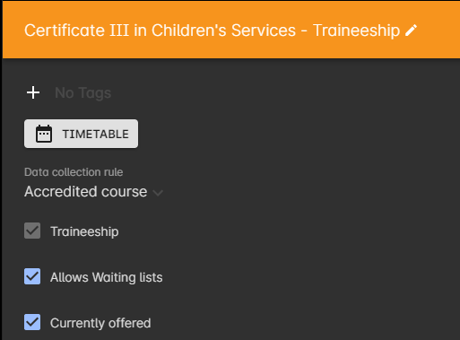
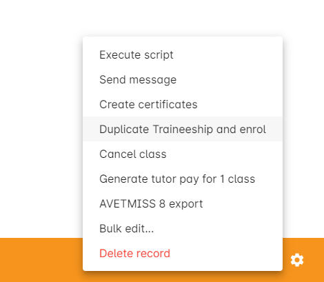

[[traineeships]]
== Traineeships

[[courses-traineeships]]
=== Traineeship Courses

Traineeship Courses are a special type of course whose classes are created as part of the enrolment process.

To mark a course as a Traineeship Course, click the 'Traineeship' checkbox at the top of the course edit view when creating your course. You will be required to select a data collection rule and a VET Qualification in the VET section at the bottom of the course edit view.

[[processingEnrolments-traineeships]]
=== Traineeship Classes

In onCourse, Traineeship Classes are a special type of class that can only take one enrolment per class. They can only be created using marked <<courses-traineeships, Traineeship Courses>>.

You can create traineeship classes the same way that you do normal classes, by creating them in advance in the Classes window, or by duplicating them from an already existing, or previously completed traineeship class by clicking the cogwheel and selecting 'Duplicate traineeship and enrol'. This will create a new copy of the highlighted traineeship class, and also open the Checkout with the selected class already chosen as an item.

Process payment to complete the enrolment.

==== Recording funding information about a traineeship

When a student is completing a traineeship, you will have been given a 'Training Contract Identifier' and a Client 'Identifier' by your state funding body. They may call them by different names, but the important thing to confirm is that they are the data that exports into the NAT000120 in positions 70 & 80 respectively.

This data is entered into the onCourse enrolment window. This data will need to be entered after enrolment by going to the Enrolment window, locating the student's enrolment record and double clicking on it. On the general tab you will find these fields.

In NSW, you will need to put your Training Contract ID into BOTH of these fields, as NSW doesn't issue a separate Client Identifier for trainees.

If you have broken the traineeship into multiple enrolments, each with one or more units of competency, you will need to enter this information into each enrolment record for the student that relates to the traineeship. This information is not recorded as part of the student's master contact record, as the student may also have other enrolment records which don't form part of this traineeship.

