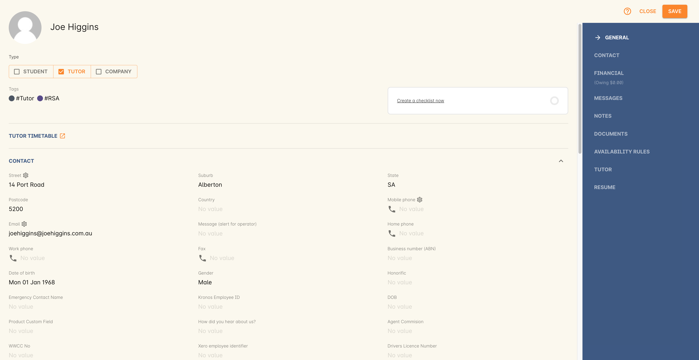
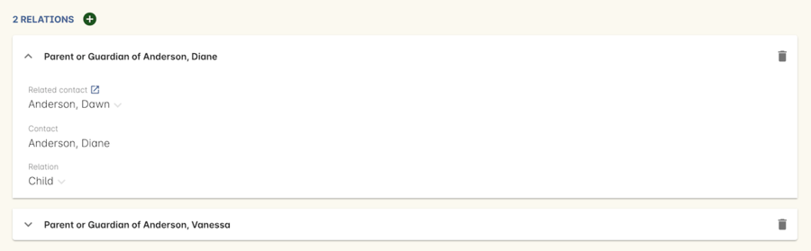
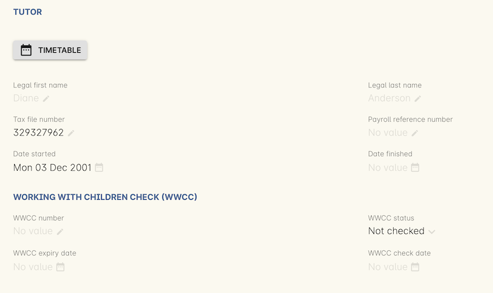
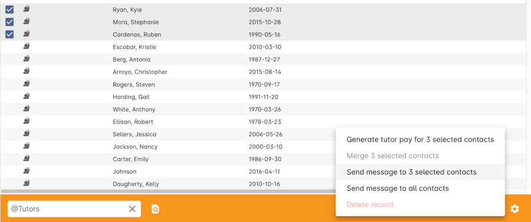

[[tutors]]
== Tutors

[[tutors-workingWith]]
=== Working with Tutors

Access Tutor records by searching for 'Tutors' on the Dashboard. The Tutors window is just the Contacts window with the Tutors filter pre-selected. It operates exactly the same as the <<contacts>> window does.

[[tutors-recordTabs]]
==== Tutor Records

You can open a tutor record by double-clicking on it in the list view window.

===== General

The general section is an important section that holds a lot of information about the tutors.
Once in the general section, you will be able to edit things like:
+

+
* Tutor Name
* Tutor Address
* Tutor phone and fax numbers
* Tutor email
* Message (alert for operator)
* Tutor Date of birth
* Tutor Gender
* Memberships
* Tutor Honorific
* Relation Window - From this window, you can set relationships to that tutor
+

===== Financial

This section shows you the financial transactions your company has with the selected tutor. Here you will see invoices issued or received and payments made to the tutor listing all the relevant information and providing links these records.

===== Messages

This section lists all messages sent to the tutor from onCourse via email, SMS and post

===== Notes

This section keeps a list of all notes you have relating to the tutor and any web visible or private documents like resume, certificates and references.

===== Documents

This section is where any documents from the onCourse document management system have been linked to the record.

===== Availability Rules

If you're aware of any set days where the tutor will not be available to attend, you will be able to set them here. Tutors will not be available for selection during the time periods you define in this section.

[[tutors-Resume]]
===== Resume

This is where you store the biographical information about the tutor you wish to publish to your ish website

[[tutors-Tutor]]
===== Tutor

This section shows a list of the classes the tutor is scheduled to teach. This section will also information about the working with children check. The Children Check number is required when expiry date is specified and vice versa. A warning gets shown when adding a tutor with status 'Barred' or 'Interim barred' to a class.

There is also a Timetable button in this section. This button opens the timetable window and shows all the sessions for the selected tutor in a calendar layout. Read more about the timetable in our <<timetable, timetable chapter>>.

[[tutors-Creating]]
=== Creating Tutors

You will need to keep your tutor's contact details on file and what classes and sessions they are scheduled to teach each term. If you are an RTO you will also need to keep copies of their resume and qualifications on file. onCourse allows you to do this using the Documents sections. Each tutor has their own personal file in onCourse which is easy to access and update.

If you have a large number of casual staff who work at a variety of different venues, it can be difficult to manage communication with them as you might not see them in person very often. Tutors listed in onCourse can be emailed or SMS'd easily and all messages sent out of the system are tracked in the tutors record helping you to keep all communications listed and organised.

. With the Contact window list view open, click on the + button in the bottom right-hand corner of the screen. A new contact screen will open.
. Set the contact as a Tutor. You will see that an additional section for tutor resume is added to the record.
. Enter the First Name and Last Name of the tutor.
. Enter the Address and other contact detail for the tutor. If you add an Email address, your tutors can log into your SkillsonCourse Portal to check their class schedules and you can email them directly from onCourse. If you enter a Mobile phone number, you can send SMS to your tutor from onCourse.
. For each contact method (mail, email and SMS) you have the option to opt the contact out of marketing communication. The default setting is to "accept marketing material," so when you click on the cog wheel above these fields, you will see this option is highlighted with a tick. This means that when you have marketing mail outs, this address will be on the mailing list. To change this setting simply click on the cog wheel and select the option "opt out from postal marketing material" if the person dosen't want to receive marketing communication from you. The other option is "undeliverable", meaning that no mail is to be delivered to this address because it is incorrect, or in the case of an email address, has received an undeliverable response from the mail server.
. The field message (alert for operator) is for any special notes that are important or relevant to this contact for eg. they might allow their phone number to be given to students.
. Use the resume section to create a publicly listed biography for the tutor. This screen shows that information which is displayed on your website. Be aware that this is an automatic function. For example, you might post a brief description for this particular tutor, their background and experience and how it relates to the courses they are teaching. As this information will be visible to students and general public on the website, it is recommended that you obtain permission from the tutor to publish this information. You can enter the text directly into the screen or cut and paste from another source. The text in the field can be formatted using Rich text.
. Move to the Notes section to add notes to the tutor record. The text in the notes field is private.
. To attach documents in the Documents section, click on the + sign next to Documents, then click Browse to find a file on your computer, or if the file is already in your onCourse, type the name you gave it when you first added it. Once you add the file it will appear here. You can also add a photo of the tutor by clicking the blank head in the top left corner of the page. This will open a browser window where you can select the image off your desktop.

[NOTE]
====
By creating a new tutor record and entering the email address for that tutor, the system will automatically create a new account for the Tutor to access the Skills onCourse Portal. You can then instruct your tutors to go to the Skills onCourse log in page and enter their first name, last name and email address and click on the Forgot Passwordlink. They will then receive an automatically generated email with their new password.
====

[[tutors-contactingTutors]]
=== Contacting tutors by email or SMS

You may wish to notify individual tutors if their course is running or cancelled, or groups of tutors with information about activities and event at the College. If you create and send the message from onCourse, the history of the message is stored within the tutor's record on the messaged section.

You must have set up an SMS and email gateway with ish to use this feature.
For information on how to do this, read the General Preferences documentation.

. Open the tutor window and search for the tutor/s you're after using the search functions.
. Highlight the tutors you wish to contact in the list. To do this select the first contact name, hold down shift then select the last contact name and click on the cog wheel icon on the bottom right-hand side of the window.
. Choose "send message" and the messaging window will open.
. Choose the template you want to use - the type of template determines whether you're sending an email or SMS.
. Select a template, and then if you need to, fill out any of the required fields. The fields required will be defined by the template you select. You should see a preview build in the right side of the window as you type.
. Check the number of contacts being sent to. You can send to suppressed contacts also by clicking the checkbox under the count.
. Press send.

[[tutors-Payroll]]
=== Tags specific to Tutors

Tutors have some specific tags that can be added to their records relating to pay periods and their tutor status. You will see a + button just below where you set the contact as a Tutor. Click on this and a drop down menu of different tags will display, among the selections is "payroll wage intervals" and "tutors." These aren't required but can be useful when used.

Payroll wage intervals - Gives you a choice of weekly, fortnightly and monthly payment schedules. Select one.

Tutors - offers you the choice of `contract tutors` - those tutors who will invoice your business, `pending tutors` - those tutors who are not yet working for you, and `vet tutors` - vocational education and training tutors.

Make your selection then the tag will appear on the record.

[[tutors-Attachments]]
=== Contacts and Documents

Documents provide a way of adding web visible or private documents like resumes, certificates and references to a contact. Learn how to attach documents in our <<documentManagement-Adding, Documents chapter>>.

