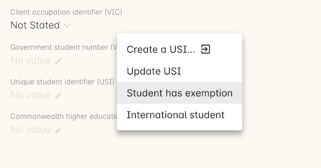
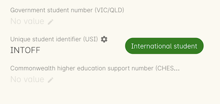
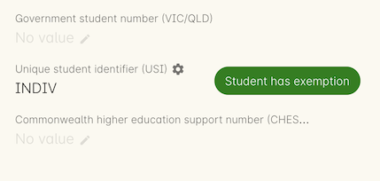
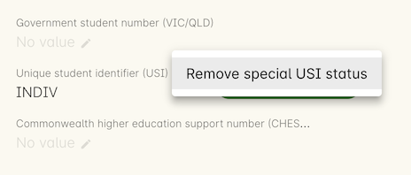

[[usi]]
== Unique Student Identifier (USI)

This section is only important for RTO's. If you are not an RTO, you
don't need to worry about the USI or this section of the documentation.

[[usi-onCourseProcess]]
=== The onCourse USI process

Our primary goal is to make obtaining and verifying USIs the
responsibility of the enrolling student to minimise the data entry and
management effort required by your office staff.

If a student enters their USI online, or you enter it manually in
onCourse the USI will automatically be verified against the USI Agency
system. In order for this process to work you'll need to run through the
USI Integration process, listed on our Integrations page here.

The verification system is not available to onCourse community edition
users who don't have a support agreement with ish. You can still capture
the USI within onCourse and report it for AVETMISS but you will not be
able to take advantage of the online student self-service process or the
automatic verification process. Community users can verify their
student's USIs manually using the USI Agency RTO portal.

==== How onCourse automates the USI process

When a student enrols in a course which is identified as a VET course,
their enrolment confirmation will include some additional text
explaining what a USI is and why they need to tell you theirs. This
email directs them to a special onCourse portal page (no log in
required) requesting they supply their USI or go through the process to
create one.

Most students will be going through the process of creating a new USI.
Once they complete this part of the process, we will then take that new
USI and verify it against their first name, last name and date of birth
as supplied on their enrolment. If the USI doesn't validate (possibly
because the student used a dummy date of birth on enrolment, or a
shortened version of their first name) then they will be prompted to
update the incorrect data in onCourse to match their USI, so we can pass
the USI validation process.

Provided you have the 'send usi reminder' script enabled in the
Automation > Scripts section, every Monday morning (this timing can be
changed), all recently enrolled VET students who have not supplied you
with their USI will be sent an automatic reminder email on how to
complete this process and why it is important they do so. A student who
doesn't complete this process or can not validate their USI will be
flagged in onCourse for you to follow up.

==== What you need to do enable the USI validation service in onCourse

You can enable the USI validation by following the steps laid out in the
https://www.ish.com.au/s/onCourse/doc/latest/manual/externalintegrations.html#externalintegrations-USI[USI
section of our external integrations chapter] of our documentation.
There are a handful of steps that must be completed externally to the
onCourse system before running the integration so ensure you follow each
step closely before moving on to the next one.

[[usi-Capturing]]
=== Capturing the USI in onCourse

The USI does not need to be captured at the time of enrolment, but
typically you'll want to have it entered and verified before the class
is completed in order to not delay issuing of certificates.

==== Creating a USI for a student

Some students will not be able to navigate the USI portal to obtain
their own USI, in which case you are able to do this on their behalf
within the VET section of their contact record, just click the cogwheel
next to the USI field then select 'Create a USI...'

image:images/usi/create_a_usi.png[ When there is no USI supplied, you
can click on the link to open a web portal and create a new USI.
,scaledwidth=100.0%]

Clicking on this link will open a web portal where you can complete the
student details and identity document information. You will need to
declare that you have obtained permission from the student to complete
this process on their behalf.

We do not recommend you copy or store the student's identity
documentation in their onCourse record as this is in breach of the USI
legislation.

==== Manual entry of a USI

When you create a new student or update an existing one, you can type
the USI directly into the field available on the VET tab in their
contact record. This can also be done directly within the checkout
process. The USI will be checked for validity (it is the correct length
and matches a checksum) and then verified against the USI agency.

image:images/usi/invalid_usi.png[ What you will see if the USI has not
been entered correctly. This USI is invalid as it doesn't meet the
character length and checksum. It can't be validated and the record
can't be saved. ,scaledwidth=100.0%]

If you have completed the steps to set up the USI Integration
successfully, then the USI validation system in onCourse will be
enabled.

Once a complete USI is entered in the student record, the background
validation process with the USI Registry System will run automatically.
The validation process is checking that the student's first name, last
name, date of birth and USI match the data held by the USI Registry
System.

If it succeeds the USI will be marked as verified with a green pill next
to the USI field and the student's first name, last name and date of
birth will become locked.

image:images/usi/verified_usi.png[ This USI has passed verification and
the record has been locked. ,scaledwidth=100.0%]

If the one of the fields do not match e.g. the student's first name in
onCourse is a shortened version of their legal name, then the USI
verification process will fail. Hovering over the information icon next
to the USI field label will show the reason why the verification process
failed. You can update the non-matching data in onCourse and the
verification process will run again, automatically, when you change one
of the first name, last name, date of birth or USI field's data.

image:images/usi/usi_verification_failed.png[ This USI has failed
verification. The data can be corrected and the verification attempted
again. ,scaledwidth=100.0%]

==== Editing a locked student record

After successful USI validation, the data that was matched with the USI
- the first name, last name, date of birth and USI of the student,
becomes locked and will no longer display an edit icon next to the
field.

On occasion, a student may inform you that they created their USI with
the wrong name details and wish to update their records. To do this,
they need to contact the USI Agency by logging into their own portal and
completing the process to make the change. Once the USI Agency has the
details of the change, you can go ahead and update their onCourse
records to match.

In the VET section of the contact, click the cogwheel next to the USI
field and click 'Update USI'. This will empty the student's USI field
and unlock their first name, last name and birth date fields. Once
updated you'll need to re-enter the student's USI number for validation.

image:images/usi/usi_edit_sheet.png[ Click the cogwheel next to the USI
field, then select Update USI to update an already verified contact's
details ,scaledwidth=100.0%]

[[usi-selfService]]
=== Student self-service

On enrolment through the office or the web, onCourse will send an email
enrolment confirmation to the student. If the course is VET flagged, the
confirmation template will include some text directing the student to
obtain and supply you with their USI.

Another default script in onCourse can be enabled to send a reminder
email to students every Monday at 9am until the class is complete or the
USI is entered. You can modify these templates or alter the script which
determines when and how often to send these emails.

Note that students are only sent this email if they are enrolled in a
VET flagged class, to avoid bothering your students engaging in non-VET
training, however by default VET flagged courses without qualifications
or units will also trigger this email as they are usually reported via
AVETMISS for funding arrangements. You may wish to alter the scripts to
only send the email when the course has a qualification record attached.

image:images/usi/usi_email.png[ An example of a confirmation email with
USI information ,scaledwidth=100.0%]

image:images/usi/usi_followup_email.png[ An example of a USI reminder
email. ,scaledwidth=100.0%]

Once the student gets the email requesting their USI, they will be able
to click on a link which takes them directly to a page within the
skillsOnCourse portal. They will not require a password and the link
will be valid for 7 days from the email being sent. The URL is
cryptographically signed so that they will not work after the expiry
date and they will not be transferable between students.

You can change the default 7 days expiry to any number of your choosing
by editing your enrolment confirmation and USI reminder email templates.

The skillsOnCourse portal page will explain the USI to the student and
give them a convenient link to create or recover a USI if they don't
have one or have forgotten it. This has been optimised so that it can be
used on mobile and tablet devices. The student will be able to enter the
USI and onCourse will handle the verification process automatically. The
student will be asked to complete three steps

==== Step 1: Personal Details

The first step requests additional contact data not already captured on
enrolment, that is mandatory for AVETMISS reporting or USI validation.
No information they have previously supplied will be visible, only
fields that are currently blank. This allows you, if desired, to collect
minimal information during the online enrolment process and request the
additional data be supplied post enrolment.

In the example below, the student is required to complete some mandatory
fields such as their street address and country of birth, plus some
options contact details such as home phone numbers. Previously supplied
contact details like email address and mobile phone number are not
displayed.

image:images/usi/usi_mobile_start.png[ Step 1: This is the screen the
students will arrive at. Fields will only be shown if data isn't already
supplied. ,scaledwidth=100.0%]

==== Step 2: AVETMISS questions

The second step requests the student complete the AVETMISS questions.
Responses to these questions are not mandatory but may be important for
verification of student access to various types of government funding,
for example, accessing lower student fees for Smart & Skilled funded
programs.

For each VET enrolment the student has in progress, they will be asked
to complete a 'reason for study' question. Some students may have this
question once, for a single enrolment, where other students enrolled in
multiple programs.

image:images/usi/usi_portal_step2.png[ Step 2: The student completes the
AVETMISS questions. ,scaledwidth=100.0%]

==== Step 3: USI

The third and last step requests the student supply their USI. If their
date of birth was not supplied on enrolment, they will be asked to enter
this also. If the student doesn't have, or know, their USI, they can
click on the link to visit the USI Agency website to obtain or retrieve
it.

On clicking next, the student's USI and contact details will be verified
with the USI Agency.

image:images/usi/usi_enter_in_portal.png[ Step 3: Provide your USI
,scaledwidth=100.0%]

image:images/usi/usi_mobile_verifying.png[ Step 3 in progress: While the
USI is being verified they will see this window. ,scaledwidth=100.0%]

If the USI agency reports back that the student's name is wrong (for
example, they enrolled in onCourse with their maiden name but their USI
is issued in their married name) then onCourse will give them the
opportunity to fix this.

image:images/usi/usi_student_name_mismatch.png[ Step 3 failed: The
student's name doesn't match the USI Registry data. They have the
opportunity to correct the data in onCourse. ,scaledwidth=100.0%]

=== USI Exemption Process

There are two types of exemption currently available for students who
don't want to, or can't, obtain a USI - international students who
complete their training offshore (INTOFF), and students who have an
individual exemption due to a personal genuine objection (INDIV). Check
the
https://www.usi.gov.au/training-organisations/training-organisation-requirements/exemptions-reporting-usi[USI
website] to ensure you have the most current information available about
who is entitled to an exemptions and the process required for reporting.

To set a USI exemption in a student's contact record:

[arabic]
. Open the contact record and navigate to the VET tab
. Click the cogwheel option next to the USI field
. Select the exemption type that applies
+

. The record will update to inset the exemption code and marked the
student's record as verified. This will allow you to print
Certification.
+

+

Should a student's exemption status later change, the cogwheel can also
be used to remove the special USI status, so an actual USI value can be
entered and verified.

[[usi-certificatePrinting]]
=== Certificate printing and the USI

The USI legislation requires that RTOs only issue formal certification
to students who have supplied a USI which has passed verification.

From 1/1/2015 all certificate record print attempts will check the
student USI status. A warning will show for any certificate print or
reprint where the student doesn't have a USI. A certificate created
after 1/1/2015 will not print without a verified USI.

A range of warnings and errors will appear based on your onCourse access
rights. By default, all non admin users do not have permission to print
certificates for students without verified USIs.

All admin users will see the warnings if a student doesn't have a USI or
verified USI, however they will be able to proceed to print for all
certificates if they choose.

image:images/usi/usi_cert_print_warn.png[ This is a warning only. You
can still proceed by selecting print. ,scaledwidth=100.0%]

All access roles have two optional levels of access - print certificate
without verified USI (this means the student has supplied a USI that
meets the checksum requirements, but for whatever reason it hasn't
passed verification with the USI Registry System) and a higher level of
permission, print certificate without USI.

We do not recommend that you allow staff permission to print
certificates without verified USIs.

image:images/usi/usi_certificate_print_permissions.png[ This access role
does not have permission to print certificates without a verified USI.
,scaledwidth=100.0%]

[[usi-FAQs]]
=== USI FAQ

*Q:* How do I make the USI validation process run in onCourse?

*A:* When onCourse detects you have entered a USI in the USI field on
the Student VET tab, it will check that you have an RTO ID entered in
your general preferences, and a First Name, Last Name and Date of Birth
entered in the student record. If all these fields are complete, the USI
Validation process will run automatically in the background.

If it fails, and you need to change some of the data to make it try
again, make the change, click out of the field (use tab on your
keyboard, or click into any other field) and the process will run again.
If you don't need to change any data, just click in the USI field and
click out and it will try again. You can do this as many times as you
like - the validation check is quite fast, less than 3 seconds in most
instances, and there is no limit to the number of times you can try to
validate a USI.

*Q:* How can I test that my onCourse USI portal access is working as
required?

*A:* Go and http://usi.gov.au/create-your-USI/Pages/default.aspx[create
yourself a USI.] Then you can use your own details to create a new
student contact and test the USI verification. Try without a date of
birth or misspelled name to see the error responses you'll get in
onCourse. You can discard the contact instead of saving it onCourse
after sufficiently testing the verification process.

*Q:* What should I do when the student has created their USI in a name
different to the name they enrolled with?

*A:* Commonly, students will enrol with the name they prefer to use e.g.
Bob rather than Robert, but their USI will be issued in their legal
name. When you try to verify the USI they supply against their name, an
error will be returned telling you that the first name (or last name, or
date of birth) doesn't match the USI you supplied. In that case, you can
change the data in onCourse and the verification process will
automatically run again.

If the student uses the USI portal to supply you with their USI, then
they can correct their name spelling themselves. You might need to call
the student to get their correct name spelling if you are collecting and
verifying USIs via an office based process.

Of course, we have also had instances of students whose name is spelt
incorrectly on their ID and therefore the name linked to their USI has
the wrong spelling, or students who have enrolled using a married name,
when the ID they used to create their USI was in their maiden name.
You'd need to enter their name into onCourse as an exact match as their
USI name to make it validate, but you probably don't want to do this as
then their certificate will be issued in the wrong name too. For the
time being, leave it as an invalid USI.

In these instances you need to get the student to log into their own
https://portal.usi.gov.au/student[USI Agency Portal] and make the change
there, and advise you once this has been done. Then you can try the
validation process again, and it should pass with the right spelling.

*Q:* How can I find out which students USIs have failed to pass
validation in onCourse?

*A:* In the contact window, you can search for students without a
verified USI by using the following query:

`student.usiStatus is NON_VERIFIED`

You can then work through the list of returned to results to check the
error messages, contact the students and make the appropriate changes.
As you change the data, the verification process will run again.

*Q:* How can I find out which students need USIs but don't have one
recorded in onCourse?

*A:* Using the class window, locate all your VET classes that are
running and highlight them all. Use the find related function to find
all 'Enrolled students' related to the highlighted classes.

In this new group of students, pop the following search query into
search to find the students without verified USI's:

`student.usiStatus is NON_VERIFIED`

You can then manually follow them up with phone calls or find their
enrolments to send them the USI reminder email.

To send the reminder email, select all the students and use the find
related icon to find related enrolments. When the enrolment window
opens, check the filter options 'current active' and 'completed active'
to remove any cancelled or failed enrolments from the list. Then
highlight all the enrolments and from the cog wheel choose the option
'send emails from template' and select the template called 'USI reminder
email'.

*Q:* What happens when merging contacts with USIs?

*A:* You cannot merge two contacts with different verified USIs. If you
attempt a merge, a notification will be displayed informing you that you
can't do this.

If only one of the contacts has a USI, then they can be merged, but
their First/Last Name and date of birth can't be changed during this
process.

*Q:* How do I validate a student who has only one name?

*A:* You can put their 'one name' into both the first name and last name
field in onCourse and it will pass validation. For example, a student
with a single name like 'Madonna' will be entered as first name
'Madonna' and last name 'Madonna'. Their certificate and other
documentation issued from onCourse will be in the single name 'Madonna',
and the AVETMISS files will export the expected 'Madonna, Madonna'. Some
students are setting up their USI with 'one name' because they
misunderstand the question in the USI portal. They think it means no
middle name. If you have a student with a name like 'Sally Smith' who
has created their USI as one name, then you can record her as First Name
= Sally Smith and Last Name = Sally Smith so her USI passes validation.
