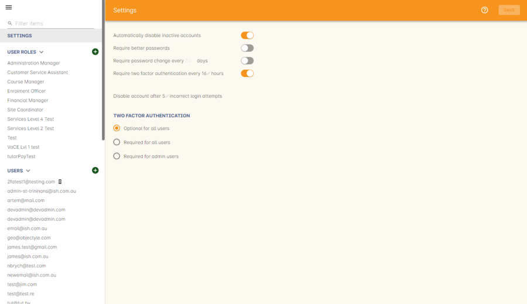
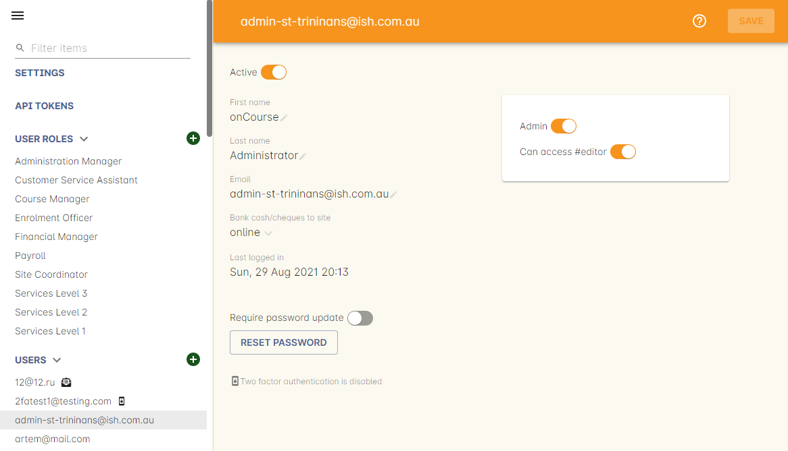
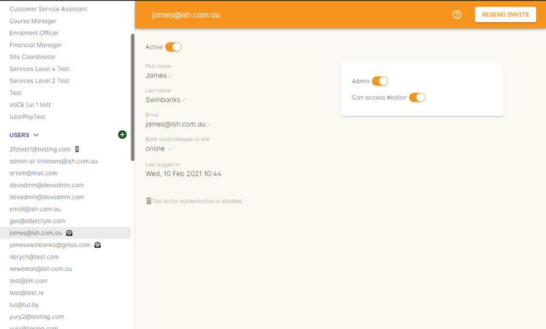
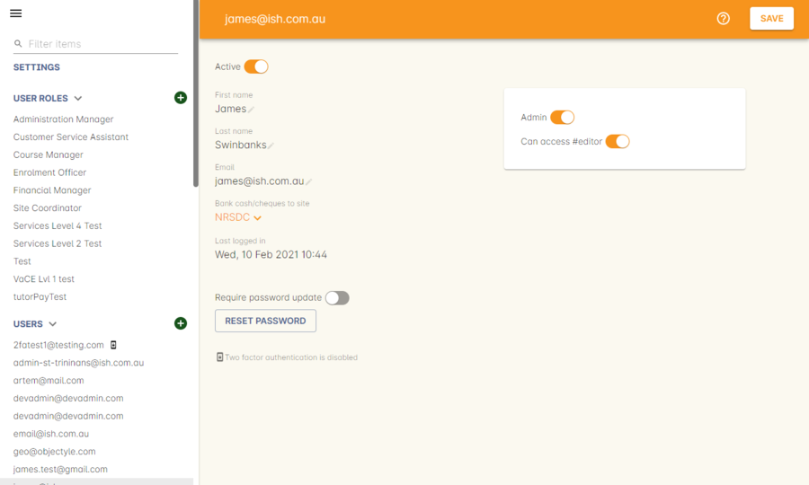
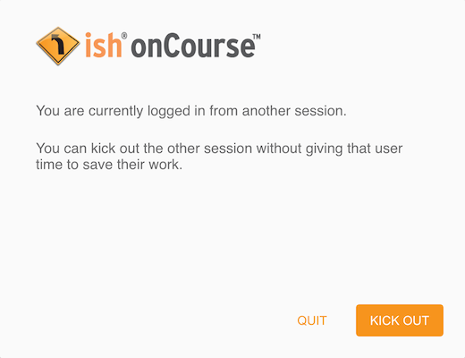
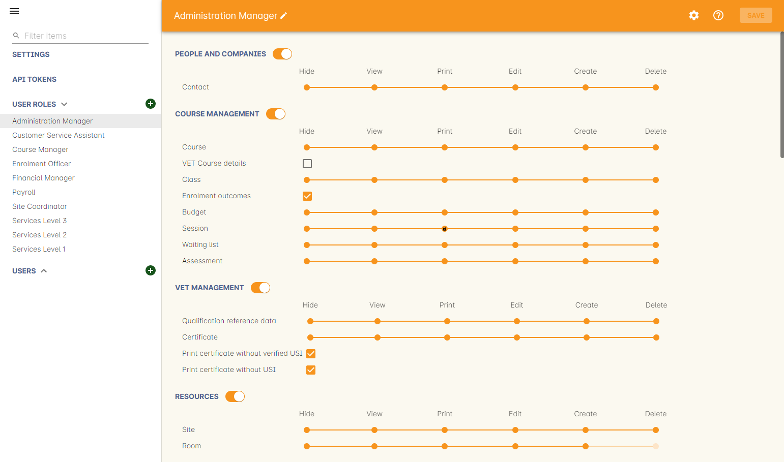
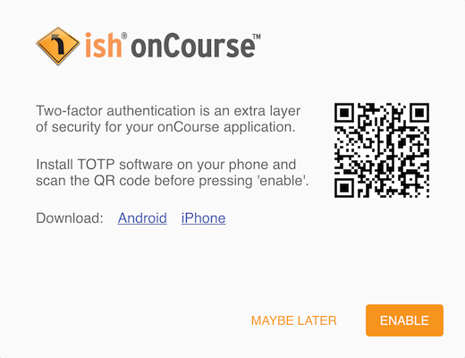
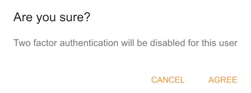

[[users]]
== Users and Authentication

[[users-Users]]
=== Security Settings

You can access the https://demo.cloud.oncourse.cc/security[Security] window on the dashboard. Along with some standard security-related preferences, here you will find a full list of users with login access to your onCourse application and data, along with the different user roles you have defined within onCourse.

If you know the name of the record you're looking for, type it into the Filter Items search at the top of the left-hand column. Otherwise just scroll the list until you find what you're after.

The first section is called 'Settings', containing onCourse's main security related preferences, including rules around enforcing two-factor authentication. You have the following preferences to switch on or off:

Automatically disable inactive user accounts::
this will disable accounts that haven't logged in after a set number of days. This could be useful for disabling the accounts of past employees if you don't have the time to manage it yourself.

Require better passwords::
When enabled, this feature demands the use of a more secure password. When enabled, it will typically reject any common passwords and enforce a higher standard of password to be used by all users.

Require password change every <x> days::
When enabled, this feature will demand users change their password every set number of days. You can change the number of days manually by clicking the number in the field.

Require two-factor authentication every <x> hours::
When enabled, this will require all users to get a new authorisation via a third-party authorisation app after the set number of hours. You can change the number of hours manually by editing the number in the field. This only applies when the same user is using the computer. If another user signs in to their account on your computer, you will be required to enter your 2FA authorisation regardless of this setting.

Disable account after <x> login attempts::
When enabled, any user account that fails to login with the correct password this number of times will have their account disabled. An admin user of your system will need to go in to their user record and re-enable them manually. The default setting is 5 attempts.

[[users-settings]]
=== Users

In user records you can add to or edit existing users details such as their name, email address, access level or send a password reset request. Only users with admin rights will be able to see, edit and add users, everyone else can only edit their own user settings. There are no limits to the number of users you can create in onCourse. Users should be deactivated if they leave your organisation.

Every person in the organisation who uses onCourse should have their own user account. We do not recommend users 'share' a login as various user layout preferences are saved against each user account. Important records created in onCourse like invoices, payments and enrolments are linked to the user who created them. If you need to follow up any discrepancies, this is made much easier when your staff each have their own user.

* Name - A name for the user record. This isn't used to login with, this is just an identifier.
* First Name - The user's first name
* Last Name - The user's last name
* Email - the users primary email address, also used for login (this email address will be used for the CMS login process).
* Bank cash/cheques to site - This should be the physical site where your staff are working. Select the site from the drop down menu. This is important if you take physical cash, cheque or EFTPOS payments at these venues and you need the site banking process to correctly tally the location balances.
* Active - selecting this allows the user to login to onCourse. If active is not selected, the user will receive an "authentication failed" message at the onCourse login screen.
* Admin - Checking this will allow the user to be an admin, they will have full access rights and can assign roles and rights to other users.
* Last logged in - not editable, just tells you when that user last logged into onCourse.
* Can edit CMS - this is a special permission that allows this user to login to your website via the CMS URL and make changes to the website pages directly. You do not need this permission to edit website content like courses, classes and products via onCourse.
* 2FA status - displays whether this user has two-factor authentication enabled or not.

[[users-aboutNewUsers]]
==== Creating new users

In the left-hand column in the Security window, click the + button next to the Users heading to create a new user.

When creating a new user, the 'Save' button will read as 'Invite' and, when clicked, will send out an email to the new user asking them to click the link to accept the invitation to become an onCourse user. The user record will appear in the user list with a 'Invited' pill icon next to their name.

The new user will not be able to login until they have accepted the invitation. If there are issues with the invitation not being received, the 'Save' button will appear as a 'Resend Invite' allowing you to resend the invitation as many times as required.

[[users-changePassword]]
==== Resetting passwords

if a user requires their password to be reset, an admin user can 'reset' a user's password by clicking the 'Reset Password' button inside the user record. The user will be sent an invite to change their password. This invite is only active for 24 hours and will need to be resent if it expires.

If a user has this sent to them, then their current password will be immediately reset and they will not be able to log in until they have set a new password.

The Save button changes to Resend Invite and the user gets a small invite icon appearing next to their name in the user list.

[TIP]
====
If your College has more than one Administration Centre, it is possible to switch between these centres whilst a user is logged in via the Users section on the Security window. Simply select the user from the list on the left, and select a choice from under the 'bank cash/cheques to site' heading.
====

[[users-requireNewPassword]]
===== Require password change every <x> days

An administrator can request a user change their password at their next login by hitting the 'require password change' button under 'Users'.

[[users-requireBetterPassword]]
===== Require better passwords

If you have this setting enabled, the application will demand a better quality of password from your users, rejecting simple passwords e.g. a sequence of numbers or anything containing the word 'password'. If a user logs in and their password is deemed insecure, they will see a pop up prompting them to create a new one.

image::images/password_minimum_requirements.png[title='The prompt asking for a more secure password']

[[users-preventConcurrent]]
===== Preventing users from logging in twice concurrently

If you try to log into onCourse with the same login credentials as a user that is already logged in, then a window will pop up asking you what you want to do. You will then have the option to quit your login attempt, or log in and kick the other user using the same log in details out. So to prevent this from happening it's best to always have your own user account.

[[users-roles]]
=== User Roles

Access rights restrict what parts of onCourse users can modify, print, view or delete. This is an advanced feature, available for onCourse "Professional and Enterprise" customers.

Four pre-defined user roles are available within the system, Enrolment Officer, Administration Manager, Course Manager and Financial Manager. You can modify these and create new access rights groups as needed. Each user within your organisation can be given Admin access rights (full access) or be added to any of your access groups. Select the access rights when creating or editing user profiles, as above.

[[users-editingRoles]]
==== Creating and Editing User Roles

To access User Roles, in onCourse go to File > Preferences > Security, then look under the User Roles heading in the left-hand panel.

Here you can create roles for users, such as "Administration Manager." Some default access roles have been created in onCourse however you should edit these and create roles applicable to your own organisation.

Each onCourse user should be assigned to a user role that defines their access levels, by default all new users created will have full admin access to all aspects of onCourse.

You can edit an existing user role by clicking on its heading in the left-hand panel, or create new access roles using the + button next to the User Roles heading in the left-hand panel.

[[users-editingRolesIcons]]
===== Icon Definitions

* Orange circle - This is the level of access enabled for this entity.
* Orange circle with a padlock - This access level cannot be edited. This may be due to choices you've made in other areas around types of access, or more likely, we've recognised it as a level of access that should remain locked for technical purposes. i.e. you cannot ever delete enrolments, you can only cancel them, hence this access remains locked at all times.
* Two dots connected by light orange lines - These are default access selections
* Two dots connected by bold orange line - These were set by a user

[[users-rolesAccess]]
===== User Role levels of access

* *View:* A view permission only allows the contact to see data already created, but does not allow existing records to be edited or new records to be created.
* **Edit:**Allows both edit and view rights.
* *Create:* Allows the creation of new records, edit and view rights.
* **Delete:**Allows record deletion where permitted by onCourse validation. Linked and locked records can not be deleted just because a user has delete rights.
* *Print:* Allows printing of reports associated with this record type
* *Hide:* Some processes only have one level of access - allow. If this option is not ticked, it means the ability to run the process is denied and the element is hidden from use.

==== What can you edit in User Roles?

Name::

here you define the name of the role, e.g; "Administration Manager".

People and companies::

* *Contact:* this refers to all onCourse students, tutors and companies. Full create rights are recommended for any user who needs to process enrolments as new contacts are often created at this time.

Course Management::
* *Course:* permission to work with courses
* *VET course details:* this only relates to adding or removing unit of competency details from a course
* *Class:* permission to work with classes
* *Enrolment outcomes:* only edit rights are editable. This allows the user to set outcome results or change the outcomes linked to a student's record
* *Budget:* viewing the class budget can be disabled
* *Session:* this permission relates to sessions as they belong to classes
* *Waiting list:* permission to work with all wait list records

VET Management::
* *Qualification reference data:* the only permission available here is edit, allowing you to add your choice of nominal hours.
* *Certificate:* this relates to VET Statements of Attainment and Qualifications only. All contacts with class print permissions can create non-vocational certificates of attendance.
* *Print certificate without verified USI:* This allows VET certificates to be printed when the student has a USI on record that has not yet been verified. A warning to the user will still be shown. This only applies to certificates created after 1/1/2015
* *Print certificate without USI:* This allows VET certificates to be printed when the student has no USI on record. A warning to the user will still be shown. This only applies to certificates created after 1/1/2015

Resources::
* *Site:* view cannot be disabled, allows user to create new and edit current Sites.
* *Room:* view cannot be disabled, allows user to create new and edit current Rooms.

Financial::
* *Enrolment:* Create permission needed for an onCourse user to use Quick Enrol
* *Custom enrolment discount:* Allow permission gives the ability for any manual discount to be added to any enrolment processed through Quick Enrol.
* *Applications:* Lets the user access course applications from prospective students.
* *Discount:* This permission relates to the creation of discount strategies. Discounts will auto apply to any applicable enrolment regardless of permission here. Also the ability to link discounts to classes, corporate passes, concession types and membership types.
* *Tutor roles:* These roles determine pay rates for teaching staff.
* *Tutor pay:* This permission relates to the creation and editing of payslips.
* *Override tutor session payable time:* allows user to unlock and modify a tutor's payable time manually
* *Bulk confirm tutor wages:* allows users to click the 'confirm now' button in the Generate tutor payroll sheet that confirms all the unconfirmed pay lines
* *Invoice:* This permission relates to the creation of manual invoices (invoices not created as part of the Quick Enrol process).
* *Credit note:* Allow the creation of manual credit notes. This permission is not needed for the creation of automatic credit notes during enrolment or class cancellation.
* *Payment In:* Permission relates only to manual payment in records, not those created during Quick Enrol.
* *Payment Out:* This permission is about creating refunds, usually processed in real time back to payer's credit cards.
* *Payment Method:* This allows the user to change the payment method when accepting payments.
* *Account:* Account settings for onCourse chart of accounts
* *Transaction:* general ledger transaction records created during all financial transactions. These can only be viewed, never edited or manually created.
* *Financial preferences:* The onCourse preferences that set the default accounts for various transaction types
* *Banking:* Allow permission to run the bank process
* *Reconciliation:* Allow permission to reconcile payments
* *Corporate pass:* Permissions relating to the creation or editing or CorporatePass. This permission is not required to process a website enrolment that uses a CorporatePass for payment.
* *Payment plan:* Permissions relating to the creation or editing Payment plans.
* *Summary extracts:* Permission that allows a user to export/print MYOB Export and Trial Balance from the Financial menu.

Special actions::
* *Class duplication/rollover:* Allow duplication of one or more classes from existing class(es)
* *Class cancellation:* Cancellation process that prevents further enrolments and creates credit notes for existing enrolments
* *Exporting to XML:* Export of class information for brochure production
* *Creating certificate from class:* Bulk certificate creation process for VET and non-VET enrolments
* *Contact merging:* Merge duplicate student records
* *Enrolment cancellation and transferring:* Cancel or transfer individual enrolments and create a credit note
* *Export AVETMISS:* Export training data for government reporting
* *Data import:* import data into onCourse
* *Override tutor pay rate:* Allow a local override at the class level to any manually set pay rate
* *Edit/Delete Notes:* Gives permission to edit and delete record note items

Messaging::
* *Email up to 50 contacts:* This permission is useful for admin staff who may need to notify a class of students about changes at a time.
* *Email over 50 contacts:* This permission is most appropriate to marketing staff who need to bulk email large amounts of students at the same time.
* *SMS up to 50 contacts:* This permission is for admin staff who may need to notify a class of students about changes.
* *SMS over 50 contacts:* This permission is most appropriate to marketing staff.

Web and content management::
* *Documents:* Permissions relating to documents used on the public website, inside onCourse and available via the portal
* *Private Documents:* Permissions relating to documents set as Private within onCourse. Can only view, edit and create. Cannot delete or print.
* *Tag:* Permission relating to all tag groups, including those that drive the website navigation. This permission is not required to add tags to records, only to edit tag groups.

Products::
* *Product:* This permission relates to the creation and editing of Products
* *Memberships:* This permission relates to the creation and editing of Memberships
* *Vouchers:* This permission relates to the creation and editing of Vouchers
* *Sales:* This permission relates to the creation and editing of Sales

Other::
* *Report:* Permissions to view, modify and print reports.
* *Email Template:* Permission to modify Email Templates.
* *Export Template:* Permission to modify Export Templates.
* *Scripts:* Permission to modify Scripts.
* *Audit logging:* Allows user to access Audit Logs
* *Contact relation types:* Permissions to view/modify contact types.
* *General preferences:* Relates to onCourse application preferences that affects all users
* *Change administration centre:* Allows user to change administration centre details
* *Concession type:* Permission to modify available concessions. This permission is not needed to add concession types to contact records.
* *Require two factor authentication:* If this is allowed then a user who logs in without two factor authentication enabled is immediately shown the "Enable two factor authentication" dialog

[[users-TOTP]]
=== onCourse Login with Two Factor Authentication

Two factor authentication (2FA) is an added layer of security for users accessing onCourse cloud instances, in particular, but also useful for locally hosted onCourse servers with VPN access enabled.

At every login attempt you will be encouraged to enable 2FA, and only once it has been enabled will this warning stop.
This can be ignored by clicking 'Maybe Later'.

2FA means that there are two 'secrets' a user needs to know to successfully log in to your onCourse application. One secret is the password set for the user account. The second 'secret' is a code that requires a device such as a smart phone with a TOTP (time-based one time password) application such as https://play.google.com/store/apps/details?id=com.google.android.apps.authenticator[Google
Authenticator] installed, with an account linked to the onCourse user account. This service generates a unique code every 30 seconds. To login successfully you will need both the user password and a current token.

When 2FA is enabled, after initial login there is a third field that asks for the 6 digit code provided by your TOTP application. If you try to log in with the wrong Token or Password, then you will get an error message saying 'Authentication failed' and you should get an admin user to disable 2FA in order to regain access to your account. You can re-enable 2FA once you've regained access.

[[users-enableTOTP]]
==== Enabling two factor authentication

To enable 2FA, simply click 'Enable' when prompted at the login window.

Have your mobile phone handy while you do this as you will need to install the TOTP software as the first part of the process. Search for 'Google Authenticator' in your phone's app store and install it.

When you first run the Authenticator app and click 'Begin setup' you may also be asked to install a QR code reader if you don't already have one. You do not have to do this, as you can choose to manually add an account by selecting 'Enter provided key', however there is less chance of data entry error if you scan the code.

The account name you create in Google Authenticator can be anything you like, such as "My onCourse login". It does not have to match the name of your onCourse user.

You will be shown a six-digit code hat will change every 30 seconds. Enter this code into the authentication code field in onCourse and click Login.

[[users-disableTOTP]]
==== Disabling or resetting two-factor authentication

If a user has two-factor authentication enabled and they wish to disable it, in the Security preferences click on the User's account name, then click 'Disable 2FA'.

A window will appear confirming you definitely want to disable this feature and explaining how to re-enable it. To confirm, click on the 'Disable' button.

You should follow this process if you have bought a new smart phone and need to set up Google Authenticator again.

An admin user has the power to disable a users two-factor authentication if they have forgotten their mobile phone. You can do this by going to the Security window, double-clicking on the user you want to change, then clicking on the 'Disable 2FA'.

[NOTE]
====
Only the user can enable their own two-factor authentication.
====

An admin user can see a list of all users that have this feature enabled in the Security window by looking at the User accounts listed under 'Users'. Any user with 2FA enabled will have a small icon appear next to their name.

[[users-emergencyAccess]]
=== Emergency access

If you're running your own onCourse server and run into issues where you no longer have access, you can create a .txt file to put into the server folder.

The file should be called createAdminUsers.txt and use the following format:

----
John,Doe,johndoe@mail.com
Jane,Doe,<janedoe@mail.com>
John Smith johnsmith@mail.com
Jane Smith <janesmith@mail.com>
----

If the user is a new user, then that user will be created and an email will be sent to them requesting that they set their password.

If you add to this file a user that already exists, when the file is read, that user's password is automatically reset and they will be sent a reset password email allowing them to set a new one.

[[advancedSetup-accessControl]]
=== Controlling User Access (authorisation)

==== Setting up Active Directory (AD) authentication and authorisation.

The below example has been completed with Windows Server 2003 R2 SP2 and onCourse 1.7.13. onCourse has the ability to use an external LDAP/AD server for authentication and authorisation, what we mean by this is that you do not need to use the onCourse user and group database but you can use your already setup AD database. Firstly on your Windows Server 2003 Machine go to "My Computer" right click and select "Properties" and you will find the following screen.

image::images/Windows_2003_system_properties.png[]

Please take careful note of the "Full Computer Name" and the "Domain" as with this information you now have the building blocks for our configuration.

Now the next thing we need to get the LDAP/AD authentication working is either the Administrator password or, a user account which is a member of the Administrators group. This is because when a query happens on the AD server it is required to login first before it can do any searches on users. If your administrators want to lock it down further they are welcome to do so, we only need read access to all user and group objects in the AD as well as the passwords for all of those users. So now we enter "Active Directory Users and Computers" and create our user: and add it to the administrators group and remember your password!

Once you have substituted all of the settings as necessary press the "Test Connection" button to ensure that onCourse can bind to the LDAP server. Once that works, you can then go to the "Users" section of this configuration page and place "sAMAccountName" and (objectClass=user) for the search filter. Now test a user in your domain and see if it authenticates. If it works, congratulations you are now authenticating against your AD server!

==== AD Authorisation

Authorisation is the process of giving your users the correct rights when they are logged in, this has a direct relationship with the different roles you can setup or create within onCourse. If you wish to use your AD server to allocate roles to your users, complete the following:

At the top of your "Active Directory Users and Computers" create an "Organizational Unit" (OU) and call it "onCourse".

In that OU create security groups which reflect the names of the roles in onCourse. Say for example the roles which are build into onCourse (you can find this in the Security window in onCourse, under 'User Roles'):

* Administration Manager
* Course Manager
* Enrolment Officer
* Financial Manager

You can add or delete roles here as you wish, but a corresponding group must exist in AD for the authorisation/access rights to be allocated.

When you have created those groups in AD add the necessary users who belong to each group.

We can then turn it on the onCourse preferences under LDAP/Authorisation and Roles and set it up the same as the following picture:

image::images/LDAP_AD_authorisation_settings.png[]
