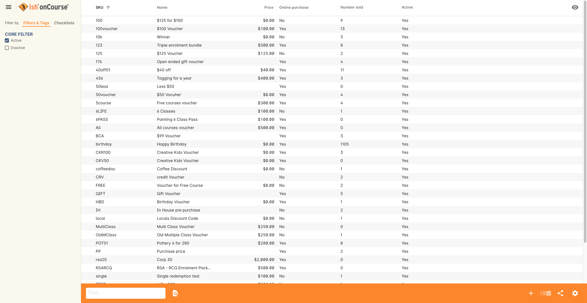
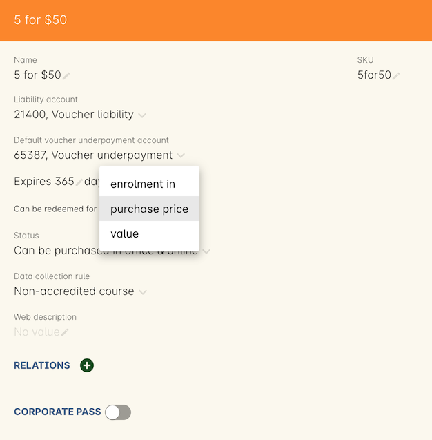
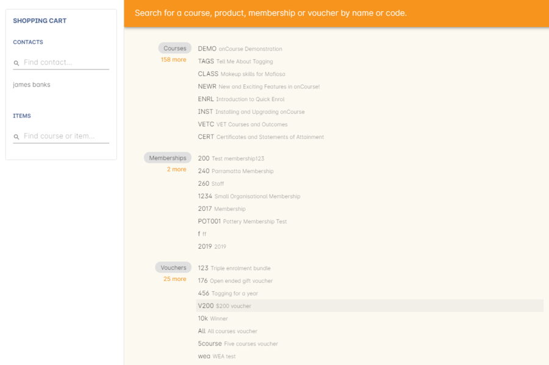
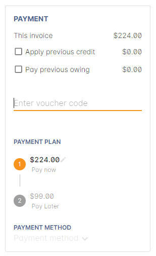
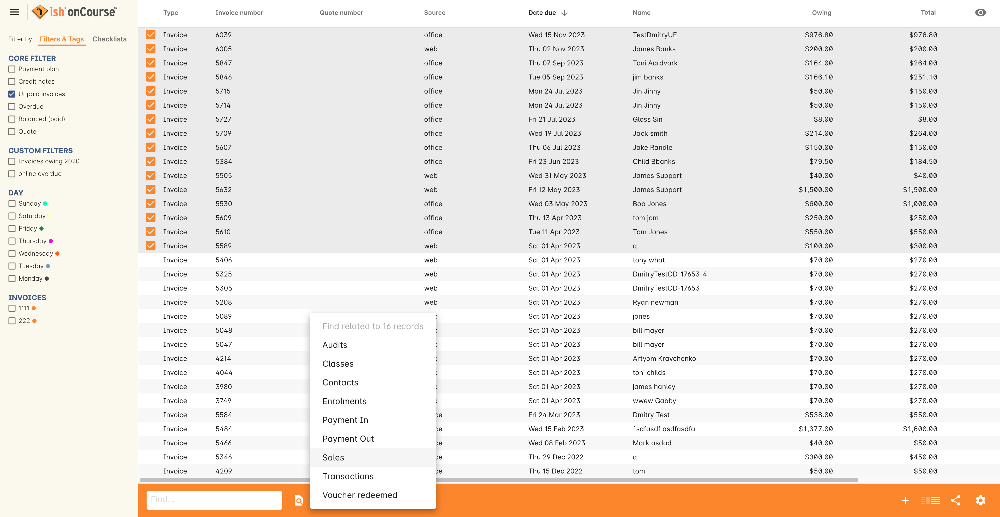
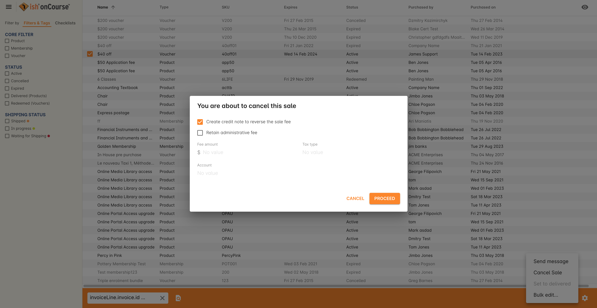
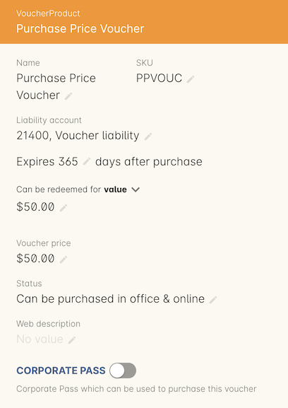

[[vouchers]]
== Vouchers

Voucher products can be created in onCourse, and then offered for sale either via the College website or through the office via checkout.
These vouchers can be gift certificates, a way to sell a bundle of enrolments as a set fee, or as a method of issuing a student with a credit, allowing them to apply that credit to an open or restricted range of courses.

. A voucher product for sale for a user specified dollar value.
The redemption value is the same as the purchase price and has a fixed redemption period e.g. 12 months.
This type of voucher is typically known as a gift certificate.
. A voucher product for sale for a different redemption price to the purchase price. e.g. purchase price $100, redemption value $120. This type of voucher can then be used as credit to purchase enrolments or other products.
. A voucher product offered for sale for a fixed fee, redeemable for a single enrolment in a course or set of courses.
. A voucher product offered for sale for a fixed fee and fixed number of enrolments from a set of one or more courses.
For example 4 enrolments from one course (a year's worth of enrolments in a course) or 4 enrolments in 4 courses (one enrolment in each of the four courses).
. A way to sell a bundle of enrolments to a company for a fixed fee, for their staff to enrol in a class of their choice from a course, e.g. 10 enrolments in your choice of classes for the course Computers for Beginners.
This type of voucher would send the invoice on redemption to the nominated company contact, rather than to the student.

[[vouchers-Definitions]]
=== onCourse Terms and Definitions

Voucher Type::
A voucher is a product which can be sold and later redeemed for other purchases or enrolments.
Vouchers can be redeemed for a monetary value or for a fixed number of enrolments in a set range of courses.
The voucher type describes how much the voucher costs to purchase, how long it is valid for and what it can be redeemed for.
Voucher::
Vouchers are the list of purchased voucher type products.
Vouchers can be purchased and redeemed through checkout.
This list shows who purchased the voucher, who it is redeemable by and what the remaining value of the voucher includes.
Every voucher has a unique code that must be quoted for redemption.

[[vouchers-Creating]]
=== Creating a voucher type

For most cases when a user wants to buy a voucher, they will nominate the price they wish to purchase the voucher for, and that the price will also be the redemption value of the voucher.
(Type 1) This type of voucher product will be created by default for all onCourse instances and be called "Gift certificate".
It will only be enabled if the College has the right license that enables this feature.

In addition, colleges can create other types of voucher products that are linked to enrolment permissions and these will have purchase prices fixed by the college.
Some of these types of voucher products may also be available for sale on the website.

A voucher may be sold as part of the existing QE process or it may be given away for free (sold with 100% discount).
Either way, an email is sent to the payer with the details of that voucher (not the student since it may be a gift, if the student and the payer are different people).

==== Navigating around the Voucher Types List View

To open the voucher type window you can either use the Dashboard favourites links, type 'Voucher Types' into the Find Anything search bar, or in the onCourse navigation menu under Products > Voucher Types.

[NOTE]
====
If a voucher passes the expiry date, the status is set to 'Expired' and the balance of the voucher purchase price is transferred from the Voucher Liability account to the Vouchers Expired income account.
Expired vouchers are greyed out in the voucher list and can't be redeemed and edited.
Their expiry date can not be changed.
====

To create a new voucher type simply click on the + icon in the bottom right hand side of the window and enter the information required.

[[voucherType-General]]
===== New voucher records

There are a number of fields in a voucher record.
They include:

* SKU - this refers to a stock-keeping unit, a unique identifier for each distinct product and service that can be purchased.
You can create whatever product code you want for any voucher.
* Name - allows you to name the voucher.
* Liability Account - allows you to choose the liability account you want the purchase price of the voucher to be deposited into until it is redeemed or expires
* Expiry date - this allows you to create a expiry date for the voucher from the date of purchase e.g. 365 days.
* Options for redemption - you can select whether you want the voucher to be able to be redeemed for an enrolment/s, for the purchased price or for different price.

View of a new voucher type record If you want the voucher to be able to be redeemed for a enrolment you can leave the drop down box as "enrolment in" as this is set as the default.
You will need to choose how many enrolments you want it to apply to in the text box below.
A voucher may allow for multiple enrolments in one course, an enrolment in choice of courses, or a mix of the two.

The section below this drop down box will change depending on the choice you make.
The range of fees for the selected courses is shown to help you discern the correct voucher price.

View of the voucher record if the option for redemption is left with the default option "enrolment in"

When you select 'enrolment in', switch on the Course button and then type in the name of the course/s you want to add.
The more you type the more refined the auto-completion choices will become.
To add a course from the list, click the 'add' button to the right of the course name.
Or you can click 'add all' to add all choice appearing in the selection window.

[NOTE]
====
If you want to apply a voucher to more than one specific course then you can add each course one by one using the first option "Course" making sure you select OK after each course added.
====

A standard 'Gift voucher' type of voucher is redeemed for it's purchase price.
You can choose this option from the drop down menu.
View if the option "purchase price" is selected from the drop down box

If you want it to be redeemed for a different price than the one purchased for then select "value" from the drop down menu and choose the amount it will be redeemed for.
This would usually be more than the purchase price, not less.View if the option "value" is selected from the drop down box

The last lot of fields on a voucher record let you set the rules of where the voucher can be purchased.
The choices allow for purchasing to be disabled entirely, purchased in the office, or purchased both in the office and online.
You can also add a more in depth description that will be displayed on the website (as long as both check boxes are selected) in the Web description field.

[[vouchers-Purchasing]]
=== Purchasing a voucher

Purchasing a voucher in onCourse is done through checkout window.
You can search for a voucher by either start typing in the Vouchers name or SKU in the 'Enter course or item' field on the left side of the page.
Alternatively you can click in the 'Enter course or item' field, then click on the 'Show all' button next to the word 'VOUCHERS' on the right side of the page.
Once you have found the voucher you want, click it and it will add to the cart.
You can then accept payment as usual.

[NOTE]
====
When a voucher is purchased it always gets sent to the payer just like the invoice does.
====

==== Purchasing a voucher on the web

You can find a list of vouchers on your website by putting /products on the end of your homepages URL. A voucher is purchased the same way as if you buying a course or product.

[[vouchers-Redemption]]
=== Redeeming a voucher

A student can redeem a voucher either via an office based enrolment in Checkout or by enrolling online themselves.
They will have to supply their voucher code which can be found in their voucher confirmation email.
A student can type in the voucher code in the payment window during an online enrolment or your staff can redeem the voucher for them during an office based enrolment.

For more information on the financial transactions that occur in the general ledger when a voucher is bought and sold, refer to <<accounting>>.

A voucher is a payment method against an invoice.

When you are trying to redeem a voucher in checkout:

. You have to firstly add the student/s, class/es or product/s as normal when enrolling a student
. In the bottom field on the left hand side, 'Enter voucher or promotion..', enter the voucher code that the student would have received by email.
+

. The voucher will attempt to validate automatically.
If valid, it will apply to the current checkout.
If not, an error will show.
. If the voucher has a different contact set as the 'Send invoice on redemption to' contact, then this contact will also be added to the cart and will be chosen as the payer.
This will not be able to be changed.
. The voucher will apply as much credit as possible to the invoice.
If there is a remainder then that credit will remain on the voucher for later use.
You cannot edit how much of the voucher to apply.
. Additional payments can be added if there is a difference between the voucher balance and the invoice balance, such as a credit card payment.
If the voucher is paying the amount in full, then the payment type will read 'No Payment' and the Pay Now amount will be $0.
+

. Continue the process as you normally would when enrolling someone through checkout

==== Investigating voucher redemption

On occasion, you may need to find a voucher that was redeemed in a sales process.
From either the Invoice, Enrolment or Payment In window, you can use the 'find related' function to go back to the voucher that was used during the sale.

Select the record you want to investigate with a single click in the list view and click on the 'Find related' icon and select the option 'Voucher redeemed'.
This will open a new list showing the voucher, or vouchers that we used as a payment method for the record.

==== Redeeming a voucher on the web

During the checkout stage of your website enrolment there is a field (as seen in the screenshot below) in the Summary section that allows you to enter a voucher code.
This field is available again on the payment page.
Enter the voucher code, click "Add Code' and it will redeem it against the value of the order if it is valid.
If the code is not valid then an error message will appear.

Additional payment methods will be requested during the final stages of the checkout process if the voucher doesn't cover the entire balance of the enrolment(s).

[NOTE]
====
When someone buys a voucher through the office they need to wait up to 15 minutes before they can redeem it online.
====

[[vouchers-General]]
=== Cancelling a Voucher

The cancellation process will check if any of the enrolments invoices were paid using a voucher.
If you cancel a class and then credit all the students, regardless of how they paid their enrolment fee value will be created as a credit note.

To cancel a voucher purchase, Go to the Sales window (can be accessed via the Dashboard highlight the selected record, click on the cog wheel, then select "Cancel voucher".
This process is similar to cancelling an enrolment, in that you have the option to provide a credit note during the cancellation process, or retain the fee paid.

A cancelled voucher can not be redeemed.

* Create credit note to reverse the voucher fee - this is checked by default, however if you wish to not create a credit note then uncheck this box and select Proceed.
Unchecking this option retains all the fee paid for the voucher for your business.
* Retain administrative fee - select this box as well if you want to deduct an admin fee from the credit note.
From here you can then choose the amount deducted, whether it includes GST and the account the retained fee is attributed to.

[NOTE]
====
It's your responsibility to note this message during cancellation and follow their own internal policies regarding voucher.
You can either use the credit to provide the student with a new voucher to the same or original value, or use the credit note for a standard transfer or refund.
For purchase price vouchers this will not be a problem, only fixed price vouchers that offer greater value or enrolment cluster vouchers.
====

==== Using a vouchers in place of credit notes

You may want to use vouchers in place of credit notes for a variety reasons:

. They remove credit note balances from your trade debtors account
. If unused by the student, they automatically expire after a fixed period of time to become income for your business, instead of remaining as a liability indefinitely
. They can be used to enrol online by anyone who has the voucher code e.g. the student can gift their credit to a friend by giving them the voucher code

To convert credit notes into gift vouchers, you first need to ensure you have a voucher type set up that can be purchased for a variable amount.

. Go to the menu Products > Voucher Types to open the list view
. Click on the + to create a new type of voucher
. Enter a SKU and voucher name.
Commonly, this type of voucher is called a 'Gift Voucher'
. By default, your vouchers will be set to expire a year after purchase (365 days).
Change this value if you wish.
. Select Can be redeemed for... 'Purchase Price'.
This will make all the other options on the general tab disappear.
. If you wish to sell this voucher on your website, go to the tab Web and check the option 'Can be purchased online'.
You may also wish to add a product description on this tab also
. Save and close your new voucher type

