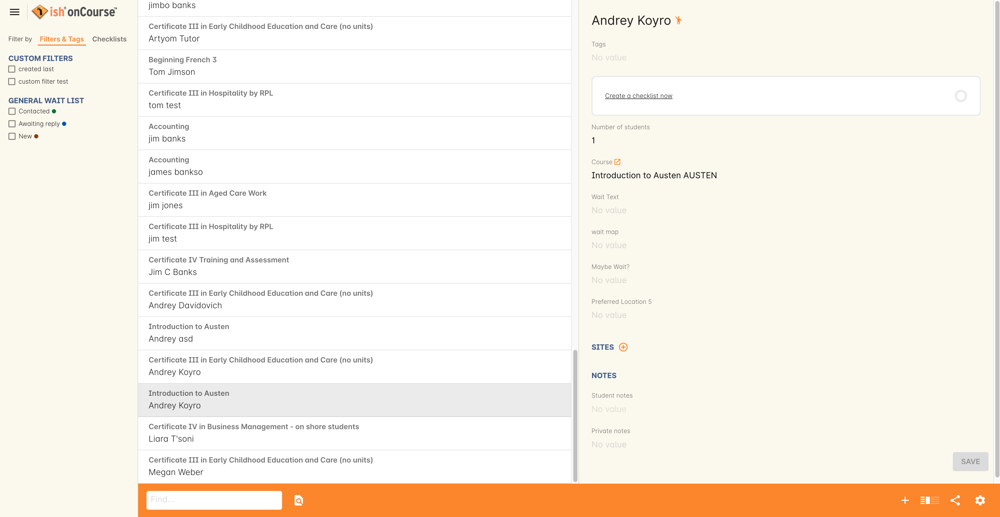
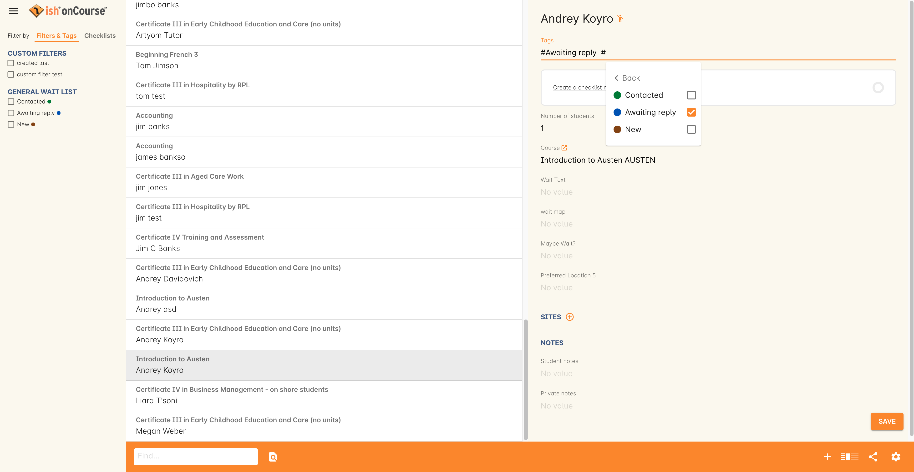
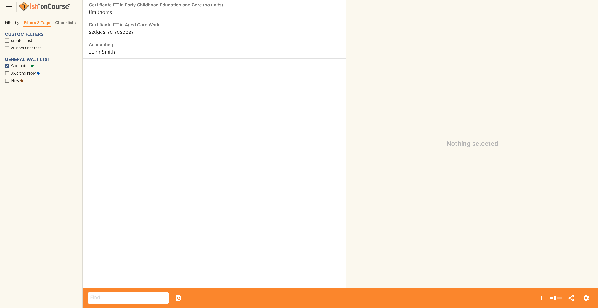
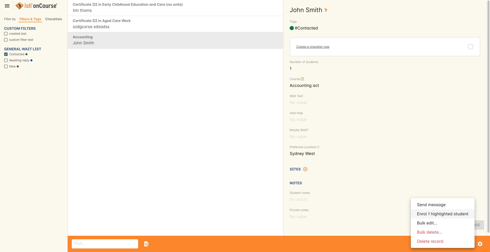

[[waitingLists]]
== Waiting Lists

=== Why use waiting lists

onCourse has three ways to obtain student data and interest in attending a course:

* _Waiting list_ - This is the least amount of commitment, akin to an expression of interest.
A wait list records the student contact details against the course they are interested in.
* _Application_ - A student applies for a course that is not open for direct enrolment, because an approval process is required.
A student can withdraw their application prior to enrolment.
* _Enrolment_ - Enrolment is a commitment to attend a specific class.
Often, enrolment requires payment of the enrolment fee to be confirmed.

Using waiting lists you can collect useful contact information from potential students, along with additional notes from the student about their enrolment preferences.

This information can then be used to plan for future classes and automatically or manually contact the potential students to advise them of class vacancies.

Waiting lists for courses without classes are a way to capture interest from potential students before committing to a class schedule.
For courses with classes, waiting lists can be useful to notify you if students would like to enrol, but can't attend at your advertised locations or times.

Waiting lists are always for a course, not a specific class from a course.

[[waitingLists-Enabling]]
=== Enabling waiting lists

In the onCourse client, by default each new course is set to allow waiting lists.
Each course can be individually disabled to prevent waiting lists as needed.

If, on the course general tab you have selected "Allows waiting lists" your students will see the wait list option on your website as part of the standard course description.

The wording of the wait list changes depending on the courses having classes available.
If there are no courses, the default waitlist wording is "This courses has no current classes.
Please join the waiting list."

If the courses has classes on the web, listed below all of the available classes is the text "If there isn't a class to suit you, please join the waiting list."

[[waitingLists-webSubscriptions]]
=== Student web subscription to waiting lists

When students click on the link in a course to the waiting list, they will be prompted to enter their contact details and any particulars about when and where they would prefer to attend a class for this course.

If students are new to your college, by adding themselves to the waiting list, a contact record for them will be created within onCourse.
If they are existing students, the information they provide will be added to their existing student record.

When a student is logged in to the student portal, they are able to manage their waiting list subscriptions, removing them from any courses they are no longer interested in.

[[waitingLists-Managing]]
=== Managing waiting lists within onCourse

Staff within your college can also add and remove students to waiting lists.
Students need to be set up as contacts before you can add them to a waiting list.

Go to the menu Activity and select Waiting lists.
This window will show you all the students currently on waiting lists for various courses.
You can add a student to the waiting list by clicking the plus + symbol.

In the general tab you can record the details about the student and the course, and select any venues they may particularly prefer.
On the notes page you can enter other details such as time of day, day or week or any other preferences.

From the waiting list window you can also remove students by clicking the minus - symbol.

In the contact record you can see if a student is on any waiting lists, and in the course record, you can see how many students are on the waiting list.

When a student enrols in a course they are on the waiting list for, their waiting list entry is automatically deleted.

[[waitingLists-tagging]]
=== Tagging Waiting Lists

Just like on other records you also have the ability to tag Waiting List record.
This allows you to build your own workflow tags for ideas like VET wait list/General Wait list, and have statuses such as New, Contacted, Awaiting reply etc.
Below is an example of a contact on the waiting list being tagged to 'Awaiting reply'.

Once you have tagged the contacts you will have the ability to filter them.
In the Waiting List list view below I have filtered all the contacts in the Waiting List who have been tagged to 'Awaiting reply'.

[[waitingLists-advisingStudents]]
=== Advising students on waiting lists that a class is available

There are three standard ways to contact students on waiting lists:

* _Automatic scheduled email reminders_ - You can enable a default script called 'Send waiting list reminder' which finds all for students who have been added to a waiting list, and sends them an email (template
- Waiting List reminder) every 7 days of the classes currently available for the courses they are on wait lists for.
If there are no classes currently available, they won't receive the automatic message.
* _Manual messages from a template_ - From the waiting list list view, you can choose a group of records you want to contact, and then from the cogwheel select 'send email from template' and choose the default template 'waiting list notification'.
This will send a template message to each student pointing them to the online enrolment process for the chosen course.
If you are going to use this message option, there should be at least one class with vacancies available published online first.
* _Manual messaging_ - From the waiting list list view, you can choose a group of records you want to contact, and then from the cogwheel select 'send message to xx contacts'.
This option allows you to write a manual email and/or SMS to the selected contacts.
More about using manual <<messages>>.

If you plan on using any of the onCourse default scripts or templates, please check the schedule and wording first, to ensure they meet your business requirements.

[[waitingLists-enrollingStudents]]
=== Enrolling students on waiting lists

When a student on a waiting list enrols in a class from the course they wait listed, their waiting list entry is automatically deleted.

You can also enrol a student directly from the waiting list by highlighting their entry and going to the cog wheel and choosing 'enrol'.
This will pre-populate the checkout window with the student's contact details and the course information, you just need to select which of the available classes they would like to enrol in.

Students can also choose to remove themselves from a waiting list via the onCourse student portal
