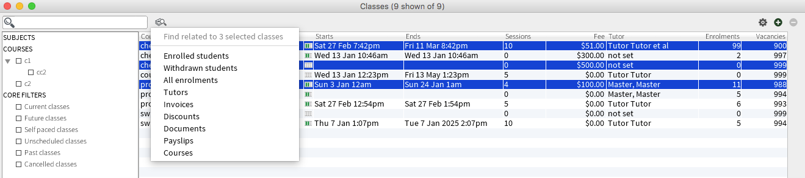

= Release 8.12
10 Mar 2016

== Major features

=== Find related record icon relocation

The find related records function in onCourse is such a regularly used
and powerful function of the onCourse application, that we have moved
this feature out of the cogwheel list and in to its very own own action
icon to make it more prominant. You can now access the 'Find related'
feature to the right of the search box in all onCourse list views. It's
icon looks like a magnifying glass hovering over a stack of papers.

=== Class cancellation notifications moved to script and email templates

When a class was cancelled in previous versions of onCourse, a window
opened asking if the user wanted to send a message to the students to
notify them, using a template that couldn't be easily customised. To
make this process consistant with other automated notifications, a new
script and email template set have been developed to replace this manual
message. Please review the new template called 'Enrolment cancellation'
and make the appropriate changes for your college before enabling this
script.

The new script 'Send enrolment cancellation' is disabled by default. If
you wish to use it at your college you will need to enable it. Please
note that enabling this script will automatically send the 'Enrolment
cancellation' email message to all enrolled students each time you
cancel a class. If this script is enabled this process will happen in
the background without the opportunity to review or disable the sending
of the message.

Another new script and email template pair have been added to notify
tutors when a class is cancelled, in the same way students are notified.
Review the script called 'Send tutor class cancellation' which is
disabled by default, and 'Tutor notice of class cancellation' email
template for any adjustments you wish to make before enabling this
script.

Note these scripts do not trigger when an enrolment is cancelled - only
when a class is cancelled.

== Reports and scripts

* A new template for Skill Set Statements of Attainment was added, that
will automatically print when a certificate record is set to be a full
Skill Set achievement `#25684`
* New scripts to allow integration with Cloud Assess LMS have been added
to onCourse. A self service API integration option will be added as part
of a future release. This early stage integration is to pass over
enrolment data from onCourse to create students and enrolments in Cloud
Assess. `#27605`

== Minor features

* Supress AVETMISS export field for enrolment moved from VET Fee Help
tab to General tab `#25396`
* Require self-hosted onCourse installations to upgrade to the previous
major version, before applying further updates. If you are not currently
runnning the latest onCourse 8.0 release before applying this upgrade,
you will be notified to upgrade to that version first. `#27472`
* Implementation of the add enrolment and cancel enrolment function from
inside the contact record using the + and - buttons on the education tab
`#27472`
* Add 'Send email from template' to the Contact list view. Note that
there are no current default email templates in onCourse that send to
contacts, however some users may have created their own email templates
they wish to send using this function `#27336`
* Add new student.portalLink functions that can be embedded in email
templates and scripts to allow students to by pass the login process to
access a specific and named resource `#27697`
* Collision detection in the room timetable view reinstated `#27404`

== Fixes

* Fix for exception in Quick Enrol that could occur when a fee or
payment amount contains a comma `#27523`
* Moved the CQR export from the certificate cogwheel and into the export
list to make it more consistent with other onCourse export processes
`#27277`
* Restored the functionality of opening related contacts from inside a
contact record with the 'open related' icon `#27539`
* Fix to voucher redemption process to update the redeemed value
immediately `#26126`
* Only display payment plan payment due dates on invoices that are fully
or partially unpaid `#27203`
* Ensure Certificates created with a retrospective Awarded On date are
collected in the AVETMISS NAT00130 export for their date range `#27452`
* Allow newly purchased vouchers to be redeemed immediately in Quick
Enrol `#27505`
* Ensure if 'export only VET courses' is selected in the AVETMISS export
runner, non VET Prior Learning records do not export `#27525`
* Fix to contact CSV export to export the student language name
correctly`#27574`
* Empty column removed from all onCourse default class rolls `#27586`
* Significant improvement to onCourse server memory usage when large
scripted emails queue to send `#27625`
* Remove from Banking Deposit display unsuccessful and reversed payment
types `#27664`
* Show negative values (Payments Out - refunds) in brackets in the
Banking Deposit list to clearly identify them `#27664`
* In the Banking Deposit window total, deduct payments out (refunds)
processed during the day from the total amount banked `#27664`
* Fix to record creation, saving and editing process while large message
batches are being created and updated `#27673`
* Prevent discounts attached to CorporatePass use from displaying or
being accessible in Quick Enrol `#27754`
* Prevent null pointer exception when a Quick Enrol process including a
payment plan invoice is unticked during the creation process `#27828`
* Prevent the shifting of outcome start and end dates when the onCourse
client and server are operating in different timezones `#27669`

== Web features

* An important change has been made to the student USI collection portal
to improve the quality of the data collected by RTOs. Contact data
mandatory for AVETMISS reporting that has not been supplied on
enrolment, such as Address, Suburb, Postcode and Date of Birth will be
requested in the first step. The second step now requests the students
complete the AVETMISS questions, with the USI as the third step.
`#27332`
* Addition of OpenGraph and Facebook Namespaces to HTML tag for all
default and custom website templates `#22081`
* Allow tag description content to be added to root tags and to render
on www.mysite.com/courses and www.mysite.com/subjects pages on the
website `#23330`

== Web fixes

* Fix to display the $ symbol when displaying the corporatePass discount
fees on the web `#27269`
* Fix to the user switching function inside the skillsOnCourse portal
which would not correctly lock/unlock the USI field when swapping
between contacts `#27583`
* Fix to the display of the 'loading more courses' icon at the bottom of
a course list page when visiting an onCourse website from an iOS device
`#26480`
* Allow CMS redirects for pages containing unique characters in the URL
such as % `#27054`
