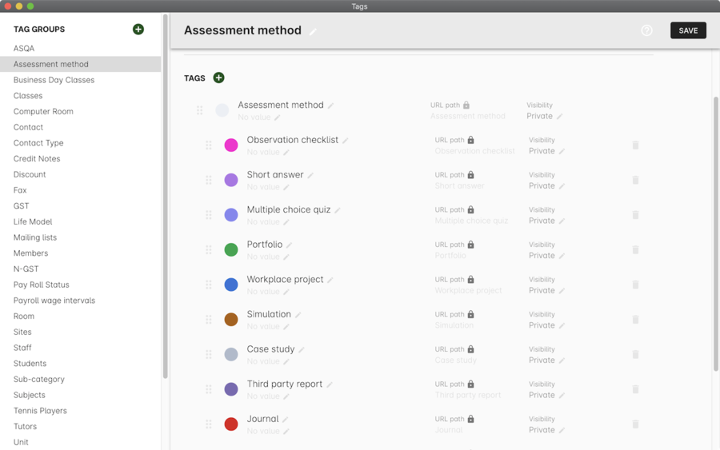

= Release 9.13
18 Aug 2019

== Important changes

As of this release, users of onCourse are _required to have an email
address_ against their user record in the system. Users who do not will
no longer be able to login until they have a valid email address against
their user record.

We've also begun to remove some older portions of the application that
are no longer in use, beginning with the AVETMISS 7 export window and
the old Scripts window. We've also removed the feature that could allow
you to freeze documents to a specific version.

== Major features

=== Tag colours

We have implemented a colour picker that will allow you to assign a hex
colour to any tag, which will help with visual identification of records
in across certain parts of the application.

=== New font

A change of the font used throughout the user interface. The new Inter
font is more readable and has some nice stylistic options for numbers
which makes them clearer.

=== New user interface

The new user interface has now been rolled out to the following areas:

* Certificates
* Voucher products
* Memberships
* Products
* Sales (product items)
* Messages
* Student Feedback
* Applications
* Invoices
* Discounts
* Payments In

=== Use of credit notes in online checkout

Students can now use any credit saved on their student records for
online checkout. When they make a purchase from your website, provided
they use the same first name, last name and email address as the record
that has the credit saved, that credit will automatically be applied to
the final total at checkout. Any credit not used will remain available
on their account for future use.

== Reports, Scripts & Exports

* Fixed an error where the banking deposit PDF report wasn't printing
`OD-13057`
* Fixed a Transaction report subreport so it stretches when details
overflow field size `OD-13068`
* Added a new historic aged debtors export to onCourse.
+
OD-13209

=== Minor features

* New Monochrome theme `OD-13198`
* Adjust Query Language grammar and model `OD-12150`
* Add survey link to enrolment confirmation email `OD-12164`
* Improved performance of database connector read ahead
+
OD-12542
* Implemented `fake paths` for AQL named queries with properties
`OD-12665`
* Implemented aliases for plural meaning in toMany relations `OD-12666`
* Implemented new AQL syntax `Curly brackets` - \{} `OD-12667`
* Implemented new AQL syntax `Square brackets` - [] `OD-12668`
* Added auto-completion to AQL `OD-12669`
* Waiting Lists on Dashboard will only show numbers from prior 4 weeks
`OD-12775`
* Invoices in Dashboard search will now order from newest first
`OD-12854`
* Improved AQL to work with negative numbers `OD-12871`
* Corporate Pass - Minor label changes `OD-12921`
* Added Canvas integration `OD-12949`
* Removed Training Packages from old UI `OD-12968`
* Added Print Certificates permissions and validation `OD-12980`
* Changed behavior and validations for Discount properties:
studentAgeUnder, studentAge `OD-12984`
* Made user email addresses mandatory `OD-13010`
* Remove document freezing feature. `OD-13038`
* Remove AVETMISS 7 `OD-13039`
* Remove Old scripts UI `OD-13040`
* Minor UI fixes. `OD-13048`
* Implemented AQL quick search (using ~) for Outcome entity `OD-13051`
* Added corresponding titles for Timetable `OD-13060`
* Updated integration logo - Cloud Assess `OD-13070`
* Added help button ('?') to Qualification, Module and Tutor Pay edit
views `OD-13079`
* Amended UI labels for ArticleProduct, MembershipProduct `OD-13098`
* Added course/class code to Canvas integration closure `OD-13109`
* Added custom filter creation to Timetable
* Added Micropower integration `OD-13134`
* Added additional validation logic to Vouchers. `OD-13143`
* Money displays with special monospaced font to make it easier to read
`OD-13159`
* Restyled sessions in Timetable `OD-13162`
* Added 'fake paths' for Timetable AQL `OD-13163`
* Added ability to restrict a discount to enrolments into same course
`OD-13166`
* Added 'Discount.limitPreviousEnrolment' field to replication
`OD-13168`
* Added tags for sessions on Timetable `OD-13179`
* Timetable layout update `OD-13183`
* Added colour coding for tags `OD-13186`
* Added colour picker for tags `OD-13187`
* Timetable now displays tags `OD-13188`
* Added ability to query for classes enrolment count to AQL `OD-6327`

=== Fixes

* AQL search: Error 500 occurs when quotation are used in conjunction
with logical operators `OD-12393`
* Lists: 3-column view. Records disappear for user after horizontal
scrolling in 2-column view
+
OD-13126
* VET certificate should now print with QR code enabled by default
`OD-13080`
* Added missing DSL method 'relatedFundingSource' to documentation
`OD-11968`
* Removed documentation for CertificateOutcome `OD-11983`
* Data upgrade and validation: duplicated DiscountCourseClass relations
`OD-12712`
* Fixed an error that stopped the onCourse demo login not working
`OD-12746`
* Banking Deposit window now shows payment status in new UI `OD-12880`
* Corporate Pass: Fixed an error where not all records were displayed in
printed PDF `OD-12901`
* Corporate Pass: Fixed an error where full list wasn't displayed in
Contact drop-down when searching `OD-12919`
* Fixed an error where searching in Corporate Pass only searched for
firstName `OD-12988`
* Fixed an error that was causing unnecessary lag in the Tags UI
`OD-12990`
* Advanced search: Fixed some issues with advanced search in new UI
windows `OD-13011`
* Dashboard: Fixed and issue where 'Last enrolment' text wrapped
incorrectly for courses with long names `OD-13021`
* Waiting Lists: Fixed an issue where student drop-down shows companies,
not students `OD-13036`
* Fixed an error where WaitingList_Site relation was not replicated when
made from new UI `OD-13045`
* Banking deposit: Fixed an error where UI wasn't showing all relevant
records `OD-13063`
* Fixed an issue where all edit views didn't have a dropdown from help
('?') button `OD-13065`
* Waiting Lists: Fixed an error where XML export failed if Waiting List
contains a site without longitude and latitude `OD-13066`
* Fixed an error in 'send certificate' scripts causing date issued to
display as null `OD-13069`
* Adjustments to quick search for Contact and Corporate Pass `OD-13077`
* Corporate pass: Fixed an error where different expiry dates were
displayed between record and list view `OD-13081`
* Sites/Rooms: Fixed an error that occurred when searching documents
attached to Sites or Rooms `OD-13084`
* Audit Logging - Fixed rendering issues when scrolling `OD-13086`
* Uneditable fields are no longer greyed out. Pencil icon distinguishes
what can be edited versus what can't `OD-13106`
* Contact type-ahead only activates after user types in at least 1
character `OD-13108`
* Deposit Banking: Fixed some styling issues `OD-13118`
* Fixed an error in preference URL constructions `OD-13123`
* Corporate pass: Fixed an error where 'null' was displayed in Contact
drop-down for companies `OD-13146`
* Fixed an error in Transactions default filtering that was broken after
AQL changes `OD-13147`
* Fixed an error that was stopping 'Largest waiting lists' on Dashboard
from working correctly `OD-13157`
* Fixed some server side errors that could stop the deleting of a record
`OD-13160`
* Fixed an error where Timetable AQL queries with 'enrolmentCount'
returned no sessions `OD-13173`
* Fixed an error where clicking on course name in Timetable logs out
user `OD-13193`

=== Web features

* Online product sales now allow student to select quantities of the
item to purchase, without any requirement of additional information.
This means students can now purchase online tickets, for example, and
not have to worry about providing contact details for every ticket
holder.
* Credit Notes are now used automatically on website checkout.
* Implemented some new behind-the-scenes features to provide increased
website security.
