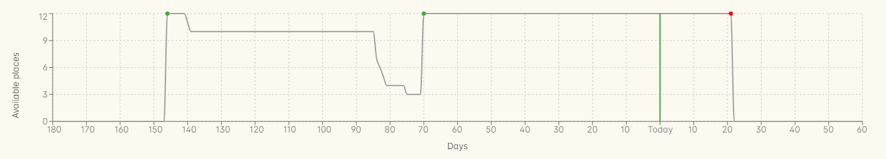

= Release 90
10 Jul. 2021

== Major features

=== Course places available graph

In our latest release we’ve included a new graph for course records, called ‘Places available’. This graph will show you a 180-day history of available places across all classes for this course, as well as a 60-day projection for future classes.

What’s this graph for? Its really a supply/demand analysis. The product stock you sell is comprised of places available across all your classes and you need to know when you’ll be running out of stock to sell. In this case, you can see that you’ll have nothing available for students to buy 20 days from now.

Think of places available as perishable stock. The tomatoes in your shop which go off the day the class commences. Every seat you fill before that date is almost pure profit since the marginal cost of delivering those seats is almost zero once you commit to running the class.

== Minor features
* Make it easier to add discounts to classes in a script `OD-16276`
* 'fee charged' field in Enrolments now collects all linked invoice lines, including refunds `OD-16291`

== Fixes
* Large email batch send could cause server crash `OD-16261`
* Cannot process a refund under certain circumstances `OD-16285`
* Script has problem setting date in query `OD-16288`
* Payment Plans not showing in correct order in checkout `OD-16293`
