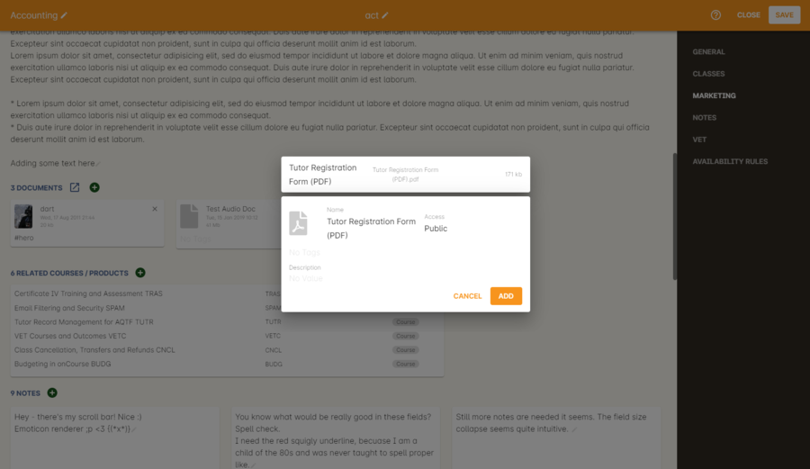
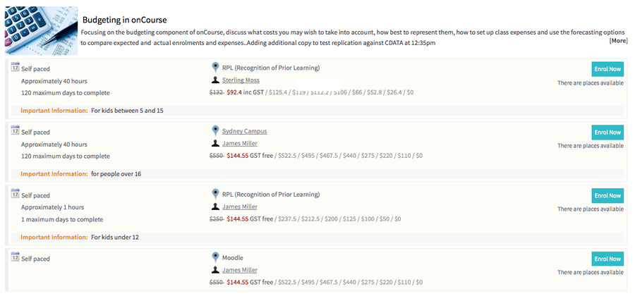
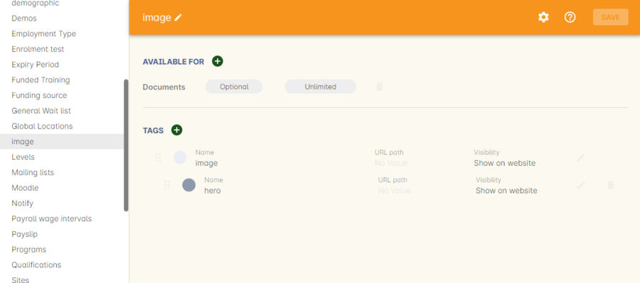
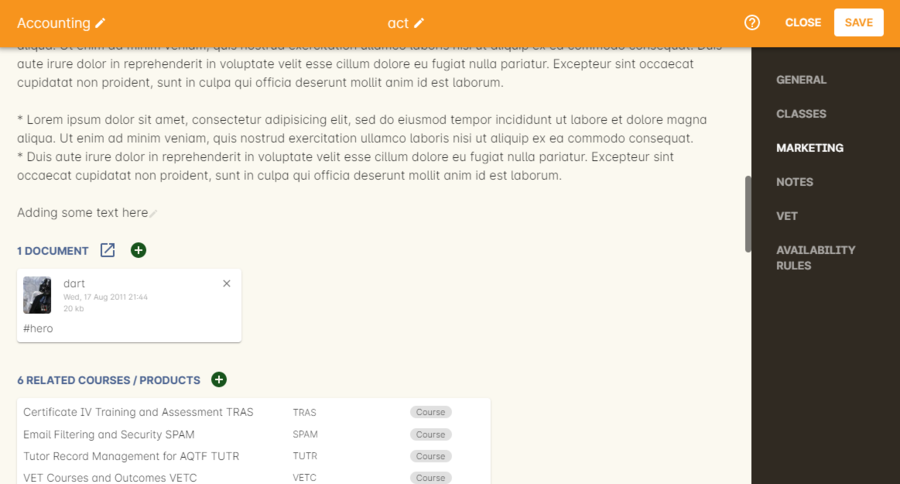

[[images_and_attachments]]
== Attaching images and documents

=== Adding files

onCourse provides an effortless way to display images and documents (for example JPG, PNG, GIF and PDF files) with your website.
Within onCourse you can add documents directly to the Documents section by navigating to the window and clicking the + button.

Alternatively, you can upload or link attachments directly from the edit view inside Course, Class, Tutor, Student, Site or many other places within onCourse.
This links the attachment directly to that resource.

[NOTE]
====
Once an attachment is uploaded via the Resources menu of onCourse, you can preview an image file by double clicking on any attachment entry in the list view.
PDF documents are not able to be previewed via this method.
====

==== Duplicate files

onCourse is clever enough to de-duplicate files when you upload them.
So if you add a 1Mb PDF to the system and then sometime later upload the same file again to onCourse, only one copy will be stored and linked to both places.
This reduces the size of your database.
In order for this to work, the two files must be absolutely identical.
The slightest difference and the two files will be both stored.

=== Displaying media online

If you wish to display attachments and images on your website, firstly make sure that you have the Security level set as Public in the document record inside onCourse.
Then you have several ways of showing content online, depending on where you want to display it.

==== Linked to specific pages

If you attach a document to a course and mark it as 'public' that attachment will be shown on the course description page.
This makes it very simple to add pictures or perhaps a PDF with further course information.
Remember that Google and other search engines will not do a good job with indexing content in Word, PDF or other formats.
So if you want the best exposure online and the best search engine results, put your course descriptions as text directly into the course description.

Attaching a PDF to the course can be useful for specific files such as a pre-enrolment questionnaire, additional information about course requirements, software exercise files, and so on.
Including these files is achieved exactly the same way as including an image on your page...
open the Course, click the Web tab and then the Plus sign to browse the files.
We recommend documents are uploaded as PDF as they can be universally accessed no matter what computer the student is running.

. Open the Course to which you wish to add the document to and scroll to the Documents section.
. Now simply click on the + button next to the Documents heading and type the name of the existing image or upload a new one by clicking the Browse button.
. Once the data updates online, the course detail page ( /course/ABC ) will now have your new document at the bottom.

. In onCourse open the Tutor record you wish to attach the image of.
. In the tutor record, click the blank head image in the top left of the window and select the image from your computer.
Click Save.
The image will now appear where the blank head image used to be.
. Provided there is text in the Resume field on their tutor record, the image will display on their tutor profile.

=== Adding thumbnail images

You have the ability to add thumbnail images to all your courses.
These will appear on your website on any courses list view page, so that's any URL that contains /courses after your domain name e.g. www.acme.com.au/courses or www.acme.com.au/courses/business/computing.

To enable this feature you will have to add the following code to the CourseItem.tml file:

....

....

substituting the words 'pixel width' and 'pixel height' for the correct dimensions.
So assuming the image you are adding is 200px x 200px then the code will be:

....

....

[NOTE]
====
The CourseItem.tml file can be found in WebDAV by going to templates ->
default -> CourseItem.tml.
====

You would then store the attached image you want to the course and making sure the pixel width and height is the same as the code in the CourseItem.tml and name them 'coursecode_1' e.g. ActingBeg_1.

=== Editing Course Hero Images in onCourse

You can use images you have uploaded into onCourse as hero images for a specific course.
To do so, you first need to add a snippet of code to your site's CourseItem.tml file.

[NOTE]
====
The CourseItem.tml file can be found in
https://www.ish.com.au/s/onCourse/doc/design/overview.html#d5e33[WebDAV]
by going to templates -> default -> CourseItem.tml.
====

This snippet is pasted below:

....
 

            

          

....

Open the CourseItem.tml in a text editing tool, like NotePad++ or Sublime, then copy and paste this code into the file somewhere out of the way.
Ensure that you set the name of the uploaded hero image in onCourse to x_hero, where 'x' is the course code of the course the image is intended for - e.g. for a Pottery course with the course code POT001, in onCourse you'd want to name the image POT001_hero.

You can edit the height and width values, but be aware that this may result in inconsistent results if the images you upload are all different szes to begin with.

=== Tagging images

You have the ability to display a different hero image on each course detail page.
These will appear on your website on any course detail pages e.g www.acme.com.au/course/accounting.

image::images/tagged_image_course_details.png[title='Tagged image displayed at the top of the Accounting course detail page']

You would then create a new tag group called 'image' and a tag inside that group. Call that tag 'hero'.

Once you have created this tag group and tag the next step would be to upload the images you want to tag to the document management system.

Once you have done this you will have to tag each of these images with the 'hero' tag.

To enable this feature you will have to add the following code to the CourseItem.tml file :

....
<t:loop source="getAttachments(courseItemModel.course)" value="attachment">
  <t:if test="hasTag(attachment, 'image/hero')">
    

  </t:if>
</t:loop>
....

Lastly you would go into each course you want these images to be displayed and add the document to the course record.
You do this by clicking the + button next to Documents heading and typing in the name of the image you've already added.
If the image isn't uploaded to onCourse yet, click Browse and search your local computer for it.
Remember to make sure the pixel width and height is the same as the code in the CourseItem.tml then tag them to the tag 'hero' in the tag group 'image'.

