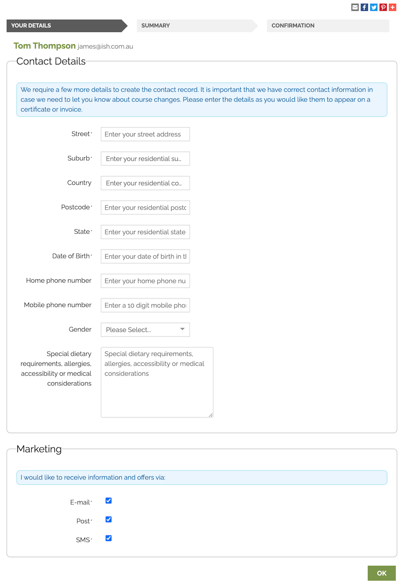
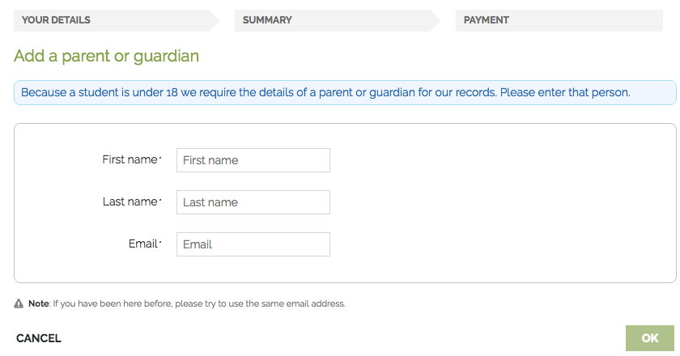
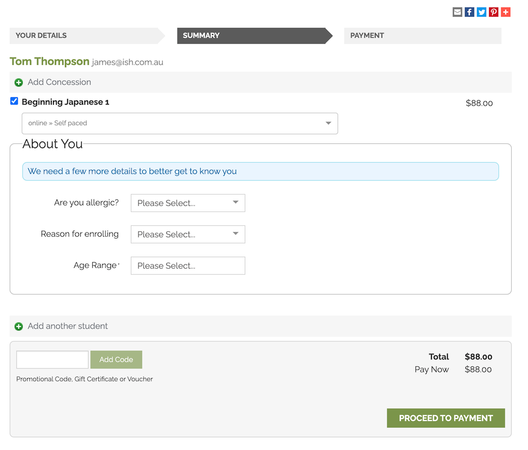
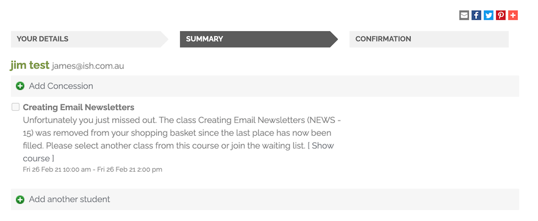
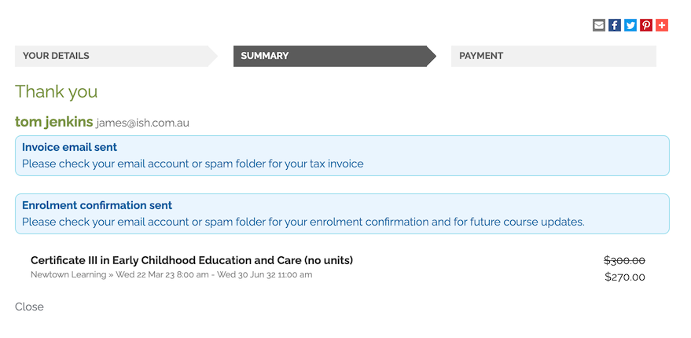
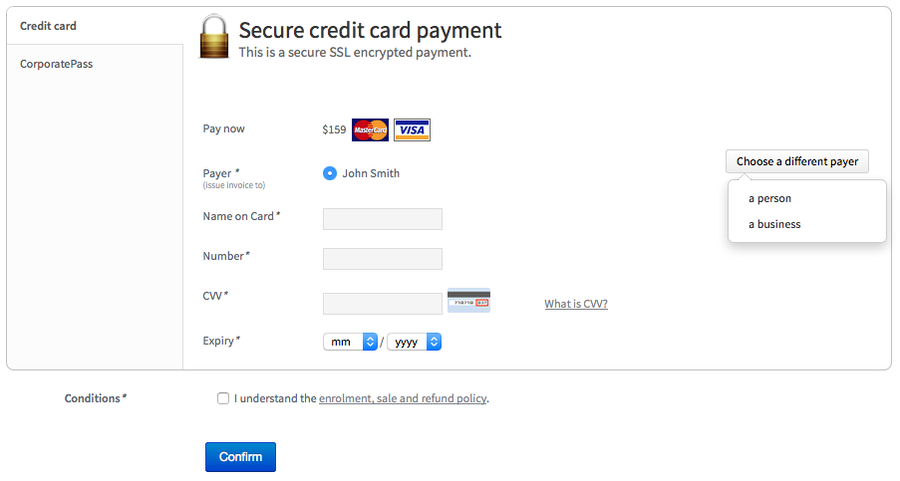

[[online_enrolments]]
== Checkout

onCourse has a password free purchasing process meaning that students don't have to remember obscure student identification details from their last enrolment, like a student number or a password they may have created some time ago. onCourse does everything possible to move the student quickly and simply through the enrolment process to secure their payment and commitment to the enrolment. Forcing a student to remember a old password will result in some loss of sales as students give up in frustration.

For this reason, onCourse errs on the side of sometimes creating duplicate student records rather than risking losing a sale. If you were running a banking website, then accurate identification might be critical. But here, we want to do everything to make it easy.

Where a student has enrolled previously they are identified by their contact details and can move immediately to the payment process. No information they have previously provided is exposed during this process.

[[online_enrolments-students]]
=== Adding a student

After a student has added classes, products or applications to their shopping basket and proceeded to checkout, they will see the page below. All the student needs to enter here is their first name, last name and email address. Based on an exact match of these three fields, this determines if they are a new student or a returning student.

Sometimes students will use a different name (through marriage or abbreviation). Sometimes they will change their email address. In these cases, onCourse will create a new student record which you might want to merge later.

image::images/your_details_page.png[title='Student details landing page']

[[online_enrolments-oldStudents]]
==== Previously enrolled students

If the student is already in onCourse then they will be matched and further questions might be skipped.

If, since their last contact with your you have made some additional fields mandatory for online enrolment, and they didn't previously supply this data, a page will be shown requesting these additional details be provided.

At no time are previously supplied details shown to the student.

image::images/returning_student_additional_info.png[title='What the student will see if additional details need to be obtained since the their last enrolment']

[[online_enrolments-newStudents]]
==== New students

If this is the first time the person is interacting with your college, after they have entered their first name, last name and email address it will take them to the next details page where more information can be added. All the fields on this page can be shown or hidden, or made mandatory using the Data Collection functionality of onCourse. In the example below the only question which is mandatory is their postcode which is marked with a '*' symbol.

If you have set a minimum age for enrolment, make sure the date of birth field in data collection is set to mandatory, or else they won't work. The Data Collection rules allow you to set up specific data to be collected for different courses, so if a student is enrolling in two courses, these requirements will be combined. In the Data Collection configuration you can specify field labels and help text.

If in onCourse, you allow concession details to be added online, there will also be a dropdown for the student to select from the list whether they have any concessions you accept, and if you require concession card details or an expiry date, these fields will also be required.

You can also include custom fields you've added to onCourse contact records into the online enrolment process. For example in the screenshot above the International Phone Field is a custom field being used in the data collection rules. You can learn more about data collection rules in onCourse in our <<dataCollection, data collection chapter>>, and custom fields in our <<generalPrefs-customFields, Preferences chapter>>.

[[online_enrolments-additionalStudents]]
==== Adding another student

Once a student has entered all their details they will be directed to a summary page. In this page they have the option of adding another contact/student to this order. The button can be found below the class/es that are being enrolled in and above the field where they can add a promotional code.

If they click on it then it will take them back to the 'YOUR DETAILS' page allowing them to enter the additional students' first name, last name and email address. They will also need to complete the responses for any fields you have deemed mandatory.

image::images/adding_another_student.png[title='Add another student button']

By default, second and subsequent students added to the online enrolment process will also have the enrolment option selected for the same classes as the first student. These can be unchecked.

image::images/multiple_students_enrolling.png[title='Multiple student enrolling in multiple classes']

[[online_enrolments-parentGuardian]]
=== Parent or Guardian

Within the Editor settings you can specify an age under which all enrolments will require parent or guardian contact details e.g. for students under 18. We recommend that you also make the date of birth field mandatory for your system. In the example below, student Manual Child is trying to enrol in a course named 'Internal', however since they are under 18 years of age they will have to enter their Parent/Guardian details first by clicking the 'Add Guardian' button.

image::images/parent_guardian1.png[title='The Summary page displaying the 'Add Guardian' button']

If the student has enrolled before and already has a parent/guardian contact related to them in onCourse, then this information will not be requested, and the 'Proceed to Payment' button will show.

Until a Parent or Guardian's details are supplied, there is no option to proceed to the payment screen. Clicking the 'Add Guardian' button directs to the Add a Parent or Guardian page, along with the following callout message; "Because a student is under 18 we require the details of a parent or guardian for our records. Please enter that person." As per adding all other contacts, if their details are already in onCourse, then only a first name, last name and email address are needed to identify them.

Once the guardian or parent's details have been captured the user will be returned to the Summary page, which will show both the child's name and the parent's, along with a short description next to the child's name of their relationship with the defined guardian.

Next to the relationship description there is also a Change button which, when clicked, takes the user back to the Add a Parent or Guardian page where the user can add a different Parent/Guardian.

image::images/parent_proceed_payment.png[title='Summary page after the student has added their parent or guardian's details and can proceed to payment']

[[online_enrolments-summary]]
=== Summary

Once a student has entered all their details they will be directed to a summary page.

This page includes the following information:

* Full name and Email Address of the student/s enrolling or paying
* Classes they are enrolling in and products they are purchasing
* Price before and after discount of each class along with a total at the bottom right of the page
* A option to add another student (please see the section above called 'Enrolling an additional student' for more information)
* If the student is purchasing a product, a field to choose the quantity of the product they're purchasing

The student can adjust the details, including changing the class they are enrolling in (if there's more than one to pick from) and then proceed to the payment page by clicking on the 'Proceed to Payment' button at the bottom of the page.

[[online_enrolments-terms]]
=== Terms and conditions

Anyone completing a transaction via the checkout, regardless of whether payment is being made or not, MUST tick the terms and conditions checkbox at the top of the Payment page before continuing. The payment section will not open or display, and the user will not be able to continue until this checkbox is ticked.

[[online_enrolments-confirmation]]
=== Payment and confirmation

After the student has clicked on the 'Finalise checkout' button at the bottom of the PAYMENT page, then they will be directed to a confirmation page with a message informing them that their online enrolment was either successful or rejected.

If the student is paying by credit card, this is the point where their card details are verified with the bank as being correct and having sufficient funds available.

At this point, onCourse also verifies there is still a place available in the class. If between the student commencing and completing the online enrolment process, the last place has been booked by another student, the enrolment process will fail at this point. Their credit card will not be billed. You will see the enrolment attempt and failure in onCourse, so you can follow them up if they don't successfully complete the enrolment.

If the enrolment and payment were successful, at the bottom of the page there will be a continue button. If you've created a post enrolment page in the configuration, they will be redirected there, if not they will be re-directed to the courses list page.

If the student's enrolment goes through successfully and their credit card is accepted they will see a page similar to the screenshot shown below.

If the credit card is not accepted the student will see a page similar to the screenshot shown below explaining what they may need to check or correct. At this point the student can try again or abandon their enrolment.

Abandoned enrolments are shown as 'failed' enrolments in onCourse.

image::images/credit_card_failed.png[title='What the student sees if their credit card has been rejected']

After a successful online enrolment process, the payer of the invoice will be emailed a tax invoice, and each of the successfully enrolled students will be emailed an enrolment confirmation. If the student is enrolling and paying for themselves, then they will receive both emails.

These automatic emails are sent based on your customisable invoice and enrolment confirmation email templates in onCourse.

[[payment_options]]
== Payment options

onCourse allows for a range of payment options for enrolling students. Students can pay for multiple classes and multiple students in a single credit card transaction, or choose to send the invoice to an approved third party, like their employer.

onCourse eCommerce doesn't handle only enrolments in classes; it also includes product, memberships and gift voucher sales allowing you to diversify your business and the way people can buy and share your products.

=== Credit card

Real-time credit card processing ensures that successful enrolments are only made when the money is in your bank account. On the Payment page the student will need to select the terms and conditions checkbox, then they can enter their credit card details and click on the 'Confirm purchase' button to complete the order.

The credit card is captured by onCourse over an SSL encrypted connection. The full card number and CVV are never stored for online payments, only passed directly to the banking system, so in the unlikely event of a security breach there are technically no stored card details for anyone to steal. The user should expect a response in about 5-10 seconds, and during this time the enrolment is put on hold, preventing someone else taking the last place available in a class.

Should the payment fail due to insufficient funds or some other problem, onCourse will retain the transaction history as an invoice, a failed payment, and a credit note reversing out the invoice. We encourage you to regularly review failed payments in your system and follow up with the user to offer them alternative payment means.

=== Corporate Pass

Corporate Pass gives approved users the ability to invoice their employer, or another approved third party, on enrolment. This allows you to create an ongoing training approval process with your corporate customers, but still allow their staff to select the training timetables, or classes, to suit themselves.

You can view, edit, create or disable a Corporate Pass within the Corporate Pass window. Once you have clicked on the Corporate Pass button a window will pop up with a list of current and expired (if you check the filter in the left column) Corporate Passes created.

You can view an existing Corporate Pass by double clicking on a record, or alternatively create one by click on the '+' symbol.

To pay using a CorporatePass during the online enrolment process the student has to click on the CorporatePass tab on the left side of the 'PAYMENT' page. The student then enters the CorporatePass code that has been supplied by their employer (this code can also be found in onCourse).

image::images/corporate_pass.png[title='Using a CorporatePass code to complete an online enrolment without the need of a payment at that time']

Once the student has submitted a valid Corporate Pass code they will see a message confirming that the code they have used is valid.
They will also be given an option to add a reference like a purchase order ID for this transaction that will be included on the invoice sent to their employer.

Once the student has chosen or not to enter a reference; marked the 'Conditions' checked; and clicked on the button 'Confirm enrolment' they will be directed to a page informing them the enrolment and payment via Corporate Pass was successful as shown below.

image::images/corporatepass_confirmation.png[title='CorporatePass confirmation page']

=== Pay Later

If you are using Payment Plans to offer a deferred payment for a course to newly enrolled students, when someone goes to enrol into one of these courses online, the online checkout will offer a 'Pay Later' option. It will appear as a tab on the payment page, just like 'Credit Card' and 'Corporate Pass'. If the user selects this tab, the Pay Now field will show $0. If they select either the Credit Card or Corporate Pass tab, the full price of the course will display. The user can also change the 'Pay Now' field to $0 and the 'Pay Later' tab will be automatically selected.

When using 'Pay Later' the user will be able to select to 'choose a different payer' by selecting the 'choose a different payer' button.

=== Vouchers and Gift Certificates

Vouchers are much more than a simple gift voucher. They can be used to sell training in flexible groups whether it be a sampler of arts courses or OH&S training for 20 co-workers.

image::images/add_code.png[title='Adding a Voucher or Gift Certificate to pay for an online enrolment/s']

If a student provides a valid voucher code during the enrolment process, then this will reduce the fee payable, possibly to zero on the final payment tab. Voucher codes can be added on either the summary or payment tab.

=== Discounts and Promotional Codes

A range of flexible discounting and promotional code tools allow for students to access your special enrolment rates right up until the point of payment. More information on discounts and promotional codes can be found in the Discount section of the main manual.

image::images/discounted_class.png[title='Cost before and after discount for individual classes']

The total cost breakdown will include how much the class/es have been discounted by. In the case below the class has been discounted by $51.01.

=== Concessions

Some colleges have created concession types that users can self select as part of the online enrolment process. Usually, selecting a concession type during the online enrolment process will then discount the enrolment fee payable.

Some types of concessions that provide discounts may only be available via a pre-approval process at the college e.g. the college has to add the concession to the student record, it can't be added online by the student. In these cases, the applicable concession fee for enrolment will apply automatically during the online enrolment process without the user having to select anything.

If self identified concessions can be added during an online enrolment, then you will see a '+' symbol with text 'Add Concession' below the students name and email address.

Once you have clicked on the 'Add Concession' button you will be directed to the following page, as shown below.

=== Credit

If a student has credit available on their onCourse contact record from a credit note, the next time they make a purchase online, be it for an enrolment, products or anything else available on your site, the credit on their account will be automatically applied to their sale total at checkout.

The credit amount cannot be altered; the transaction will always use the full amount of credit available. Any remaining credit left over will still be available for the customer to use on future transactions.

image::images/credit_online.png[title='The 'Previous credit' line shows the amount of credit available for the transaction']
