[[editor]]
== onCourse CMS - Editor

[[editorIntroduction]]
=== Introduction

The onCourse Editor is your platform to create, manage and distribute information to your website.
Editor is a Content Management System (CMS) that provides simple but powerful tools to manage the structure and content of your website in a collaborative environment.

[[editorAccess]]
==== Access to the Editor

Before you start editing content within the Editor you need to set up a user name and password to log in.

onCourse enables any user to also have the ability to log into and edit content within the Editor using the same log in credentials that you use to access onCourse . To do this go to the Security window in onCourse, click on the user in the left-hand column, then ensure they have 'Can access #editor' switched on in their user record.

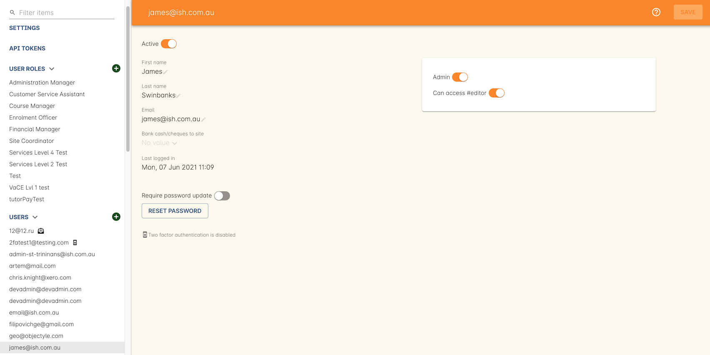

[[editorLoggingIn]]
==== Logging In

Access the editor by visiting your website and adding `#editor` at the end of the url.
For example, if your website url is
`http://www.acme.com.au` the editor can be accessed at
`http://www.acme.com.au#editor`.

Log in using your email address.

[[editorView]]
==== The Editor View

Once logged in, a toolbar is visible to the left hand side of the window.
You can continue to browse through your site as normal while logged into the Editor.

On the toolbar, you can see icons that allows you to quickly access the primary areas of the Editor.
At the bottom of the toolbar, there is an option to publish any changes you've made.
This will push all your changes to the production servers, so they are visible to everyone.

While you are logged into the editor you are looking at a draft version of the site which cannot be seen by anyone not also logged into the editor.
Changes you make with webDAV (static files, images, javascript, css, etc) are also only visible while logged in to the editor, until you publish the site.

Navigate through the Editor by using the icons on the toolbar.
These icons allow you to access different areas of the Editor quickly.

Site::

 +
Returns you to viewing your website.
All changes made in the Editor (and not published) will be visible until you log out.
Content::
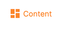
 +
Allows you to edit the Blocks, Pages and Menus that appear on your site
Settings::
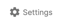
 +
Allows you to manage how your website and portal display information.
Design::
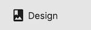
 +
Allows for the themes of the website to be edited

[[editorContent]]
=== Editing Content

Click the Content icon to see the editor for Blocks, Pages and Themes.
These three components make up the structure of the website.

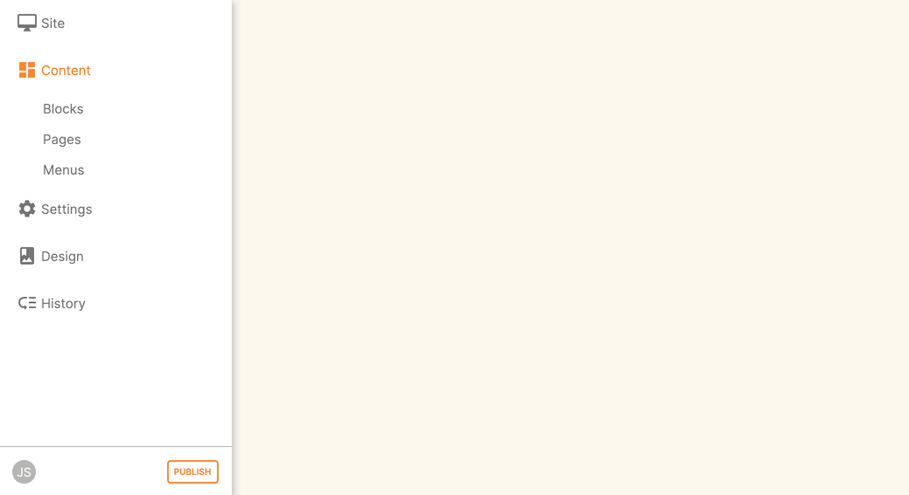

[[editorBlocks]]
==== Blocks

Blocks are re-usable snippets of text, pictures, rich text markup, etc.
If you wanted to add a banner on every page of your website, or an area on different pages dedicated to a contact form, blocks are ideal.
Even if you only use them once, they are a convenient way to break apart complicated pages into easy to edit pieces.

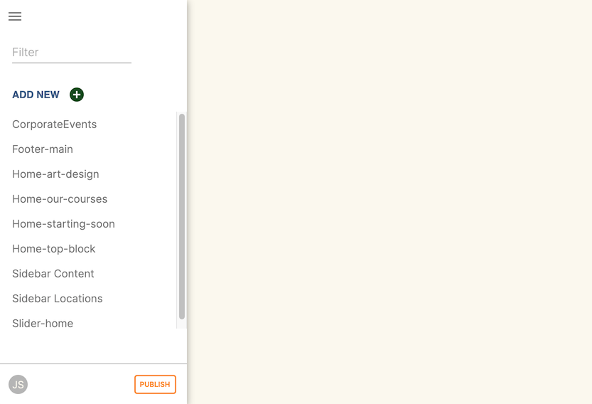

===== Editing a block

Selecting a block takes you to the Editor page for that specific block.
Here, you can change the name of the block and edit the contents.
On the right hand side of the screen you see a preview of what the block will look like on your website.

Click on the block contents to open the block in a text editor view.
Enter your rich text or html to be added to the block and click save.
This closes the text editor and renders your changes for you to review.

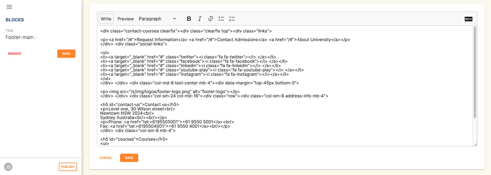

You can navigate back to the Blocks page by clicking the title of the block in the top right hand corner.

===== Creating a new block

You can create a new Block from the Block view by clicking on 'ADD NEW'.
You will have to give your new block a name in the 'Title' field, as well as some rich text or HTML in the content field do the right.
Remember that renaming a block might break places you have embedded that block using rich text.

Once you are happy with your new block, save it by hitting the blue 'SAVE' button.
If you wish to discard the new block, hit the red 'REMOVE' button.

[[editorPages]]
==== Pages

Many pages on your website are automatically generated from onCourse.
These pages include:

* /courses
* /courses/arts/photography
* /course/ABC
* /sites
* /tutor/123
* /site/234
* /checkout

Pages not automatically generated from onCourse can be created in the Editor.
The Pages view shows a list of all the static pages in your website and gives you quick access to search for, edit and delete pages.
Similar to the Block view, clicking on a Page will open text editor.

===== Editing existing pages

From the Content menu, select Pages to get a list of all static pages on your site.

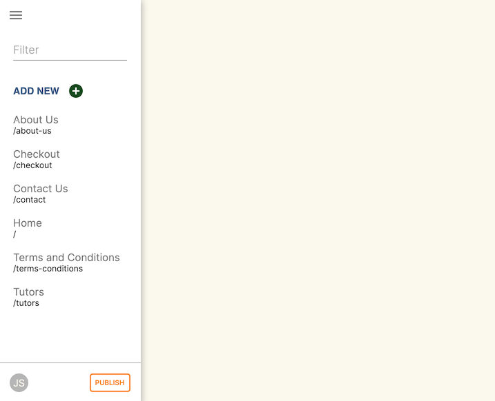

When a specific page is selected the editor allows you to change the theme that is applied to this page, the page name, as well as editing the content.
You can also select whether any given page is 'visible'.
The page title will be visible in the window title of the user's browser.
Every page will be given an automatic URL like /page/5 however you may wish to give it an easier to use URLs like /terms or /about/contact-us.
You can even give a page multiple URLs which will all work to display the same page to the user.
Only one of the pages will be 'canonical', and the others will redirect to it.

You can also select to have a page omitted from the site map.
Hiding a page from the sitemap will make it invisible to web crawlers and search engines.

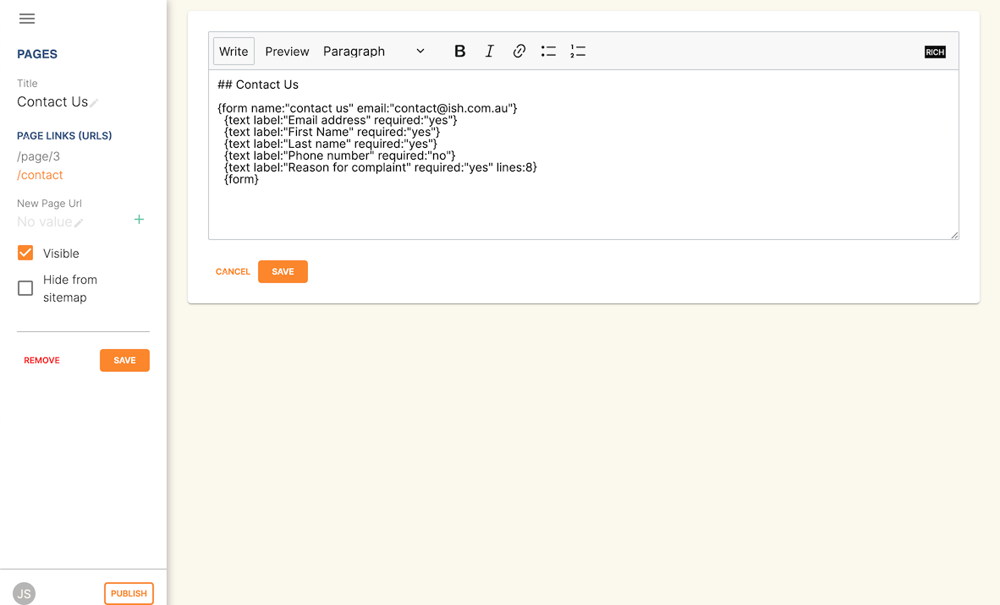

===== Create new pages

Click the 'ADD NEW' button to create a new blank page.
Here you can edit the pages Title, the pages URL as well as the theme that is applied to this page.
You can also toggle if the new page is visible.
Clicking the 'Sample content' will open the page in the text editor to be edited.

Once you have finished creating your new page, you will have to save it by hitting the blue 'SAVE' button or discard your changes by the red 'REMOVE' button.

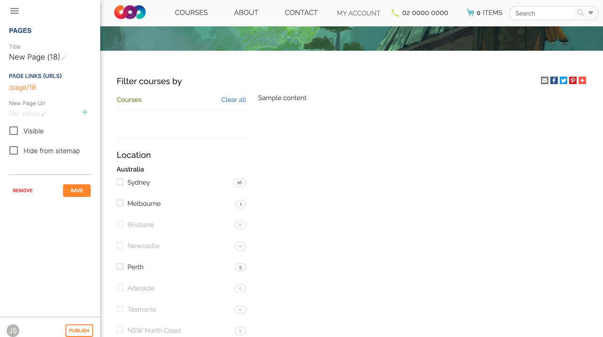

[[editorMenus]]
==== Menus

From the Content view, the primary header navigation can be edited from 'Menus'.

Most websites have a primary navigation menu which users will use to find their way around.
In Menu's you can add new menu items, and link them to particular pages or external URLs.

===== Edit an existing menu item

Click on a menu name to edit it.
The menu name is as shown on your website.

Click, hold and drag the menu items into a different order or nest them within other menu items.

Click to edit the URL, that is, the page to which the menu links.
Ensure this matches the page name exactly.
If it doens't, it won't work as you expect.

Menus exist in a hierarchy.
Clicking, holding and drag a menu item to reorder the menu.
Clicking and dragging a menu item on top of, and to the right of another will nest the menu item and make it a submenu item.

===== Add a new menu item

Clicking 'ADD NEW ITEM' will create a new menu item with no URL. This menu item will appear as the top menu level and will not link to any page.

A menu item can be deleted by clicking the red 'REMOVE' button to the right of each menu item.

Once you are happy with your changes, you can save them by clicking the blue 'SAVE' button.

[[editorSettings]]
=== Settings

The editor allows you to manage a number of different aspects of how the website and portal display information.
This includes determining what information can be viewed through the SkillsonCourse portal, general website settings, any checkout settings or preferences and the site's 301 redirects.

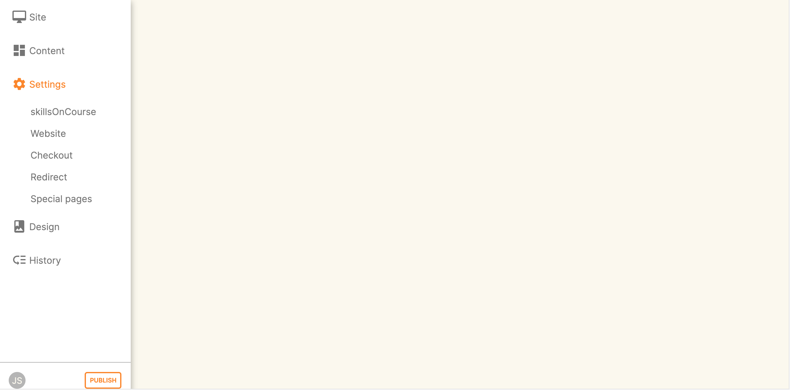

[[editorSkillsOnCourse]]
==== SkillsOnCourse

The SkillsonCourse Settings page allows you to manage the amount of information that is able to Tutors in the SkillsonCourse portal.

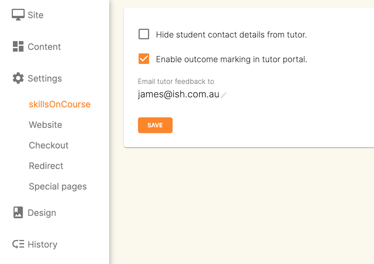

*Hide student contact details from tutor*: When a tutor is viewing the class roll via the SkillsonCourse, you can determine whether you want them to be able to view the email address, phone numbers of each student listed on the class roll.
Please note that it is not possible to not display the contact details for one class, but display it for another, as this setting is universally applied.

The below SkillsonCourse portal view shows the student contact details displayed within the class roll.
By specifying that you do not want the contact details to be displayed, this class list would simply show as a list of student names.

image::images/cms_set_portal_info_display.png[]

[[editorWebsite]]
==== Website Settings

The website settings page gives a few different options on how things are displayed on the website.

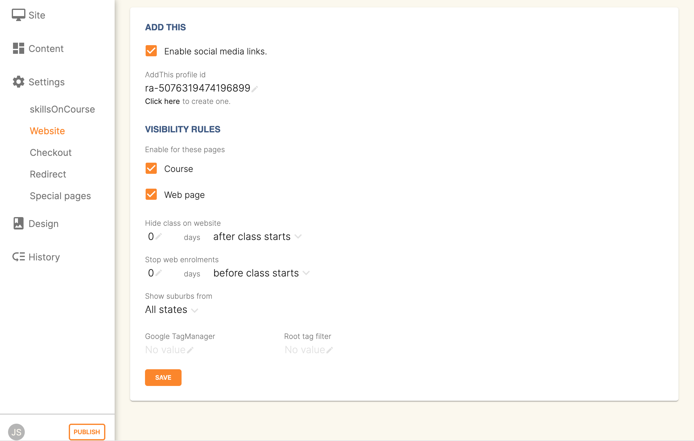

*Add This* is a powerful social media linking tool that enables you to insert social media links into your web pages, as well as giving you access to analytical tools to gain insight into your audience.

Add This accounts are free and the first step is to create a new account.
Do this by clicking the 'Click here' link.
Set up your account including specifying which social media links you wish to display on your website, the size and format of those links, as well as the free analytics tools that are part of your account set up.

Once complete, insert the Add This id into the field provided.
You can choose what pages the Add This! buttons appear on by ticking the 'Course' or 'Web Page' boxes below the Add This! field.

Add This also gives you a snippet of HTML to put into your site.
You can put this HTML snippet into a page or block manually.

[source,html]
----
<!-- AddThis Button BEGIN -->

    
    
    
    
    
    

<
!-- AddThis Button END-->

----

If you insert the social media links to your course information, it displays as follows.

*Hide Classes on Website/Stop web enrolments* Here you can set classes to hide or stop taking enrolments automatically after some threshold is passed.
For examples, after a class starts, before a class starts after a class ends or beforea class ends.

*Show Suburbs from* The 'Show suburbs from' dropdown allows you to filter out suburbs being returned in the site search.
For example, when entering the search query 'Newtown', with 'Show suburbs from' set to 'All states' the advanced search will return classes from:

* NEWTOWN, 2042
* NEWTOWN, 3220
* NEWTOWN, 3351
* NEWTOWN, 4305
* NEWTOWN, 4350

Setting 'Show suburbs from' to NSW will just return:

* NEWTOWN, 2042

Once you have finished changing your website settings, hit 'SAVE' to apply them.

[[editorRedirect]]
==== Redirects

The redirect settings allow you to create 301 redirects to your website by entering the path in the field on the left (starting with '/') and the destination in the field on the right (either starting with '/' for another local page or starting with http/https for redirecting to another website)

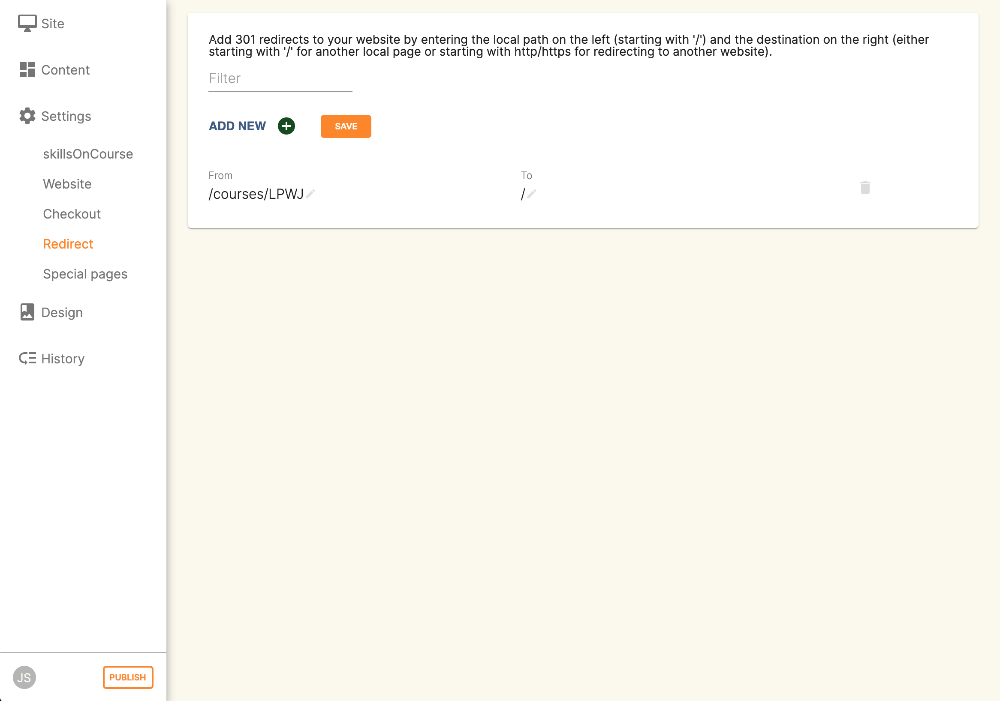

==== Editing an existing redirect

You can edit an existing redirect by changing the *From* and *To* parameters.

==== Adding a new redirect

Clicking 'ADD NEW' creates a new redirect at the bottom of the redirects, with blank *From* and *To* parameters.

Once you have finished editing the list of redirects, click 'SAVE' to add the redirects to your site.

[[editorDesign]]
=== Design

The Design menu lets you edit the Themes applied to your onCourse website.

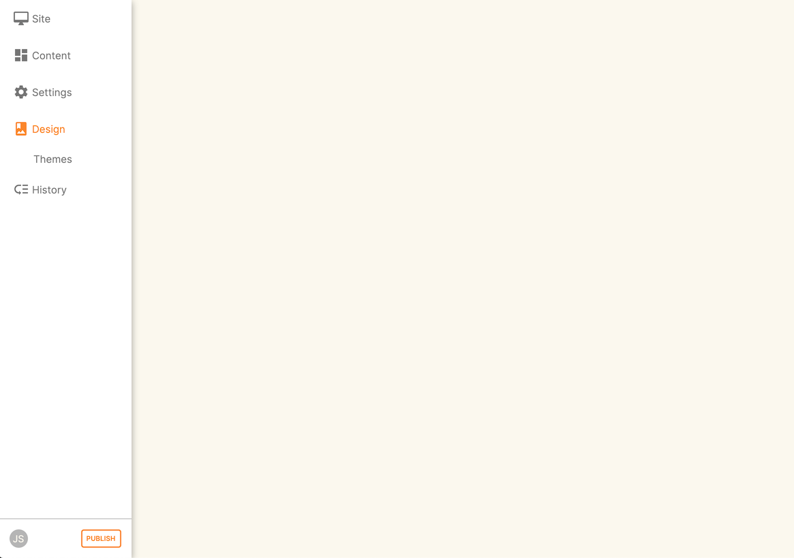

[[Theme]]
==== Themes

Themes are a way to describe a page structure made up by a number of blocks and is a design layout created for you by your designer.
There will always be a layout called "default".
If you want different parts of your site to have very different looks, ask your designer to create alternative layouts for you to use.

Each theme can have a number of blocks arranged in any way you choose.
There are five regions available:

* header
* left
* content
* right
* footer

Each region can contain one or more blocks which you click and drag from the right hand side 'Blocks' area.
To remove a block, click and drag it back into the list of unused blocks on the right.
Order the blocks on the page by clicking and dragging them into position.

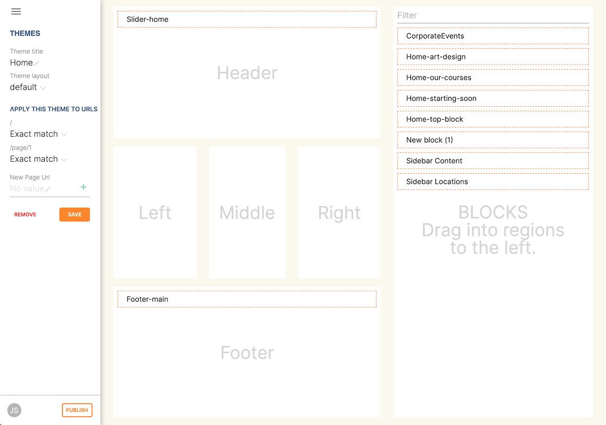

[[editorHistory]]
=== History

The History menu displays the most recent reversions of your site, the date this reversion of the site was publish and who published each reversion.

You can also see the current version of your site and have the option to publish recent changes from this page.

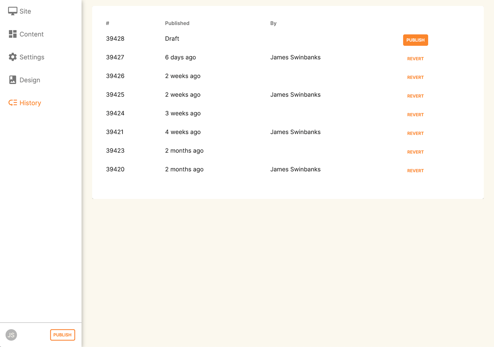

[[editorRevertingChanges]]
==== Reverting Changes

For each published revision of the site, there is an option to revert to that version.
Click 'Revert' to roll your site back to how it was on the given date.
*Note that this cannot be undone.*

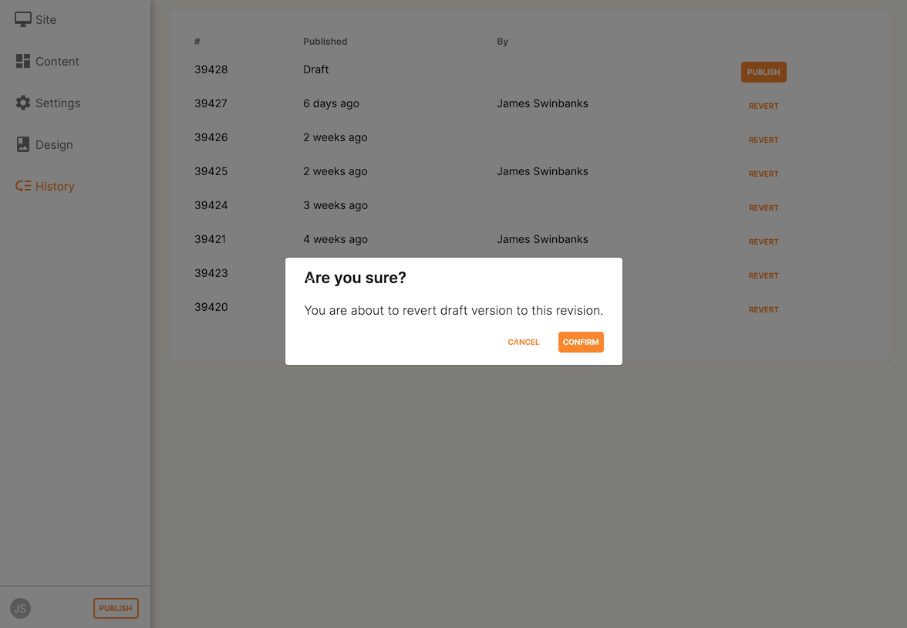

[[editorPublish]]
=== Publishing your changes

Any changes you've made are only visible when logged into the Editor.
Your site must be published before any changes appear on the live site.

To publish your changes to your live site, click 'Publish' from the bottom of the toolbar.
This prompts you to confirm that you want the changes published.
Click 'Confirm' to commit any changes you have made and make these changes visible on the live site.

