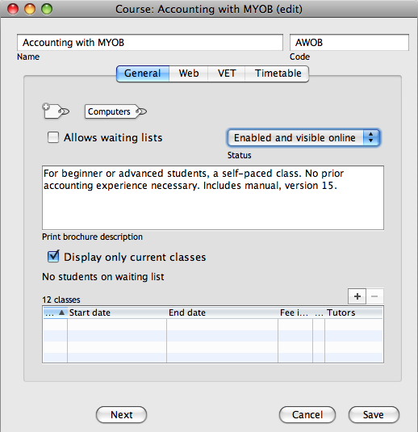
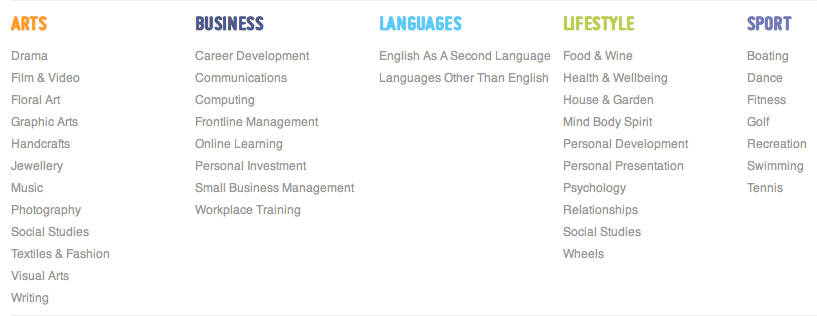
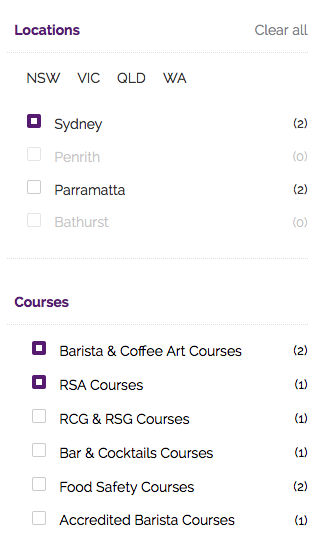

[[adding_content]]
== Creating an onCourse website

=== Your college online

One of the key features of onCourse is the integrated website.
This allows you to promote your courses and products on your website and provide seamless online enrolments, waiting lists, mailing lists, discounts, credit card payments, student and tutor portals and much more.

=== Updating your site

Because ish onCourse has been written as one comprehensive system, updating your web site is completely painless.
Every time you make a change to any relevant information those changes are automatically uploaded to your web site in the background.
So, as courses are filled, the web site shows prospective students that places are limited.
This works equally well if you are hosting onCourse yourself or in our cloud service.

=== Enabling courses for online display

Courses need to be Enabled and visible online in the General section of each course record, to display on your site.

You must also tag your courses with Subject tags for them to display on your web site browsing navigation.
You may choose to allow subject tags to be set more than once, or limit to one.
If a course is tagged with more than one subject, it will appear in the menu for each tag you have assigned.
Check the onCourse manual for more on tagging.

==== Course description

The field `web description` is where you should enter all the information about the course description, what people should bring, pre-requisites, outcomes and anything else you can think of.
As this is the course, this information needs to pertain to all the classes of this course.
If you have class specific information you should put this in the class web description.

The description fields are rich text fields, so you can use bullets, headings and numbered lists. You can also include images and attachments in your pages.

==== Displaying Classes

Once a course has been tagged and enabled for the web, classes in that course will be displayed if they have the “Enrolment allowed" and "visible online” options selected in their record's “General” section.
The classes themselves do not need to be tagged with anything from the Subjects tag group in order to appear on the website.
You can also select a series of classes in the list view and select the cog wheel option `Show class on website` to web enable classes in bulk.

==== Class descriptions

The information that you put in this field should be specific for just this instance of the class.
Keep your general course information in the course itself.

==== Summary

* Courses have “Enabled and visible online” selected on the General tab
* Courses are tagged with at least one tag under Subjects in the tag group (if it has multiple tags, this course will appear under each tag)
* Ensure "Enrolment allowed" and "visible online” are selected in the "General" section of every class you want to appear on your website.

=== Other information

Other information which makes its way automatically to your website includes tutors, rooms and sites.
In particular, be sure to fill out the latitude and longitude of the sites since this will automatically give the website the ability to show a Google Maps driven location finder for students trying to find the venue.

=== Special Pages

Some URLs in your site are reserved for special pages.
These pages are delivered by the onCourse software itself.
To customise them, consult the templates chapter for details of how these pages are created.
These pages include:

/courses::
A list of all courses which are marked as web visible.
/courses/arts::
A list of all courses tagged with the tag "arts" from the "subject" tag group.
/courses/people/get-better-job::
A list of all courses tagged with the tag "get-better-job" from the "people" tag group.
/course/ABC::
The detail of the course with code ABC.
/class/ABC-123::
The detail of the class with code ABC-123
/sites::
A list of all sites marked as web visible.
/site/12::
The detail of site with internal id 12.
/tutor/23::
The detail of the tutor with internal id 23.
/checkout::
All pages under this path are used for the checkout system.
You can however move that to a different path.
/editor::
All pages under this path are reserved for the web page editor.
/s::
Static files like css, images and js live here.

=== Advanced Search options

onCourse includes a Solr search engine indexed to your website.
This allows users to use the built in simple or advanced search tools on your webpages to find the courses they are looking for, or for you to craft URLs which include certain search results.

You can also choose to include only courses tagged with a set tag group in your search engine index, which is commonly done when a college has multiple websites for different training departments. i.e. the workplace learning site only ever searches on and shows results tagged with professional development, while the community site indexes all courses.

The usual sort order for course results in a list view page prioritises courses with classes starting next.
When a search parameter is added into a page, the sort order is shifted to bring results with a greater relevancy to the top of the page, and then to sort by classes starting next.

To see the scoring priority for each course in a search result, add the string ?debugQuery=true to the end of your URL.

When adding a 'near=' search, it will automatically hide results outside of 100km radius the search suburbs' GPO. This can be useful if you deliver in a variety of physically seperated locations.
For example, a website visitor who searches for courses in Sydney is unlikely to be interested in results in Melbourne, but may be interested in results in Chatswood.
In this case the Melbourne class results would be suppressed from the list but shown to the user if they click the button 'Show other classes'

Classes that are full or classes that are cancelled are suppressed from results list pages in the same way.

Searches created by website users are always run against all your courses e.g. www.myurl.com/courses?s=whatever

If you want to craft some specific searches to put behind image banners, promotional ads or other links, you can build your search within a tag group URL to make the results more specific.
For example, if you want a promo for day time cooking classes your search might be www.myurl.com/courses/cooking?time=day which will find all the courses tagged with the subject tag group named cooking that have classes running during the day time.

The onCourse search options available are:

/courses?s=cook::
This is standard keyword search, which includes stemming so the term cook will find cook, cooks, cooking, cookery ect.
The search results prioritise courses where the search term appears in the course name, over courses where it appears in the course description.
/courses?near=Chatswood+2057::
Search on both the Suburb+postcode.
While the search may work without the postcode, adding the postcode is essential to determine location if the suburb exists in multiple states.
/courses?price=200::
This searches for classes with an enrolment fee less than the specified dollar value.
/courses?tutorId=1234::
This searches for all classes that the tutor with ID number 1234 is currently teaching.
To find what a tutors ID is you will need to find a class that is online and one the tutor currently teaches.
Then right click on their name, in the class block, and open the link in a new window/tab.
The tutors ID will be the last few digits of the URL. So if the URL is www.yoursite.com.au/tutor/3, then the tutor ID is 3.
/courses?time=day::
Searching for a day class means the first session commences before 5pm.
/courses?time=evening::
Searching evening means the session starts after 5pm.
/courses?day=mon::
This searches for a class where the first session is on Monday.
/courses?day=tues::
This searches for a class where the first session is on Tuesday.
/courses?day=wed::
This searches for a class where the first session is on Wednesday.
/courses?day=thurs::
This searches for a class where the first session is on Thursday.
/courses?day=fri::
This searches for a class where the first session is on Friday.
/courses?day=sat::
This searches for a class where the first session is on Saturday.
/courses?day=sun::
This searches for a class where the first session is on Sunday.
/courses?day=weekday::
A weekday class means the first session is held Monday to Friday.
/courses?day=weekend::
A weekend search means the class starts on a Saturday or Sunday.
/courses?after=20141201::
This will show class that start after the date 1/12/2014. The date in the search is in format yyyymmdd.
/courses?before=20150101::
This will show classes that start before 1/1/2015. The date in the search is in format yyyymmdd.
This can be used in combination with the after search option to create a date range.
/courses/cooking?tag=delivery/School+holidays::
This search allows you search for courses that are tagged with multiple tags.
You must use the full secondary tag path.
This means the course is tagged with both the landing page tag (usually the tag group from within the subjects tag) and the search term tag.

Multiple search teams can be concatenated to created complex search strings such as www.myurl.com/courses/cooking?s=thai&near=Chatswood+2057&price=500&time=day&tag=level/beginner which is searching inside the subject tag group cooking for courses also tagged with the level tag group beginner that contain the keyword Thai, held near Chatswood NSW in the day time and costing under $500.

[NOTE]
====
A note on the space character inside a URL: If you have a tag name that contains a space, and you are manually crafting a URL that includes that tag, you need to replace the space character with "+" e.g. tag name
"cooking for kids" in a URL becomes "cooking+for+kids". This is done
automatically for pages generated by onCourse, it is only in hand
crafted URLs you need to remember to add the space delimiter. "%20"
works also, but makes the URL harder for a human to read.
====

==== Filtering class results using advanced search

Advanced search parametres can also be added to specific course pages, to filter the list of results returned.
This can be a useful function when you offer the same course in multiple locations, but users only want to see the classes from a specific location.

These search options are appended to a standard course page, with the URL containing the course code.
In these examples, I'll use the course code ABC123.

/course/ABC123/?near=Chatswood+2057::
Search on both the Suburb+postcode.
While the search may work without the postcode, adding the postcode is essential to determine location if the suburb exists in multiple states.
/course/ABC123/?time=day::
Searching for day classes of a course means the first session commences before 5pm.
/course/ABC123/?time=evening::
Searching evening classes of a course means the first session starts after 5pm.

=== Faceted Search

Faceted search uses a hierarchy structure to enable users to browse information by choosing from a pre-determined set of categories.
This allows a user to type in their simple query, then refine their search options by navigating.
In reality, it's an advanced search going on in the background, but instead of the user having to think of the additional search categories, it's been made easier for them by the visible folder structure.
Examples of other websites that use it are Amazon and eBay.

You can select more than one option in the faceted search which will allow you to view more than categories results.

In the example below ther has been one option selected in the Locations tag and two options in the Courses tag.
The courses that are displayed will be ones that are being taught in Sydney that have either been tagged to Barista & Coffee Art or RSA Course.
The URL that is generated after the domain name from this search is /courses/barista+%26+coffee+art+courses?tag=/rsa+courses&near=sydney/2000/5

If you only selected the Sydney option above then the URL you would get is /courses?near=sydney/2000/5; if you only selected RSA Courses then the URL you would get is /courses/rsa+courses; and if you selected both Sydney and RSA Courses then the URL you would get is /courses/rsa+courses?near=sydney/2000/5.
