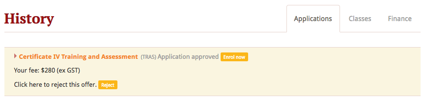
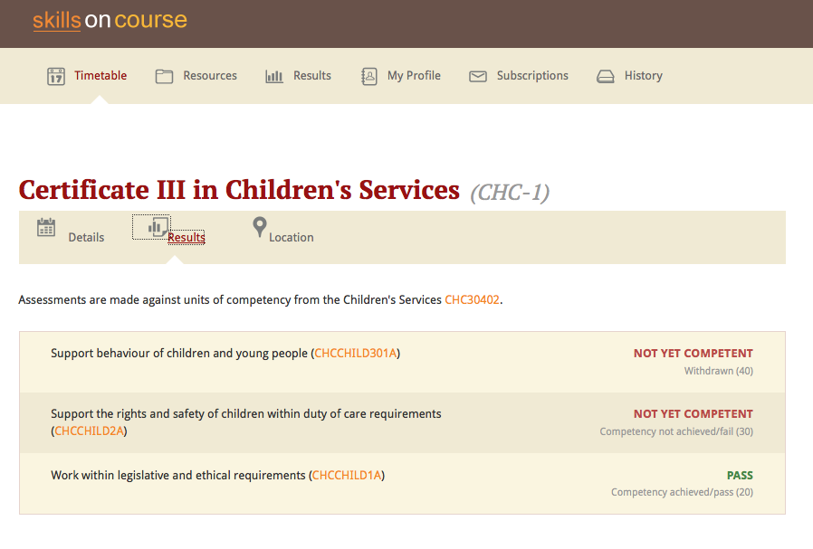
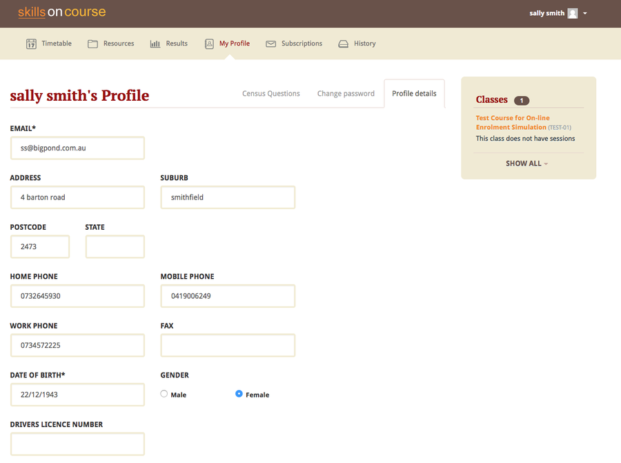
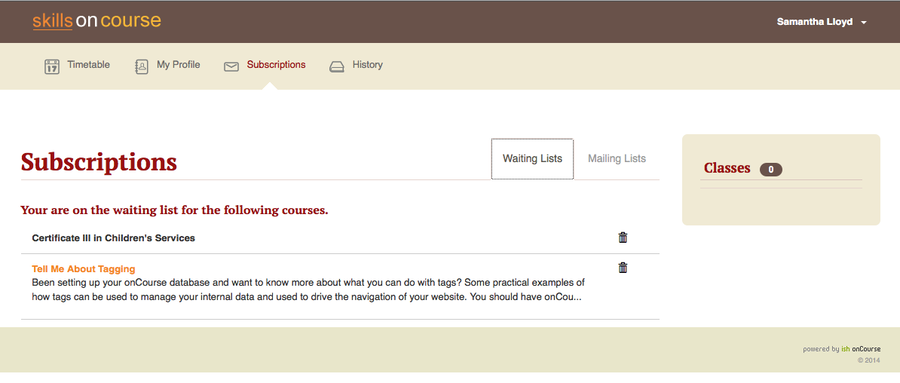
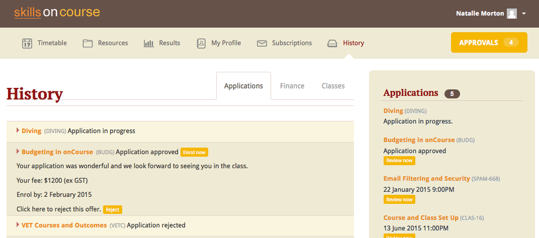
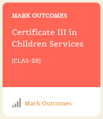
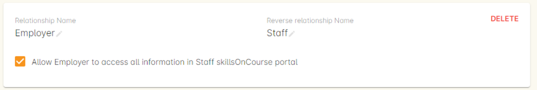

== SkillsOnCourse Portal

=== Introduction

skillsOnCourse is a website for tutors and students which allows them to interact with your college and their classes.

It's a place where students can receive class documents, give class feedback, make payments or update their student details.

Tutors can mark class rolls, upload documents for a class, leave notes on classes for onCourse admins and more.

Company logins can review progress of related employee contacts, pay invoices and review provided company information.

skillsOnCourse provides a way to give 24-hour assistance to help students and tutors get the answers they need.

=== Portal Set up

Your SkillsOnCourse portal URL will match the onCourse system key your college uses for its onCourse instance. For example, if you logged in to onCourse at testcollege.oncourse.cloud.cc then your college's default portal URL will be https://testcollege.skillsoncourse.com.au

=== Creating accounts and setting passwords

From the moment they are created in onCourse, students will automatically have a skillsOnCourse account created. They just need to set a password in order to log in.

They can do this by going to the login page for your portal, entering their first and last name and email address, then clicking 'forgot password'. They will be sent an email prompting them to click a link which will lead them to the password set window.

Passwords must have a minimum of 12 characters, with at least one uppercase and one lowercase character each, at least one special character, and at least one number. The password reset page has indicators to help tell you whether the password you're trying to use is secure enough or not.

The system will not let people set an unsecure or simple password, so we encourage the use of a password generator.

=== Logging in

The skillsOnCourse login screen will prompt the student or tutor to enter their details.

Just like the onCourse enrolment process, a student is identified their first and last name and an email address to avoid forcing students and tutors to remember another user id.

image::images/Tutor Portal Log In Screen.png[title='skillsOnCourse web login page']

It's also possible to log into skillsOnCourse as a Company rather than an individual.

To do so, click the 'As A Person' switch over to 'As A Company', then enter the name, email address and password for your company log in.

image::images/Tutor Portal Log In Screen Company.png[]

==== Recovering and Resetting Passwords

The main login screen for the skillsOnCourse portal includes a 'forgot password' link.

The student or tutor will need to provide a first name, last name and valid email address in order to initiate the process. Companies will need their company name and associated email address. If the contact doesn't have an email address in onCourse then they must get in touch with the college so that you can manually update their record.

Students must have a valid email address for this process to work. Passwords cannot be updated within onCourse itself. Only the SkillsOnCourse password reset emails can be used to set passwords.

If the user clicks on the forgot password link and enters the other details, an email will be sent to them with a link to enable them create a new password.

This link will be valid for 24 hours only, after that time the link within the email will not work. Once the student has reset their password, they can continue using skillsOnCourse.

....
Dear {name},

To reset your SkillsOnCourse password, simply click the link below. That will take you to a web page where you can create a new password. Please note that the link will expire 24 hours after this email was sent.

  {recoveryLink}

If you weren't trying to reset your password, don't worry - your account is still secure and no one has been given access to it. Most likely, someone just mistyped their email address while trying to reset their own password.
....

== Student Portal

Once a student has logged into their skillsonCourse portal they will see their dashboard.

image::images/portal_dashboard.png[title='Example dashboard']

image::images/portal_dashboard_mobile.png[title='Example mobile view dashboard']

Students are able to navigate their way around skillsOnCourse via the top of page menu options. Each section is described in detail below.

=== Dashboard

The main screen students will see when logged in. Here they can see a breakdown of their upcoming classes, any resources they have available to them. They will also be alerted to any outstanding invoices they have to make payments on.

==== Next Class

This is the student's next class. They can click 'View Course' to see the course details on the college's website, or click 'Course Details' to review the details of the class within the portal.

Click 'View All' to go to the Timetable page and view all the upcoming classes.

image::images/portal_dashboard_next_session.png[title='Next Class dashboard icon']

==== Payment Due

If the student has a payment due for an outstanding invoice then this will be indicated here as well. This invoice can be paid online if they click the 'Pay Online Now' button. The student will be taken to the History > Finance section where they can make a credit card payment.

image::images/portal_dashboard_payment_due.png[title='Payment Due dashboard icon']

==== USI Required

Students who haven't already provided and verified their USI will see an icon on the dashboard notifying them that it's still required. They can then click on 'Review Now' which will direct them to the Census Questions tab of the students profile where they can either enter and verify or create a USI.

image::images/portal_dashboard_usi.png[title='USI Required dashboard icon']

==== Resources

When this section displays on the dashboard it will display any documents or class materials relating to the next class. Students can click to download the materials to their computer.

Click 'View All' to be taken to the main Resources page and access all resources available to that student.

image::images/portal_dashboard_resources.png[title='Resources dashboard icon']

==== Class Feedback

After a student has completed a class they will have the ability to provide feedback and rate it by clicking the link and then filling out the feedback survey. Once feedback has been provided the block will show the next oldest non-rated class. If there are no others then this section will not appear.

image::images/portal_dashboard_class_feedback.png[title='Class Feedback dashboard icon']

==== Applications to Study

If a student has applied to study in a class and has yet to be enrolled or withdrawn then they will see a 'Application to Study' icon similar to the one below. It will include the name of the class along with the current status.

image::images/portal_dashboard_application.png[title='Application to Study dashboard icon']

If the application has been accepted then a 'PROCEED' button will appear, which if clicked, will redirect them to the Applications tab of the History page, as shown below. They can then either click on the 'Enrol Now' button to take them to a special URL on your website where they can enrol, or they can click on the 'Reject' button that will withdraw their application.

=== Timetable

The timetable shows the student's upcoming class sessions laid out in a list. If the student is attending multiple classes the list can be filtered by class to make it easier to read.

Students can navigate between months by using the calendar month tool on the left panel. The calendar view will highlight the dates where there is a class for the student to attend. Students can click any date of the calendar where there is a class to be taken to that date in the list view.

The timetable will open to the current date, or next scheduled session by default. Students can view the course on the website, or view more details within the portal itself using the links provided.

image::images/Tutor Portal Timetable View.png[title='skillsOnCourse timetable view']

==== Timetable Subscriptions

Skills onCourse allows both Students and Tutors to subscribe to a timetable for their classes.
To add this Calendar feed to your own Calendar, simply click on the 'Sync to Device' link within the portal timetable view then add this feed to your own Calendar software.

Once the subscription has been set, any amendments made to the timetable for your classes will automatically flow through to your Calendar. Any new classes a user enrols in, or are scheduled to teach, will be included in this subscription.

image::images/PortalCalendarSubscription.png[title='URL link generated by the Portal which can be added to your own Calendar']

=== Resources

The resources tab is a quick way to navigate to any global resources that have been added to the portal, like course documents, class specific documents, certificates etc.

Resources grouped by class may have been attached at either the course, class or student enrolment record, and may include documents such as learning and assessment resources, of completion Certificates.

The display of resources in the portal is based on the permissions set for the document inside the onCourse application. Documents with the permission 'Student and tutor' show in the portal for both students and tutors. Documents with the permission 'Tutor only' show only to tutors, and are a suitable permission for resources like assessment marking guides.

The skillsOnCourse dashboard also contains links to the newest resources added to the portal for the student or tutor.

Resources for classes which are completed can be accessed from the class record directly.

image::images/portal_resources.png[title='Tutors can access detailed class information via the skillsOnCourse portal']

=== Results

The results tab of the portal show students the outcome results for their enrolments. Results may be for VET and non-VET courses.

Some VET courses will show the link to the parent qualification, where the course has been created with this link in onCourse. Other VET courses, that are module only enrolments will list the outcomes only with no reference to a qualification.

image::images/portal_results_tab.png[title='List of all class results on the results tab']

A student can also view their results for an individual class by clicking on the 'Results' tab on the class detail view.

==== Class feedback

Students have the ability to rate classes they enrolled in and provide feedback comments. They can do this in both the Class detail view, or within the Results section.

If the default survey is used they can provide a Net Promoter Score response out of 10 (How likely are you to recommend us to a friend) and rate out of 5 stars how they found the Venue, Course and Tutor with a notes field below for them to add comments.

The tutors that are teaching these class will then be able to see their overall class rating in their portal, without any information identifying the student/s who provided the rating.

image::images/class_rating_student.png[title='Students have the ability to rate classes they enrolled in']

=== Profile

This is where users are able to update their contact details, AVETMISS information or change their SkillsOnCourse password. Any details updated will be reflected back in to onCourse.

image::images/Tutor Portal My Profile Update Password.png[title='Reset your skillsonCourse Password']

==== Updating AVETMISS and USI Details (Census Questions)

If a student is undertaking a VET course, they can provide or update the required AVETMISS information via the profile page, on the Census Questions tab. The student USI can also be supplied and will be verified in real time here, and citizenship information can be provided for funding and VET Fee-Help eligibility.

image::images/portal_census_questions.png[title='Student USI and AVETMISS Information']

==== Change Password

Users can change their password to their SkillsOnCourse login directly from here.

=== Subscriptions

Here students can see which course waiting lists they are on, as well as set their contact preferences for email, sms and via post.

Students can remove themselves from any waiting list by simply deleting the entry.

=== History

Students can access a list of their previously enrolled classes, their financial history and any current or previous applications they have submitted to your college in the History menu.

==== Applications

If a student has submitted any applications that have been approved, they will have the option to enrol in the class, or alternatively they can reject the offer.

If you want to withdraw the application simply click on the 'Reject' option, after which your application will show as 'Withdrawn'.

If you want to enrol in the class you have applied for, simply click on the 'Enrol now' option which will take the student to that course page on your website.

image::images/Tutor Portal History Application withdrawn.png[title='Application has been withdrawn']

==== Classes

image::images/Tutor Portal History Enrolments.png[title='List view of previously enrolled classes']

==== Finance

To find out more information about a certain transaction you can click on one of the records. That will iopen up payment information or a Tax invoice for the chosen payment, as seen below.

image::images/Tutor Portal History Finance Invoice.png[title='Tax invoice']

===== Making a credit card payment in the portal

A student has the ability to make credit card payments in the skillsOnCourse portal, so debtors are allowed to make payments against their outstanding invoices or payment plans.
This can be found in the Finance tab of the History menu.
The payment option UI will only appear if the student has an overdue payment, if not, then this tab will just show a list of their financial history.
A student has an option to reduce the amount they want to pay if they can't afford to pay the full amount at the present time, with a minimum limit of $20 unless the total overdue amount is less than this.
Once the user has defined the amount they want to pay the student just needs to enter the credit card details of person making the payment.
The user will then get a message notifying them if the payment was successful or if it failed.
If the payment fails, then a few seconds after getting a notification of this they will get directed back to the payment page allowing them to try again.

If a payment is due there will be a block on the dashboard notifying the student of this, as seen below.
If they click on the 'PAY ONLINE NOW' button in the block it will take them to where they can make the payment, as shown above.

[NOTE]
====
If a student has mulitple invoices that are overdue the amount shown that needs to be paid will be the combined overdue total.
If they don't want to pay the full amount yet, then the payment will be taken off the oldest invoice first, even if they are on a payment plan.
====

There is also a script in the Automation window called 'send payment plan reminder' that automatically sends a message 7 days before the payment due date, on the day the payment is due and every 7 days after that.

image::images/send payment plan reminder.png[title='Send payment plan reminder script']

Below is an example of the email that gets sent to a student who is overdue.
There is also a link in the email that allows them to go straight to the portal, without having to log in, and pay the overdue balance.

=== Certificates in skillsonCourse

Once you have attached the students Certificate to their enrolment record you will want to be able to direct the student to where they can find it in their skillsonCourse portal.

They can find this by:

. clicking on 'History' tab in the top menu, then on 'Classes' to see the full list of past classes.
. Under this section the student will see a list of past classes and to find the certificate for class 'Certificate III in Children's Services (CHC2-4)' they would need to click on this class in the list.
. Finally click on the 'Resources' option; this option will only appear if they have something attached to their enrolment record.
. When they have done this the student will be able to download and print their Certificate themselves.

image::images/finding_certificate_portal.png[title='Where a student can find their Certificate in skillonCourse']

[[tutor]]
== Tutor Specific Features

=== Tutor Specific Features

Tutors have access to the same features as students, with the dashboard showing upcoming classes, the timetable showing the same but in more detail. Though some features are only visible to tutors, including real time marking of the attendance roll for their classes, leaving of notes on the class, and uploading of documents to the class for students to access via the portal.

==== Class Approval (tutors only)

When a tutor approves of a class, the approval date is added to the Tutor record on the class in onCourse under 'Confirmed On'. If a tutor has been assigned to teach a class, and they haven't confirmed whether they can teach it, the class approval icon will appear on their SkillsonCourse dashboard.

If they don't have any classes to approve then this icon will not appear.

image::images/portal_dashboard_class_approval.png[title='Class Approval dashboard icon']

You can check whether a tutor has confirmed if they can teach a class by going to the tutor section of a class and checking if there's a confirmed date below their name.

You can manually set a date by clicking to expand the tutor, clicking the field and adding a date.

image::images/tutor_class_confirm_on_missing.png[title='Checking to see if a tutor has confirmed to teach a class in onCourse']

==== Mark Roll (tutors only)

Tutors are able to mark the roll for classes they are taking within the class detail view of the class.

While in the Class Detail view, select a session from the Timetable, then go through and set attendance. You can set Attended or Absent without reason directly. For more options, like partial attendance and adding reasons for absence notes, click the pencil icon and then make your selections, then click 'Save'.

image::images/portal_dashboard_mark_roll.png[title='Mark Roll dashboard icon']

==== Mark Outcomes (tutors only)

This will appear if a tutor has outcomes for a class they have taught that haven't been marked.

Click on the 'Mark Outcomes' button to be taken to where you can either mark the students outcomes in the class by Outcome or by Student. You can set the outcome status and also set the outcome end date on the outcome. Make sure to save any changes you make.

image::images/portal_mark_outcomes_by_student.png[title='Marking Outcomes by Student']

[[user_switching]]
== Company Logins and User Switching

This feature allows you to set up different relationships between e.g. An employer and their staff members and allow them to have access to their SkillsOnCourse portal login. Log in as a company profile in order to access and review associated employee progress.

=== onCourse Settings

To enable this feature between certain relationship you need to tick the checkbox in the Contact Relation types window in Preferences. Type 'Preferences' into the dashboard search and open the window, then select 'Contact Relation types' in the left hand column.

image::images/contact_relationship_list.png[title='Contact Relation Types view in Preferences']

Once you have the marked the checkbox, as shown below, the employer will be able to access their staffs skillsonCourse portal.

After a relationship has been created and marked as giving access to information with the skillsonCourse portal then you can start creating relationships between contacts.

To do this you have to open up the contact you want to create relationship to, Scroll till you see 'Relation' then click the + button.

From here a sheet will appear that will allow you to choose who you want to create a relationship to along with what type of relationship.

In the example below I am trying to make 'Natalie Morton' the employer of 'James Matthews'.

image::images/adding_a_relationship_to_contacts_record.png[title='Adding a relationship to a contacts record']

Once you have added the relationship it will remain there on the contact record once the record is saved.

=== What will you see in skillsonCourse

Once you have marked the checkbox in the Contact Relation Types view in Preferences there should now be an option to switch users within skillsonCourse. This can be found at the top right hand side of the window.

In the example below you can see user Natalie Morton has been given access to James Matthews' skillsonCourse details.

Once your in a different users account the second name below your name in the top right side of the page will change to the name of what ever users account you are in, as seen below.

image::images/skillsonCourse_user_switching2.png[title='View of what you will see in the top right side of the window when Natalie has switched to James' skillsonCourse login']
