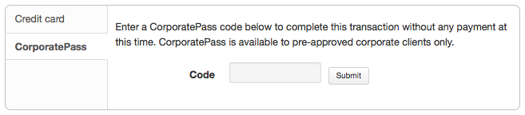
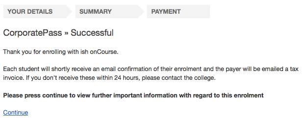
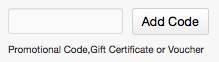
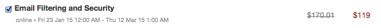
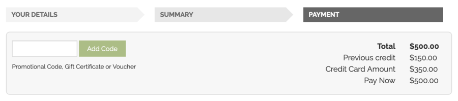

[[payment_options]]
== Payment Options

onCourse allows for a range of payment options for enrolling students.
Students can pay for multiple classes and multiple students in a single credit card transaction, or choose to send the invoice to an approved third party, like their employer.

onCourse eCommerce doesn't handle only enrolments in classes; it also includes product, memberships and gift voucher sales allowing you to diversify your business and the way people can buy and share your products.

=== Credit card

Real-time credit card processing ensures that successful enrolments are only made when the money is in your bank account.
Once the student has entered their credit card details they will need to select the checkbox at the bottom of the page that says 'I understand the enrolment and refund policy', then click on the 'Confirm purchase' button to complete the order.

The credit card is captured by onCourse over an SSL encrypted connection.
The full card number and CVV are never stored in the database, only passed directly to the banking system, so in the unlikely event of a security breach there are no stored card details for anyone to steal.
The user should expect a response in about 5-10 seconds, and during this time the enrolment is put on hold, preventing someone else taking the last place available in a class.

Should the payment fail due to insufficient funds or some other problem, onCourse will retain the transaction history as an invoice, a failed payment, and a credit note reversing out the invoice.
We encourage you to regularly review failed payments in your system and follow up with the user to offer them alternative payment means.

image:images/payment_credit_card.png[ Using a credit card when paying for an online enrolment,scaledwidth=80.0%]

=== Corporate Pass

CorporatePass gives approved users the ability to invoice their employer, or another approved third party, on enrolment.
This allows you to create an ongoing training approval process with your corporate customers, but still allow their staff to select the training timetables, or classes, to suit themselves.

You can view, edit, create or disable a Corporate Pass within onCourse by clicking on the CorporatePass button that can be found in the marketing tab.
Once you have clicked on the CorporatePass button a window will pop up with a list of current and expired (if you check the filter in the left column) Corporate Passes created.

You can view an existing CorporatePass by double clicking on a record, or alternatively create one by click on the '+' symbol in the top right hand of the window.
More information on Corporate Passes can be found in the link:#corporatePass[CorporatePass chapter] of the handbook.

To pay using a CorporatePass during the online enrolment process the student has to click on the CorporatePass tab on the left side of the 'PAYMENT' page.
The student then enters the CorporatePass code that has been supplied by their employer (this code can also be found in onCourse).

Once the student has submitted a valid CorporatePass code they will see a message confirming that the code they have used is valid.
They will also be given an option to add a reference like a purchase order ID for this transaction that will be included on the invoice sent to their employer.

image:images/corporatepass_validation.png[ CorporatePass reference,scaledwidth=100.0%]

Once the student has chosen or not to enter a reference; marked the 'Conditions' checked; and clicked on the button 'Confirm enrolment' they will be directed to a page informing them the enrolment and payment via CorporatePass was successful as shown below.

=== Pay Later

If you are using Payment Plans to offer a deferred payment for a course to newly enrolled students, when someone goes to enrol into one of these courses online, the online checkout will offer a 'Pay Later' option.
It will appear as a tab on the payment page, just like 'Credit Card' and 'Corporate Pass'.
If the user selects this tab, the Pay Now field will show $0. If they select either the Credit Card or Corporate Pass tab, the full price of the course will display.
The user can also change the 'Pay Now' field to $0 and the 'Pay Later' tab will be automatically selected.

When using 'Pay Later' the user will be able to select to 'choose a different payer' by selecting the 'choose a different payer' button.

=== Vouchers and Gift Certificates

Vouchers are much more than a simple gift voucher.
They can be used to sell training in flexible groups whether it be a sampler of arts courses or OH&S training for 20 co-workers.
More information on Vouchers of Gift Certificates can be found in the link:#vouchers[vouchers chapter] of the handbook.

If a student provides a valid voucher code during the enrolment process, then this will reduce the fee payable, possibly to zero on the final payment tab.
Voucher codes can be added on either the summary or payment tab.

=== Discounts and Promotional Codes

A range of flexible discounting and promotional code tools allow for students to access your special enrolment rates right up until the point of payment.
More information on discounts and promotional codes can be found in the Discount section of the main manual.

The total cost breakdown will include how much the class/es have been discounted by.
In the case below the class has been discounted by $51.01.

image:images/discounted_amount.png[ Total cost and discount for all classes you are trying to enrol in at this time,scaledwidth=100.0%]

=== Concessions

Some colleges have created concession types that users can self select as part of the online enrolment process.
Usually, selecting a concession type during the online enrolment process will then discount the enrolment fee payable.

Some types of concessions that provide discounts may only be available via a pre-approval process at the college e.g. the college has to add the concession to the student record, it can't be added online by the student.
In these cases, the applicable concession fee for enrolment will apply automatically during the online enrolment process without the user having to select anything.

If self identified concessions can be added during an online enrolment, then you will see a '+' symbol with text 'Add Concession' below the students name and email address.

image:images/add_concession.png[ Where to find the 'Add Concession' button on the Summary page,scaledwidth=100.0%]

Once you have clicked on the 'Add Concession' button you will be directed to the following page, as shown below.
More information on how to add Concessions within onCourse can be found in the
link:#concessions[concessions chapter] of the handbook.

image:images/Concessions.png[ Adding a Concession/Membership to an enrolment,scaledwidth=100.0%]

=== Credit

If a student has credit available on their onCourse contact record from a credit note, the next time they make a purchase online, be it for an enrolment, products or anything else available on your site, the credit on their account will be automatically applied to their sale total at checkout.

The credit amount cannot be altered; the transaction will always use the full amount of credit available.
Any remaining credit left over will still be available for the customer to use on future transactions.

