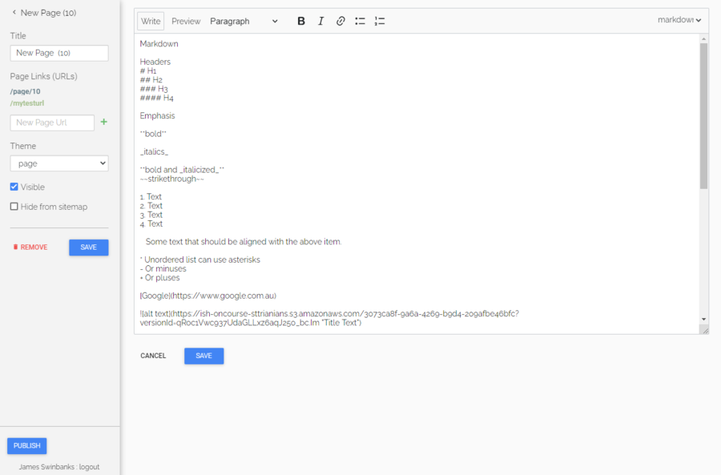
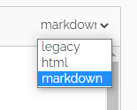

[[richText]]
== Markup

The #editor will let you use three different styles of markup, which you must define using the dropdown box in the top right of the content window; legacy, html and markdown.





[[richText-HTML]]
=== HTML

If you select HTML you can use standard HTML tags to build the content on your page. This is only recommended for advanced users with a prior working knowledge of HTML, otherwise we recommend using markdown mode.

[[richText-md]]
=== Markdown

Markdown is a simplified markup language designed to be easy to use for people who don't code. To add content using markdown, select 'markdown' from the drop-down box in the top-right of the content page you're editing. Markdown mode also supports HTML, so you can combine the two when using markdown mode.

[[richText-mdHeaders]]
==== Headers

[source,markdown]
----
# H1
## H2
### H3
#### H4
----

[[richText-mdEmphasis]]
==== Emphasis

[source,markdown]
----
You can **bold text** using twin asterisk's (**) on either side of the text you want to emphasize.
You can use _italics_ by using an underline (_) on either side of the text you want to emphasize.
You can also combine the two to create text that's **both bold and _italicized_**.
If you want to ~~crossout~~ strike out some text, add twin tilde's (~~) either side of it.
----

[[richText-mdLineBreaks]]
==== Line Breaks

Line breaks can be added by starting a new paragraph with a line gap in between the first paragraph and the second.

[[richText-mdLists]]
==== Lists

You can create both ordered and unordered lists, ansd combinations of the two as well. Some examples include:

[source,markdown]
----
* This is
* an unordered
* list

1. This is the first entry in an ordered list
2. second entry
3. third entry
4. fourth entry
    * the fourth entry has an unordered sub-list
    * second entry in the unordered sub-list
5. fifth entry
----

[[richText-mdLinks]]
==== Links

You can create in-links using the following syntax:

....
[The text you want inside the link](https://www.theurl.com.au)
....

It'll come out something like this:

[source,markdown]
----
Click this [link to search](https://www.google.com.au) for your favourite courses
----

[[richText-mdImages]]
==== Images

You can reference images stored in your onCourse documents by using its reference URL like so:

....

....

Whatever you put in 'Title Text' will appear when hovering the mouse over the image and is useful as a caption.

[[richText-mdCodeBlock]]
==== Code blocks

You can highlight portions of text to preserve things like code formatting by using the ` symbol. You can also create code blocks this way, see the example below:

[source,markdown]
----
You can highlight `certain words` or a `call to action` like this.

```
<!DOCTYPE html>
<html>
<body>

<p>This is how you can present code using markdown.</p>
<p>This example uses html, but it can be anything you like.</p>

</body>
</html>
```
----

[[richText-mdVideos]]
==== Videos

You can insert videos using pure Markdown, however it's far simpler (and better for users as well) if you simply embed the html code into the page. Video services like YouTube have an easy 'Embed' button that gives you the code you need to copy and paste into the content field of the page you're editing.

[[richText-Legacy]]
=== Legacy (rich text)

==== Formatting text

Many places in onCourse where can enter large amounts of text to display on the website will allow you to enter "rich text". This includes web pages, course descriptions, tutor profiles, site descriptions and much more. Rich text is used for simple styling of your text, without you needing to know any HTML. The headings, fonts and bullet point styles used on your website are determined by your template and design. Anywhere you can enter rich text, you can also enter HTML, if you have these skills.

You can also enter rich text in any web page or block within the CMS when 'legacy' is selected.

[[richText-guide]]
===== Simple guide to rich text

.Common formatting options
[cols=",,",options="header",]
|===
|You type |Output |Notes
a|
....
The sun was *shining on the sea*
....

|The sun was *shining on the sea* |All text between the * will be bold.
Don't put a space between the * and the text.

a|
....
Shining with _all its might_
....

|Shining with _all its might_ |All text between the _ will be italics.
Don't put a space between the _ and the text.

a|
....
* Now this was very odd
* because it was
* the middle of the night
....

a|
* Now this was very odd
* because it was
* the middle of the night

|Make sure you put a space after the * on each line.

a|
....
# Now this was very odd
# because it was
# the middle of the night
....

a|

. Now this was very odd
. because it was
. the middle of the night

|Make sure you put a space after the # on each line.

a|
....
h1. The Moon
....

|*The Moon* |Use the h1. for a large heading (you can also use h2. h3.
h4. and h5. for smaller headings). Ensure you use a lower case h and
full stop and space after the number. Leave a blank line of text between
your heading text and the following paragraph, or all the text to follow
will be rendered as a heading also.

a|
....
"Alice":http://hole.example.com
....

|http://hole.example.com[Alice] |The text wrapped in the quotes becomes
the hyperlink text and the url which follows is the link the user will
be redirected to upon clicking.

a|
....
"Rabbit":/course/stew
....

|http://hole.example.com/course/stew[Rabbit] |An internal hyperlink is
similar, however you do not have to provide the full path name. You only
need to provide the text that appears after your domain name.

a|
....
"Queen":mailto:red@hole.example.com
....

|mailto://red@hole.example.com[Queen] |To create a mailto link, the text
inside the quotes becomes the hyperlink which will open your users
default mail client, followed by the email address.
|===

For further information about rich text, please look at the
http://en.wikipedia.org/wiki/Textile_%28markup_language%29[Textile
documentation].
We use textile with some special extra additions for dynamic course content.

==== Inserting dynamic content

Using *rich text markup* onCourse is able to draw from many parts of your data.
Maybe you wish to display a banner, linked to a random course from a subset of high priority courses; or display a collapsible menu of subject.
Maybe you'd like to add the complete contents from one group of specially tagged blocks of content.

By using the dynamic content rich text markup your web pages will always be up to date.
If you change a course description, then everywhere that course is referenced will automatically update.

There are many types of content you can insert into a page and you can use the following markup anywhere rich text is supported.
That is, you can insert images, course lists, video and much more inside other web pages, course descriptions, tutor resumes and any other place you see the rich text symbol.

.Dynamic rich text
[width="100%",cols="50%,50%",options="header",]
|===
|What you want |Rich text to use
|Position an image within some text |\{image}
|Link to an attachment |\{attachment}
|Insert a re-usable CMS block within some text |\{block}
|Display a course description within another page |\{course}
|Show a list of courses |\{courses}
|Display a list of subjects |\{tags}
|Embed a page inside another page |\{page}
|Display a video within a page |\{video}
|Display a form within a page |\{form}
|Add text field into a given form |\{text}
|===

==== \{block}

Start by creating a new Block in the CMS editor and giving it the title of "bannerAd1".
Put some text in there an image with a link to some special offer.
Once this Block is saved it can be displayed in either your content or another block, throughout your website by the simple inclusion of the rich text markup

===== Usage

....
{block name:"bannerAd1"}
....

name::
The name of the Web Block.
Blocks cannot share the same name, so make sure each in unique.

[[Course]]
==== \{course}

The second rich text markup we consider is *\{course}* This tag functions to embed specific onCourse Course data into a page or web block.
It can display data/content either at random, or specified from a particular grouping - ie evening classes.
If a course is chosen at random - courses can be restricted by specific tagging and basic class information can also be displayed.

You might like to highlight particular courses on your front page ("Course of the Week" for example), or display a random course in a 'block' in the sidebar across all pages of your website - the possibilities are endless.

===== Usage

....
{course tag:"/Subjects/Leisure/Arts" showclasses:"false"}
....

[tag]::
Optional.
Defines the path to a tag.
The full path to the tag must be specified. e.g.
"/Subjects/Leisure/Arts and Craft".
This option is ignored if the "code" parameter is passed.
A random course will be displayed from the tag specified.
If no tag is defined, "/Subjects" is assumed.
[code]::
Optional.
Specifies a particular course code to display.
If this option is not defined, a random course will be shown.
[showclasses]::
[true, false] Optional.
A unordered list of all the classes available for this course will also be displayed.
Default is false.

[[tags-courses]]
==== \{courses}

The third rich text markup we should look at is *\{courses}* This variation of the "course" code will display a List of courses within your content or "block"; and can be sorted dynamically by number of filters including; by start date; alphabetical listing, and others.

For example the Courses markup could be used if you wished to create a home page... or landing page that contained the most popular courses, alternatively Courses that were about to start through the coming week.
To do so, what you would need to do is open the relevant page - home page or other, and place the following rich text markup: (replace 'yourTopicsHere' with an appropriate list)

===== Usage

....
{courses tag:"/Subjects/Leisure/Arts" limit:"3" sort:"alphabetical" order:"asc" style:"titles"}
....

[tag]::
Defines the path to a tag.
The full path to the tag must be specified.
e.g. "/Subjects/Leisure/Arts".
All courses with this tag will be displayed.
If no tag is given then "/Subjects" is assumed by default.
[showTag]::
If the parameter is true then it shows all tags.
 +
If tag parameter is not defined then it uses "Subject" first layers tags.
 +
default: false
[limit]::
The maximum amount of courses that will be shown.
If no limit is defined, the default setting is that all valid entries are displayed.
[sort]::
[alphabetical, date, availability] Optional.
What fields you can use to sort the courses;
 +
alphabetical: course.name.
 +
date: course.startDate
 +
availability: course.availableEnrolmentPlaces
 +
default: alphabetical
[order]::
[asc, desc] Optional. ascending or descending order.
Default is ascending.
[style]::
[titles, details] Optional.
Which predefined template will be used to show every course:
 +
titles: shows only name of course
 +
details: shows full information about this course
 +
default: details

[[tags-tags]]
==== \{tags}

Tags are the most common way of creating navigation to your courses and classes.
You might organise your courses into subject categories, e.g.:

* Arts
* Leisure
** Cooking
** Crafts
* Business
* Languages
* Sports

Using onCourse's powerful tagging system, you might also organise your courses according to skill level:

* Beginners
* Intermediate
* Advanced
* Masterclass

Or, perhaps by target audience:

* Kids
** 1 - 4 years old
** 5 - 8 years old
** 9 - 12 years old
* Teens
* Adults

You may then want to display that tag structure on your website to allow users to navigation through it.
Clicking on any tag will take the user to a URL like /courses/leisure/crafts and all the relevant courses will be displayed on that page.
To place a tree of tag options on a page, simply use the rich text "\{tags}".
Further options allow you to customise the output.

===== Usage

....
{tags name:"/Subjects/Leisure/Craft" maxLevels:"3" showDetail:"true" hideTopLevel:"false" template:"TagItem.tml"}
....

[name]::
Optional.
Defines the path to a tag.
The full path to the tag must be specified. e.g.
"/Subjects/Leisure/Craft" and will display all child tags including the specified tag.
If no name is provided then it will default to "/Subjects".
[maxLevels]::
Optional.
Defining this option will limit how many levels of the tag tree will be displayed.
For example, "1" will only show the top level tag and nothing else.
If nothing is provided here then all levels of the tag tree are shown.
[showDetail]::
[true, false] Optional.
If true, a tag's description (as defined in the onCourse client) will also be displayed.
The default option is false.
[hideTopLevel]::
[true, false] Optional.
If true, the top level tag is not displayed.
The default option is false.
[template]::
Optional.
The name of the template to use for rendering each item in the tag list.
Defaults to TagItem.tml.
If you set this to something else, make sure you create the appropriate file in your website resources.

===== Sample HTML output

[source,xml]
----
                <div class="taggroup-2405">
  <ul>
    <li class="hasChildren childSelected">
      <a href="/courses">Personal Development</a>
      <ul>
        <li><a href="/courses/personal+development/work">Work</a></li>
        <li class="selected"><a href="/courses/personal+development/life">Life</a></li>
        <li><a href="/courses/personal+development/love">Love</a></li>
      </ul>
    </li>
  </ul>
</div>

----

The output of \{tags} with a little css styling applied.

==== \{page}

You may want to display content from one page within another page.
Use this rich text element to embed content.

===== Usage

....
{page code:"123"}
....

code::
The page number you wish to embed.
This is the same as the number at the end of the default URL for the target page ("/page/123").

==== \{form}

You are able to use this markup to display a form on the page which anyone can fill in.
This can be very useful as a 'contact us' form for example.
When the user enters the required data, an email is sent to the address you nominate with the information entered.
This is the only rich text markup which requires a closing bit of markup to designate where the form ends.
Don't forget to insert \{form} at the end!

===== Usage

....
{form name:"email us" email:"sales@acmecollege.com.au" url:"/thankyou"}
                {text label:"Email address" required:true}
                {text label:"First Name" required:true}
                {text label:"Last name" required:true}
                {text label:"Phone number" required:false}
                {text label:"Reason for complaint" required:true lines:8}
                {form}
....

name::
The name of the form.
It is not visible to the user on the webpage.
email::
This is where the email will be sent.
It is not visible to the user on the webpage.
[url]::
After the user submits the form, they will be redirected to this URL.
If not supplied, they will be returned to the current page.
required fields::
If you wish to set a given field as a required field, you can reflect this within the form as either 'true' or 'yes' if it is required.

==== \{text}

This markup is only useful inside \{form} markup (see the previous section).
You use this to add a text field into the form.

===== Usage

....
{text label:"Reason for complaint" required:true lines:8}
....

label::
The visible label shown next to the field.
[required]::
If you set this to "true" then the user cannot submit the form without entering some value here.
Setting this to any other value or leaving it out means that the field is optional.
[lines]::
Setting this to "true" displays a text area 10 lines high.
You can also explicitly set this to any other integer number of lines.
If this value is not set, a single line text field will be shown.
[maxlength]::
This can be set to any integer value greater than 1 and limits the input in this field to this number of characters.
Note that spaces count toward this maximum.

==== \{radiolist}

This markup is only useful inside \{form} markup.
You use this to add a set of radio buttons into the form, of which only one can be selected.

===== Usage

....
{radiolist label:"Age range" default:"20-25" options:"20-25,26-30,31-35,36-40,41-45,46-50,50+"}
....

label::
The visible label shown next to the field.
[default]::
This is the radio button which is selected by default.
If nothing is supplied here, then there is no default selected.
[required]::
If you set this to "true" then the user cannot submit the form without entering some value here.
Setting this to any other value or leaving it out means that the field is optional.
[options]::
This comma separated list of options will be displayed as the list of radio button options.
You must have at least two options.

==== \{popuplist}

This markup is only useful inside \{form} markup.
You use this to add a popup list into the form, of which only one can be selected.

===== Usage

....
{popuplist label:"Age range" default:"20-25" options:"20-25,26-30,31-35,36-40,41-45,46-50,50+"}
....

label::
The visible label shown next to the field.
[default]::
This is the item which is selected by default.
If nothing is supplied here, then there is no default selected.
[required]::
If you set this to "true" then the user cannot submit the form without entering some value here.
Setting this to any other value or leaving it out means that the field is optional.
[options]::
This comma separated list of options will be displayed as the list of options.
You must have at least two options.

[[images_and_attachments-image]]
==== \{image}

You may want to attach images and other files to courses, classes, sites, rooms and tutors and have them appear on the website.
Just attach the file you want in onCourse via the Training > Documents menu item, click the '+' button and upload the file or image, mark it as 'Public' via the Access dropdown box and that file will be automatically transferred and attached to your site.
These files will appear by default at the bottom of the relevant page.
So for instance, just attach a PDF to a course to have that document appear as a link at the bottom of the course description.
Likewise, pictures will appear at the bottom of the page.
If however you would like to position the image somewhere else (say, next to the relevant paragraph of text) you can do so with a special rich text entry called \{image}.

===== Usage

....
{image name:"duck" align:"right" caption:"This is a duck"}
....

[name]::
Optional.
The name of the image.
If this is not given and the id is also not given, then a random image is displayed from those linked to the relevant database object.
For example, if the rich text is a course description, then the random image will be one of the images linked to that course; if the rich text is a tutor profile, then the random image will be chosen from those attached to the tutor.
[id]::
Optional.
If you know the internal reference of the binary image object, you can use that here instead of the name.
If both id and name are passed, then the name will be ignored.
[align]::
[left, right, center, centre] Optional.
By default, images are left aligned.
[alt]::
Optional.
If supplied, the image will be given this 'alt' tag which is mainly useful for accessibility purposes.
That is, people with vision difficulties may have a screen reader which can read out the names of images.
If this value is not supplied, the alt tag is set to the image name.
[caption]::
Optional.
A caption to display under the image.
[width]::
Optional.
Specify the width of the image in pixels as it will display on the webpage.
If not supplied, the image will display at its full size.
[height]::
Optional.
Specify the height of the image in pixels as it will display on the webpage.
If not supplied, the image will display at its full size.
[class]::
Optional.
A CSS class will be added to this image for styling purposes.
[link]::
Optional.
If supplied, this image will be made an href link to the destination you specify.

[[images_and_attachments-video]]
==== \{video}

Embed a video on your page.
You will not upload the video directly to onCourse, but instead use a third party service like YouTube - their servers are optimised for video delivery and the performance and tools more helpful.

You can also use this within the Marketing tab of any Course, Class or anywhere else that uses this rich text format.
Just copy and paste the below portion of code, and replace the youtube_id with the id from the YouTube video you wish to embed.
You can find this after the = sign in the Video URL.

===== Usage

....
p<{height:315px}. {video type:"youtube" id:"youtube_id" height:"315" width:"560"}
....

type::
Currently only "youtube" is supported.
id::
This is the remote id of the video.
For example, a youtube video which has a URL of http://www.youtube.com/watch?v=YGwtEzZPb7M would have an id of 'YGwtEzZPb7M'
[height]::
The height in pixels you want to force the video to.
If you leave this option out, it will default to the standard player size.
You need to enter this twice, as referenced in the example above.
Both height parameters should match.
[width]::
The width in pixels you want to force the video to.
If you leave this option out, it will default to the standard player size.

[[images_and_attachments-attachment]]
==== \{attachment}

Link to an attachment.
When your user clicks on the link, the file will be downloaded. You will want to use well accepted file formats such as PDF.

===== Usage

....
{attachment name:"course_guide"}
....

name::
The name of the attachment as you specified it in the onCourse attachment entry screen.

