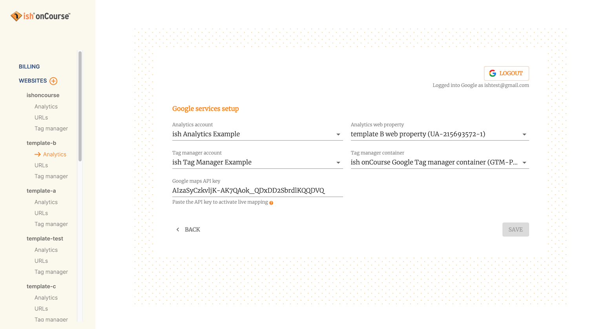
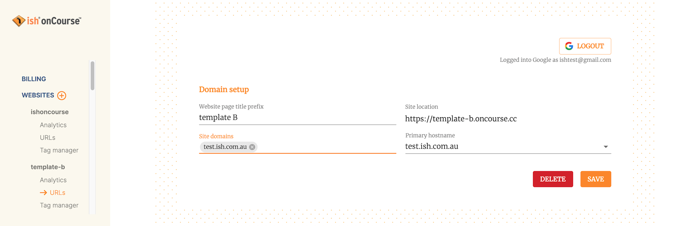

[[websiteSetup]]
== Website setup

By going to the Website Setup section in onCourse, you can manage and control much of the setup behind your website, including the adding of custom domains, set up of google tag manager and analytics, and even create brand new websites from scratch.

[[websiteSetup-Billing]]
=== Billing

The billing section will show you your current level of onCourse plan, and the number of concurrent users your licence allows for.

If you wish to make a change, click the Change button, then enter the number of concurrent users you require and select a new plan from the drop-down list. Hit cancel if you've made a mistake and don't wish to change anything.

You can also set the email address and name of the person who should be receiving invoices for your onCourse account. You can also add an invoice reference, should you require one.

Once you're happy with your changes, hit Save.

====
IMPORTANT - If you drop to a lower tier plan, it will take effect at the start of the next month. If you raise up to a higher tier plan, the change will be immediate.
====

[[websiteSetup-Websites]]
=== Websites

Here you will see a list of all of your onCourse websites, each with four different sub-sections beneath them; analytics, URLs, tag manager and google search.

You can also create a new website. by clicking the + button next to the Websites header.

[[websiteSetup-newWebsite]]
==== Creating a new website

Create a new website linked to your onCourse system by clicking the + button next to the Websites header.

When setting up a new website, you'll be asked for a website page title prefix (a page title that appears at the top of the browser), a key for the site location URL, any custom site domains you might be adding (for licence holders who are allowed custom domains) and the base template, selected from our list of site templates.

Set the page title and site location, then add your custom site domains and then select a primary hostname.

Finally, select your base template from our list.

When you're done, click Save and your new website will start to build. Websites without custom domains will appear almost instantly while those with custom domains will take a little longer.

[[websiteSetup-googleServices]]
=== Log in to Google services

The first thing you'll do here is log in and connect with Google services. This will allow you to access things like analytics directly from within onCourse. Click the 'Log in' button and accept the permissions to set up your services.

The first step is to set up your Analytics, and then your Google Tag Manager, and then add your Google Maps API key. If you have not created an account for either Analytics or Tag Manager, you will need to do so before you can complete these steps.

Analytics - https://analytics.google.com/

Tag Manager - https://tagmanager.google.com/

Once you have selected your analytics account from the list, you can select the Analytics web property. This is the specific code used to track events and users on your site. If you leave this empty, onCourse will attempt to create one for you at the point you hit 'Save'.

Simiarly with the Google Tag Manager account, select this from the drop-down list, and then select the appropriate container from the drop-down box.

If you don't have the right permissions to use or view a tag manager container or analytics web property, you won't be able to see them in the lists. In these cases just leave these fields empty and onCourse will create them for you automatically when you Save.

[[websiteSetup-maps]]
==== Google Maps API

You also apply your Google Maps API key on the Google Services set up screen. It's a bit of a process to get set up for Google Maps, so follow the instructions below:

1. Go to https://console.cloud.google.com/projectselector2/google/maps-apis/credentials
2. Create a new project by clicking 'Create Project'
3. Choose 'Maps Javascript API', and then select 'Enable'
+

+
4. Click 'Credentials', then '+ Create Credentials' in the top bar, then click 'API Key', then click 'Restrict API key'
5. In the next window, rename your API key to something relevant
6. Under 'Application restrictions', select 'HTTP referrers (websites)'
7. IMPORTANT - DO NOT SKIP THIS STEP - Under Website restrictions, click 'Add an item'. You'll want to add at least two items - the first will be your onCourse website URL eg acme.oncourse.cc/* with a * on the end. The second will be your custom domain URL, again with a star on the end after the slash eg www.acme.com.au/*. THIS IS VERY IMPORTANT FOR SECURITY
8. Lastly, go into billing section of the Google Cloud Platform and attach your credit card details, otherwise your api call quota will be very small. You're given $100 worth of credit every month, but without adding your credit card there's a very good chance this will stop working until you next top it up. The map functionality will simply not work if you choose not to do this.

[[websiteSetup-analytics]]
==== Analytics

To plug your Google Analytics account into your website and view simple analytics from this section in onCourse, click the Analytics section under the website you wish to set up or view, then simply log in to Google Services and select your Analytics account from the drop-down box. You'll need to have this set up in Google Analytics before it will show in onCourse. If you have yet to set your Google Analytics, you can get started by clicking 'Open Analytics' while logged in to Google Services.

Once this is set up and analytics are flowing into your system, you'll be able to view the number of website sessions from the past 4 weeks from here. In Google Analytics, 'Sessions' refers to the number of individual sessions initiated by all the users of your website.

[[websiteSetup-urls]]
==== URLs

Here you can see the domain names in use for this website, if you have a custom one, as well as the default onCourse domain for your site.

You can change the page title by editing the current entry in the Website page title prefix field, then hitting Save. Your site location is the default URL, and is fixed and cannot be edited.

If your onCourse plan allows for them, you can also add any custom site domains to your website here. After you've entered the domain name URL make sure you also set the primary hostname from the drop-down box that appears, then hit Save.

[[websiteSetup-tagManager]]
==== Tag manager

image::images/ga_gtm.png[title='Adding your Google Analytics details in onCourse']

This screen will show you which container from your Tag Manager setup you've applied to the site. If you want to change this, go to the Analytics window and change it there, or click 'Configure' to be taken to the Google Tag Manager dashboard, outside onCourse.

Your Tag Manager needs to be set up separately from onCourse in order for this to be available to use, so ensure it is ready to go before attempting to link Google Services to your onCourse website.

