== Dashboard

=== Next Class

If a tutor is scheduled to teach an upcoming session, or a student is scheduled to attend a class, then when they log into their skillsonCourse portal they will see the next class icon on their dashboard as shown below.
The 'View Map' button is clickable and redirect them to the class location tab where a google map will display where the session is taking place.

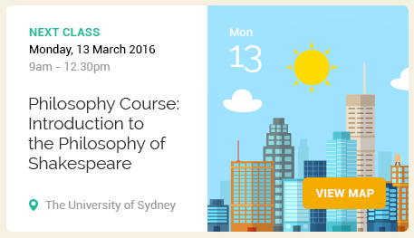

=== Attendance

If a student has attended classes that have attendance marking then an icon will appear on their dashboard with their attendance percentage.
The Attenance percentage is calculated by adding up all the sessions that the student has attended or are absent with a reason divided by the total number of session over the last 12 month period.

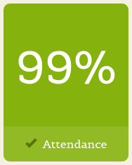

The attendance percentage icon that appears depends on a students average attendance over the last 12 months.

* A green icon will appear if they have attended over 85%
* A orange icon will appear if they have attended between 75% and 85%
* A red icon will appear if they have attended under 75%

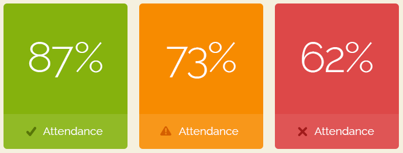

=== Payment Due

If a payment is due there will be an icon on the dashboard notifying the student of this, as seen below.
The 'PAY ONLINE NOW' button is clickable and redirect them to where they can make the payment, more information about this can be found
http://www.ish.com.au/s/onCourse/doc/web/useful_information.html#d5e1357[here.]

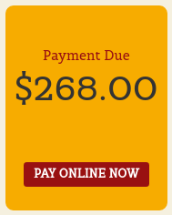

=== USI Required

Students who haven't already provided and verified their USI will see an icon on the dashboard notifying them that it's still required.
They can then click on 'Review Now' which will direct them to the Census Questions tab of the students profile where they can either enter and verify or create a USI.

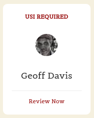

=== Resources

If a user has one or more documents or images linked to their account then they will see a resources icon listing the three most recent upload.
All of the listed resources are clickable and will open in a new tab.
They can also click on the 'View All' button in the top right to be redirected to the Resources page to see the full list of all the attachments.

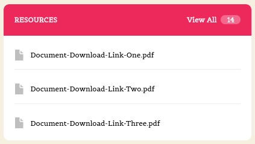

=== Class Feedback

After a student has completed a class they will have the ability to provide feedback about it and rate out of 5 stars.
If there are mulitple classes that haven't been rated then it will show the oldest non-rated class first.
If clicked on it will take the student to the class page.
Once feedback has been provided the block will show the next oldest non-rated class; if there are no others then this icon will no be displayed at all.

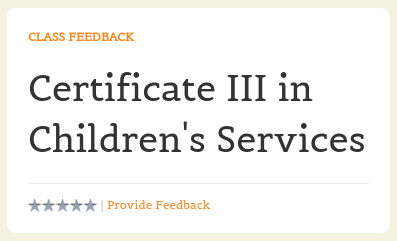

=== Application to Study

If a student has applied to study in a class and has yet to be enrolled or withdrawn then they will see a 'Application to Study' icon similar to the one below.
It will include the name of the class along with the current status.

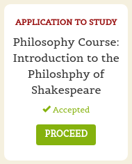

If the application has been accepted then a 'PROCEED' button will appear, which if clicked, will redirect them to the Applications tab of the History page, as shown below.
They can then either click on the 'Enrol Now' button that will take them to a special URL on your website where they can enrol, or they can click on the 'Reject' button that will withdraw their application.

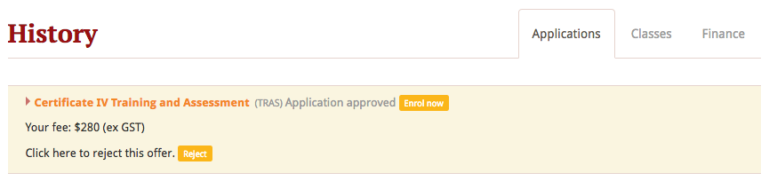

=== Class Approval (tutors only)

If a tutor has been assigned to teach a class and they haven't confirmed whether they can teach it, the class approval icon will appear on their skillsonCourse dashboard.
If a tutor has multiple classes that haven't been approved then the block will show their next non approved class.
If they don't have any classes to approve then this icon will not appear.

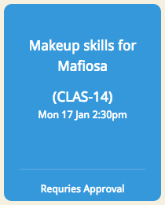

You can check whether a tutor has confirmed if they can teach a class by going to the tutor section of a class and checking if there's a confirmed date below their name.
You can manually set a date by clicking to expand the tutor, clicking the field and adding a date.

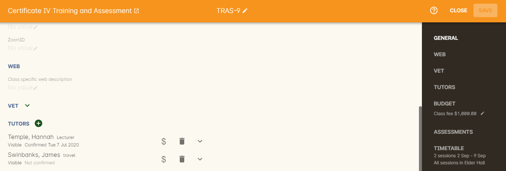

=== Mark Roll (tutors only)

Tutors will see the 'Mark Roll' dashboard icon in their portal if they are teaching a session less than an hour from now.
If there is no such class then this block will show the tutor's last session taught that hasn't been marked.
The icon will show the name of the course along with the start date and time of the session.
The 'Mark Roll' button is clickable and will open the sessions roll marking page in the tutors portal.

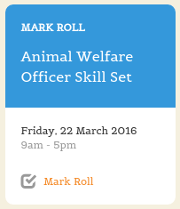

=== Mark Outcomes (tutors only)

This block will appear if a tutor has outcomes for a class they have taught that haven't been marked.
If a tutor has multiple classes with have outcomes that haven't been marked then this block will display the class that ended most recently.

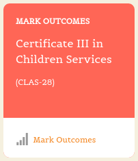

If they click on the 'Mark Outcomes' button then it take them to where they can either mark the students outcomes in the class by Outcome or by Student.

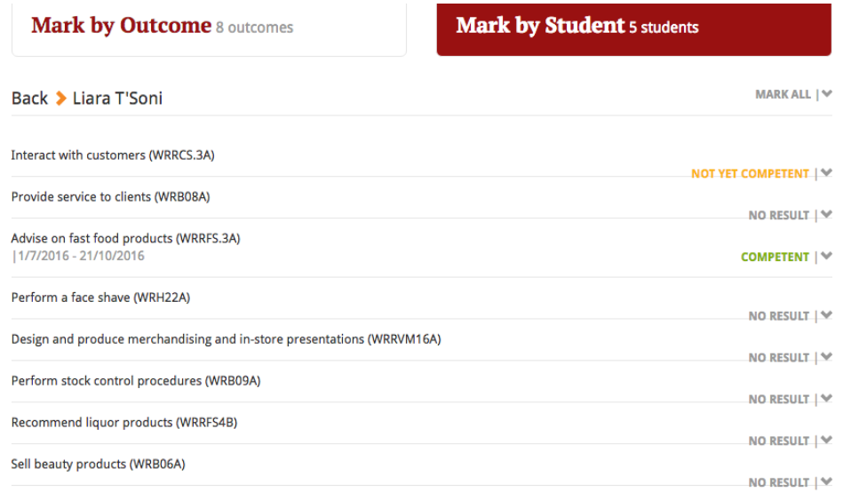
