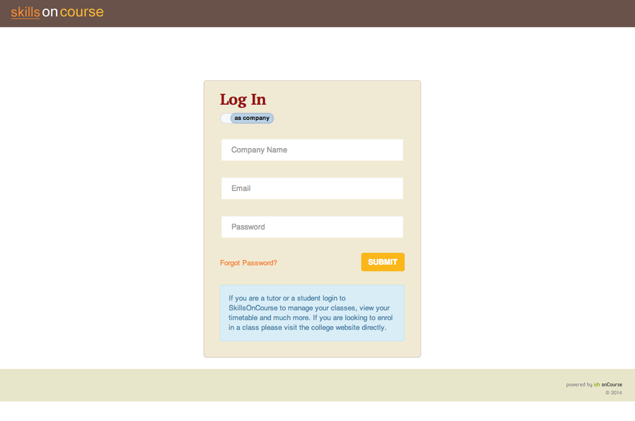
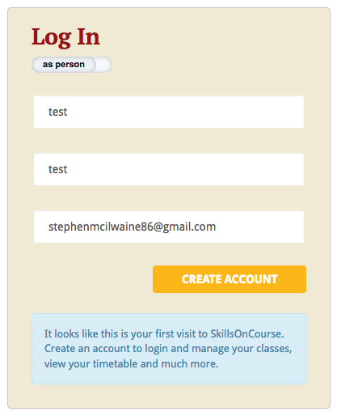
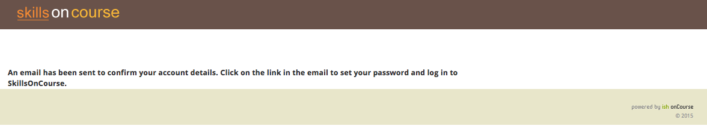
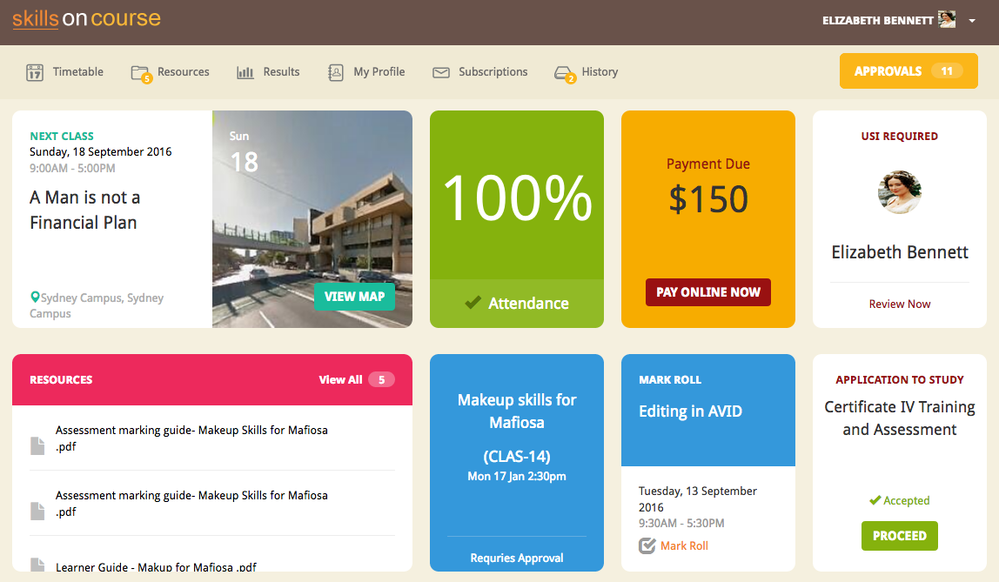
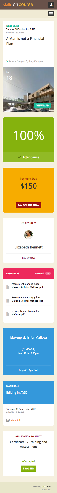
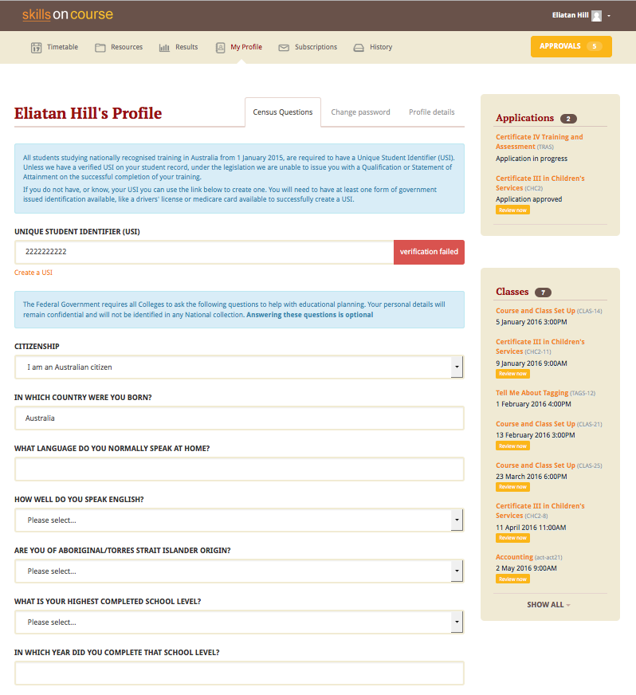

== General

=== Introduction

skillsOnCourse is a website for tutors and students which allows them to interact with your college and with each other.
Every student and tutor is automatically given a login when their record is created in onCourse or when they enrol online.

skillsOnCourse gives tutors the information they need without having to contact you regularly.
"Is my class full?", "Will my class go ahead?", "Can I get a class roll".
These are all things that your teaching staff will ask you every day; now you have a 24-hour assistance to help tutors get the answers they need.

Students will also enjoy the skillsOnCourse portal.
They can quickly and easily get the information they need about their classes and timetable.

=== Creating accounts and logging in

All students when they are created in onCourse, will automatically have a skillsOnCourse account set up for them.
The first time a student enrols in your college, they will be sent an email which allows them to log into skillsOnCourse and set their password.
Tutors are also given an account when their record is created in onCourse.

The skillsOnCourse login screen will prompt the student or tutor to enter their details.
Like the onCourse enrolment process, a student is identified by name and email address to avoid forcing students and tutors to remember another user id.

image:images/Tutor Portal Log In Screen.png[ skillsOnCourse web login page,scaledwidth=40.0%]

It is also possible to log into skills onCourse as a Company rather than an individual.
To do so simply click the 'as person' switch and it will change to 'as company', then enter the email address and password for your company.

==== Auto-detect first time users

skillsOnCourse has the ability to auto detect first time visitors to the site, when following a login link from onCourse.
The direct link that they would visit is
https://www.skillsoncourse.com.au/portal/login?e=email@gmail.com
replacing 'email@gmail.com' with the email address of the user.
The system will auto populate their name and email address and prompt them to create an account on their first visit as shown below.

Once you click on 'CREATE ACCOUNT' button you will be taken to page, as shown below, notifying you that a link has been sent to your email address where you can create a password.

==== Recovering and Resetting Passwords

The main login screen for the skillsOnCourse portal includes a 'forgot password' link.
The user will need to provide a name and valid email address in order to initiate the process.
If the student or tutor does not have an email address in onCourse then they must contact the college so that you can manually update their record.
It is important that you implement an appropriate set of policies around how to authenticate users over the phone when they request that their email address be changed or added, since that email address will give them access to the full profile and history of the user.

If the user clicks on the forgot password link and enters the other details, an email will be sent to them with a link to enable them create a new password.
This link will be valid for 24 hours only, after that time the link within the email will not work.
Once the student has reset their password, they can continue using skillsOnCourse.

....
Dear {name},

To reset your SkillsOnCourse password, simply click the link below. That will take you to a web page
where you can create a new password. Please note that the link will expire 24 hours after
this email was sent.

  {recoveryLink}

If you weren't trying to reset your password, don't worry - your account is still secure and no
one has been given access to it. Most likely, someone just mistyped their email address
while trying to reset their own password.
....

==== Dashboard

Once a user has logged into their skillsonCourse portal they will see a number of blocks that will allow the user to see areas that can be reviewed or need actioned.

==== Updating Your Details

Once logged in, users are able to update their contact details via the Profile details menu.
This screen also enables them to update their password and their responses to the RTO AVETMISS, USI and VET FEE Help student questions, under the various tabs available in their profile.
Any custom fields that have been added and made to be shown in the cms preferences will appear in the 'Profile details' menu option.
As you can see below the custom field 'Drivers Licence Number' has been added to the questions a student can answer or updated themselves.

image:images/Tutor Portal My Profile View.png[ My profile page of skillsOnCourse,scaledwidth=40.0%]

image:images/Tutor Portal My Profile Update Password.png[ Reset your skillsonCourse Password,scaledwidth=40.0%]

==== Updating AVETMISS Details

If a student is undertaking a VET course, they can provide or update the required AVETMISS information via the profile page, on the Census Questions tab.
The student USI can also be supplied and will be verified in real time here, and citizenship information can be provided for funding and VET Fee-Help eligibility.

=== Navigating skillsOnCourse

Students and Tutors are able to navigate their way around skillsOnCourse via the top of page menu options.
By clicking on the 'skillsOnCourse' logo in the top left hand corner of the page, they can return to the home page of the site.
Because the site is built using modern html techniques, the user can safely use the back button on their browser or bookmark any page they like.
When they return to a bookmarked page they will be asked to log in and will then be redirected to the page they bookmarked.

If a student or tutor is updating their profile, they must save their changes before navigating away from that page.
If they leave the page without saving the changes, those changes are lost.

