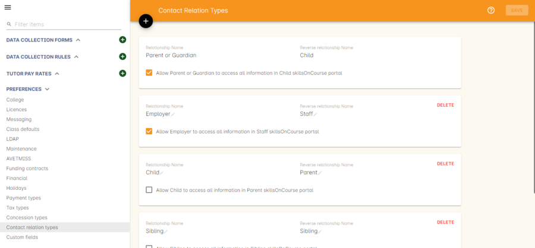
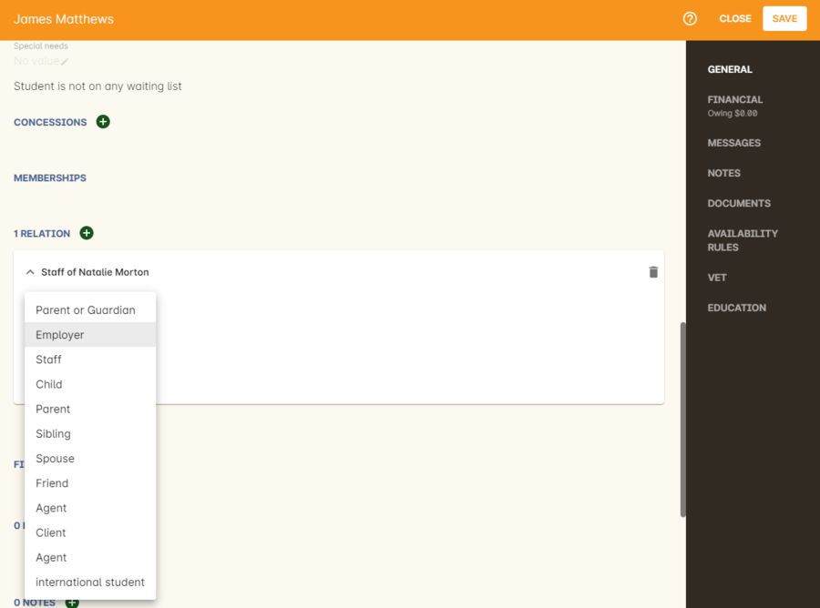

[[user_switching]]
== User Switching

This feature allows you to set up different relationships between e.g. An employer and their staff members and allow them to have access to their skillsonCourse portal login.

=== onCourse Settings

To enable this feature between certain relationship you need to tick the checkbox in the Contact Relation types window in Preferences.
Type 'Preferences' into the dashboard search and open the window, then select 'Contact Relation types' in the left hand column.

Once you have the marked the checkbox, as shown below, the employer will be able to access their staffs skillsonCourse portal.

image:images/contact_relationship_edit.png[ The 'allow access to portal' checkbox,scaledwidth=100.0%]

After a relationship has been created and marked as giving access to information with the skillsonCourse portal then you can start creating relationships between contacts.
To do this you have to open up the contact you want to create relationship to, Scroll till you see 'Relation' then click the + button.
From here a sheet will appear that will allow you to choose who you want to create a relationship to along with what type of relationship.
In the example below I am trying to make 'Natalie Morton' the employer of 'James Matthews'.

Once you have added the relationship it will remain there on the contact record once the record is saved

=== What will you see in skillsonCourse

Once you have marked the checkbox in the Contact Relation Types view in Preferences there should now be an option to switch users within skillsonCourse.
This can be found at the top right hand side of the window.
In the example below you can see user Natalie Morton has been given access to James Matthews' skillsonCourse details.

image:images/skillsonCourse_user_switching.png[ Where to switch users within skillsonCourse,scaledwidth=100.0%]

Once your in a different users account the second name below your name in the top right side of the page will change to the name of what ever users account you are in, as seen below.

image:images/skillsonCourse_user_switching2.png[ View of what you will see in the top right side of the window when Natalie has switched to James' skillsonCourse login,scaledwidth=100.0%]
