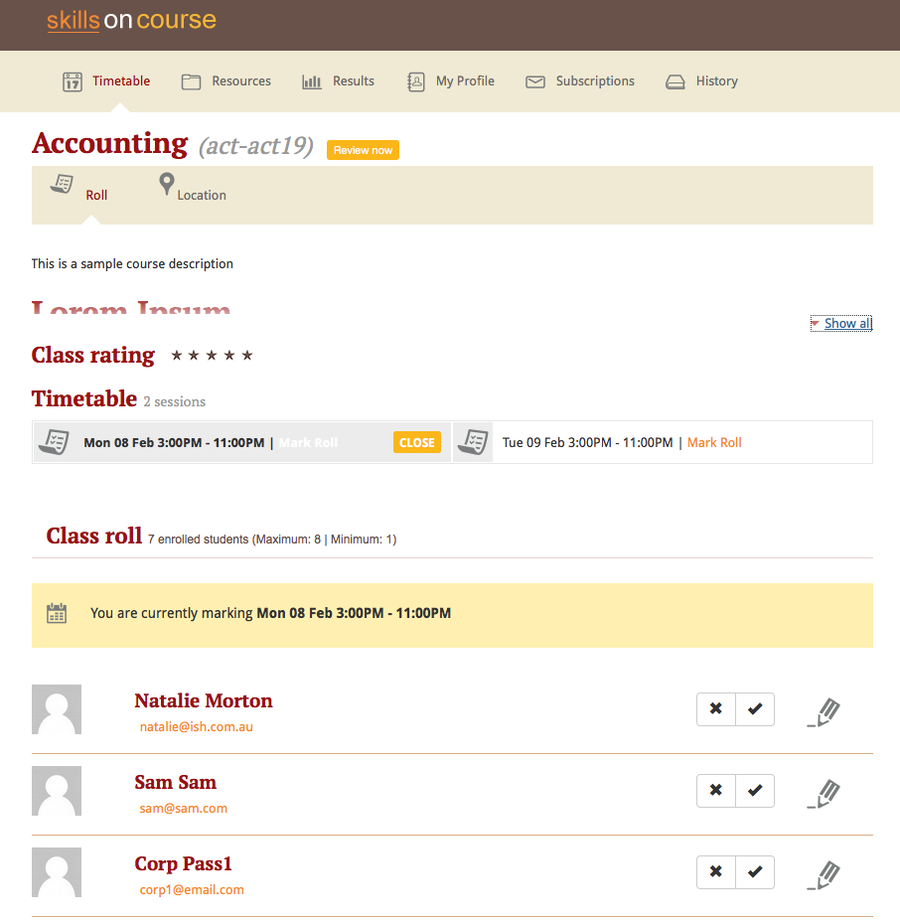

[[tutors]]
== Information for Tutors

[[tutors-portal]]
=== Getting Started

The https://www.skillsoncourse.com.au/portal/login[skillsOnCourse portal] is a website that gives you the information you need about your classes and students without having to contact the college regularly. "What am I scheduled to teach?", "How many students are enrolled in my class?", "What resources should I use to teach the class?". These are all things that the portal can help answer.

You can access your skillsonCourse portal on your desktop computer, tablet, or mobile phone. The screenviews may alter from those shown in this document based on the screen size of your device, but all the functionality is the same.

image::images/Tutor Portal Log In Screen.png[title='skillsOnCourse web login page']

[[tutors-portalPassword]]
=== Creating, Recovering and Resetting Passwords

The first time you visit skillsOnCourse, you will not have a password to login. If the college has your name and email address details recorded in their onCourse database, a password link can be automatically sent to you. If you are not sure what details they have on record, please contact the college so that they can check or update your record with your preferred name and email address.

The main login screen for the skillsOnCourse portal includes a 'forgot password' option. Enter your first name, last name and email address and then click on the 'forgot password' link.

When you click on 'forgot password', an email will be sent to you with a link to allow you to create a new password. This link will be valid for 24 hours only, after that time the link will not work. Once you have reset your password, you will be logged in and can continue using skillsOnCourse.

The next time you visit skillsOnCourse, you can use this new password to login directly.

....
Dear {name},

To reset your SkillsOnCourse password, simply click the link below. That will take you to a web page
where you can create a new password. Please note that the link will expire 24 hours after
this email was sent.

  {recoveryLink}

If you weren't trying to reset your password, don't worry - your account is still secure and no
one has been given access to it. Most likely, someone just mistyped their email address
while trying to reset their own password.
....

[[tutors-portalTimetable]]
=== Your timetable

The first page you see when you arrive in skillsOnCourse is your personalised timetable. This shows you the sessions you are scheduled to teach in a month by month format. The timetable summary of sessions on the top of page shows your upcoming sessions.

Clicking on a session will expand the session view to show any session notes, and also provide you with a quick link through to mark the class roll for that session.

image::images/Tutor Portal Timetable View.png[title='skillsOnCourse timetable view,showing the first session expanded']

Using the 'Sync to Device' link in the top of the timetable, you can subscribe to your timetable so the sessions show in another electronic calendar, such as your phone. You only need to do this once - if the college adds new classes for you to deliver, or if the details of one of your class sessions changes i.e. a room change, then your subscribed calender updates also.

[[tutors-portalClass]]
=== Class information

As a tutor, the primary function of skillsOnCourse is to show your class information, including total number of enrolments, venue and room information. You can navigate to classes through the timetable page or from the history page.

Alternatively you can click on the class name under the 'Classes' column on the right side of the window. The classes column is available in every page of the portal except the timetable view.

image::images/Tutor Portal Classes Menu Details Tab.png[title='You can access detailed class information via the skillsOnCourse portal']

[[tutors-portalAttendance]]
=== Viewing and Marking a Class Roll

You can access the class roll by clicking on the name of the class, and locating the session you wish to mark. The attendance records are then sent to the college in real time. Each session of your class has its own attendance record, and you can scroll through each session. By default, the next session (based on the current date) will show first.

If your college collects student identification photos as part of their enrolment process, you will also see those images in the class roll.

To mark a class roll, you can select the simple options of tick for attended, or cross for absent. If a student arrived late, left early or was absent from the whole session for a valid reason, you can click on the icon next to the roll marking option to add a note and record the student's arrival and departure times.

[[tutors-confirmClass]]
=== Confirming your classes

When you are offered a class teaching opportunity, the college requires you to confirm that you are available to deliver the content as described and according to the schedule of delivery dates.

To access any classes that you have not yet confirmed your availability for, simply click on the APPROVALS button at the top right hand side of the Portal. If you are not available, or cannot otherwise agree to teach the class as described there is a message box to email the college your feedback.

[[tutor_outcome_marking]]
=== Marking non-VET Outcomes

If your college has enabled outcomes marking in the tutor portal, you will be able to mark the students competent, not yet competent, no result or withdrawn in the 'outcomes' section in the class.

. Log in to the portal
. It will open your dashboard.
You will see a widget 'mark outcomes' with the most recent class.
+

. Click on the 'mark outcomes' widget.
This will open the class page to the 'outcomes' tab.
Alternatively, if you are already on the class you can select 'outcomes' tab from the menu on the top of the class page.
. Click/ tap the name of the student to open their marking screen.
+

. In the marking screen, click/ tap on the word competent, not yet competent, withdrawn or no results to select the mark.
. Click/ tap the check box to select 'Set outcomes end date to today'.
NOTE: You will need to check with your college to see if they wish you to use this feature.
. Then click/ tap save to complete.
+

=== Marking VET outcomes

If your college has enabled outcomes marking in the tutor portal, you will be able to mark the students competent, not yet competent, no result or withdrawn in the 'outcomes' section in the class.

The marks you enter will update directly to the college database and may be included reports, automations or the next lodgement for funding, so you should only enter outcomes if they are final.

. Log in to the portal
. It will open your dashboard.
You will see a widget 'mark outcomes' with the most recent class.
+

. Click on the 'mark outcomes' widget.
This will open the class page to the 'outcomes' tab.
If you are already on the class you can select 'outcomes' tab from the menu on the top of the class page.
. You can choose to mark by student or by outcome.
Click/ tap on the 'mark by outcome' button to show the list of outcomes attached to the class or 'mark by student' button to show the list of students in the class.
+

. Click/ tap on the outcome name or student name in the list to open the marking screen.
. Click/ tap on the word competent, not yet competent, withdrawn or no results to select the mark. NOTE: You have the option to mark on the student in the outcome, or all outcomes for that student, if you click/ tap 'mark all' at the top right-hand side.
. Click/ tap the check box to select 'Set outcomes end date to today'.
NOTE: You will need to check with your college to see if they use this feature.
. Then click/ tap save to complete.
+

Jane Citizen is a tutor for Cert III Aged Care. Jane's student Michael has completed all his assessments for the course and was competent for all outcomes on the same day.

* Jane logs into the Tutor Portal using the browser on her mobile
* Jane will then tap the Mark Outcomes' widget on the dashboard to go to the outcome tab on the class
* As it is a VET course, Jane selects 'Mark by Student' to mark one student
* Jane taps Michael's name on the student list to open his record for marking
* Jane selects 'Mark All' to mark all the outcomes
* Jane taps Competent and 'Set outcomes end date to today', and then taps 'save' to complete.

[[tutors-portalDocuments]]
=== Class Resources and Files

You have access to a list of resources and files for each individual class you teach. These can be found by clicking on the 'Resources' option in the top menu. Some of the resources listed will also be available to your students in their portal, while other resources are only available to tutors of the class.

Tutor resources that are generic to the college, rather than specifically related to one of your classes will appear at the top of the list.

[[tutors-portalFeedback]]
=== Class survey results

Students attending your class may be asked to complete a survey rating their experience at the conclusion of their training. You will be able to see a summary of their feedback in the class window.

[[tutors-portalUpdateDetails]]
=== Updating Your Details

Once logged in, you are able to update your contact details via the My Profile menu.

image::images/Tutor Portal My Profile View.png[title='My profile page of skillsOnCourse']

This screen also enables you to change your password at any time.

image::images/Tutor Portal My Profile Update Password.png[title='Reset your skillsonCourse Password']
