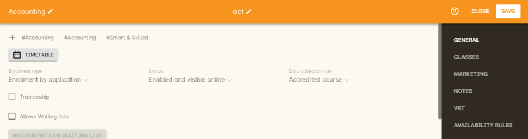
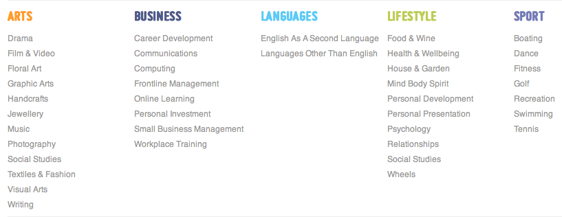

[[images_and_attachments]]
== Attaching images and documents

=== Adding files

onCourse provides an effortless way to display images and documents (for example JPG, PNG, GIF and PDF files) with your website.
Within onCourse you can add documents directly to the Documents section by navigating to the window and clicking the + button.

Alternatively, you can upload or link attachments directly from the edit view inside Course, Class, Tutor, Student, Site or many other places within onCourse.
This links the attachment directly to that resource.

[NOTE]
====
Once an attachment is uploaded via the Resources menu of onCourse, you can preview an image file by double clicking on any attachment entry in the list view.
PDF documents are not able to be previewed via this method.
====

==== Duplicate files

onCourse is clever enough to de-duplicate files when you upload them.
So if you add a 1Mb PDF to the system and then sometime later upload the same file again to onCourse, only one copy will be stored and linked to both places.
This reduces the size of your database.
In order for this to work, the two files must be absolutely identical.
The slightest difference and the two files will be both stored.

=== Displaying media online

If you wish to display attachments and images on your website, firstly make sure that you have the Security level set as Public in the document record inside onCourse.
Then you have several ways of showing content online, depending on where you want to display it.

==== Linked to specific pages

If you attach a document to a course and mark it as 'public' that attachment will be shown on the course description page.
This makes it very simple to add pictures or perhaps a PDF with further course information.
Remember that Google and other search engines will not do a good job with indexing content in Word, PDF or other formats.
So if you want the best exposure online and the best search engine results, put your course descriptions as text directly into the course description.

Attaching a PDF to the course can be useful for specific files such as a pre-enrolment questionnaire, additional information about course requirements, software exercise files, and so on.
Including these files is achieved exactly the same way as including an image on your page...
open the Course, click the Web tab and then the Plus sign to browse the files.
We recommend documents are uploaded as PDF as they can be universally accessed no matter what computer the student is running.


. Open the Course to which you wish to add the document to and scroll to the Documents section.
. Now simply click on the + button next to the Documents heading and type the name of the existing image or upload a new one by clicking the Browse button.
. Once the data updates online, the course detail page ( /course/ABC ) will now have your new document at the bottom.

image::images/upload_image_to_course.png[title='Upload a document to your course via the web page of the given course']


. In onCourse open the Tutor record you wish to attach the image of.
. In the tutor record, click the blank head image in the top left of the window and select the image from your computer.
Click Save.
The image will now appear where the blank head image used to be.
. Provided there is text in the Resume field on their tutor record, the image will display on their tutor profile.

=== Adding thumbnail images

You have the ability to add thumbnail images to all your courses.
These will appear on your website on any courses list view page, so that's any URL that contains /courses after your domain name e.g. www.acme.com.au/courses or www.acme.com.au/courses/business/computing.

image::images/thumbnail_image.png[title='Adding thumbnail images to courses']

To enable this feature you will have to add the following code to the CourseItem.tml file:

....
<div t:type="ui/image" name="${courseItemModel.course.code}_1" width="pixel width" height="pixel height"></div>
....

substituting the words 'pixel width' and 'pixel height' for the correct dimensions.
So assuming the image you are adding is 200px x 200px then the code will be:

....
<div t:type="ui/image" name="${courseItemModel.course.code}_1" width="200" height="200"></div>
....

[NOTE]
====
The CourseItem.tml file can be found in WebDAV by going to templates ->
default -> CourseItem.tml.
====

You would then store the attached image you want to the course and making sure the pixel width and height is the same as the code in the CourseItem.tml and name them 'coursecode_1' e.g. ActingBeg_1.

=== Editing Course Hero Images in onCourse

You can use images you have uploaded into onCourse as hero images for a specific course.
To do so, you first need to add a snippet of code to your site's CourseItem.tml file.

[NOTE]
====
The CourseItem.tml file can be found in
https://www.ish.com.au/s/onCourse/doc/design/overview.html#d5e33[WebDAV]
by going to templates -> default -> CourseItem.tml.
====

This snippet is pasted below:

....
 <div class="hero-image-banner">
            <div t:type="ui/image" name="${courseItemModel.course.code}_hero" class="course-img" width="275" height="183"></div>
          </div>

....

Open the CourseItem.tml in a text editing tool, like NotePad++ or Sublime, then copy and paste this code into the file somewhere out of the way.
Ensure that you set the name of the uploaded hero image in onCourse to x_hero, where 'x' is the course code of the course the image is intended for - e.g. for a Pottery course with the course code POT001, in onCourse you'd want to name the image POT001_hero.

You can edit the height and width values, but be aware that this may result in inconsistent results if the images you upload are all different szes to begin with.

=== Tagging images

You have the ability to display a different hero image on each course detail page.
These will appear on your website on any course detail pages e.g www.acme.com.au/course/accounting.


You would then create a new tag group called 'image' and a tag inside that group. Call that tag 'hero'.

image::images/taggingheroimage.png[title='Creating a new tag group called 'image' and a child tag called 'hero'']

Once you have created this tag group and tag the next step would be to upload the images you want to tag to the document management system.

Once you have done this you will have to tag each of these images with the 'hero' tag.

To enable this feature you will have to add the following code to the CourseItem.tml file :

....
<t:loop source="getAttachments(courseItemModel.course)" value="attachment">
  <t:if test="hasTag(attachment, 'image/hero')">
    <div t:type="ui/image" name="attachment.name" class="course-img" width="200" height="200"></div>
  </t:if>
</t:loop>
....

Lastly you would go into each course you want these images to be displayed and add the document to the course record.
You do this by clicking the + button next to Documents heading and typing in the name of the image you've already added.
If the image isn't uploaded to onCourse yet, click Browse and search your local computer for it.
Remember to make sure the pixel width and height is the same as the code in the CourseItem.tml then tag them to the tag 'hero' in the tag group 'image'.

image::images/tagged_image_course.png[title='Added the image 'dart' to the course 'Accounting'']


[[onlineCollege]]
== Your College Online

[[onlineIntroduction]]
=== Introduction

One of the key features of onCourse is the integrated website. This allows you to promote your courses via your website with seamless online enrolments, waiting lists, mailing lists, discounts, credit card payments, student and tutor portals and much more.

[[onlineUpdating]]
=== Updating your site

Because onCourse has been written as one comprehensive system, updating your website is automated and painless. Every time you make a change to any relevant information those changes are automatically uploaded to your website without you having to do anything specific. For example, this means that as courses are filled the website automatically updates to show prospective students that places are limited.


onCourse makes the uploading and downloading of information (the replication) foolproof so that you don't have to worry about it. Replication was designed by ish to work perfectly even after your internet connection has been offline for a while (say, because your ISP had an outage). onCourse is designed to not require high performance internet links, so you can use very low cost ADSL and because you aren't hosting the website in your office, you don't need to invest in expensive, high performance, high reliability internet connections (such as SHDSL which are typically $400 / month and up). You also don't need servers which provide 24×7 web access for students or have backup power and generators to ensure high reliability website service with a 24-hour climate controlled server room in a secure facility which complies with the Mastercard/Visa PCI security regulations .ish already does all that for you.

All you need are the computers you own today and a plain, simple low-cost internet link to run onCourse. We provide the rest.

* Automatic uploads to the website every time you make a change
* Resilient to outages in your internet connection
* Does not require a high speed connection
* Automatic replication of new enrolments and students from website
* Since you aren't serving the website from your office, you don't need to supply, support or service data-centre quality links and equipment
* Our data centre is constantly monitored and supported by experienced Unix system administrators. It has 24-hour airlock security, temperature control, diesel power backup, halon gas fire control and its own electricity sub-station
* Separate monitoring systems check the availability of every website every 15 minutes. Our technical team is notified of any outage via SMS and email notification.

[[online-coursesOnline]]
=== Enabling courses for online display

Each course needs to be marked as 'Enabled and visible online' from within the General tab when looking at the course to display on the website.
To do this:

. Go to "Course"
. Double click on a course record
. In the course record, make sure the "Enabled and visible online" option is selected under "status"
. Click save



You must also tag your courses with Subject tags for them to display on your website. You may choose to allow subject tags to be set more than once, or limit to one. If a course is tagged with more than one subject, it will appear in the menu for each tag you have assigned.



==== Course description

The field ‘web description' is where you should enter all the information about the course, what students should bring, pre-requisites, outcomes and anything else you can think of. As this is the course, this information needs to pertain to all the classes of this course. If you have class specific information you should put this in the class web description. The web description can be found in the 'Marketing' tab on courses inside onCourse.

The description fields are rich text fields, so you can use bullets, headings and numbered lists. See https://www.ish.com.au/s/onCourse/doc/web/richText.html[our documentation] for more on our richtext markup. You can also include images and attachments in your pages using richtext or HTML.

[[online-classesOnline]]
=== Enabling Classes for online display

Similar to courses, each class needs to be marked as "Enrolment allowed and visible online" from within its record. To do this:


. Go to "Class"
. Double click on a class record
. Make sure the "'Enrolment allowed and visible online'" option is on under "Restrictions".
. Click save

==== Class descriptions

A class's web description can be editted from inside a Class record.

The information that you put in this field should be specific for just this instance of the class. Keep your general course information in the course itself.

==== Summary

* Courses have “Enabled and visible online” selected in the record
* Courses are tagged with at least one tag under Subjects in the tag group (if it has multiple tags, this course will appear under each tag)
* Ensure "Enrolment allowed and visible online” is selected in every class you want to appear on your website.

[[onlineSpecialPages]]
=== Special Pages

Some URLs on your site are reserved for special pages. These pages are delivered by the onCourse software itself. To customise them, consult the templates chapter for details of how these pages are created.
These pages include:

/courses::
A list of all courses which are marked as web visible.
/course/arts::
A list of all courses tagged with the tag "arts" from the "subject" tag group.
/courses/people/get-better-job::
A list of all courses tagged with the tag "get-better-job" from the "people" tag group.
/course/ABC::
The detail of the course with code ABC.
/class/ABC-123::
The detail of the class with code ABC-123
/sites::
A list of all sites marked as web visible.
/site/12::
The detail of site with internal id 12.
/tutor/23::
The detail of the tutor with internal id 23.
/checkout::
All pages under this path are reserved for the enrolment/checkout processing pages.

[[onlineAdvancedSearch]]
=== Advanced Search Options

onCourse includes a Solr search engine indexed to your website. This allows users to use the built in simple or advanced search tools on your webpages to find the courses they are looking for, or for you to craft URLs which include certain search results.

You can also choose to include only courses tagged with a set tag group in your search engine index, this is commonly done when providers have multiple websites for different training departments. i.e. the workplace learning site only ever searches on and shows results tagged with professional development, while the community site indexes all courses.

The sort order for course results in a list view page prioritises courses with classes starting next. When a search parameter is added into a page, the sort order is shifted to bring results with a greater relevancy to the top of the page, and then to sort by classes starting next.

To see the scoring priority for each course in a search result, add the string ?debugQuery=true to the end of your URL.

When adding a 'near=' search, it will automatically hide results outside of 100km radius the search suburbs' GPO. This can be useful if you deliver in seperated locations. For example, a website visitor who searches for courses in Sydney is unlikely to be interested in results in Melbourne, but may be interested in results in Chatswood. In this case the Melbourne classes would be suppressed from the list but shown to the user if they click the button 'Show other classes'

Classes that are full or cancelled are suppressed from the course results.

If you wanted to craft some specific searches to put behind image banners, promotional ads or other links, you can build your search within a tag group URL to make the results more specific.
For example, if you want a promo for day time cooking classes your search might be www.myurl.com/courses/cooking?time=day which will find all the courses tagged with the subject tag group named cooking that have classes running during the day time.

The onCourse search options available are:

Keyword search::
Example - _/courses?s=cook_
 +
This is standard keyword search, which includes stemming so the term cook will find cook, cooks, cooking, cookery ect.
The search results prioritise courses where the search term appears in the course name, over courses where it appears in the course description.
Search by proximity to location::
Example - _/courses?near=Chatswood/2067/1_
 +
Search on both the Suburb/postcode/search radius in km.
While the search may work without the postcode, adding the postcode is essential to determine location if the suburb exists in multiple states.
You do not require the search radius for this to function.
Search by price::
Example - _/courses?price=200_
 +
This searches for classes with an enrolment fee less than the specified dollar value.
Search by specific tutor::
Example - _/courses?tutorId=1234_
 +
This searches for all classes that the tutor with ID number 1234 is currently teaching.
To find what a tutors ID is you will need to find a class that is online and one the tutor currently teaches.
Then right click on their name, in the class block, and open the link in a new window/tab.
The tutors ID will be the last few digits of the URL. So if the URL is www.yoursite.com.au/tutor/3, then the tutor ID is 3.
Search by time of day::
Example - _/courses?time=daytime_
 +
Searching for a day class means the first session commences before 5pm.
 +
Example - _/courses?time=evening_
 +
Searching evening means the session starts after 5pm.
Search for classes starting on a specific day::
Example - _/courses?day=mon_
 +
This searches for a class where the first session is on Monday.
 +
Parameters:
 +
* mon
* tues
* wed
* thurs
* fri
* sat
* sun
* weekday - _searches for classes where the first session is held Monday to Friday_
* weekend - _searches for classes where the first session is held on a Saturday or Sunday_
Date Specific Search::
Example - _/courses?after=20141201_
 +
This will show class that start after the date 1/12/2014. The date in the search is in format yyyymmdd.
 +
Example - _/courses?before=20141201_
 +
This will show classes that start before 1/1/2015. The date in the search is in format yyyymmdd.
This can be used in combination with the after search option to create a date range.
Relative Time Search::
Example - _/courses?before=30_
 +
This will show all classes starting within the next 30 days.
 +
Example - _/courses?after=365_
 +
This will show all classes that are starting 365 days or more after the current day.
Tag Specific Search::
Example - _/courses/cooking?tag=delivery/School+holidays_
 +
This search allows you search for courses that are tagged with multiple tags.
You must use the full secondary tag path.
This means the course is tagged with both the landing page tag (usually the tag group from within the subjects tag) and the search term tag.

Multiple search teams can be concatenated to created complex search strings such as _www.myurl.com/courses/cooking?s=thai&near=Chatswood+2057&price=500&time=day&tag=level/beginner_ which is searching inside the subject tag group cooking for courses also tagged with the level tag group beginner that contain the keyword Thai, held near Chatswood NSW in the day time and costing under $500.

[NOTE]
====
A note on the space character inside a URL: If you have a tag name that contains a space, and you are manually crafting a URL that includes that tag, you need to replace the space character with a + symbol e.g. tag name "cooking for kids" in a URL becomes "cooking+for+kids". This is done automatically for pages generated by onCourse, it is only in hand crafted URLs you need to remember to add the space delimiter. "%20" works also, but makes the URL harder for a human to read.
====


[[onlineAdvnacedFiltering]]
==== Filtering class results using advanced search

Advanced search parameters can also be added to specific course pages, to filter the list of results returned. This can be a useful function when you offer the same course in multiple locations, but users only want to see the classes from a specific location.

These search options are appended to a standard course page, with the URL containing the course code. In these examples, course code ABC123 is used.

Example - _/course/ABC123/?near=Chatswood+2057_::
Search on both the Suburb+postcode. While the search may work without the postcode, adding the postcode is essential to determine location if the suburb exists in multiple states.
Example - _/course/ABC123/?time=day_::
Searching for day classes of a course means the first session commences before 5pm.
Example - _/course/ABC123/?time=evening_::
Searching evening classes of a course means the first session starts after 5pm.

[[onlineFacetedSearch]]
=== Faceted Search

Faceted search uses a hierarchy structure to enable users to browse information by choosing from a pre-determined set of categories. This allows a user to type in their simple query, then refine their search options by navigating. In reality, it's an advanced search going on in the background, but instead of the user having to think of the additional search categories, it's been made easier for them by the visible folder structure. Examples of other websites that use it are Amazon and eBay.

You can select more than one option in the faceted search which will allow you to view more than categories results.

In the example below ther has been one option selected in the Locations tag and two options in the Courses tag. The courses that are displayed will be ones that are being taught in Sydney that have either been tagged to Barista & Coffee Art or RSA Course. The URL that is generated after the domain name from this search is /courses/barista+%26+coffee+art+courses?tag=/rsa+courses&near=sydney/2000/5

image::images/faceted_search.png[title='Example of how the faceted search is used']

If you only selected the Sydney option above then the URL you would get is __/courses?near=sydney/2000/5;__if you only selected RSA Courses then the URL you would get is /courses/rsa+courses; and if you selected both Sydney and RSA Courses then the URL you would get is _/courses/rsa+courses?near=sydney/2000/5_.

[[onlineSEO]]
=== Search Engine Optimisation

There are a number of tools available to you to help maximise the search engine optimisation for your onCourse website.

[[onlineGoogleTools]]
==== Google tools

Google offer a range of really useful free tools to help drive search results to your site and analyse who is visiting your site, why they are visiting your site and how much they are spending.

[[onlineAnalytics]]
===== Analytics

ish will automatically sign you up to this service when we set up your account. onCourse has special hooks into Google Analytics to pass through the ecommerce details of people who visit your site, so not only can you see who is coming to your site and from where, but you can see which sources of traffic result in actual money being spent. It is all very well to get thousands of page views from Facebook, but unless that traffic is generating enrolments you aren't getting the results you really need.

[[onlineTagManager]]
===== Tag Manager

Google Tag Manager is a powerful tool which allows you to inject javascript, images or other content into your web pages. Every onCourse site automatically comes with a tag manager account for your use. Although you can get by with never logging into Tag Manager, this is a really useful way to dynamically add scripts to your site. There are so many tools available for you, many of them free.

* user tracking
* remarketing tools (following users around the internet with ads for your site)
* Facebook
* user experience measurement (eg. using hotjar to watch a user's mouse clicks to see which parts of your site are hard to use)
* A-B testing (show different content to different users and measure the results)

[[onlineWebmasterTools]]
==== Webmaster Tools

This free tool is something you can set up yourself. Just go to https://www.google.com/webmasters/tools[www.google.com/webmasters/tools] and click "add a site". You'll be given several choices for how to verify your site; choose "HTML file upload" option. Take the file and upload it to your onCourse site in the top of the /s folder using webDAV. Don't forget to then publish your site changes into production.

You may decide to engage the services of an SEO company, and they may want to add your site to their own Webmaster tools. There is no problem with uploading several different Google html verification files to your site.

Once you have performed the verification, a huge number of options are available to you. Most importantly you'll want to review your organic search results, look at who is linking to you, make sure Google knows which country you are in.

[[onlineSiteMap]]
==== Site Map

onCourse automatically generates a sitemap for all your content, so you don't need to maintain this by hand. This ensures that Google is able to locate every page in your site and index it. Whether you get page hits from Google search will of course depend on what you have on that page and how popular it is, but at least you know that Google will find every single page of your site.

For more information on Search Engine Optimization, refer to the https://www.ish.com.au/s/onCourse/doc/design/seo.html[SEO and analysis chapter of our Web Desgin manual.]


[[richText]]
== Markup

The #editor will let you use one of three different styles of markup, which you must define using the dropdown box in the top right of the content window; legacy, html and markdown.

image::images/editor_syntax_dropdown.png[title="The content edit view with 'Markdown' selected in the top-right"]

image::images/editor_dropdown_selections.png[title="The three choices of editing syntax: markdown, html and legacy (rich text)"]

[[richText-HTML]]
=== HTML

If you select HTML you can use standard HTML tags to build the content on your page. This is only recommended for advanced users with a prior working knowledge of HTML, otherwise we recommend using markdown mode.

[[richText-md]]
=== Rich Text

Markdown is a simplified markup language designed to be easy to use for people who don't code. To add content using markdown, select 'markdown' from the drop-down box in the top-right of the content page you're editing. HTML cannot be used in Markdown mode.

==== Simple guide to Rich Text

.Common formatting options
[cols=",,",options="header",]
|===
|You type |Output |Notes
a|
....
The sun was **shining on the sea**
....

|The sun was *shining on the sea* |All text between the * will be bold.
Don't put a space between the * and the text.

a|
....
Shining with _all its might_
....

|Shining with _all its might_ |All text between the _ will be italics.
Don't put a space between the _ and the text.

a|
....
* Now this was very odd
* because it was
* the middle of the night
....

a|
* Now this was very odd
* because it was
* the middle of the night

|Make sure you put a space after the * on each line.

a|
....
1. Now this was very odd
2. because it was
3. the middle of the night
   1. it was dark
   2. no one was home
....

a|

. Now this was very odd
. because it was
. the middle of the night
.. it was dark
.. no one was home

|Make sure you put a space after the . on each line. If you want an ordered sub-list, at any point put three spaces before the number.

a|
....
# The Moon
....

| *The Moon* |  Header are created using the hashtag symbol, a space and then the heading. You can use up to four hastags in a row for different level headings. See below under Headers for more information.

a|
....
https://hole.example.com[Alice]
....

|https://hole.example.com[Alice] |The url is the link the user will be redirected to upon clicking, while the text wrapped in the brackets becomes the hyperlink text.

a|
|===


[[richText-mdHeaders]]
==== Headers
To type out a header, add a # symbol at the beginning of the line. The number of # you use, up to 4 total, sets the type of heading that's used.

[source,markdown]
----
# H1
## H2
### H3
#### H4
----

[[richText-mdEmphasis]]
==== Emphasis

You can bold or italicize text by wrapping the text in asterisks and/or underscores.

[source,markdown]
----
You can **bold text** using twin asterisk's (**) on either side of the text you want to emphasize.
You can use _italics_ by using an underline (_) on either side of the text you want to emphasize.
You can also combine the two to create text that's **both bold and _italicized_**.
----

[[richText-mdLineBreaks]]
==== Line Breaks

Line breaks can be added by starting a new paragraph with a line gap in between the first paragraph and the second.

[[richText-mdLists]]
==== Lists

You can create both ordered and unordered lists, and combinations of the two as well. Some examples include:

[source,markdown]
----
* This is
* an unordered
* list

1. This is the first entry in an ordered list
2. second entry
   1. ordered sub-list 1
   2. ordered sub-list 2
3. third entry
4. fourth entry
    * the fourth entry has an unordered sub-list
    * second entry in the unordered sub-list
5. fifth entry
----

[[richText-mdLinks]]
==== Links

You can create in-links using the following syntax:

....
[The text you want inside the link](https://www.theurl.com.au)
....

It'll come out something like this:

[source,markdown]
----
Click this [link to search](https://www.google.com.au) for your favourite courses
----

[[richText-mdImages]]
==== Images

You can reference images stored in your onCourse documents by using its reference URL like so:

....

....

Whatever you put in 'Title Text' will appear when hovering the mouse over the image and is useful as a caption.

[[richText-mdCodeBlock]]
==== Code blocks

You can highlight portions of text to preserve things like code formatting by flanking the text using the ` symbol. You can also create code blocks this way, see the example below:

[source,markdown]
----
You can highlight `certain words` or a `call to action` like this.

```
<!DOCTYPE html>
<html>
<body>

<p>This is how you can present code using markdown.</p>
<p>This example uses html, but it can be anything you like.</p>

</body>
</html>
```
----

[[richText-mdVideos]]
==== Videos

You can insert videos using pure Markdown, however it's far simpler (and better for users as well) if you simply embed the html code into the page. Video services like YouTube have an easy 'Embed' button that gives you the code you need to copy and paste into the content field of the page you're editing.

[[richText-mdBlockQuote]]
==== Block Quotes

You can add Block Quotes to your text by using a > symbol at the beginning of the line, like so:

[source,markdown]
----
> This is a block quote.
> This is a part of the same block quote.
----


[[richText-Legacy]]
=== Legacy

==== Formatting text

Many places in onCourse where can enter large amounts of text to display on the website will allow you to enter "rich text". This includes web pages, course descriptions, tutor profiles, site descriptions and much more. Rich text is used for simple styling of your text, without you needing to know any HTML. The headings, fonts and bullet point styles used on your website are determined by your template and design. Anywhere you can enter rich text, you can also enter HTML, if you have these skills.

You can also enter rich text in any web page or block within the CMS when 'legacy' is selected.

[[richText-guide]]
==== Simple guide to legacy

.Common formatting options
[cols=",,",options="header",]
|===
|You type |Output |Notes
a|
....
The sun was *shining on the sea*
....

|The sun was *shining on the sea* |All text between the * will be bold.
Don't put a space between the * and the text.

a|
....
Shining with _all its might_
....

|Shining with _all its might_ |All text between the _ will be italics.
Don't put a space between the _ and the text.

a|
....
* Now this was very odd
* because it was
* the middle of the night
....

a|
* Now this was very odd
* because it was
* the middle of the night

|Make sure you put a space after the * on each line.

a|
....
# Now this was very odd
# because it was
# the middle of the night
....

a|

. Now this was very odd
. because it was
. the middle of the night

|Make sure you put a space after the # on each line.

a|
....
h1. The Moon
....

|*The Moon* |Use the h1. for a large heading (you can also use h2. h3.
h4. and h5. for smaller headings). Ensure you use a lower case h and
full stop and space after the number. Leave a blank line of text between
your heading text and the following paragraph, or all the text to follow
will be rendered as a heading also.

a|
....
"Alice":http://hole.example.com
....

|http://hole.example.com[Alice] |The text wrapped in the quotes becomes
the hyperlink text and the url which follows is the link the user will
be redirected to upon clicking.

a|
....
"Rabbit":/course/stew
....

|http://hole.example.com/course/stew[Rabbit] |An internal hyperlink is
similar, however you do not have to provide the full path name. You only
need to provide the text that appears after your domain name.

a|
....
"Queen":mailto:red@hole.example.com
....

|mailto://red@hole.example.com[Queen] |To create a mailto link, the text
inside the quotes becomes the hyperlink which will open your users
default mail client, followed by the email address.
|===

For further information about rich text, please look at the
http://en.wikipedia.org/wiki/Textile_%28markup_language%2
9[Textile
documentation].
We use textile with some special extra additions for dynamic course content.

=== Dynamic content

Using *rich text markup* onCourse is able to draw from many parts of your data.
Maybe you wish to display a banner, linked to a random course from a subset of high priority courses; or display a collapsible menu of subject.
Maybe you'd like to add the complete contents from one group of specially tagged blocks of content.

By using the dynamic content rich text markup your web pages will always be up to date.
If you change a course description, then everywhere that course is referenced will automatically update.

There are many types of content you can insert into a page and you can use the following markup anywhere rich text is supported.
That is, you can insert images, course lists, video and much more inside other web pages, course descriptions, tutor resumes and any other place you see the rich text symbol.

.Dynamic rich text
[width="100%",cols="50%,50%",options="header",]
|===
|What you want |Rich text to use
|Position an image within some text |\{image}
|Link to an attachment |\{attachment}
|Insert a re-usable CMS block within some text |\{block}
|Display a course description within another page |\{course}
|Show a list of courses |\{courses}
|Display a list of subjects |\{tags}
|Embed a page inside another page |\{page}
|Display a video within a page |\{video}
|Display a form within a page |\{form}
|Add text field into a given form |\{text}
|===

=== \{block}

Start by creating a new Block in the CMS editor and giving it the title of "bannerAd1".
Put some text in there an image with a link to some special offer.
Once this Block is saved it can be displayed in either your content or another block, throughout your website by the simple inclusion of the rich text markup

==== Usage

....
{block name:"bannerAd1"}
....

name::
The name of the Web Block.
Blocks cannot share the same name, so make sure each in unique.

[[Course]]
=== \{course}

The second rich text markup we consider is *\{course}* This tag functions to embed specific onCourse Course data into a page or web block.
It can display data/content either at random, or specified from a particular grouping - ie evening classes.
If a course is chosen at random - courses can be restricted by specific tagging and basic class information can also be displayed.

You might like to highlight particular courses on your front page ("Course of the Week" for example), or display a random course in a 'block' in the sidebar across all pages of your website - the possibilities are endless.

==== Usage

....
{course tag:"/Subjects/Leisure/Arts" showclasses:"false"}
....

[tag]::
Optional.
Defines the path to a tag.
The full path to the tag must be specified. e.g.
"/Subjects/Leisure/Arts and Craft".
This option is ignored if the "code" parameter is passed.
A random course will be displayed from the tag specified.
If no tag is defined, "/Subjects" is assumed.
[code]::
Optional.
Specifies a particular course code to display.
If this option is not defined, a random course will be shown.
[showclasses]::
[true, false] Optional.
A unordered list of all the classes available for this course will also be displayed.
Default is false.

[[tags-courses]]
=== \{courses}

The third rich text markup we should look at is *\{courses}* This variation of the "course" code will display a List of courses within your content or "block"; and can be sorted dynamically by number of filters including; by start date; alphabetical listing, and others.

For example the Courses markup could be used if you wished to create a home page... or landing page that contained the most popular courses, alternatively Courses that were about to start through the coming week.
To do so, what you would need to do is open the relevant page - home page or other, and place the following rich text markup: (replace 'yourTopicsHere' with an appropriate list)

==== Usage

....
{courses tag:"/Subjects/Leisure/Arts" limit:"3" sort:"alphabetical" order:"asc" style:"titles"}
....

[tag]::
Defines the path to a tag.
The full path to the tag must be specified.
e.g. "/Subjects/Leisure/Arts".
All courses with this tag will be displayed.
If no tag is given then "/Subjects" is assumed by default.
[showTag]::
If the parameter is true then it shows all tags.
 +
If tag parameter is not defined then it uses "Subject" first layers tags.
 +
default: false
[limit]::
The maximum amount of courses that will be shown.
If no limit is defined, the default setting is that all valid entries are displayed.
[sort]::
[alphabetical, date, availability] Optional.
What fields you can use to sort the courses;
 +
alphabetical: course.name.
 +
date: course.startDate
 +
availability: course.availableEnrolmentPlaces
 +
default: alphabetical
[order]::
[asc, desc] Optional. ascending or descending order.
Default is ascending.
[style]::
[titles, details] Optional.
Which predefined template will be used to show every course:
 +
titles: shows only name of course
 +
details: shows full information about this course
 +
default: details

[[tags-tags]]
=== \{tags}

Tags are the most common way of creating navigation to your courses and classes.
You might organise your courses into subject categories, e.g.:

* Arts
* Leisure
** Cooking
** Crafts
* Business
* Languages
* Sports

Using onCourse's powerful tagging system, you might also organise your courses according to skill level:

* Beginners
* Intermediate
* Advanced
* Masterclass

Or, perhaps by target audience:

* Kids
** 1 - 4 years old
** 5 - 8 years old
** 9 - 12 years old
* Teens
* Adults

You may then want to display that tag structure on your website to allow users to navigation through it.
Clicking on any tag will take the user to a URL like /courses/leisure/crafts and all the relevant courses will be displayed on that page.
To place a tree of tag options on a page, simply use the rich text "\{tags}".
Further options allow you to customise the output.

==== Usage

....
{tags name:"/Subjects/Leisure/Craft" maxLevels:"3" showDetail:"true" hideTopLevel:"false" template:"TagItem.tml"}
....

[name]::
Optional.
Defines the path to a tag.
The full path to the tag must be specified. e.g.
"/Subjects/Leisure/Craft" and will display all child tags including the specified tag.
If no name is provided then it will default to "/Subjects".
[maxLevels]::
Optional.
Defining this option will limit how many levels of the tag tree will be displayed.
For example, "1" will only show the top level tag and nothing else.
If nothing is provided here then all levels of the tag tree are shown.
[showDetail]::
[true, false] Optional.
If true, a tag's description (as defined in the onCourse client) will also be displayed.
The default option is false.
[hideTopLevel]::
[true, false] Optional.
If true, the top level tag is not displayed.
The default option is false.
[template]::
Optional.
The name of the template to use for rendering each item in the tag list.
Defaults to TagItem.tml.
If you set this to something else, make sure you create the appropriate file in your website resources.

==== Sample HTML output

[source,xml]
----
                <div class="taggroup-2405">
  <ul>
    <li class="hasChildren childSelected">
      <a href="/courses">Personal Development</a>
      <ul>
        <li><a href="/courses/personal+development/work">Work</a></li>
        <li class="selected"><a href="/courses/personal+development/life">Life</a></li>
        <li><a href="/courses/personal+development/love">Love</a></li>
      </ul>
    </li>
  </ul>
</div>

----

The output of \{tags} with a little css styling applied.

=== \{page}

You may want to display content from one page within another page.
Use this rich text element to embed content.

==== Usage

....
{page code:"123"}
....

code::
The page number you wish to embed.
This is the same as the number at the end of the default URL for the target page ("/page/123").

=== \{form}

You are able to use this markup to display a form on the page which anyone can fill in.
This can be very useful as a 'contact us' form for example.
When the user enters the required data, an email is sent to the address you nominate with the information entered.
This is the only rich text markup which requires a closing bit of markup to designate where the form ends.
Don't forget to insert \{form} at the end!

==== Usage

....
{form name:"email us" email:"sales@acmecollege.com.au" url:"/thankyou"}
                {text label:"Email address" required:true}
                {text label:"First Name" required:true}
                {text label:"Last name" required:true}
                {text label:"Phone number" required:false}
                {text label:"Reason for complaint" required:true lines:8}
                {form}
....

name::
The name of the form.
It is not visible to the user on the webpage.
email::
This is where the email will be sent.
It is not visible to the user on the webpage.
[url]::
After the user submits the form, they will be redirected to this URL.
If not supplied, they will be returned to the current page.
required fields::
If you wish to set a given field as a required field, you can reflect this within the form as either 'true' or 'yes' if it is required.

=== \{text}

This markup is only useful inside \{form} markup (see the previous section).
You use this to add a text field into the form.

==== Usage

....
{text label:"Reason for complaint" required:true lines:8}
....

label::
The visible label shown next to the field.
[required]::
If you set this to "true" then the user cannot submit the form without entering some value here.
Setting this to any other value or leaving it out means that the field is optional.
[lines]::
Setting this to "true" displays a text area 10 lines high.
You can also explicitly set this to any other integer number of lines.
If this value is not set, a single line text field will be shown.
[maxlength]::
This can be set to any integer value greater than 1 and limits the input in this field to this number of characters.
Note that spaces count toward this maximum.

=== \{radiolist}

This markup is only useful inside \{form} markup.
You use this to add a set of radio buttons into the form, of which only one can be selected.

==== Usage

....
{radiolist label:"Age range" default:"20-25" options:"20-25,26-30,31-35,36-40,41-45,46-50,50+"}
....

label::
The visible label shown next to the field.
[default]::
This is the radio button which is selected by default.
If nothing is supplied here, then there is no default selected.
[required]::
If you set this to "true" then the user cannot submit the form without entering some value here.
Setting this to any other value or leaving it out means that the field is optional.
[options]::
This comma separated list of options will be displayed as the list of radio button options.
You must have at least two options.

=== \{popuplist}

This markup is only useful inside \{form} markup.
You use this to add a popup list into the form, of which only one can be selected.

==== Usage

....
{popuplist label:"Age range" default:"20-25" options:"20-25,26-30,31-35,36-40,41-45,46-50,50+"}
....

label::
The visible label shown next to the field.
[default]::
This is the item which is selected by default.
If nothing is supplied here, then there is no default selected.
[required]::
If you set this to "true" then the user cannot submit the form without entering some value here.
Setting this to any other value or leaving it out means that the field is optional.
[options]::
This comma separated list of options will be displayed as the list of options.
You must have at least two options.

[[images_and_attachments-image]]
=== \{image}

You may want to attach images and other files to courses, classes, sites, rooms and tutors and have them appear on the website.
Just attach the file you want in onCourse via the Training > Documents menu item, click the '+' button and upload the file or image, mark it as 'Public' via the Access dropdown box and that file will be automatically transferred and attached to your site.
These files will appear by default at the bottom of the relevant page.
So for instance, just attach a PDF to a course to have that document appear as a link at the bottom of the course description.
Likewise, pictures will appear at the bottom of the page.
If however you would like to position the image somewhere else (say, next to the relevant paragraph of text) you can do so with a special rich text entry called \{image}.

==== Usage

....
{image name:"duck" align:"right" caption:"This is a duck"}
....

[name]::
Optional.
The name of the image.
If this is not given and the id is also not given, then a random image is displayed from those linked to the relevant database object.
For example, if the rich text is a course description, then the random image will be one of the images linked to that course; if the rich text is a tutor profile, then the random image will be chosen from those attached to the tutor.
[id]::
Optional.
If you know the internal reference of the binary image object, you can use that here instead of the name.
If both id and name are passed, then the name will be ignored.
[align]::
[left, right, center, centre] Optional.
By default, images are left aligned.
[alt]::
Optional.
If supplied, the image will be given this 'alt' tag which is mainly useful for accessibility purposes.
That is, people with vision difficulties may have a screen reader which can read out the names of images.
If this value is not supplied, the alt tag is set to the image name.
[caption]::
Optional.
A caption to display under the image.
[width]::
Optional.
Specify the width of the image in pixels as it will display on the webpage.
If not supplied, the image will display at its full size.
[height]::
Optional.
Specify the height of the image in pixels as it will display on the webpage.
If not supplied, the image will display at its full size.
[class]::
Optional.
A CSS class will be added to this image for styling purposes.
[link]::
Optional.
If supplied, this image will be made an href link to the destination you specify.

[[images_and_attachments-video]]
=== \{video}

Embed a video on your page.
You will not upload the video directly to onCourse, but instead use a third party service like YouTube - their servers are optimised for video delivery and the performance and tools more helpful.

You can also use this within the Marketing tab of any Course, Class or anywhere else that uses this rich text format.
Just copy and paste the below portion of code, and replace the youtube_id with the id from the YouTube video you wish to embed.
You can find this after the = sign in the Video URL.

==== Usage

....
p<{height:315px}. {video type:"youtube" id:"youtube_id" height:"315" width:"560"}
....

type::
Currently only "youtube" is supported.
id::
This is the remote id of the video.
For example, a youtube video which has a URL of http://www.youtube.com/watch?v=YGwtEzZPb7M would have an id of 'YGwtEzZPb7M'
[height]::
The height in pixels you want to force the video to.
If you leave this option out, it will default to the standard player size.
You need to enter this twice, as referenced in the example above.
Both height parameters should match.
[width]::
The width in pixels you want to force the video to.
If you leave this option out, it will default to the standard player size.

[[images_and_attachments-attachment]]
=== \{attachment}

Link to an attachment.
When your user clicks on the link, the file will be downloaded. You will want to use well accepted file formats such as PDF.

==== Usage

....
{attachment name:"course_guide"}
....

name::
The name of the attachment as you specified it in the onCourse attachment entry screen.

[[Tutors]]
=== \{tutors}

You are able to use this markup to display tutors on your home, courses, course detail, internal page or any other page. Use this rich text element to embed tutors.

==== Usage

....
{tutors tagName:"featured"} 
....

....
{tutors id:"10"}
....


[tagName]::
Optional. Shows 3 random tutors tagged with 'featured' tag if [count] is not specified. Please note that featured is not a tag group but its name of certain child tag.
[count]::
Optional. Defining this option will limit number of tutors that needs to be displayed. Default value is 3.
[id]::
Optional. The specific tutor you wish to display. id parameter refers to angelId. This is the same id which we use in tutor page. ("/tutor/123")