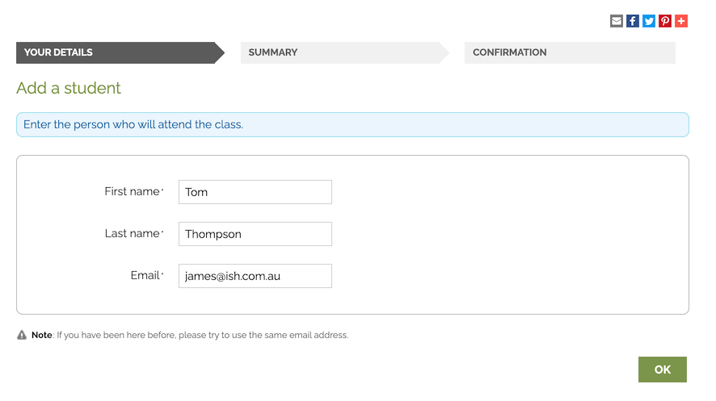
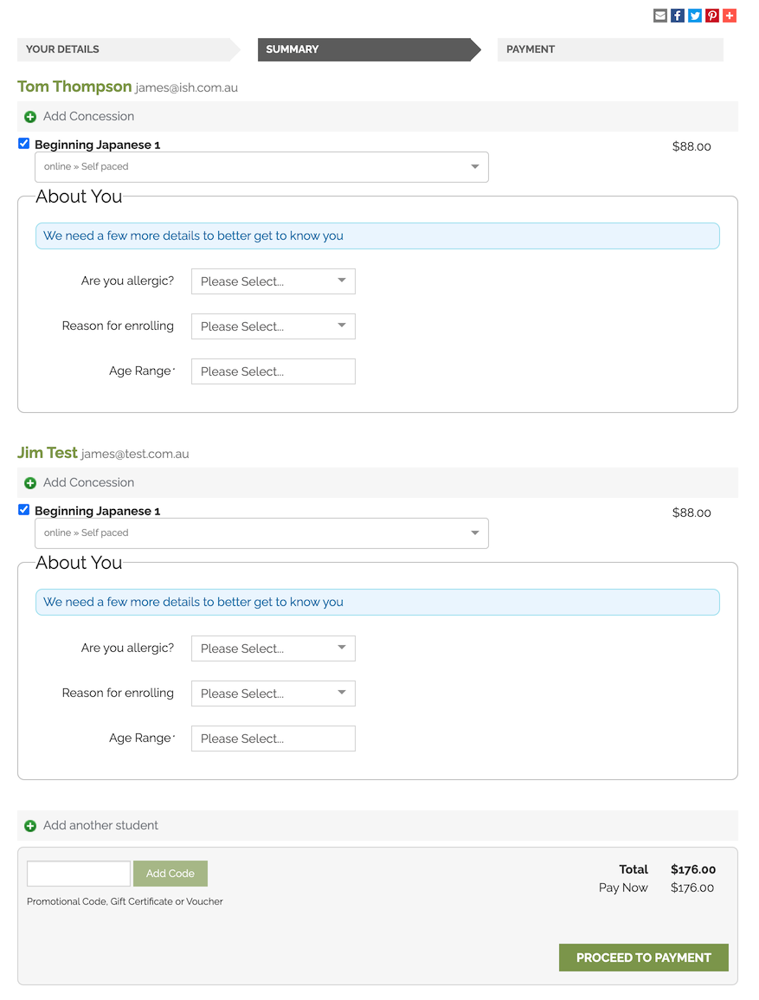
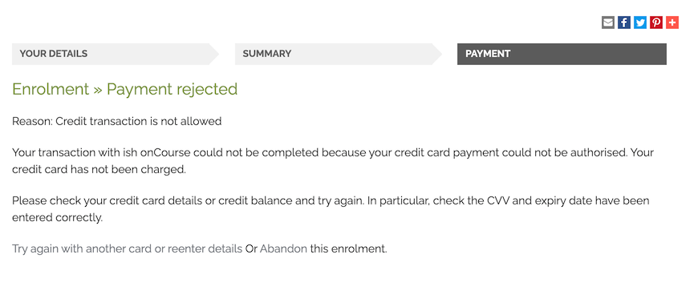

[[online_enrolments]]
== Online Enrolments

onCourse has a password free purchasing process meaning that students don't have to remember obscure student identification details from their last enrolment, like a student number or a password they may have created some time ago. onCourse does everything possible to move the student quickly and simply through the enrolment process to secure their payment and commitment to the enrolment. Forcing a student to remember a old password will result in some loss of sales as students give up in frustration.

For this reason, onCourse errs on the side of sometimes creating duplicate student records rather than risking losing a sale. If you were running a banking website, then accurate identification might be critical. But here, we want to do everything to make it easy.

Where a student has enrolled previously they are identified by their contact details and can move immediately to the payment process. No information they have previously provided is exposed during this process.

[[online_enrolments-students]]
=== Matching the student

After a student has added classes, products or applications to their shopping basket and proceeded to checkout, they will see the page below. All the student needs to enter here is their first name, last name and email address. Based on an exact match of these three fields, this determines if they are a new student or a returning student.

Sometimes students will use a different name (through marriage or abbreviation). Sometimes they will change their email address. In these cases, onCourse will create a new student record which you might want to merge later.

[[online_enrolments-oldStudents]]
==== Previously Enrolled Students

If the student is already in onCourse then they will be matched and further questions might be skipped.

If, since their last contact with your you have made some additional fields mandatory for online enrolment, and they didn't previously supply this data, a page will be shown requesting these additional details be provided.

At no time are previously supplied details shown to the student.

image::images/returning_student_additional_info.png[title='What the student will see if additional details need to be obtained since the their last enrolment']

[[online_enrolments-newStudents]]
==== New Students

If this is the first time the person is interacting with your college, after they have entered their first name, last name and email address it will take them to the next details page where more information can be added. All the fields on this page can be shown or hidden, or made mandatory using the Data Collection functionality of onCourse. In the example below the only question which is mandatory is their postcode which is marked with a '*' symbol.

If you have set a minimum age for enrolment, the date of birth will be mandatory. The Data Collection rules allow you to set up specific data to be collected for different courses, so if a student is enrolling in two courses, these requirements will be combined. In the Data Collection configuration you can specify field labels and help text.

If in onCourse, you allow concession details to be added online, there will also be a dropdown for the student to select from the list whether they have any concessions you accept, and if you require concession card details or an expiry date, these fields will also be required.

image::images/new_student.png[title='New student questions page']

You can also include custom fields you've added to onCourse contact records into the online enrolment process.

image::images/custom_field_questions.png[title='Custom field and Special needs questions']

[[online_enrolments-additionalStudents]]
==== Enrolling an additional student

Once a student has entered all their details they will be directed to a summary page. In this page they have the option of adding another contact/student to this order. The button can be found below the class/es that are being enrolled in and above the field where they can add a promotional code.

If they click on it then it will take them back to the 'YOUR DETAILS' page allowing them to enter the additional students' details.

To add another person, they need to know their first name, last name and email address, plus complete the responses for any fields you have deemed mandatory.

image::images/adding_another_student.png[title='Add another student button']

By default, second and subsequent students added to the online enrolment process will also have the enrolment option selected for the same classes as the first student. These can be unchecked.

[[online_enrolments-summary]]
=== Summary

Once a student has entered all their details they will be directed to a summary page.

This page includes the following information:

* Full name and Email Address of the student/s enrolling or paying

* Classes they are enrolling in and products they are purchasing

* Price before and after discount of each class along with a total at the bottom right of the page

* A option to add another student (please see the section above called 'Enrolling an additional student' for more information)

* If the student is purchasing a product, a field to choose the quantity of the product they're purchasing

The student can adjust the details and then proceed to the payment page by clicking on the 'Proceed to Payment' button at the bottom of the page.

image::images/summary_page.png[title='Summary page']

[[online_enrolments-parentGuardian]]
=== Adding a Parent or Guardian

Within the Editor settings you can specify an age under which all enrolments will require parent or guardian contact details e.g. for students under 18. We recommend that you also make the date of birth field mandatory for your system. In the example below, student Manual Child is trying to enrol in a course named 'Internal', however since they are under 18 years of age they will have to enter their Parent/Guardian details first by clicking the 'Add Guardian' button.

If the student has enrolled before and already has a parent/guardian contact related to them in onCourse, then this information will not be requested, and the 'Proceed to Payment' button will show.

Until a Parent or Guardian's details are supplied, there is no option to proceed to the payment screen. Clicking the 'Add Guardian' button directs to the Add a Parent or Guardian page, along with the following callout message; "Because a student is under 18 we require the details of a parent or guardian for our records. Please enter that person." As per adding all other contacts, if their details are already in onCourse, then only a first name, last name and email address are needed to identify them.

image::images/add_parent_guardian.png[title='The Add a Parent or Guardian page is where you add your parent/guardian's details']

Once the guardian or parent's details have been captured the user will be returned to the Summary page, which will show both the child's name and the parent's, along with a short description next to the child's name of their relationship with the defined guardian.

Next to the relationship description there is also a Change button which, when clicked, takes the user back to the Add a Parent or Guardian page where the user can add a different Parent/Guardian.

[[online_enrolments-payment]]
=== Payment

For the payments section to display, students must click to accpet the terms and conditions. Then the payment window will render on the payment page.

At the point of payment, the payer (person who will receive the invoice) can be selected. In the example of an enrolment with multiple students, the first contact added will be set as the payer by default. In the drop down list, you can select another payer.

If the student is under 18, their parent/guardian will be set as the payer by default. This can be changed back to the student if required.

For an enrolment to be successful, the payment section must be successfully completed. Credit card details are validated in real time and if the student abandons the transaction because they cannot supply these details, you will see their enrolment in onCourse as 'failed', which you may choose to follow up.

Once the student is on the 'PAYMENT' page thwy will first need to agree to the terms and conditions. Once they do there will be two main ways to pay for their classes, these are:

* Pay using a credit or debit card (default)
* Click on the 'CorporatePass' option.
* Use a Voucher code

They can enter their Corporate Pass code in the field to complete the transaction without the need for a payment at this time. This process works via pre-approval and it can't just be chosen by any visitor to the website. If they have a voucher code they can enter their voucher code and the amount will be removed from the total. If the voucher will pay the total in full then the total will display as $0 and the student can click through to confirm.

If the payer is listed below then all they have to do is make the radio button next to their name is marked before filling in their credit/debit card details. If the payer is not already listed then they can click on the 'Choose a different payer' button, select whether the payer is a person or business and then add them as a contact. If the payer is a business when trying to add them as a contact instead of the 'Your details' page asking for the first and last name of the contact, it will instead ask for the business name.

image::images/payment_credit_card.png[title='Payment page']

If the total value of the enrolment and/or application sale is $0 then the final payment page will not show the 'secure credit card payment tab' nor the final page that shows 'payment successful'.

=== Confirmation

After the student has clicked on the 'Confirm purchase' button at the bottom of the PAYMENT page, then they will be directed to a confirmation page with a message informing them that their online enrolment was either successful or rejected.

If the student is paying by credit card, this is the point where their card details are verified with the bank as being correct and having sufficient funds available.

At this point, onCourse also verifies there is still a place available in the class. If between the student commencing and completing the online enrolment process, the last place has been booked by another student, the enrolment process will fail at this point. Their credit card will not be billed. You will see the enrolment attempt and failure in onCourse, so you can follow them up if they don't successfully complete the enrolment.

image::images/class_full_during_online_enrolment.png[title='What the student will see if the class has suddenly becoming full while enrolling']

If the enrolment and payment were successful, at the bottom of the page there will be a continue button. If you've created a post enrolment page in the configuration, they will be redirected there, if not they will be re-directed to the courses list page.

If the students enrolment goes through successfully and their credit card is accepted they will see a page similar to the screen shot shown below.

image::images/credit_card_successful.png[title='What the student sees if their credit card has been accepted']

If the credit card is not accepted the student will see a page similar to the screen shot shown below explaining what they may need to check or correct. At this point the student can try again or abandon their enrolment.

Abandoned enrolments are shown as 'failed' enrolments in onCourse.

After a successful online enrolment process, the payer of the invoice will be emailed a tax invoice, and each of the successfully enrolled students will be emailed an enrolment confirmation. If the student is enrolling and paying for themselves, then they will receive both emails.

These automatic emails are sent based on your customisable invoice and enrolment confirmation email templates in onCourse.
